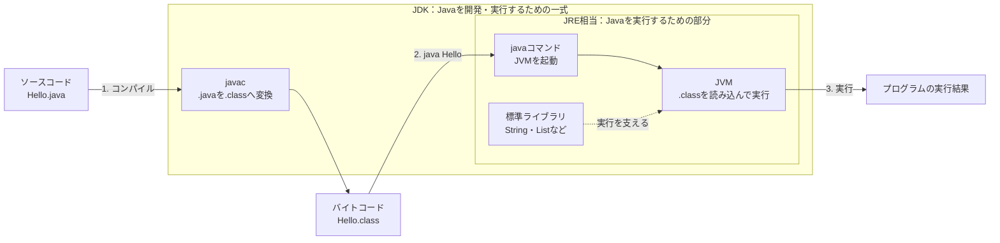

# Java-01 ハンズオン: Javaをはじめよう（実務視点）

前提バージョン: JDK 17（17.x）

## 0. 環境セットアップ（Windows / Git Bash）
最初に環境を揃えます。すでに導入済みの場合は確認だけ実施してください。

### 0-1. 必要ツール一覧
- JDK 17（Java開発・実行環境）
- Maven 3.9+（後続のSpring Boot演習で使用）
- VS Code（編集）
- Git for Windows（Git Bash含む）

### 0-2. Git Bash（Git for Windows）
ダウンロードURL: `https://git-scm.com/download/win`

1. 「Git for Windows」を入手
2. インストール実行（デフォルトでOK）
3. スタートメニューから Git Bash が起動できればOK
4. 確認:
   ```bash
   git --version
   ```

補足:
- VS Code下部のターミナル表示が `powershell` の場合、この資料の `mkdir -p` などのコマンドは Git Bash で実行してください
- VS Codeで Git Bash を使う場合は、ターミナル右上の `+` 横のメニューから `Git Bash` を選択します

### 0-3. VS Code のインストール
ダウンロードURL: `https://code.visualstudio.com/Download`

1. 公式サイトからインストーラを入手
2. インストール実行（デフォルトでOK）
3. 任意確認:
   ```bash
   code -v
   ```

補足:
- `code -v` は VS Code をコマンドから呼び出せるかの任意確認です
- `code` が認識されない場合でも、VS Code が起動できていれば次へ進んでOKです
- `code` コマンドも使いたい場合は、VS Codeを完全に終了して起動し直すか、PC再起動後に再確認してください
- それでも認識されない場合は、VS Codeを再インストールし、インストール時に「Add to PATH」を有効にしてください

### 0-4. JDK 17 のインストール
ダウンロードURL: `https://adoptium.net/temurin/releases/`

1. 「Eclipse Adoptium (Temurin 17)」の Windows x64 インストーラを入手
2. インストール実行（デフォルトでOK）
3. 新しい Git Bash で確認:
   ```bash
   java -version
   javac -version
   ```
4. どちらも `17.x` が表示されればOK

期待出力例（抜粋）:
```text
openjdk version "17.0.x" ...
OpenJDK Runtime Environment ...
OpenJDK 64-Bit Server VM ...
javac 17.0.x
```

`java` または `javac` が見つからない場合:
- Windowsの「環境変数」で `JAVA_HOME` を設定
- `Path` に `%JAVA_HOME%\bin` を追加
- Git Bash 再起動

### 0-5. Maven 3.9+ のインストール
ダウンロードURL: `https://maven.apache.org/download.cgi`

1. Apache Maven の「Binary zip」を入手
   - ページ内の `Apache Maven 3.9.x` という見出しまで移動
   - その下の表で、左列が `Binary zip archive` の行を探す
   - `Link` 列にある `apache-maven-3.9.x-bin.zip` をクリック
   - `Checksums` 列の `.sha512` は確認用ファイルなので、通常はクリックしない
   - `Binary tar.gz archive` や `Source zip archive` ではなく、Windowsでは `bin.zip` を使う
2. zipファイルを展開
   - ダウンロードした `apache-maven-3.9.x-bin.zip` を右クリック
   - `すべて展開` を選択
   - 例: `%USERPROFILE%\Documents` の下に展開
   - 展開後のフォルダ例: `%USERPROFILE%\Documents\apache-maven-3.9.x`
   - フォルダの中に `bin` / `conf` / `lib` が見えればOK
3. Windowsの「環境変数」を開く
   - Windowsの検索欄で `環境変数` と入力
   - `システム環境変数の編集` を開く
   - `環境変数(N)...` ボタンを押す
4. `MAVEN_HOME` を設定
   - 上側の `ユーザー環境変数` で `新規` を押す
   - `変数名`: `MAVEN_HOME`
   - `変数値`: `%USERPROFILE%\Documents\apache-maven-3.9.x`
   - 実際のフォルダ名が `apache-maven-3.9.16` なら、`変数値` も `%USERPROFILE%\Documents\apache-maven-3.9.16` にする
   - `MAVEN_HOME` には `bin` まで含めない
5. `Path` に Maven の `bin` を追加
   - 上側の `ユーザー環境変数` で `Path` を選択
   - `編集` を押す
   - `新規` を押す
   - `%MAVEN_HOME%\bin` を追加
   - `OK` を押して、開いている環境変数画面をすべて閉じる
6. 新しい Git Bash で確認:
   ```bash
   mvn -version
   ```

期待出力例（抜粋）:
```text
Apache Maven 3.9.x (...)
Java version: 17.x, vendor: ...
```

補足:
- `Path` 追加後は Git Bash を再起動
- 反映されない場合は PC 再起動
- MavenはこのJava-01では直接使いませんが、後続のSpring Boot演習で使用します
- `mvn` が認識されない場合は、`MAVEN_HOME` が Maven の展開フォルダを指しているか、`Path` に `%MAVEN_HOME%\bin` が入っているかを確認してください

### 0-6. 作業フォルダ
この資料は本体アプリとは別に、練習用フォルダで進めます。

```bash
mkdir -p ~/order-management-springboot/practice/java
```

VS Codeで開く（GUI）:
1. VS Code を起動
2. `ファイル` → `フォルダーを開く`
3. `~/order-management-springboot/practice/java` を選択

---

## 1. この資料のゴール
- プログラムが「コンピュータへの命令」であることを説明できる
- Java の最小プログラムを自分で作成し、実行できる
- Java 学習で最初に使う基本コマンド（`javac` / `java`）を迷わず使える

---

## 2. 事前準備（最初の5分）
```bash
mkdir -p ~/order-management-springboot/practice/java/
cd ~/order-management-springboot/practice/java
java -version
javac -version
```

期待状態:
- `java -version` と `javac -version` の両方で `17` が表示される（例: `17.0.x`）
- `not found` が出ない

---

## 3. 最小用語（先にここだけ）
| 用語 | 意味 | このハンズオンでの扱い |
|---|---|---|
| プログラム | コンピュータにさせたい処理の命令集合 | Javaコードとして記述 |
| ソースコード | 人が読むためのコード（`.java`） | 自分で作成して保存 |
| コンパイル | ソースを実行可能な形式へ変換 | `javac` を実行 |
| 実行 | コンパイル済みコードを動かす | `java クラス名` を実行 |

#### Javaとは（HTML/CSSとの違い）
- HTML/CSSは「画面をどう見せるか」を書く言語
- Javaは「処理をどう動かすか」を書くプログラミング言語
- この研修では、Javaで業務ロジック（出勤/退勤ルール）を実装する

#### JDK / JRE / JVM の違い（初心者向け）



図の読み方:

1. **JDK**に含まれる`javac`が、`.java`を`.class`へコンパイルする
2. 実行時は、**JVM**が`.class`を読み込み、標準ライブラリを利用しながら動かす
3. **JRE**は「JVMと標準ライブラリをまとめた実行環境」を表す名前
4. この研修ではJDK 17を導入するため、コンパイルと実行の両方ができる

| 用語 | 役割 | 含まれるもの | この研修での見え方 |
|---|---|---|---|
| JVM | Javaプログラムを実行する本体（仮想マシン） | `.class` を実行する実行エンジン | `java Hello` 実行時に裏で動く |
| JRE | Javaを「実行するため」の一式 | JVM + 標準ライブラリ | 実行環境を表す概念として理解する |
| JDK | Javaを「開発・実行するため」の一式 | JRE相当の実行環境 + `javac` などの開発ツール | この研修で必須。`javac` と `java` を使う |

補足:
- `javac` が使えるのは JDK を入れているから
- JDK 17では、JREを別にインストールせず、JDKだけで開発と実行を行うのが基本
- 研修では「JDKを導入すれば、JVMでの実行もコンパイルもできる」と覚えればOK

#### Javaの基本構文
```java
public class Sample { // クラス宣言。ファイル名は Sample.java にする
    public static void main(String[] args) { // Javaが最初に実行する特別なメソッド
        System.out.println("Hello"); // 文字列を1行出力する
    } // main メソッドの終わり
} // クラス定義の終わり
```

この例の意味:
- `public class Sample` はクラス定義
- `main(...)` は実行開始地点
- `System.out.println(...)` は画面出力
- `{}` は処理の範囲、`;` は文の終わり

#### Javaの実行の流れ（今回の演習）
1. `javac` で `.java` をコンパイルして `.class` を作る
2. `java` で `.class` を実行する
3. エラーが出たら「行番号」「メッセージ」を見て修正する

---

## 4. ハンズオン

目的:
- Javaプログラムの最小形を動かす

完了条件:
- `IntroHello.java` を作成・コンパイル・実行できる
- 実行結果に `Javaの世界へようこそ！` が表示される

作成ファイル: `~/order-management-springboot/practice/java/handson01/IntroHello.java`

### Step 0: 作業フォルダを作る
```bash
mkdir -p ~/order-management-springboot/practice/java/handson01
cd ~/order-management-springboot/practice/java/handson01
```

### Step 1: 最小プログラムを作る
`IntroHello.java` を次の内容で作成:

```java
public class IntroHello { // クラス名。ファイル名は IntroHello.java に合わせる
    public static void main(String[] args) { // 実行開始地点（エントリーポイント）
        System.out.println("Javaの世界へようこそ！"); // 画面に1行表示
    } // main の終わり
} // クラスの終わり
```

実行:
```bash
javac -encoding UTF-8 IntroHello.java
java IntroHello
```

期待出力:
```text
Javaの世界へようこそ！
```

コード解説:
- `public class IntroHello` はクラス定義
- `main` はプログラムの実行開始地点
- `System.out.println(...)` は1行表示
- クラス名とファイル名は一致必須（`IntroHello` と `IntroHello.java`）

### Step 2: 命令を増やして「プログラム」を体感する
`IntroHello.java` を次の内容に更新:

```java
public class IntroHello { // 同じクラス名のまま中身だけ更新する
    public static void main(String[] args) {
        System.out.println("Javaの世界へようこそ！"); // 1つ目の命令
        System.out.println("4 + 5 * 6 = " + (4 + 5 * 6)); // 計算結果を文字列に連結して表示
        System.out.println("処理が完了しました。"); // 3つ目の命令
    }
}
```

実行:
```bash
javac -encoding UTF-8 IntroHello.java
java IntroHello
```

期待出力:
```text
Javaの世界へようこそ！
4 + 5 * 6 = 34
処理が完了しました。
```

コード解説:
- 命令を上から順番に実行するのが基本
- 算術式の結果も表示できる
- 出力文を変えるだけで「何をするプログラムか」が変わる

### Step 3: 実務メッセージへ置き換える
`IntroHello.java` の表示文を業務寄りに変更:

```java
public class IntroHello { // 文法は同じで、表示内容だけ業務メッセージへ変更
    public static void main(String[] args) {
        System.out.println("受注バッチ開始"); // 処理開始ログ
        System.out.println("検証対象件数: " + (4 + 5 * 6)); // 件数を計算して表示
        System.out.println("受注バッチ終了"); // 処理終了ログ
    }
}
```

実行:
```bash
javac -encoding UTF-8 IntroHello.java
java IntroHello
```

期待出力例:
```text
受注バッチ開始
検証対象件数: 34
受注バッチ終了
```


学習ポイント:
- プログラムの本質は「命令を正確に並べること」
- Javaの文法は同じでも、業務用途に応じて文言と処理を変えられる

---

## 5. ミニ演習（5〜10分）
各レベルは前のレベルの完成コードを引き継いで実施します。レベル1は直前のハンズオン完成コードから開始してください。

### レベル1（基本）
1. `検証対象件数` の式を `10 + 20 * 3` に変える。

期待出力例:
```text
検証対象件数: 70
```

### レベル2（拡張）
1. `System.out.println(...)` を1行追加し、処理段階を1つ増やす。
2. クラス名を `StartApp` に変える（ファイル名も `StartApp.java` に揃える）。

期待出力例:
```text
受注バッチ開始
検証対象件数: 70
処理ステップ2を実行
受注バッチ終了
```

### レベル3（実務）
1. レベル2の各ログ文の先頭に `[INFO]` を付ける。
2. 開始 -> 件数表示 -> 追加した処理 -> 終了 の順序が崩れないことを確認する。

期待出力例:
```text
[INFO] 受注バッチ開始
[INFO] 検証対象件数: 70
[INFO] 処理ステップ2を実行
[INFO] 受注バッチ終了
```

### 実行前予想問題（1分）
次の2つの出力を、実行前に予想してから確認してください。
- `System.out.println(4 + 5 * 6);`
- `System.out.println((4 + 5) * 6);`

### デバッグ演習（任意, 5分）
1. `System.out.println("受注バッチ開始")` の行末 `;` を一度削除してコンパイルする。
2. エラーメッセージを確認して `;` を戻す。
3. 再コンパイルして成功を確認する。

---

## 6. つまずきポイント
- `';' expected`
  -> 行末の `;` を確認
- `class X is public, should be declared in a file named X.java`
  -> クラス名とファイル名を一致させる
- 文字化けする
  -> 保存文字コードを UTF-8 にする


