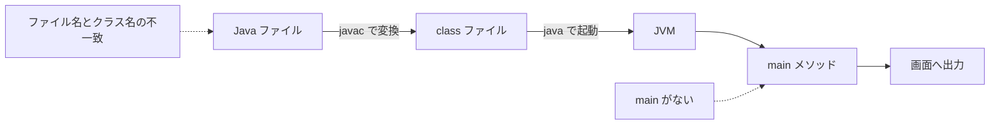

# Java-02 ハンズオン: プログラムの書き方（作成→コンパイル→実行）

## 1. この資料のゴール
- Java 開発の基本3ステップ（作成・コンパイル・実行）を説明できる
- `main` メソッドの最小テンプレートを自分で書ける
- よくある初期エラー（クラス名不一致、`main` なし）を自分で直せる

---

## 2. 事前準備
```bash
cd ~/order-management-springboot/practice/java
java -version
javac -version
```

期待状態:
- `java -version` と `javac -version` の両方で `17` が表示される
- 例: `17.0.x`

---

## 3. 開発の流れ（最小）
1. `.java` ファイルを作る（ソースコード）
2. `javac` でコンパイルする（`.class` 生成）
3. `java` で実行する

### 全体構成図（作成から実行まで）


ポイント:
- `javac` はソースコードをコンパイルして `.class` を作る
- `java` は `.class` の中から `main` を探して実行する
- 初期エラーは、名前の不一致と `main` の有無から確認すると切り分けやすい

---

## 4. ハンズオン

目的:
- Javaの基本サイクルを手で回す

完了条件:
- `HelloFlow.java` を自分で段階的に完成できる
- 「作成→コンパイル→実行」を2回以上繰り返せる

作成ファイル: `~/order-management-springboot/practice/java/handson02/HelloFlow.java`

### Step 0: 作業フォルダを作る
```bash
mkdir -p ~/order-management-springboot/practice/java/handson02
cd ~/order-management-springboot/practice/java/handson02
```

### Step 1: 空クラスを作る
`HelloFlow.java` を次の内容で作成:

```java
public class HelloFlow { // クラス宣言。ファイル名は HelloFlow.java に合わせる
} // クラス定義の終わり
```

実行:
```bash
javac -encoding UTF-8 HelloFlow.java
```

期待出力例:
```text
(コンパイル成功: 出力なし)
```


学習ポイント:
- クラス定義だけならコンパイルできる
- まだ `main` がないため、実行開始地点はない

### Step 2: `main` を追加する
`HelloFlow.java` を次の内容に更新:

```java
public class HelloFlow { // Step 1 のクラスに実行開始地点を追加する
    public static void main(String[] args) { // Java 実行時に最初に呼ばれる特別なメソッド
        // まだ処理を書かないため空のままにする
    } // main メソッドの終わり
} // クラス定義の終わり
```

実行:
```bash
javac -encoding UTF-8 HelloFlow.java
java HelloFlow
```

期待状態:
- 実行は成功するが何も表示されない

コード解説:
- `public static void main(String[] args)` はエントリーポイント
- 中身が空なら表示も処理もない

### Step 3: 出力命令を追加する
`HelloFlow.java` を次の内容に更新:

```java
public class HelloFlow { // クラス名とファイル名を一致させたまま使う
    public static void main(String[] args) { // 実行開始地点
        System.out.println("Hello Flow"); // 1 行目のメッセージを表示
        System.out.println("Java開発サイクル確認中"); // 2 行目のメッセージを表示
    } // main メソッドの終わり
} // クラス定義の終わり
```

実行:
```bash
javac -encoding UTF-8 HelloFlow.java
java HelloFlow
```

期待出力:
```text
Hello Flow
Java開発サイクル確認中
```

### Step 4: 意図的にエラーを作って直す
`HelloFlow.java` のクラス名を一時的に `HelloFlowX` に変えてコンパイル:

```java
public class HelloFlowX { // あえてファイル名 (HelloFlow.java) と不一致にしてエラーを再現
    public static void main(String[] args) {
        System.out.println("Hello Flow"); // 本文が正しくても名前不一致でコンパイルエラーになる
    }
}
```

実行:
```bash
javac -encoding UTF-8 HelloFlow.java
```

想定エラー:
- `class HelloFlowX is public, should be declared in a file named HelloFlowX.java`

修正:
- クラス名を `HelloFlow` に戻す（またはファイル名を合わせる）

学習ポイント:
- Java はクラス名とファイル名の一致を厳密に要求する

### Step 5: 実務ログ風にする（仕上げ）
`HelloFlow.java` を次の内容に更新:

```java
public class HelloFlow { // 最終版: 実務ログ風メッセージに変更
    public static void main(String[] args) {
        System.out.println("[INFO] バッチ起動"); // 処理開始ログ
        System.out.println("[INFO] 受注データ読込"); // 中間処理ログ
        System.out.println("[INFO] バッチ正常終了"); // 処理終了ログ
    } // main メソッドの終わり
} // クラス定義の終わり
```

実行:
```bash
javac -encoding UTF-8 HelloFlow.java
java HelloFlow
```

期待出力例:
```text
[INFO] バッチ起動
[INFO] 受注データ読込
[INFO] バッチ正常終了
```


---

## 5. ミニ演習（5〜10分）
### レベル1（基本）
1. `System.out.println` を1行増やし、処理ステップを追加する。

期待出力例:
```text
[INFO] バッチ起動
[INFO] 受注データ読込
[INFO] 検証処理
[INFO] バッチ正常終了
```

### レベル2（拡張）
1. `main` の引数名 `args` を別名に変更しても動くことを確認する。
2. インデントを崩した状態で保存し、読みづらさを確認して整える。

期待出力例:
```text
[INFO] バッチ起動
[INFO] 受注データ読込
[INFO] バッチ正常終了
```

### レベル3（実務）
1. ログを「開始」「コンパイル対象クラス名」「終了」の3行に整理する。
2. 1行目と3行目の間に処理内容の行が来るように並べる。

期待出力例:
```text
[INFO] 開始
[INFO] 対象クラス: HelloFlow
[INFO] 終了
```

### 実行前予想問題（1分）
次のコマンドの違いを、実行前に予想してから確認してください。
- `java HelloFlow`
- `java HelloFlow.java`

### デバッグ演習（任意, 5分）
1. `HelloFlow.java` のクラス名だけを `HelloFlowApp` に変更してコンパイルする。
2. ファイル名とクラス名の不一致エラーを確認する。
3. ファイル名かクラス名を揃えて再コンパイルする。

---

## 6. つまずきポイント
- `main method not found`
  -> `main` シグネチャを正確に書く
- `cannot find symbol`
  -> スペルミスや大文字小文字違いを確認
- `Could not find or load main class ...`
  -> `java` 実行時のクラス名を確認（拡張子 `.java` は付けない）


