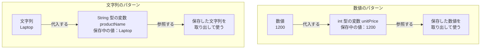

# Java-03 ハンズオン: 変数と型（宣言→代入→参照）

## 1. この資料のゴール
- 変数の基本（宣言・代入・参照）を説明できる
- 主要な型（`String`, `int`, `long`, `double`, `boolean`）を使い分けできる
- 実務で通用する変数名（lowerCamelCase）で記述できる

---

## 2. 事前準備
```bash
cd ~/order-management-springboot/practice/java
java -version
javac -version
```

期待状態:
- `java -version` と `javac -version` の両方で `17` が表示される
- 例: `17.0.x`

---

## 3. 先に覚えるポイント
1. 変数は「宣言→代入→参照」の順で使う
2. 変数名は lowerCamelCase（例: `orderCount`, `unitPrice`）
3. 型に合わない値は代入できない

### 変数のイメージ



ポイント:
- 変数は、後で使う値を一時的に保管する箱として考える
- `int` は整数を保管する型、`String` は文字列を保管する型
- `unitPrice` や `productName` は変数の名前
- 値を箱へ入れることが「代入」、箱の値を取り出して使うことが「参照」
- Javaコードで文字列を代入するときは、`"Laptop"` のように `"` で囲む

### 書式の基本

#### 変数の宣言

```java
int quantity;
String productName;
```

ポイント:
- `型 変数名;` の形で変数を用意する
- `int` は整数、`String` は文字列を扱う型
- 変数名は lowerCamelCase で書く

#### 代入と参照

```java
quantity = 3;
System.out.println(quantity);
```

ポイント:
- `=` は右辺の値を左辺の変数へ代入する
- 変数名を書くと、保存されている値を参照できる
- 代入前のローカル変数を参照するとコンパイルエラーになる

#### 宣言と初期化を同時に行う

```java
String productName = "Laptop";
int unitPrice = 120000;
boolean paid = true;
```

ポイント:
- `型 変数名 = 値;` の形で、宣言と最初の代入を同時にできる
- 文字列は `"` で囲む
- `boolean` は `true` または `false` を入れる

#### 再代入

```java
int stock = 10;
stock = 8;
```

ポイント:
- 変数には後から別の値を代入できる
- 再代入しても、変数の型は変わらない
- `int` の変数に `"8"` のような文字列は代入できない

実務でよく使う型（優先）:

| 型 | 主な用途 | 扱えるデータ（リテラル） | 変数名例 |
|---|---|---|---|
| `String` | コード、名称、メール | 文字列 | `orderCode`, `customerName` |
| `int` | 数量、件数、価格（小規模） | およそ ±21億 | `quantity`, `unitPrice` |
| `long` | 大きいID、時刻値 | およそ ±900京 | `orderId`, `userId` |
| `double` | 小数（比率など） | 小数（floatより精度が高い） | `taxRate`, `score` |
| `boolean` | true/false 状態 | true か false | `paid`, `active` |

型の分類:

| 分類 | この資料での例 | 説明 |
| --- | --- | --- |
| 基本データ型 | `int`, `long`, `double`, `boolean`, `char` | Java言語に組み込まれている型。クラスではない |
| 標準ライブラリのクラス | `String` | JDKに含まれるクラス。文字列を扱う |

補足:
- `int` や `double` は標準ライブラリではなく、Java言語の基本データ型
- `String` は基本データ型ではなく、`java.lang.String` という標準ライブラリのクラス
- 標準ライブラリは Java-05 で詳しく扱う

---

## 4. ハンズオン

目的:
- 型と変数を使って実務に近い情報を扱う

完了条件:
- `VariableTypeDemo.java` を実行し、注文情報を表示できる
- `int` と `long` の使い分けを説明できる

作成ファイル: `~/order-management-springboot/practice/java/handson03/VariableTypeDemo.java`

### Step 0: 作業フォルダを作る
```bash
mkdir -p ~/order-management-springboot/practice/java/handson03
cd ~/order-management-springboot/practice/java/handson03
```

### Step 1: `int` の宣言→代入→参照
`VariableTypeDemo.java` を次の内容で作成:

```java
public class VariableTypeDemo { // クラス宣言。ファイル名は VariableTypeDemo.java にする
    public static void main(String[] args) { // 実行開始地点
        int quantity; // 宣言: int 型の変数 quantity を用意する
        quantity = 3; // 代入: quantity に 3 を入れる
        System.out.println(quantity); // 参照: quantity の値を読み出して表示する
    } // main メソッドの終わり
} // クラス定義の終わり
```

実行:
```bash
javac -encoding UTF-8 VariableTypeDemo.java
java VariableTypeDemo
```

期待出力例:
```text
3
```

### Step 2: 実務で使う変数を追加
`VariableTypeDemo.java` を次の内容に更新:

```java
public class VariableTypeDemo { // 変数の型を増やして実務に近い情報を扱う
    public static void main(String[] args) {
        String orderCode = "ORD-2026-0001"; // 文字列: 注文番号
        int quantity = 3; // 整数: 数量
        int unitPrice = 1200; // 整数: 単価
        int totalPrice = quantity * unitPrice; // 数量 x 単価で合計を計算
        boolean paid = false; // 真偽値: 支払済みかどうか

        System.out.println("注文番号: " + orderCode); // 文字列連結で表示
        System.out.println("数量: " + quantity); // 数量を表示
        System.out.println("単価: " + unitPrice); // 単価を表示
        System.out.println("合計: " + totalPrice); // 計算結果を表示
        System.out.println("支払済み: " + paid); // true / false を表示
    } // main メソッドの終わり
} // クラス定義の終わり
```

実行:
```bash
javac -encoding UTF-8 VariableTypeDemo.java
java VariableTypeDemo
```

期待出力例:
```text
注文番号: ORD-2026-0001
数量: 3
単価: 1200
合計: 3600
支払済み: false
```

コード解説:
- `String` は文字列
- `int` は整数（数量・単価・件数など）
- `boolean` は真偽値（状態フラグ）

### Step 3: `long` と `double` を追加
`VariableTypeDemo.java` を次の内容に更新:

```java
public class VariableTypeDemo { // 大きな整数(long)と小数(double)も扱う
    public static void main(String[] args) {
        String orderCode = "ORD-2026-0001"; // 文字列データ
        long orderId = 10000000001L; // 大きな整数。long リテラルは末尾に L を付ける
        int quantity = 3; // 数量
        int unitPrice = 1200; // 単価
        int totalPrice = quantity * unitPrice; // 合計金額
        double taxRate = 0.10; // 税率 (10%)
        double taxAmount = totalPrice * taxRate; // 税額 = 合計 x 税率
        boolean paid = false; // 支払状態

        System.out.println("注文番号: " + orderCode); // 注文番号を表示
        System.out.println("注文ID: " + orderId); // 注文IDを表示
        System.out.println("合計: " + totalPrice); // 合計金額を表示
        System.out.println("税額: " + taxAmount); // 税額を表示
        System.out.println("支払済み: " + paid); // 支払状態を表示
    } // main メソッドの終わり
} // クラス定義の終わり
```

実行:
```bash
javac -encoding UTF-8 VariableTypeDemo.java
java VariableTypeDemo
```

期待出力例:
```text
注文番号: ORD-2026-0001
注文ID: 10000000001
合計: 3600
税額: 360.0
支払済み: false
```


コード解説:
- `long` は `int` より大きな整数を扱える（ID向け）
- `double` は小数を扱える（税率など）

### Step 4: 初期化と再代入を確認
`VariableTypeDemo.java` を次の内容に更新:

```java
public class VariableTypeDemo { // 初期化と再代入の動きを確認する
    public static void main(String[] args) {
        int quantity = 3; // 初期化: 宣言と最初の代入を同時に行う
        System.out.println("初期数量: " + quantity); // 初期値を表示

        quantity = 5; // 再代入: 既存の値 3 を 5 で上書きする
        System.out.println("再設定後数量: " + quantity); // 更新後の値を表示
    } // main メソッドの終わり
} // クラス定義の終わり
```

実行:
```bash
javac -encoding UTF-8 VariableTypeDemo.java
java VariableTypeDemo
```

期待出力例:
```text
初期数量: 3
再設定後数量: 5
```

学習ポイント:
- 再代入すると古い値は上書きされる

### 補足: `char` 型とエスケープシーケンス
- `char` は「1文字だけ」を扱う型（例: `'A'`）
- `String` は0文字以上の文字列を扱う型（例: `"ABC"`）
- 改行やタブ、`"` のような特殊文字はエスケープで表現する

```java
public class CharEscapeDemo {
    public static void main(String[] args) {
        char grade = 'A';
        String message = "1行目\\n2行目\\t\"OK\"";

        System.out.println("評価: " + grade);
        System.out.println(message);
    }
}
```

実行イメージ:
- `\n` は改行される
- `\t` はタブとして表示される

---

## 5. ミニ演習（10分）
各レベルは前のレベルの完成コードを引き継いで実施します。レベル1は直前のハンズオン完成コードから開始してください。

### レベル1（基本）
1. `orderCode` を別値に変更する。
2. `paid` を `true` に変更して出力確認する。

期待出力例:
```text
注文番号: ORD-2026-9999
数量: 3
単価: 1200
合計: 3600
支払済み: true
```

### レベル2（拡張）
1. レベル1の `taxRate` を `0.08` に変更して税額の差分を確認する。

期待出力例:
```text
注文番号: ORD-2026-9999
数量: 3
単価: 1200
合計: 3600
支払済み: true
税率: 0.08
税額: 288.0
```

### レベル3（実務）
1. レベル2の `int totalPrice` を `long totalPrice` に変える。
2. `totalPrice` に `3000000000L` を代入し、他の表示も残したまま実行する。

期待出力例:
```text
注文番号: ORD-2026-9999
数量: 3
単価: 1200
合計: 3000000000
支払済み: true
税率: 0.08
税額: 2.4E8
```

### 実行前予想問題（1分）
次の2行の結果を、実行前に予想してから確認してください。
- `int a = 10; double b = 1.5; System.out.println(a + b);`
- `String code = "100"; System.out.println(code + 20);`

### デバッグ演習（任意, 5分）
1. `int quantity = "3";` のように型不一致コードを意図的に入れてコンパイルする。
2. `incompatible types` を確認したら、値または型を正しく修正する。
3. 再コンパイルして成功を確認する。

---

## 6. つまずきポイント
- `cannot find symbol`
  -> 変数名のスペルと大文字小文字を確認
- `incompatible types`
  -> 型と代入値が一致しているか確認
- `integer number too large`
  -> 大きな整数は `long` + `L` を使う
