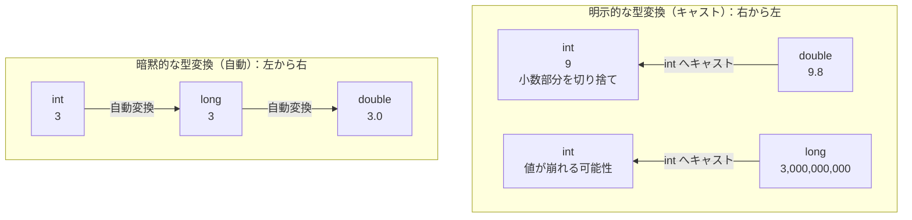

# Java-04A 補講: 型変換とキャスト（暗黙変換 / 明示変換）

## 1. この資料のゴール
- 代入時・演算時の型変換ルールを説明できる
- `Integer.parseInt` / `String.valueOf` を使って文字列と数値を変換できる
- キャストの副作用（切り捨て、オーバーフロー）を理解できる

---

## 2. 事前準備
```bash
cd ~/order-management-springboot/practice/java
java -version
javac -version
```

期待状態:
- `java -version` と `javac -version` の両方で `17` が表示される
- 例: `17.0.x`

---

## 3. 先に覚えるポイント
1. 代入時は「小さい型 -> 大きい型」は暗黙変換される
2. 演算時は、より大きい型に揃えて計算される
3. 明示キャストは便利だが、値が欠けることがある

### 型変換の方向



ポイント:
- `int` から `long` や `double` のように、より広い範囲を扱える型へは自動変換される
- 暗黙変換でも、非常に大きい `long` を `double` にすると精度が落ちる場合がある
- `double` や `long` から `int` へ変換するときは、`(int)` のように変換先の型を明示する
- 小さい型へのキャストでは、小数部分の切り捨てやオーバーフローが起こる場合がある
- `String` と数値の変換はキャストではなく、`Integer.parseInt` や `String.valueOf` を使う

### 書式の基本

#### 代入時の暗黙変換

```java
int qty = 3;
long longQty = qty;
```

ポイント:
- `int` から `long` のように、表せる範囲が広い型へは自動変換される
- 逆方向の `long` から `int` は自動では代入できない

#### 演算時の型変換

```java
int price = 1200;
double taxRate = 0.10;
double taxed = price * (1 + taxRate);
```

ポイント:
- `int` と `double` を一緒に計算すると、結果は `double` に揃う
- 小数を含む計算結果を受ける変数は `double` にする

#### 文字列から数値へ変換する

```java
String quantityText = "15";
int quantity = Integer.parseInt(quantityText);
```

ポイント:
- `Integer.parseInt(...)` は数値文字列を `int` に変換する
- `"15"` は変換できるが、`"abc"` は変換できず例外になる

#### 数値から文字列へ変換する

```java
int subtotal = 12000;
String subtotalText = String.valueOf(subtotal);
```

ポイント:
- `String.valueOf(...)` は値を文字列へ変換する
- 画面表示やログ用の文字列を作るときに使える

#### 明示キャスト

```java
double average = 9.8;
int roundedDown = (int) average;
```

ポイント:
- `(int)` のように型を指定して変換することをキャストと呼ぶ
- `double` から `int` へキャストすると、小数部分は切り捨てられる
- 範囲外の値を小さい型へキャストすると、意図しない値になることがある

---

## 4. ハンズオン

目的:
- 型変換の挙動を実行で確認する

完了条件:
- `TypeConversionDemo.java` の出力から、型変換のルールを説明できる

作成ファイル: `~/order-management-springboot/practice/java/handson04a/TypeConversionDemo.java`

### Step 0: 作業フォルダを作る
```bash
mkdir -p ~/order-management-springboot/practice/java/handson04a
cd ~/order-management-springboot/practice/java/handson04a
```

### Step 1: 代入・演算時の暗黙変換を確認する
`TypeConversionDemo.java` を次の内容で作成:

```java
public class TypeConversionDemo {
    public static void main(String[] args) {
        int qty = 3;
        long longQty = qty; // int -> long は暗黙変換

        int price = 1200;
        double taxRate = 0.10;
        double taxed = price * (1 + taxRate); // int と double の演算は double に揃う

        System.out.println("longQty: " + longQty);
        System.out.println("taxed: " + taxed);
    }
}
```

実行:
```bash
javac -encoding UTF-8 TypeConversionDemo.java
java TypeConversionDemo
```

期待出力例:
```text
longQty: 3
taxed: 1320.0
```

### Step 2: 文字列と数値を相互変換する
前のコード全体を置き換え、`TypeConversionDemo.java` を次の内容に更新:

```java
public class TypeConversionDemo {
    public static void main(String[] args) {
        String quantityText = "15";
        int quantity = Integer.parseInt(quantityText); // String -> int

        int unitPrice = 800;
        int subtotal = quantity * unitPrice;
        String subtotalText = String.valueOf(subtotal); // int -> String

        System.out.println("quantity(int): " + quantity);
        System.out.println("subtotal(String): " + subtotalText);
    }
}
```

実行:
```bash
javac -encoding UTF-8 TypeConversionDemo.java
java TypeConversionDemo
```

期待出力例:
```text
quantity(int): 15
subtotal(String): 12000
```

### Step 3: 明示キャストの挙動を確認する
前のコード全体を置き換え、`TypeConversionDemo.java` を次の内容に更新:

```java
public class TypeConversionDemo {
    public static void main(String[] args) {
        double score = 99.8;
        int scoreInt = (int) score; // 小数点以下は切り捨て

        long bigId = 3_000_000_000L;
        int narrowed = (int) bigId; // 範囲外のため値が崩れる

        System.out.println("scoreInt: " + scoreInt);
        System.out.println("narrowed: " + narrowed);
    }
}
```

実行:
```bash
javac -encoding UTF-8 TypeConversionDemo.java
java TypeConversionDemo
```

期待出力例:
```text
scoreInt: 99
narrowed: -1294967296
```

確認ポイント:
- `double` から `int` へのキャストでは、小数点以下が切り捨てられる
- `long` から `int` へのキャストでは、`int` の範囲を超えると値が崩れる

### Step 4: 型変換を使った金額計算にまとめる（仕上げ）
前のコード全体を置き換え、`TypeConversionDemo.java` を次の内容に更新:

```java
public class TypeConversionDemo {
    public static void main(String[] args) {
        String priceText = "1080";
        int price = Integer.parseInt(priceText); // String -> int

        double taxRate = 0.10;
        double taxedPrice = price * (1 + taxRate); // int と double の演算

        int billingAmount = (int) taxedPrice; // double -> int
        String billingText = String.valueOf(billingAmount); // int -> String

        System.out.println("変換前の価格: " + priceText);
        System.out.println("税込金額(double): " + taxedPrice);
        System.out.println("請求金額(int): " + billingAmount);
        System.out.println("請求金額(String): " + billingText);
    }
}
```

実行:
```bash
javac -encoding UTF-8 TypeConversionDemo.java
java TypeConversionDemo
```

期待出力例:
```text
変換前の価格: 1080
税込金額(double): 1188.0
請求金額(int): 1188
請求金額(String): 1188
```

確認ポイント:
- `Integer.parseInt(...)` で文字列を数値へ変換している
- `int` と `double` の演算結果は `double` になる
- `(int)` で小数部分を切り捨てている
- `String.valueOf(...)` で数値を文字列へ変換している

---

## 5. ミニ演習（10分）

各レベルは、Step 4で完成した `TypeConversionDemo.java` を基準に実施してください。

### レベル1（基本）
1. Step 4の `priceText` を `"2500"` に変更する。
2. 文字列から数値へ変換された価格と、税込金額を確認する。

期待出力例:
```text
変換前の価格: 2500
税込金額(double): 2750.0
請求金額(int): 2750
```

### レベル2（拡張）
1. Step 4の `taxRate` を `0.08` に変更する。
2. `double` の税込金額と、`int` へキャストした請求金額の違いを確認する。

期待出力例:
```text
税込金額(double): 1166.4
請求金額(int): 1166
```

確認ポイント:
- `(int)` へのキャストでは、小数点以下が切り捨てられる

### レベル3（実務）
1. Step 4に `String quantityText = "3";` を追加する。
2. `Integer.parseInt(...)` で数量を `int` に変換する。
3. `price * quantity` で小計を計算してから、税率を適用する。
4. 最終的な請求金額を表示する。

期待出力例:
```text
数量: 3
小計: 3240
請求金額: 3564
```

### 実行前予想問題（1分）
次の2つの出力を実行前に予想してください。
- `System.out.println((int) 12.9);`
- `System.out.println(5 + 2.5);`

### デバッグ演習（任意, 5分）
1. Step 4の価格変換を `int price = priceText;` に変更し、意図的に型不一致を発生させる。
2. `javac` のエラーメッセージを読み、代入できない理由を確認する。
3. `Integer.parseInt(priceText)` に戻して再コンパイルし、元の期待結果に戻ることを確認する。

---

## 6. つまずきポイント
- `incompatible types`
  -> 代入先と代入元の型を確認
- `NumberFormatException`
  -> `parseInt` の入力文字列が数値のみか確認
- キャスト後の値が想定と違う
  -> 切り捨て・オーバーフローの可能性を確認
