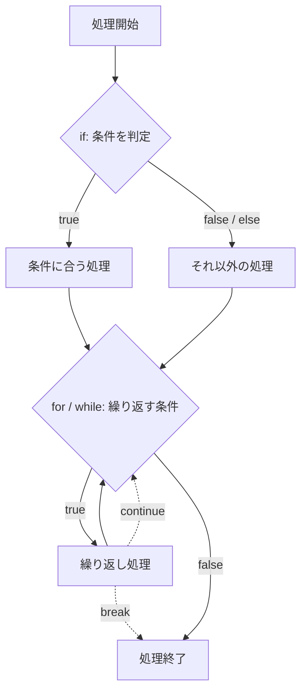

# Java-06 ハンズオン: 条件分岐と繰り返し

補講（任意）: [Java-06A switch / do-while / ラベル付き制御](./java-06a-advanced-control-flow.md)

## 1. この資料のゴール
- `if / else if / else` を使って業務条件を表現できる
- `for` と `while` を目的に応じて使い分けできる
- `break` / `continue` の基本挙動を理解する

---

## 2. 事前準備
```bash
cd ~/order-management-springboot/practice/java
java -version
javac -version
```

期待状態:
- `java -version` と `javac -version` の両方で `17` が表示される
- 例: `17.0.x`

---

## 3. 先に覚えるポイント
1. 条件分岐は「どの処理を実行するか」を決める
2. ループは「同じ処理を繰り返す」
3. `break` はループ終了、`continue` は次の周回へ進む

### 全体構成図（条件分岐と繰り返し）


ポイント:
- `if` は条件によって進む処理を選ぶ
- `for` / `while` は条件が成り立つ間、同じ処理へ戻る
- `continue` は次の周回へ戻り、`break` はループの外へ出る

### 書式の基本

#### if / else if / else

```java
if (条件式) {
    条件式が true のときの処理
} else if (別の条件式) {
    別の条件式が true のときの処理
} else {
    どの条件にも当てはまらないときの処理
}
```

ポイント:
- `if` の条件は必ず `()` で囲む
- 条件式の結果は `boolean` になる
- `else if` は必要な数だけ書ける
- `else` は最後に1回だけ書ける
- 上から順に判定され、最初に `true` になったブロックだけ実行される

条件式の例:

```java
stock <= 0
stock < 10
score >= 80
paid == true
```

#### for

```java
for (初期化; 継続条件; 更新) {
    繰り返したい処理
}
```

例:

```java
for (int day = 1; day <= 5; day++) {
    System.out.println(day);
}
```

ポイント:
- `int day = 1` は最初に1回だけ実行される
- `day <= 5` が `true` の間だけ繰り返す
- `day++` は1周終わるたびに実行される
- 回数が決まっている繰り返しに向いている

#### while

```java
while (条件式) {
    繰り返したい処理
}
```

例:

```java
int retry = 0;
while (retry < 3) {
    System.out.println(retry);
    retry++;
}
```

ポイント:
- 条件式が `true` の間だけ繰り返す
- 更新処理を書き忘れると無限ループになる
- 回数よりも「条件を満たす間」という考え方に向いている

#### break / continue

```java
break;    // ループを終了する
continue; // 今回の周回だけスキップして次へ進む
```

例:

```java
for (int orderNo = 1; orderNo <= 5; orderNo++) {
    if (orderNo == 2) {
        continue;
    }
    if (orderNo == 4) {
        break;
    }
    System.out.println(orderNo);
}
```

期待出力例:

```text
1
3
```

---

## 4. ハンズオン

目的:
- 条件とループで業務の流れを表現する

完了条件:
- `ControlFlowDemo.java` で判定と繰り返しの両方を実行できる

作成ファイル: `~/order-management-springboot/practice/java/handson06/ControlFlowDemo.java`

### Step 0: 作業フォルダを作る
```bash
mkdir -p ~/order-management-springboot/practice/java/handson06
cd ~/order-management-springboot/practice/java/handson06
```

### Step 1: if/else を使う
`ControlFlowDemo.java` を次の内容で作成:

まずは `if` / `else if` / `else` が上から順に判定される動きを確認する。

```java
public class ControlFlowDemo { // 条件分岐の動作確認クラス
    public static void main(String[] args) { // 実行開始地点
        int stock = 8; // 現在在庫

        if (stock <= 0) { // 在庫が 0 以下なら欠品
            System.out.println("在庫なし"); // 欠品メッセージ
        } else if (stock < 10) { // 0 より大きく 10 未満なら少ない
            System.out.println("在庫少"); // 在庫少メッセージ
        } else { // それ以外は十分ある
            System.out.println("在庫あり"); // 在庫ありメッセージ
        }
    } // main メソッドの終わり
} // クラス定義の終わり
```

実行:
```bash
javac -encoding UTF-8 ControlFlowDemo.java
java ControlFlowDemo
```

期待出力例:
```text
在庫少
```


### Step 2: for ループを追加
`ControlFlowDemo.java` を次の内容に更新:

`for` は、回数が決まっている繰り返しに使う。

```java
public class ControlFlowDemo { // for ループの動作確認クラス
    public static void main(String[] args) {
        for (int day = 1; day <= 5; day++) { // day を 1 から 5 まで 1 ずつ増やして繰り返す
            System.out.println("営業日: " + day + "日目"); // 各周回で現在の日数を表示
        }
    } // main メソッドの終わり
} // クラス定義の終わり
```

実行:
```bash
javac -encoding UTF-8 ControlFlowDemo.java
java ControlFlowDemo
```

期待出力例:
```text
営業日: 1日目
営業日: 2日目
営業日: 3日目
営業日: 4日目
営業日: 5日目
```


### Step 3: while ループを追加
`ControlFlowDemo.java` を次の内容に更新:

`while` は、条件が成り立つ間だけ繰り返したいときに使う。

```java
public class ControlFlowDemo { // while ループの動作確認クラス
    public static void main(String[] args) {
        int retry = 0; // カウンタを 0 で初期化
        while (retry < 3) { // retry が 3 未満の間は繰り返す
            System.out.println("再試行回数: " + retry); // 現在の再試行回数を表示
            retry++; // 次の周回に向けて 1 増やす（これがないと無限ループになる）
        }
    } // main メソッドの終わり
} // クラス定義の終わり
```

実行:
```bash
javac -encoding UTF-8 ControlFlowDemo.java
java ControlFlowDemo
```

期待出力例:
```text
再試行回数: 0
再試行回数: 1
再試行回数: 2
```


### Step 4: break / continue を使う（仕上げ）
`ControlFlowDemo.java` を次の内容に更新:

`continue` は今回の周回だけスキップし、`break` はループ全体を終了する。

```java
public class ControlFlowDemo { // break / continue の動作確認クラス
    public static void main(String[] args) {
        for (int orderNo = 1; orderNo <= 10; orderNo++) { // 注文番号 1〜10 を順に処理
            if (orderNo == 3) {
                continue; // 3番はこの周回だけ飛ばして次へ進む
            }
            if (orderNo == 8) {
                break; // 8番に到達したらループ全体を終了する
            }
            System.out.println("処理対象注文: " + orderNo); // 処理対象として出力
        }
    } // main メソッドの終わり
} // クラス定義の終わり
```

実行:
```bash
javac -encoding UTF-8 ControlFlowDemo.java
java ControlFlowDemo
```

期待出力例:
```text
処理対象注文: 1
処理対象注文: 2
処理対象注文: 4
処理対象注文: 5
処理対象注文: 6
処理対象注文: 7
```

### Step 5: 在庫確認と注文処理にまとめる（仕上げ）
前のコード全体を置き換え、`ControlFlowDemo.java` を次の内容に更新:

```java
public class ControlFlowDemo {
    public static void main(String[] args) {
        int stock = 8;
        int requestedQuantity = 3;

        if (requestedQuantity <= 0) {
            System.out.println("注文数が不正です");
        } else if (requestedQuantity > stock) {
            System.out.println("在庫が不足しています");
        } else {
            System.out.println("注文を受け付けました");
        }

        for (int orderNo = 1; orderNo <= 10; orderNo++) {
            if (orderNo == 3) {
                continue;
            }
            if (orderNo == 8) {
                break;
            }
            System.out.println("処理対象注文: " + orderNo);
        }

        int retry = 0;
        while (retry < 3) {
            System.out.println("再試行回数: " + retry);
            retry++;
        }
    }
}
```

実行:
```bash
javac -encoding UTF-8 ControlFlowDemo.java
java ControlFlowDemo
```

期待出力例:
```text
注文を受け付けました
処理対象注文: 1
処理対象注文: 2
処理対象注文: 4
処理対象注文: 5
処理対象注文: 6
処理対象注文: 7
再試行回数: 0
再試行回数: 1
再試行回数: 2
```

確認ポイント:
- `if / else if / else` で注文数を判定している
- `for` で注文番号を順番に処理している
- `continue` で特定の注文をスキップしている
- `break` で注文処理を終了している
- `while` で再試行処理を繰り返している


---

## 5. ミニ演習（10分）

各レベルは、Step 5で完成した `ControlFlowDemo.java` を基準に実施してください。
次のレベルへ進む前に、Step 5の完成コードへ戻してください。

### レベル1（基本）
1. `requestedQuantity` を `10` に変更し、在庫不足になることを確認する。
2. 次に `requestedQuantity` を `0` に変更し、不正な注文数になることを確認する。

期待出力例:
```text
requestedQuantity = 10:
在庫が不足しています

requestedQuantity = 0:
注文数が不正です
```

### レベル2（拡張）
1. Step 5の `for` 文を変更する。
2. 注文番号が奇数の場合は `continue` する。
3. 注文番号が `6` の場合は `break` する。
4. 偶数の注文番号だけが表示されることを確認する。

期待出力例:
```text
処理対象注文: 2
処理対象注文: 4
```

### レベル3（実務）
1. Step 5の `stock` を `3` に変更する。
2. `for` 文で注文を1件処理するたびに、`stock` を1減らす。
3. `stock` が `0` になったら、次の注文処理を `break` で終了する。
4. 注文番号 `3` は、Step 5と同じように `continue` でスキップする。
5. 在庫がなくなったときに `在庫終了` と表示する。

期待出力例:
```text
処理対象注文: 1
処理対象注文: 2
処理対象注文: 4
在庫終了
```

### 実行前予想問題（1分）
次のコードで表示される注文番号を、実行前に予想してください。

```java
for (int orderNo = 1; orderNo <= 6; orderNo++) {
    if (orderNo == 2) {
        continue;
    }
    if (orderNo == 5) {
        break;
    }
    System.out.println(orderNo);
}
```

### デバッグ演習（任意, 5分）
1. Step 5の `if (requestedQuantity <= 0)` を `if requestedQuantity <= 0` に変更し、意図的に丸括弧を削除する。
2. コンパイルして構文エラーを確認する。
3. `if (requestedQuantity <= 0)` に戻す。
4. 再コンパイルして成功することを確認する。

---

## 6. つまずきポイント
- `if` の `()` を忘れる
  -> `if (条件)` の形を守る
- ループが止まらない
  -> `while` の更新処理（`i++` など）を確認
- `break` と `continue` を混同
  -> `break` は終了、`continue` はスキップ

