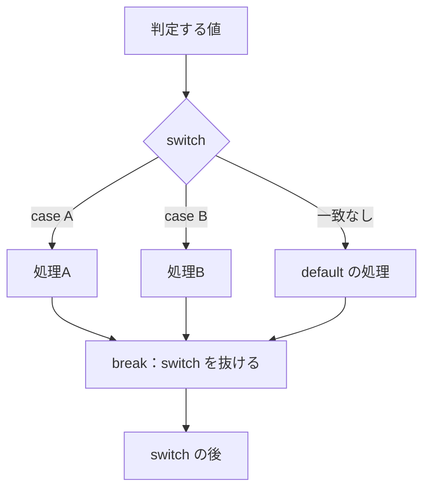
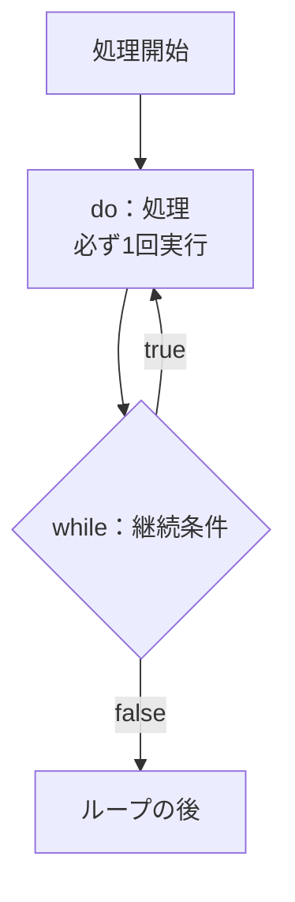
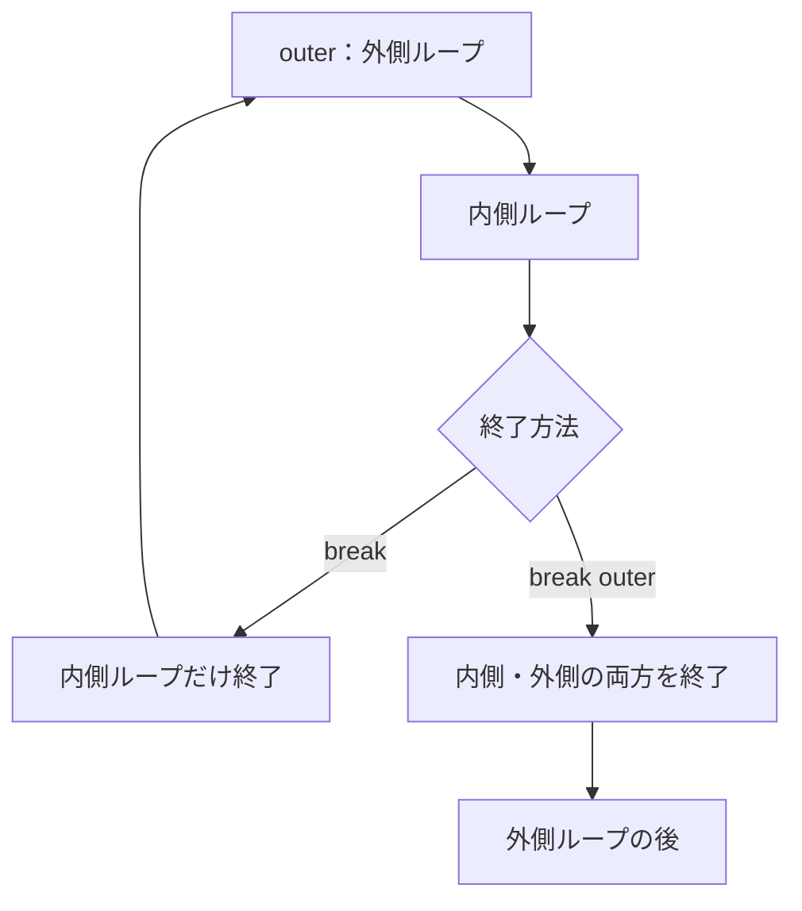

# Java-06A 補講: switch / do-while / ラベル付き制御

## 1. この資料のゴール
- `switch` を使って多分岐を実装できる
- `do-while` の前判定/後判定の違いを説明できる
- ネストループでラベル付き `break` を使い分けできる

---

## 2. 事前準備
```bash
cd ~/order-management-springboot/practice/java
java -version
javac -version
```

期待状態:
- `java -version` と `javac -version` の両方で `17` が表示される
- 例: `17.0.x`

---

## 3. 先に覚えるポイント
1. `switch` は値ごとに分岐先を切り替える
2. `do-while` は1回実行してから条件判定する
3. ラベル付き `break` は外側ループまで一気に抜けられる

### 書式の基本

#### switch



```java
switch (判定する値) {
    case 値1:
        値1だったときの処理
        break;
    case 値2:
        値2だったときの処理
        break;
    default:
        どの case にも当てはまらないときの処理
        break;
}
```

例:

```java
String status = "PAID";

switch (status) {
    case "PAID":
        System.out.println("支払い済み");
        break;
    case "PENDING":
        System.out.println("支払い待ち");
        break;
    default:
        System.out.println("不明な状態");
        break;
}
```

ポイント:
- `switch` は1つの値を複数の候補と照合するときに使う
- `case` には一致させたい値を書く
- `default` はどの `case` にも一致しないときに実行される
- `break;` を書かないと、次の `case` の処理へ流れることがある（フォールスルー）

#### do-while



```java
do {
    繰り返したい処理
} while (条件式);
```

例:

```java
int retry = 0;

do {
    retry++;
    System.out.println(retry);
} while (retry < 3);
```

ポイント:
- `do` の中身は、条件式に関係なく最低1回は実行される
- 条件式が `true` の間だけ繰り返す
- 最後の `while (条件式);` には `;` が必要
- 「まず1回実行してから継続判定したい」処理に向いている

#### ラベル付き break



```java
ラベル名:
for (...) {
    for (...) {
        break ラベル名;
    }
}
```

例:

```java
outer:
for (int row = 1; row <= 3; row++) {
    for (int col = 1; col <= 3; col++) {
        if (row == 2 && col == 2) {
            break outer;
        }
        System.out.println("row=" + row + ", col=" + col);
    }
}
```

ポイント:
- 通常の `break` は、今いる一番内側のループだけを終了する
- `break outer;` のように書くと、指定したラベルのループまで終了できる
- ラベル名は任意だが、`outer` のように外側だと分かる名前にする
- 多用すると読みづらくなるため、必要な場面だけ使う

---

## 4. ハンズオン

目的:
- 分岐と繰り返しの制御構文を拡張して扱う

完了条件:
- `AdvancedControlFlowDemo.java` で3つの構文を実行確認できる

作成ファイル: `~/order-management-springboot/practice/java/handson06a/AdvancedControlFlowDemo.java`

### Step 0: 作業フォルダを作る
```bash
mkdir -p ~/order-management-springboot/practice/java/handson06a
cd ~/order-management-springboot/practice/java/handson06a
```

### Step 1: `switch` を使った多分岐
`AdvancedControlFlowDemo.java` を次の内容で作成:

`switch` は、1つの値を複数の候補に分けて処理したいときに使う。

```java
public class AdvancedControlFlowDemo {
    public static void main(String[] args) {
        int score = 80;

        switch (score / 10) {
            case 10:
            case 9:
            case 8:
                System.out.println("評価: A");
                break;
            case 7:
            case 6:
                System.out.println("評価: B");
                break;
            default:
                System.out.println("評価: C");
                break;
        }
    }
}
```

実行:
```bash
javac -encoding UTF-8 AdvancedControlFlowDemo.java
java AdvancedControlFlowDemo
```

期待出力例:
```text
評価: A
```

### Step 2: `do-while` で後判定ループ
`AdvancedControlFlowDemo.java` を次の内容に更新:

`do-while` は、条件に関係なく最初の1回は必ず実行される。

```java
public class AdvancedControlFlowDemo {
    public static void main(String[] args) {
        int retry = 0;

        do {
            retry++;
            System.out.println("再試行: " + retry);
        } while (retry < 3);
    }
}
```

実行:
```bash
javac -encoding UTF-8 AdvancedControlFlowDemo.java
java AdvancedControlFlowDemo
```

期待出力例:
```text
再試行: 1
再試行: 2
再試行: 3
```

### Step 3: ラベル付き `break` を使う
`AdvancedControlFlowDemo.java` を次の内容に更新:

ラベル付き `break` は、ネストしたループの外側まで一気に抜けたいときに使う。

```java
public class AdvancedControlFlowDemo {
    public static void main(String[] args) {
        outer:
        for (int row = 1; row <= 3; row++) {
            for (int col = 1; col <= 3; col++) {
                if (row == 2 && col == 2) {
                    break outer; // 内側だけでなく外側ループも終了
                }
                System.out.println("row=" + row + ", col=" + col);
            }
        }
    }
}
```

実行:
```bash
javac -encoding UTF-8 AdvancedControlFlowDemo.java
java AdvancedControlFlowDemo
```

期待出力例:
```text
row=1, col=1
row=1, col=2
row=1, col=3
row=2, col=1
```

### Step 4: 状態判定と繰り返し処理にまとめる（仕上げ）
前のコード全体を置き換え、`AdvancedControlFlowDemo.java` を次の内容に更新:

```java
public class AdvancedControlFlowDemo {
    public static void main(String[] args) {
        String status = "PAID";

        switch (status) {
            case "PAID":
                System.out.println("状態: 入金済み");
                break;
            case "PENDING":
                System.out.println("状態: 入金待ち");
                break;
            default:
                System.out.println("状態: 不明");
                break;
        }

        int countdown = 3;
        do {
            System.out.println("開始まで: " + countdown);
            countdown--;
        } while (countdown >= 1);

        inspection:
        for (int row = 1; row <= 3; row++) {
            for (int col = 1; col <= 3; col++) {
                if (row == 2 && col == 2) {
                    System.out.println("不正データ検出: row=" + row + ", col=" + col);
                    break inspection;
                }
                System.out.println("確認済み: row=" + row + ", col=" + col);
            }
        }
    }
}
```

実行:
```bash
javac -encoding UTF-8 AdvancedControlFlowDemo.java
java AdvancedControlFlowDemo
```

期待出力例:
```text
状態: 入金済み
開始まで: 3
開始まで: 2
開始まで: 1
確認済み: row=1, col=1
確認済み: row=1, col=2
確認済み: row=1, col=3
確認済み: row=2, col=1
不正データ検出: row=2, col=2
```

確認ポイント:
- `switch` で状態ごとの処理を分けている
- `do-while` で処理を1回以上実行している
- ラベル付き `break` で2重ループ全体を終了している

---

## 5. ミニ演習（10分）

各レベルは、Step 4で完成した `AdvancedControlFlowDemo.java` を基準に実施してください。
次のレベルへ進む前に、Step 4の完成コードへ戻してください。

### レベル1（基本）
1. Step 4の `status` を `"PENDING"` に変更する。
2. `switch` によって入金待ちのメッセージだけが表示されることを確認する。
3. 次に `status` を `"CANCELLED"` に変更し、`default` が実行されることを確認する。

期待出力例:
```text
status = "PENDING":
状態: 入金待ち

status = "CANCELLED":
状態: 不明
```

### レベル2（拡張）
1. Step 4の `countdown` を `5` に変更する。
2. `do-while` の処理を変更せず、`5`から`1`まで表示されることを確認する。

期待出力例:
```text
開始まで: 5
開始まで: 4
開始まで: 3
開始まで: 2
開始まで: 1
```

### レベル3（実務）
1. Step 4の不正データ条件を `row == 3 && col == 1` に変更する。
2. `row=2, col=3` までは確認処理が続くことを確認する。
3. `row=3, col=1` でラベル付き `break` が実行され、2重ループ全体が終了することを確認する。

期待出力の末尾:
```text
確認済み: row=2, col=2
確認済み: row=2, col=3
不正データ検出: row=3, col=1
```

### 実行前予想問題（1分）
次のコードの出力を実行前に予想してください。
- `int n = 0; do { n++; } while (n < 0); System.out.println(n);`

### デバッグ演習（任意, 5分）
1. Step 4の `case "PAID":` にある `break;` を一時的に削除する。
2. `status` が `"PAID"` のまま実行し、`PENDING` の処理まで続くことを確認する。
3. `break;` を戻し、`状態: 入金済み` だけが表示されることを確認する。

---

## 6. つまずきポイント
- `switch` で `break` 漏れ
  -> フォールスルーが意図通りか確認
- `while` と `do-while` の使い分け混乱
  -> 「先に判定」か「先に1回実行」かで選ぶ
- ラベル付き `break` の誤用
  -> どのループを抜けるかラベル名を明示する
