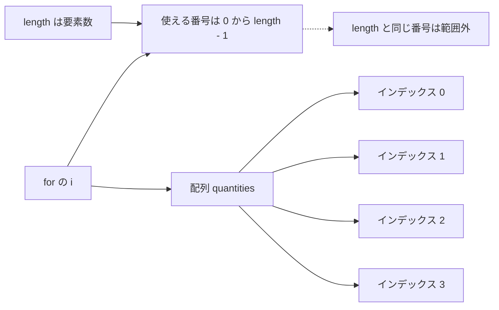

# Java-07 ハンズオン: 配列

補講（任意）: [Java-07A 参照型と多次元配列](./java-07a-reference-types-and-multidimensional-arrays.md)

## 1. この資料のゴール
- 配列の宣言・初期化・参照を理解する
- `for` と組み合わせて配列を処理できる
- インデックスと `length` の関係を説明できる

---

## 2. 事前準備
```bash
cd ~/order-management-springboot/practice/java
java -version
javac -version
```

期待状態:
- `java -version` と `javac -version` の両方で `17` が表示される
- 例: `17.0.x`

---

## 3. 先に覚えるポイント
1. 配列は同じ型の値を複数保持する
2. 先頭要素のインデックスは `0`
3. 有効範囲は `0` 〜 `length - 1`

### 全体構成図（配列とインデックス）


ポイント:
- 配列の件数が4なら、最後のインデックスは `3`
- `i < 配列名.length` にすると、最後の要素まで安全に処理できる
- `i <= 配列名.length` にすると、存在しない位置を読みに行く

### 書式の基本

#### 配列の宣言と初期化

```java
int[] quantities = {3, 5, 2, 8};
String[] productNames = {"Laptop", "Mouse", "Keyboard"};
```

ポイント:
- `int[]` は「int の配列」を表す
- `String[]` は「String の配列」を表す
- `{...}` の中に、同じ型の値を並べる
- 配列に入れた値は、順番を持つ

#### 要素の参照

```java
System.out.println(quantities[0]);
System.out.println(quantities[1]);
```

ポイント:
- 配列の位置番号をインデックスと呼ぶ
- インデックスは `0` から始まる
- `quantities[0]` は1件目
- `quantities[1]` は2件目
- 最後の要素は `配列名[配列名.length - 1]`

#### length

```java
System.out.println(quantities.length);
```

ポイント:
- `length` は配列の要素数を表す
- 配列では `length()` ではなく `length` と書く
- 要素数が4なら、有効なインデックスは `0`, `1`, `2`, `3`
- `4` 番目のインデックスに見える `quantities[4]` は範囲外

#### for で配列を処理する定番形

```java
for (int i = 0; i < quantities.length; i++) {
    System.out.println(quantities[i]);
}
```

ポイント:
- `i = 0` から始める
- `i < quantities.length` の間だけ繰り返す
- `i++` で次の要素へ進む
- `i <= quantities.length` にすると範囲外アクセスになる（quantities[0]からなので、quantities[4]は存在しない）

#### 拡張for

```java
for (int quantity : quantities) {
    System.out.println(quantity);
}
```

ポイント:
- 配列の値を先頭から順番に取り出せる
- インデックスが不要なときは読みやすい
- インデックス番号が必要なときは通常の `for` を使う

#### 2つの配列を対応させる

```java
String[] productNames = {"Laptop", "Mouse", "Keyboard"};
int[] quantities = {3, 5, 2};

for (int i = 0; i < productNames.length; i++) {
    System.out.println(productNames[i] + " 数量: " + quantities[i]);
}
```

ポイント:
- `productNames[0]` と `quantities[0]` のように、同じインデックス同士を対応させる
- 2つの配列の件数がずれると、範囲外エラーや対応ずれが起きる
- 実務では後で学ぶクラスやコレクションでまとめて扱うことが多い

---

## 4. ハンズオン

目的:
- 複数データをまとめて扱う

完了条件:
- `ArrayDemo.java` で数値配列と文字列配列を処理できる

作成ファイル: `~/order-management-springboot/practice/java/handson07/ArrayDemo.java`

### Step 0: 作業フォルダを作る
```bash
mkdir -p ~/order-management-springboot/practice/java/handson07
cd ~/order-management-springboot/practice/java/handson07
```

### Step 1: 数値配列を作る
`ArrayDemo.java` を次の内容で作成:

まずは配列の作成、先頭要素の参照、要素数の確認を行う。

```java
public class ArrayDemo { // 配列の基本確認クラス
    public static void main(String[] args) { // 実行開始地点
        int[] quantities = {3, 5, 2, 8}; // int 配列を初期化（4要素）
        System.out.println("1件目数量: " + quantities[0]); // インデックス 0 の要素を参照
        System.out.println("配列の長さ: " + quantities.length); // 要素数を取得
    } // main メソッドの終わり
} // クラス定義の終わり
```

実行:
```bash
javac -encoding UTF-8 ArrayDemo.java
java ArrayDemo
```

期待出力例:
```text
1件目数量: 3
配列の長さ: 4
```


### Step 2: ループで合計する
`ArrayDemo.java` を次の内容に更新:

配列全体を処理するときは、`for` と `length` を組み合わせる。

```java
public class ArrayDemo { // 配列をループで集計するクラス
    public static void main(String[] args) {
        int[] quantities = {3, 5, 2, 8}; // 集計対象の配列
        int total = 0; // 合計値の初期値

        for (int i = 0; i < quantities.length; i++) { // i を配列の有効範囲で繰り返す
            total += quantities[i]; // 現在要素を total に加算
        }

        System.out.println("数量合計: " + total); // 集計結果を表示
    } // main メソッドの終わり
} // クラス定義の終わり
```

実行:
```bash
javac -encoding UTF-8 ArrayDemo.java
java ArrayDemo
```

期待出力例:
```text
数量合計: 18
```


### Step 3: 文字列配列を追加（仕上げ）
`ArrayDemo.java` を次の内容に更新:

複数の配列を同じインデックスで対応付けて扱う。

```java
public class ArrayDemo { // 文字列配列と数値配列を組み合わせて扱うクラス
    public static void main(String[] args) {
        String[] productNames = {"Laptop", "Mouse", "Keyboard"}; // 商品名配列
        int[] quantities = {3, 5, 2}; // 各商品の数量配列

        for (int i = 0; i < productNames.length; i++) { // 商品数分だけ繰り返す
            System.out.println(productNames[i] + " 数量: " + quantities[i]); // 同じインデックス同士を対応付けて表示
        }
    } // main メソッドの終わり
} // クラス定義の終わり
```

実行:
```bash
javac -encoding UTF-8 ArrayDemo.java
java ArrayDemo
```

期待出力例:
```text
Laptop 数量: 3
Mouse 数量: 5
Keyboard 数量: 2
```

---

## 5. ミニ演習（10分）

各レベルは、Step 3で完成した `ArrayDemo.java` を基準に実施してください。
次のレベルへ進む前に、Step 3の完成コードへ戻してください。

### レベル1（基本）
1. `productNames` の末尾に `"Monitor"` を追加する。
2. `quantities` の末尾に `1` を追加する。
3. 2つの配列の要素数をそろえ、商品を4件表示する。

期待出力例:
```text
Laptop 数量: 3
Mouse 数量: 5
Keyboard 数量: 2
Monitor 数量: 1
```

### レベル2（拡張）
1. Step 3の `quantities` の先頭要素を、最大数量の初期値にする。
2. 通常の `for` 文で `quantities` の全要素を比較し、最大数量を求める。
3. ループ終了後に最大数量を表示する。

期待出力例:
```text
最大数量: 5
```

### レベル3（実務）
1. `quantities` の合計処理を拡張for（for-each）で実装する。
2. 商品名の前にインデックスを表示する処理は、通常の `for` 文で実装する。
3. インデックスが不要な処理と必要な処理で、2種類の `for` 文を使い分ける。

期待出力例:
```text
合計(拡張for): 10
0: Laptop
1: Mouse
2: Keyboard
```

### 実行前予想問題（1分）
次のコードの出力を実行前に予想してください。
- `int[] nums = {3, 5, 2, 8};`
- `System.out.println(nums.length);`
- `System.out.println(nums[nums.length - 1]);`

### デバッグ演習（任意, 5分）
1. Step 3のループ条件を `i < productNames.length` から `i <= productNames.length` に変更して実行する。
2. `ArrayIndexOutOfBoundsException` を確認する。
3. エラーが発生したインデックスと配列の要素数を確認する。
4. 条件を `i < productNames.length` に戻して再実行する。

---

## 6. つまずきポイント
- `ArrayIndexOutOfBoundsException`
  -> `i < array.length` を確認
- 配列長が一致しない
  -> `productNames` と `quantities` の件数を揃える
- `length()` と `length` の混同
  -> 配列は `length`（フィールド）

