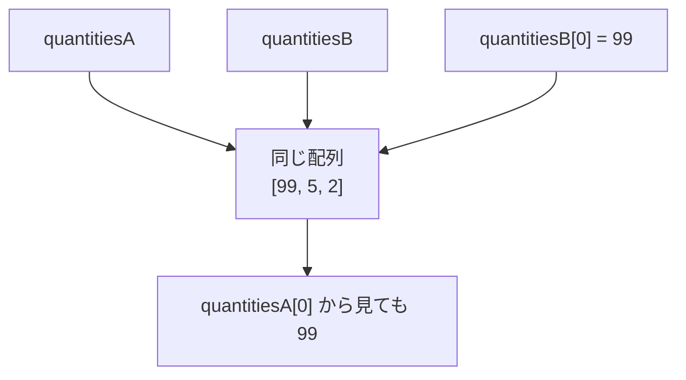
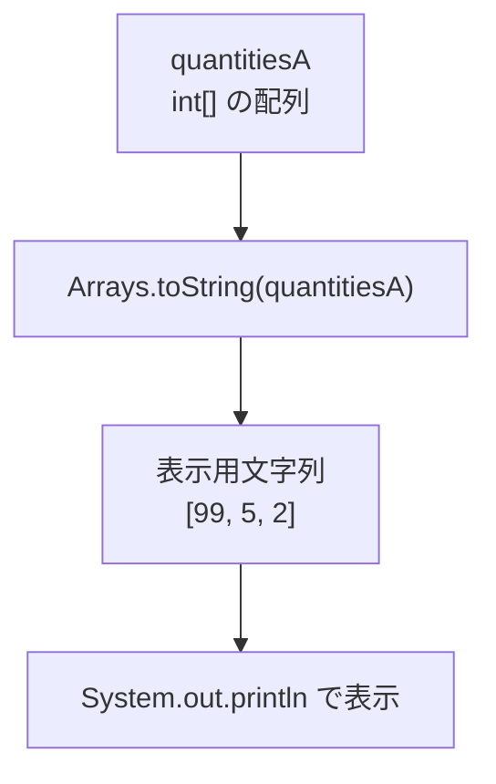
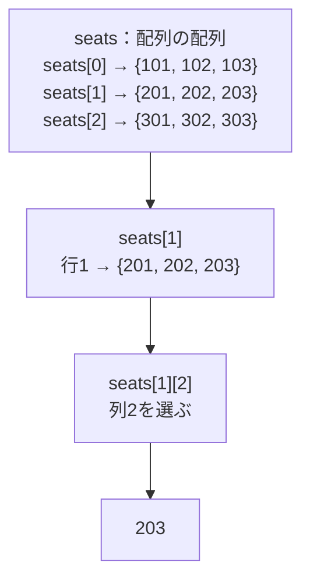
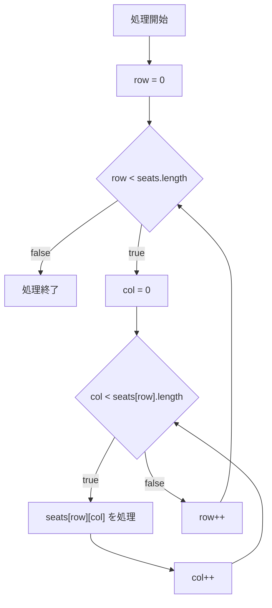

# Java-07A 補講: 参照型と多次元配列

## 1. この資料のゴール
- 参照型の代入で「同じ配列を参照する」挙動を説明できる
- 2次元配列を走査して値を表示できる
- 行ごとに列数が異なる2次元配列を安全に処理できる

---

## 2. 事前準備
```bash
cd ~/order-management-springboot/practice/java
java -version
javac -version
```

期待状態:
- `java -version` と `javac -version` の両方で `17` が表示される
- 例: `17.0.x`

---

## 3. 先に覚えるポイント
1. 参照型変数は値そのものではなく参照先を保持する
2. 配列の代入では、中身ではなく同じ配列を指す参照がコピーされる
3. 2次元配列は「配列の配列」として扱い、行ごとの長さを確認する

### 書式の基本

#### 参照型の代入



```java
int[] quantitiesA = {3, 5, 2};
int[] quantitiesB = quantitiesA;

quantitiesB[0] = 99;

System.out.println("A[0]: " + quantitiesA[0]);
System.out.println("B[0]: " + quantitiesB[0]);
```

期待出力例:

```text
A[0]: 99
B[0]: 99
```

ポイント:
- 配列は参照型
- `quantitiesB = quantitiesA` は配列の中身をコピーしているのではなく、同じ配列を指す参照をコピーしている
- `quantitiesB[0]` を変更すると、`quantitiesA[0]` から見ても変更後の値になる

#### 配列の中身を表示する



```java
import java.util.Arrays;

System.out.println(Arrays.toString(quantitiesA));
```

期待出力例:

```text
[99, 5, 2]
```

ポイント:
- 配列をそのまま `println` すると中身が見やすく表示されない
- `Arrays.toString(配列名)` を使うと、配列の要素を確認しやすい

#### 2次元配列の宣言と参照



```java
int[][] seats = {
        {101, 102, 103},
        {201, 202, 203},
        {301, 302, 303}
};

System.out.println(seats[0][0]);
System.out.println(seats[1][2]);
```

期待出力例:

```text
101
203
```

ポイント:
- `int[][]` は int の2次元配列を表す
- `seats[行][列]` の形で要素を参照する
- インデックスは行も列も `0` から始まる
- 2次元配列では、行ごとに列数が異なる場合もある

#### 2次元配列を `for` で処理する定番形



```java
for (int row = 0; row < seats.length; row++) {
    for (int col = 0; col < seats[row].length; col++) {
        System.out.println(seats[row][col]);
    }
}
```

期待出力例:

```text
101
102
103
201
202
203
301
302
303
```

ポイント:
- 外側の `for` は行を処理する
- 内側の `for` は列を処理する
- 行数は `seats.length`
- 各行の列数は `seats[row].length`

---

## 4. ハンズオン

目的:
- 参照型の挙動と多次元配列の操作を実行で理解する

完了条件:
- `ReferenceArrayDemo.java` で参照共有と2次元配列走査を確認できる

作成ファイル: `~/order-management-springboot/practice/java/handson07a/ReferenceArrayDemo.java`

### Step 0: 作業フォルダを作る
```bash
mkdir -p ~/order-management-springboot/practice/java/handson07a
cd ~/order-management-springboot/practice/java/handson07a
```

### Step 1: 参照型の代入を確認する
`ReferenceArrayDemo.java` を次の内容で作成:

```java
import java.util.Arrays;

public class ReferenceArrayDemo {
    public static void main(String[] args) {
        int[] quantitiesA = {3, 5, 2};
        int[] quantitiesB = quantitiesA; // 参照をコピー

        quantitiesB[0] = 99; // B経由で先頭要素を更新

        System.out.println("A: " + Arrays.toString(quantitiesA));
        System.out.println("B: " + Arrays.toString(quantitiesB));
    }
}
```

実行:
```bash
javac -encoding UTF-8 ReferenceArrayDemo.java
java ReferenceArrayDemo
```

期待出力例:
```text
A: [99, 5, 2]
B: [99, 5, 2]
```

### Step 2: 2次元配列を走査する
`ReferenceArrayDemo.java` を次の内容に更新:

```java
public class ReferenceArrayDemo {
    public static void main(String[] args) {
        int[][] seats = {
                {101, 102, 103},
                {201, 202, 203},
                {301, 302, 303}
        };

        for (int row = 0; row < seats.length; row++) {
            for (int col = 0; col < seats[row].length; col++) {
                System.out.println("row=" + row + ", col=" + col + ", seatNo=" + seats[row][col]);
            }
        }
    }
}
```

実行:
```bash
javac -encoding UTF-8 ReferenceArrayDemo.java
java ReferenceArrayDemo
```

期待出力例:
```text
row=0, col=0, seatNo=101
row=0, col=1, seatNo=102
row=0, col=2, seatNo=103
row=1, col=0, seatNo=201
row=1, col=1, seatNo=202
row=1, col=2, seatNo=203
row=2, col=0, seatNo=301
row=2, col=1, seatNo=302
row=2, col=2, seatNo=303
```

---

## 5. ミニ演習（10分）
### レベル1（基本）
1. `int[]` をもう1つ作り、参照コピー時と別配列時の差分を表示する。

期待状態:
- 参照コピー側は同時に変化し、別配列側は変化しない。

### レベル2（拡張）
1. 次のように行ごとの列数が異なる2次元配列を作り、すべての値を表示する。
   - 1行目: `{101, 102, 103}`
   - 2行目: `{201, 202}`
   - 3行目: `{301, 302, 303, 304}`

期待状態:
- `seats[row].length` を使い、各行の列数に合わせて安全に走査できる。

### レベル3（実務）
1. 2次元配列の合計値を求める。
2. 行ごとの合計も別々に表示する。

期待状態:
- 全体合計と各行合計を正しく表示できる。

### 実行前予想問題（1分）
次の結果を実行前に予想してください。
- `int[][] values = {{10, 20}, {30}}; System.out.println(values.length);`
- `System.out.println(values[1].length);`

### デバッグ演習（任意, 5分）
1. 2次元配列の内側ループを `col <= seats[row].length` に変更して実行する。
2. `ArrayIndexOutOfBoundsException` を確認する。
3. 条件を `col < seats[row].length` に戻して再実行する。

---

## 6. つまずきポイント
- 参照コピーを値コピーと誤解
  -> 配列は参照型であることを意識する
- 2次元配列で添字エラー
  -> 外側は `seats.length`、内側は `seats[row].length`
