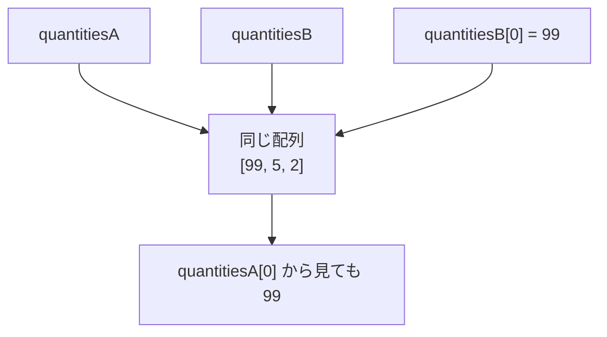
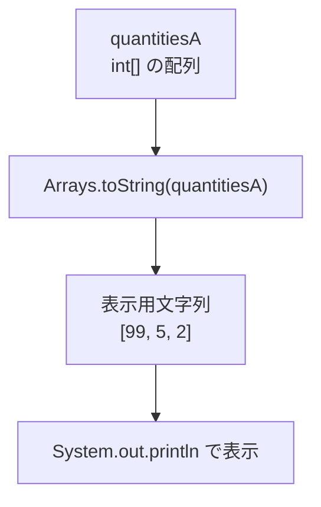
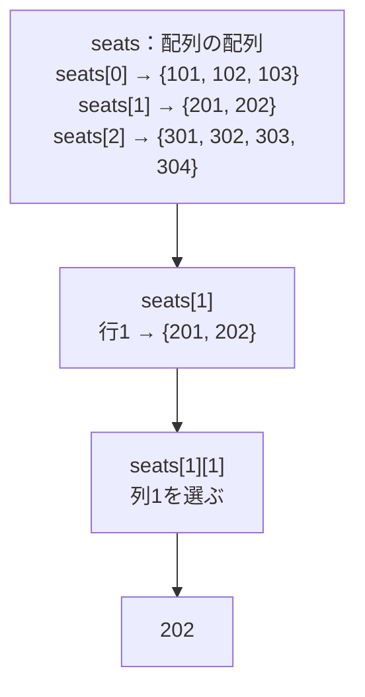
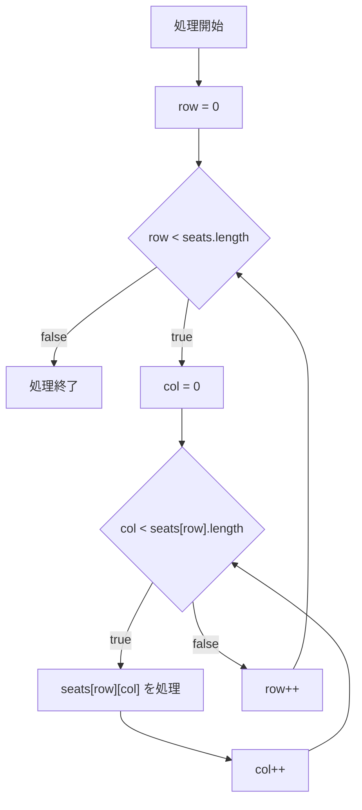

# Java-07A 補講: 参照型と多次元配列

## 1. この資料のゴール
- 参照型の代入で「同じ配列を参照する」挙動を説明できる
- 2次元配列を走査して値を表示できる
- 行ごとに列数が異なる2次元配列を安全に処理できる

---

## 2. 事前準備
```bash
cd ~/order-management-springboot/practice/java
java -version
javac -version
```

期待状態:
- `java -version` と `javac -version` の両方で `17` が表示される
- 例: `17.0.x`

---

## 3. 先に覚えるポイント
1. `int`は基本データ型、`int[]`と`int[][]`は参照型
2. 参照型変数は、配列やオブジェクトそのものではなく参照先を保持する
3. 配列の代入では、中身ではなく同じ配列を指す参照がコピーされる
4. 2次元配列は「配列の配列」として扱い、行ごとの長さを確認する

### `int`と`int[]`は別の型

`int`は基本データ型（プリミティブ型）ですが、`int[]`は配列を表す参照型です。

```java
int quantity = 3;          // int型: 基本データ型
int[] quantities = {3, 5}; // int[]型: 参照型
```

この章で参照型として扱うのは、`int`ではなく`int[]`や`int[][]`です。

| 型 | 分類 | 変数が保持するもの | 代入時にコピーされるもの |
| --- | --- | --- | --- |
| `int` | 基本データ型（プリミティブ型） | 整数値 | 整数値 |
| `double` | 基本データ型（プリミティブ型） | 小数値 | 小数値 |
| `boolean` | 基本データ型（プリミティブ型） | 真偽値 | 真偽値 |
| `char` | 基本データ型（プリミティブ型） | 1文字 | 文字 |
| `int[]` | 参照型 | 1次元配列への参照 | 配列への参照 |
| `int[][]` | 参照型 | 2次元配列への参照 | 配列への参照 |
| `String` | 参照型 | 文字列オブジェクトへの参照 | オブジェクトへの参照 |
| `LocalDate` | 参照型 | 日付オブジェクトへの参照 | オブジェクトへの参照 |
| 自作クラス | 参照型 | インスタンスへの参照 | インスタンスへの参照 |

#### 基本データ型を代入した場合

```java
int a = 10;
int b = a; // 整数値10をコピー

b = 20;

System.out.println(a); // 10
System.out.println(b); // 20
```

`b`を変更しても、`a`には影響しません。

#### 配列を代入した場合

```java
int[] quantitiesA = {3, 5, 2};
int[] quantitiesB = quantitiesA; // 同じ配列への参照をコピー

quantitiesB[0] = 99;

System.out.println(quantitiesA[0]); // 99
System.out.println(quantitiesB[0]); // 99
```

`quantitiesA`と`quantitiesB`は同じ配列を参照しているため、`quantitiesB`から要素を変更すると、`quantitiesA`から見える値も変わります。

補足:

`String`と`LocalDate`も、配列と同じ参照型です。ただし、作成した後の内容を変更するときの動きが配列とは異なります。

| 参照型 | 作成後の内容 | 変更する処理を行った結果 |
|---|---|---|
| 配列 | 要素を変更できる | 同じ配列の要素が変わる |
| `String` | 文字列の内容を直接変更できない | 変更後の内容を持つ新しい文字列が作られる |
| `LocalDate` | 日付の内容を直接変更できない | 変更後の日付を持つ新しい`LocalDate`が作られる |

`String`の例:

```java
String originalName = "Java";
String updatedName = originalName + "入門";

System.out.println(originalName); // Java
System.out.println(updatedName);  // Java入門
```

文字列を連結しても、`originalName`が参照している`"Java"`は変わりません。`"Java入門"`という新しい文字列が作られ、`updatedName`がその文字列を参照します。

`LocalDate`の例:

```java
import java.time.LocalDate;

LocalDate today = LocalDate.of(2026, 7, 12);
LocalDate tomorrow = today.plusDays(1);

System.out.println(today);    // 2026-07-12
System.out.println(tomorrow); // 2026-07-13
```

`plusDays(1)`を実行しても、`today`が参照している日付は変わりません。1日後の日付を持つ新しい`LocalDate`が作られ、`tomorrow`がその日付を参照します。

このように、作成後にオブジェクトの内容を変更できない性質を「イミュータブル」と呼びます。変数を別の文字列や日付へ再代入できない、という意味ではありません。この章では参照共有による変更を確認しやすいように、要素を変更できる配列を使用します。

### 書式の基本

#### 参照型の代入



```java
int[] quantitiesA = {3, 5, 2};
int[] quantitiesB = quantitiesA;

quantitiesB[0] = 99;

System.out.println("A[0]: " + quantitiesA[0]);
System.out.println("B[0]: " + quantitiesB[0]);
```

期待出力例:

```text
A[0]: 99
B[0]: 99
```

ポイント:
- 配列は参照型
- `quantitiesB = quantitiesA` は配列の中身をコピーしているのではなく、同じ配列を指す参照をコピーしている
- `quantitiesB[0]` を変更すると、`quantitiesA[0]` から見ても変更後の値になる

#### 配列の中身を表示する



```java
import java.util.Arrays;

System.out.println(quantitiesA); // 配列をそのまま渡すと、中身は見やすく表示されない

String quantitiesText = Arrays.toString(quantitiesA);
System.out.println(quantitiesText);
```

期待出力例:

```text
[I@...のような文字列
[99, 5, 2]
```

1行目の文字列は実行環境によって異なる。確認したい配列の中身は、2行目のように `Arrays.toString(...)` を使って表示する。

`Arrays.toString(quantitiesA)` を分解すると、次の意味になる。

| 記述 | 意味 |
|---|---|
| `Arrays` | 配列を扱う機能が用意されたクラス |
| `toString` | 配列を表示用の文字列へ変換するメソッド |
| `quantitiesA` | `toString`へ渡す配列 |
| 戻り値 | `"[99, 5, 2]"`のような`String`型の文字列 |

処理の順序:

1. `Arrays.toString(quantitiesA)` が配列の各要素を読み取る。
2. 表示用文字列 `"[99, 5, 2]"` を返す。
3. 返された文字列を `quantitiesText` に代入する。
4. `System.out.println` が文字列を表示する。

ポイント:
- 配列をそのまま `println` すると中身が見やすく表示されない
- `Arrays.toString(配列名)` を使うと、1次元配列の要素を確認しやすい文字列にできる
- `Arrays.toString` は表示用文字列を作る処理であり、元の配列の要素は変更しない
- `Arrays` を使用するには、ファイルの先頭に `import java.util.Arrays;` が必要

#### 2次元配列の宣言と参照



```java
int[][] seats = {
        {101, 102, 103},
        {201, 202},
        {301, 302, 303, 304}
};

System.out.println(seats[0][0]);
System.out.println(seats[1][1]);
```

期待出力例:

```text
101
202
```

ポイント:
- `int[][]` は int の2次元配列を表す
- `seats[行][列]` の形で要素を参照する
- インデックスは行も列も `0` から始まる
- 2次元配列では、行ごとに列数が異なる場合もある

`seats[row].length` は、左から順に分けて読むと理解しやすい。

```java
int[] currentRow = seats[row];       // row番目の行を取り出す
int columnCount = currentRow.length; // 取り出した行の要素数を調べる
```

この2行の考え方を、1つの式で書いたものが次の記述である。

```java
int columnCount = seats[row].length;
```

| `row`の値 | `seats[row]`が表す配列 | `seats[row].length` |
|---:|---|---:|
| `0` | `{101, 102, 103}` | `3` |
| `1` | `{201, 202}` | `2` |
| `2` | `{301, 302, 303, 304}` | `4` |

`seats.length`は外側の配列にある行の数、`seats[row].length`は現在選択している行の要素数を表す。配列の`length`はメソッドではないため、`length()`ではなく`length`と書く。

#### 2次元配列を `for` で処理する定番形



```java
for (int row = 0; row < seats.length; row++) {
    for (int col = 0; col < seats[row].length; col++) {
        System.out.println(seats[row][col]);
    }
}
```

期待出力例:

```text
101
102
103
201
202
301
302
303
304
```

ポイント:
- 外側の `for` は、`seats.length`を使って処理する行を順番に選ぶ
- `seats[row]`は、現在処理している1行分の`int[]`を表す
- 内側の `for` は、`seats[row].length`を使って現在の行に存在する要素だけを処理する
- 行ごとに列数が異なっても、それぞれの行の要素数に合わせて安全に処理できる

---

## 4. ハンズオン

目的:
- 参照型の挙動と多次元配列の操作を実行で理解する

完了条件:
- `ReferenceArrayDemo.java` で参照共有と2次元配列走査を確認できる

作成ファイル: `~/order-management-springboot/practice/java/handson07a/ReferenceArrayDemo.java`

### Step 0: 作業フォルダを作る
```bash
mkdir -p ~/order-management-springboot/practice/java/handson07a
cd ~/order-management-springboot/practice/java/handson07a
```

### Step 1: 参照型の代入を確認する
`ReferenceArrayDemo.java` を次の内容で作成:

```java
import java.util.Arrays;

public class ReferenceArrayDemo {
    public static void main(String[] args) {
        int[] quantitiesA = {3, 5, 2}; // int[]は参照型
        int[] quantitiesB = quantitiesA; // 同じ配列への参照をコピー

        quantitiesB[0] = 99; // B経由で先頭要素を更新

        String quantitiesAText = Arrays.toString(quantitiesA); // 配列Aを表示用文字列へ変換
        String quantitiesBText = Arrays.toString(quantitiesB); // 配列Bを表示用文字列へ変換
        System.out.println("A: " + quantitiesAText);
        System.out.println("B: " + quantitiesBText);
    }
}
```

実行:
```bash
javac -encoding UTF-8 ReferenceArrayDemo.java
java ReferenceArrayDemo
```

期待出力例:
```text
A: [99, 5, 2]
B: [99, 5, 2]
```

### Step 2: 2次元配列を走査する
`ReferenceArrayDemo.java` を次の内容に更新:

```java
public class ReferenceArrayDemo {
    public static void main(String[] args) {
        int[][] seats = {
                {101, 102, 103},
                {201, 202, 203},
                {301, 302, 303}
        };

        for (int row = 0; row < seats.length; row++) { // seats.lengthは行数
            for (int col = 0; col < seats[row].length; col++) { // 現在の行の要素数まで繰り返す
                System.out.println("row=" + row + ", col=" + col + ", seatNo=" + seats[row][col]);
            }
        }
    }
}
```

実行:
```bash
javac -encoding UTF-8 ReferenceArrayDemo.java
java ReferenceArrayDemo
```

期待出力例:
```text
row=0, col=0, seatNo=101
row=0, col=1, seatNo=102
row=0, col=2, seatNo=103
row=1, col=0, seatNo=201
row=1, col=1, seatNo=202
row=1, col=2, seatNo=203
row=2, col=0, seatNo=301
row=2, col=1, seatNo=302
row=2, col=2, seatNo=303
```

### Step 3: 参照共有と2次元配列をまとめる（仕上げ）
前のコード全体を置き換え、`ReferenceArrayDemo.java` を次の内容に更新:

```java
import java.util.Arrays;

public class ReferenceArrayDemo {
    public static void main(String[] args) {
        int[] quantitiesA = {3, 5, 2};
        int[] quantitiesB = quantitiesA;
        quantitiesB[0] = 99;

        String quantitiesAText = Arrays.toString(quantitiesA); // 配列Aを表示用文字列へ変換
        String quantitiesBText = Arrays.toString(quantitiesB); // 配列Bを表示用文字列へ変換
        System.out.println("A: " + quantitiesAText);
        System.out.println("B: " + quantitiesBText);

        int[][] seats = {
                {101, 102, 103},
                {201, 202, 203},
                {301, 302, 303}
        };

        for (int row = 0; row < seats.length; row++) { // seats.lengthは行数
            for (int col = 0; col < seats[row].length; col++) { // seats[row]は現在の行、lengthはその要素数
                System.out.println("row=" + row + ", col=" + col + ", seatNo=" + seats[row][col]);
            }
        }
    }
}
```

実行:
```bash
javac -encoding UTF-8 ReferenceArrayDemo.java
java ReferenceArrayDemo
```

期待出力例:
```text
A: [99, 5, 2]
B: [99, 5, 2]
row=0, col=0, seatNo=101
row=0, col=1, seatNo=102
row=0, col=2, seatNo=103
row=1, col=0, seatNo=201
row=1, col=1, seatNo=202
row=1, col=2, seatNo=203
row=2, col=0, seatNo=301
row=2, col=1, seatNo=302
row=2, col=2, seatNo=303
```

確認ポイント:
- `quantitiesA` と `quantitiesB` は同じ配列を参照している
- `seats.length` は行数を表す
- `seats[row]` は現在処理している1行分の配列を表す
- `seats[row].length` は現在の行にある要素数を表す

---

## 5. ミニ演習（10分）

各レベルは前のレベルの完成コードを引き継いで実施します。レベル1はStep 3の完成コードから開始してください。

### レベル1（基本）
1. Step 3に、`int[] quantitiesC = {3, 5, 2};` を追加する。
2. `quantitiesB[1]` を `88` に変更する。
3. `quantitiesA`、`quantitiesB`、`quantitiesC`を、それぞれ`Arrays.toString(...)`で表示用文字列へ変換して表示する。
   - 例: `String quantitiesCText = Arrays.toString(quantitiesC);`

確認対象の出力（抜粋）:
```text
A: [99, 88, 2]
B: [99, 88, 2]
C: [3, 5, 2]
```

確認ポイント:
- 参照をコピーした `quantitiesB` の変更は `quantitiesA` にも反映される
- 別に作成した `quantitiesC` は変更されない

### レベル2（拡張）
1. レベル1の `seats` を、次のように行ごとの列数が異なる2次元配列へ変更する。
   - 1行目: `{101, 102, 103}`
   - 2行目: `{201, 202}`
   - 3行目: `{301, 302, 303, 304}`
2. Step 3の2重ループは変更せず、すべての値を表示する。

期待出力の末尾:
```text
row=2, col=1, seatNo=302
row=2, col=2, seatNo=303
row=2, col=3, seatNo=304
```

確認ポイント:
- `seats[row]`は現在処理している行の配列を表す
- `seats[row].length`により、現在の行の要素数に合わせて安全に走査できる

### レベル3（実務）
1. レベル2の`seats`表示処理より後へ`int total = 0;`を追加し、全体合計を入れる変数にする。
2. `seats`の各行を処理する外側の`for`文を追加し、その先頭で`int rowTotal = 0;`を宣言する。
3. 内側の`for`文で`seats[row][col]`を`rowTotal`へ加算する。
4. 1行分の内側ループが終わったら、`rowTotal`を`total`へ加算する。
5. `rowTotal`を使って行ごとの合計を表示し、すべての行を処理した後に`total`を使って全体合計を表示する。

確認対象の出力（抜粋）:
```text
row 0 合計: 306
row 1 合計: 403
row 2 合計: 1210
全体合計: 1919
```

### 実行前予想問題（1分）
次の結果を実行前に予想してください。
- `int[][] values = {{10, 20}, {30}}; System.out.println(values.length);`
- `System.out.println(values[1].length);`

### デバッグ演習（任意, 5分）
1. Step 3の内側ループを `col <= seats[row].length` に変更して実行する。
2. `ArrayIndexOutOfBoundsException` を確認する。
3. エラーが発生した列インデックスと、その行の要素数を確認する。
4. 条件を `col < seats[row].length` に戻して再実行する。

---

## 6. つまずきポイント
- `int`自体を参照型だと誤解
  -> `int`は基本データ型で、配列を表す`int[]`と`int[][]`が参照型
- 参照コピーを値コピーと誤解
  -> 配列は参照型であることを意識する
- 2次元配列で添字エラー
  -> 外側は `seats.length`、内側は `seats[row].length`
