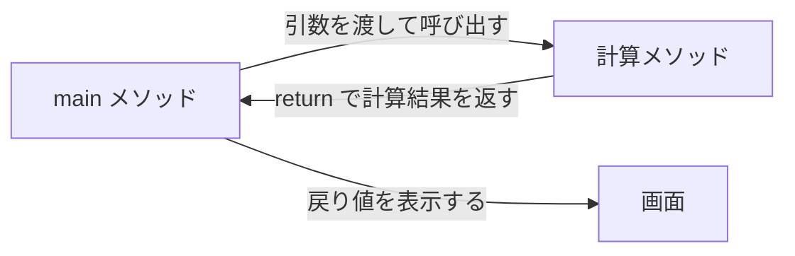
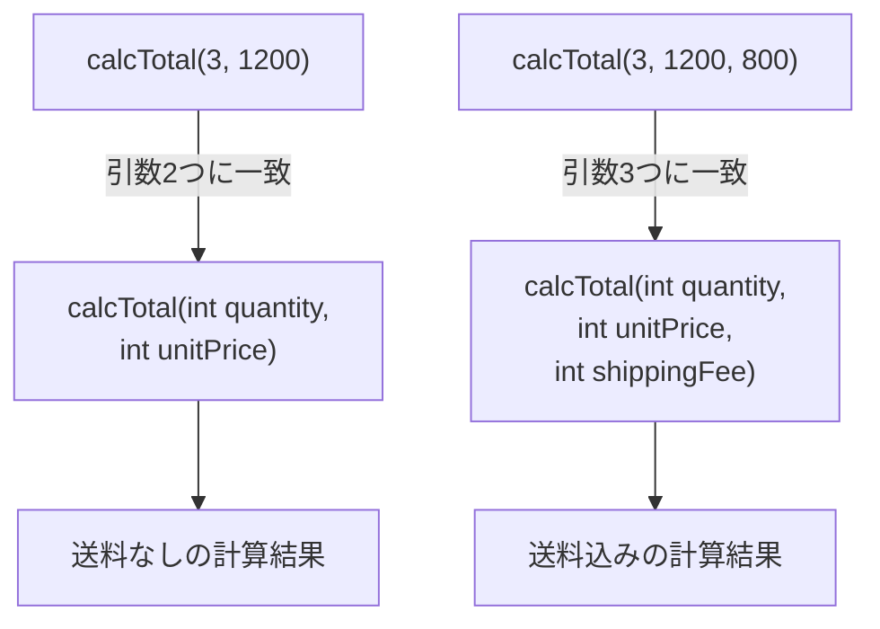

# Java-08 ハンズオン: メソッド

## 1. この資料のゴール
- メソッドの定義と呼び出しを理解する
- 引数と戻り値を使って再利用可能な処理を作れる
- オーバーロードの基本を説明できる

---

## 2. 事前準備
```bash
cd ~/order-management-springboot/practice/java
java -version
javac -version
```

期待状態:
- `java -version` と `javac -version` の両方で `17` が表示される
- 例: `17.0.x`

---

## 3. 先に覚えるポイント
1. メソッドは「処理の部品」
2. 引数は入力、戻り値は出力
3. 同名メソッドでも引数が違えば共存できる（オーバーロード）

### 全体構成図（メソッド呼び出し）


ポイント:
- 呼び出し側は、必要な値を引数として渡す
- メソッド側は、処理結果を `return` で呼び出し元へ返す
- オーバーロードでは、呼び出し時の引数に合うメソッドが選ばれる

### 書式の基本

#### 引数なし・戻り値なしメソッド

```java
static void printStartMessage() {
    System.out.println("受注処理を開始します");
}

printStartMessage();
```

ポイント:
- メソッドはクラスの中、`main` メソッドの外に定義する
- `void` は戻り値がないことを表す
- 呼び出すときは `メソッド名();` と書く
- この資料では、同じクラスの `main` から直接呼び出すため `static` を付ける

#### 引数と戻り値があるメソッド

```java
static int calcTotal(int quantity, int unitPrice) {
    return quantity * unitPrice;
}

int total = calcTotal(3, 1200);
```

ポイント:
- `calcTotal(int quantity, int unitPrice)` の `quantity` と `unitPrice` が引数
- 先頭の `int` は戻り値の型
- `return` は呼び出し元へ値を返す
- 呼び出し側では戻り値を変数に代入できる

#### オーバーロード



```java
static int calcTotal(int quantity, int unitPrice) {
    return quantity * unitPrice;
}

static int calcTotal(int quantity, int unitPrice, int shippingFee) {
    return quantity * unitPrice + shippingFee;
}
```

ポイント:
- 同じメソッド名でも、引数の数や型が違えば定義できる
- 呼び出し時の引数に合うメソッドが選ばれる
- 戻り値の型だけが違う同名メソッドは作れない

---

## 4. ハンズオン

目的:
- 計算ロジックをメソッドに分離する

完了条件:
- `MethodDemo.java` で引数・戻り値・オーバーロードを確認できる

作成ファイル: `~/order-management-springboot/practice/java/handson08/MethodDemo.java`

### Step 0: 作業フォルダを作る
```bash
mkdir -p ~/order-management-springboot/practice/java/handson08
cd ~/order-management-springboot/practice/java/handson08
```

### Step 1: 引数なしメソッド
`MethodDemo.java` を次の内容で作成:

```java
public class MethodDemo { // メソッド分割の基本を学ぶクラス
    static void printStartMessage() { // 引数なし・戻り値なしのメソッド
        System.out.println("受注処理を開始します"); // 開始メッセージを表示
    }

    public static void main(String[] args) { // 実行開始地点
        printStartMessage(); // 定義したメソッドを呼び出す
    } // main メソッドの終わり
} // クラス定義の終わり
```

実行:
```bash
javac -encoding UTF-8 MethodDemo.java
java MethodDemo
```

期待出力例:
```text
受注処理を開始します
```


### Step 2: 引数と戻り値を追加
`MethodDemo.java` を次の内容に更新:

```java
public class MethodDemo { // 引数と戻り値を使うメソッド例
    static int calcTotal(int quantity, int unitPrice) { // quantity と unitPrice を受け取り int を返す
        return quantity * unitPrice; // 合計金額を呼び出し元へ返す
    }

    public static void main(String[] args) {
        int total = calcTotal(3, 1200); // 実引数を渡してメソッド実行
        System.out.println("合計: " + total); // 戻り値を表示
    } // main メソッドの終わり
} // クラス定義の終わり
```

実行:
```bash
javac -encoding UTF-8 MethodDemo.java
java MethodDemo
```

期待出力例:
```text
合計: 3600
```


コード解説:
- `int quantity, int unitPrice` は仮引数（メソッド内で使う受け口）
- `return` は呼び出し元へ値を返す

### Step 3: オーバーロードを追加
`MethodDemo.java` を次の内容に更新:

```java
public class MethodDemo { // オーバーロードを学ぶクラス
    static int calcTotal(int quantity, int unitPrice) { // 引数2つ版
        return quantity * unitPrice; // 送料なし合計
    }

    static int calcTotal(int quantity, int unitPrice, int shippingFee) { // 引数3つ版（同名メソッド）
        return quantity * unitPrice + shippingFee; // 送料込み合計
    }

    public static void main(String[] args) {
        int total1 = calcTotal(3, 1200); // 引数2つ版が呼ばれる
        int total2 = calcTotal(3, 1200, 800); // 引数3つ版が呼ばれる

        System.out.println("送料なし合計: " + total1); // 結果を表示
        System.out.println("送料込み合計: " + total2); // 結果を表示
    } // main メソッドの終わり
} // クラス定義の終わり
```

実行:
```bash
javac -encoding UTF-8 MethodDemo.java
java MethodDemo
```

期待出力例:
```text
送料なし合計: 3600
送料込み合計: 4400
```


### Step 4: 実務メソッドへ仕上げる
`MethodDemo.java` を次の内容に更新:

```java
public class MethodDemo { // 実務で使う計算メソッド構成例
    static int calcSubtotal(int quantity, int unitPrice) { // 小計計算メソッド
        return quantity * unitPrice; // 小計を返す
    }

    static int calcBillingAmount(int quantity, int unitPrice, int shippingFee, int discount) { // 請求金額計算メソッド
        int subtotal = calcSubtotal(quantity, unitPrice); // 小計計算を再利用
        return subtotal + shippingFee - discount; // 送料を足し、割引を引いた請求金額を返す
    }

    public static void main(String[] args) {
        int billingAmount = calcBillingAmount(4, 1800, 800, 500); // 必要値を渡して請求金額を計算
        System.out.println("請求金額: " + billingAmount); // 計算結果を表示
    } // main メソッドの終わり
} // クラス定義の終わり
```

実行:
```bash
javac -encoding UTF-8 MethodDemo.java
java MethodDemo
```

期待出力例:
```text
請求金額: 7500
```


補足（実務）:
- この章の金額計算メソッドは学習用に `int` を使っている
- 実務の金額計算では `BigDecimal` の利用を検討する

### Step 5: 開始処理と金額計算をまとめる（仕上げ）
前のコード全体を置き換え、`MethodDemo.java` を次の内容に更新:

```java
public class MethodDemo {
    static void printStartMessage() {
        System.out.println("受注処理を開始します");
    }

    static int calcSubtotal(int quantity, int unitPrice) {
        return quantity * unitPrice;
    }

    static int calcBillingAmount(int quantity, int unitPrice, int shippingFee, int discount) {
        int subtotal = calcSubtotal(quantity, unitPrice);
        return subtotal + shippingFee - discount;
    }

    public static void main(String[] args) {
        printStartMessage();

        int billingAmount = calcBillingAmount(4, 1800, 800, 500);
        System.out.println("請求金額: " + billingAmount);
    }
}
```

実行:
```bash
javac -encoding UTF-8 MethodDemo.java
java MethodDemo
```

期待出力例:
```text
受注処理を開始します
請求金額: 7500
```

確認ポイント:
- 引数なし・戻り値なしのメソッドを呼び出している
- `calcBillingAmount(...)` から `calcSubtotal(...)` を再利用している
- 引数で受け取った値を使って計算結果を返している

---

## 5. ミニ演習（10分）

各レベルは、Step 5で完成した `MethodDemo.java` を基準に実施してください。
次のレベルへ進む前に、Step 5の完成コードへ戻してください。

### レベル1（基本）
1. Step 5の `calcBillingAmount(...)` は残したまま、`taxRatePercent` を受け取る5引数版を追加する。
2. 5引数版から4引数版を呼び出し、その戻り値へ税率を適用する。
3. 税率 `10` と `8` を渡し、オーバーロードされたメソッドを2回呼び出す。

期待出力例:
```text
税率10% 請求金額: 8250
税率8% 請求金額: 8100
```

### レベル2（拡張）
1. Step 5の4引数版 `calcBillingAmount(...)` の先頭に、`quantity` が`0`以下なら`0`を返す処理を追加する。
2. `quantity` に `0` と `-2` を渡して結果を確認する。

期待出力例:
```text
quantity=0 -> 0
quantity=-2 -> 0
```

### レベル3（実務）
1. Step 5の引数なし `printStartMessage()` は残す。
2. `String jobName` を受け取る `printStartMessage(String jobName)` を追加する。
3. 引数あり版を、ジョブ名を変えて2回呼び出す。

期待出力例:
```text
受注取込 を開始します
在庫同期 を開始します
```

### 実行前予想問題（1分）
Step 5の4引数版メソッドについて、次の呼び出し結果を実行前に予想してください。
- `calcBillingAmount(2, 1000, 300, 100)`
- `calcBillingAmount(0, 1000, 300, 100)`

### デバッグ演習（任意, 5分）
1. Step 5の `calcSubtotal(...)` の戻り値を、一時的に `return "0";` へ変更する。
2. エラーメッセージを確認して `return 0;` に修正する。
3. 再コンパイルして成功を確認する。

---

## 6. つまずきポイント
- `non-static method ... cannot be referenced from a static context`
  -> `main` から呼ぶメソッドを `static` にするか、インスタンス化する
- 戻り値型と `return` 値の不一致
  -> 宣言型を見直す
- 引数順序のミス
  -> 呼び出し側の順番をコメントで明示
