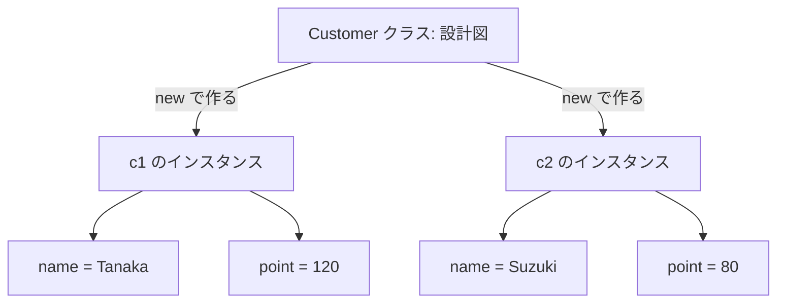
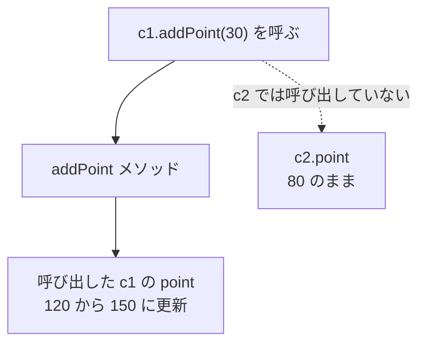

# Java-09 ハンズオン: インスタンスとクラス

前章とのつながり: [Java-08 メソッド](./java-08-methods.md) では、処理をメソッドへ分ける方法を学んだ。この章では、データと処理を持つクラスからインスタンスを作る方法を学ぶ。

補講（任意）: [Java-09A Stringの参照比較と値比較](./java-09a-string-reference-and-value-comparison.md)

## 1. この資料のゴール
- クラスとインスタンスの違いを説明できる
- `new` でインスタンスを作る意味を説明できる
- 同じクラスから複数インスタンスを作成し、状態が独立することを確認できる

---

## 2. 事前準備
```bash
cd ~/order-management-springboot/practice/java
java -version
javac -version
```

期待状態:
- `java -version` と `javac -version` の両方で `17` が表示される
- 例: `17.0.x`

---

## 3. 先に覚えるポイント
1. この章の流れは「フィールドへ値を入れる -> メソッドで値を更新する」の2段階で、インスタンスの状態を扱えるようにすることが目的
2. クラスは設計図、インスタンスは実体。`new` で作った各インスタンスは別状態を持つ（`c1` を変えても `c2` は自動では変わらない）
3. インスタンスメソッドを呼び出すと、呼び出したインスタンスの状態が処理の対象になる

### オブジェクト指向とは

オブジェクト指向は、プログラムを役割ごとの部品に分け、それぞれを組み合わせて処理を作る考え方です。
Javaでは、部品の設計をクラスとして書き、その設計から実際に使うインスタンスを作ります。

この章では、顧客を表す `Customer` クラスを設計し、`c1` と `c2` という2人分のインスタンスを作ります。
それぞれが自分の名前とポイントを持つことを確認しながら、「クラスは設計図、インスタンスは設計図から作った実体」という関係を学びます。

次章では、ここで学んだクラスとインスタンスを複数のファイルへ分け、役割ごとに連携させます。

### クラスとインスタンスの関係


ポイント:
- `Customer` クラスは設計図
- `new Customer()` を2回実行すると、別々のインスタンスが2つできる
- `c1` を変更しても、`c2` の値は自動では変わらない

### 書式の基本

#### クラスとフィールド

```java
class Customer {
    String name;
    int point;
}
```

ポイント:
- クラスはデータや処理をまとめる設計図
- `name` や `point` のように、インスタンスが持つ値をフィールドと呼ぶ
- この段階では、まず最小形としてアクセス修飾子なしで書く

#### インスタンス生成とフィールド代入

```java
Customer c1 = new Customer();
c1.name = "Tanaka";
c1.point = 120;
```

ポイント:
- `new Customer()` で `Customer` のインスタンスを作る
- `c1` は作成したインスタンスを参照する変数
- `c1.name` のように `.` を使ってフィールドへアクセスする

#### インスタンスメソッド

```java
void addPoint(int value) {
    point += value;
}

c1.addPoint(30);
```

ポイント:
- インスタンスメソッドは、各インスタンスの状態を使って処理できる
- `c1.addPoint(30)` は `c1` のポイントだけを変更する
- 別のインスタンス `c2` には自動では影響しない

#### 呼び出したインスタンスだけが変わる



ポイント:
- どのインスタンスを更新するかは、`c1.addPoint(30)` のようにメソッドを呼び出した側で決まる
- `c1.addPoint(30)` は `c1.point` だけを更新する
- `c2` ではメソッドを呼び出していないため、`c2.point` は変わらない

`Customer` クラスの中で `c1.point` と書かない理由:
- `c1` は `main` メソッドの中で作った変数名
- `Customer` クラスの `addPoint` メソッドの中から `c1` という名前は見えない
- どのインスタンスを更新するかは、`c1.addPoint(30)` のように呼び出した側で決まる
- メソッド内では、フィールド名の `point` を使って呼び出し元の状態を更新する

メソッド内で呼び出し元のインスタンスを明示する書き方は、[Java-11 さまざまなクラス機構](./java-11-class-mechanisms.md) でコンストラクタと一緒に学びます。

---

## 4. ハンズオン

目的:
- インスタンスが独立した状態を持つことを理解する

完了条件:
- `InstanceDemo.java` で複数インスタンスの独立性を確認できる

作成ファイル: `~/order-management-springboot/practice/java/handson09/InstanceDemo.java`

### Step 0: 作業フォルダを作る
```bash
mkdir -p ~/order-management-springboot/practice/java/handson09
cd ~/order-management-springboot/practice/java/handson09
```

### Step 1: クラスとインスタンスを作る
`InstanceDemo.java` を次の内容で作成:

```java
class Customer { // 顧客データを表すクラス
    String name; // 顧客名（フィールド）
    int point; // 保有ポイント（フィールド）
}

public class InstanceDemo { // 実行クラス
    public static void main(String[] args) {
        Customer c1 = new Customer(); // 1人目のインスタンス生成
        c1.name = "Tanaka"; // 1人目の名前
        c1.point = 120; // 1人目のポイント

        Customer c2 = new Customer(); // 2人目のインスタンス生成（c1とは別実体）
        c2.name = "Suzuki"; // 2人目の名前
        c2.point = 80; // 2人目のポイント

        System.out.println(c1.name + " point: " + c1.point); // c1 の状態を表示
        System.out.println(c2.name + " point: " + c2.point); // c2 の状態を表示
    } // main メソッドの終わり
} // クラス定義の終わり
```

実行:
```bash
javac -encoding UTF-8 InstanceDemo.java
java InstanceDemo
```

期待出力例:
```text
Tanaka point: 120
Suzuki point: 80
```

### Step 2: メソッドを追加する
`InstanceDemo.java` を次の内容に更新:

```java
class Customer { // 顧客クラス
    String name; // 顧客名
    int point; // ポイント

    void addPoint(int value) { // ポイント加算メソッド
        point += value; // 現在ポイントに value を加える
    }
}

public class InstanceDemo { // 実行クラス
    public static void main(String[] args) {
        Customer c1 = new Customer(); // 1人目を生成
        c1.name = "Tanaka"; // 名前設定
        c1.point = 120; // 初期ポイント設定
        c1.addPoint(30); // メソッド呼び出しで加算

        Customer c2 = new Customer(); // 2人目を生成
        c2.name = "Suzuki"; // 名前設定
        c2.point = 80; // 初期ポイント設定

        System.out.println(c1.name + " point: " + c1.point); // 加算後の c1 を表示
        System.out.println(c2.name + " point: " + c2.point); // c2 は影響を受けないことを表示
    } // main メソッドの終わり
} // クラス定義の終わり
```

実行:
```bash
javac -encoding UTF-8 InstanceDemo.java
java InstanceDemo
```

期待出力例:
```text
Tanaka point: 150
Suzuki point: 80
```

確認ポイント:
- `addPoint(30)` を呼んだ `c1` だけが変化し、`c2` は変化しない
- メソッドをどのインスタンスから呼び出したかによって、更新対象が決まる
- `c2.addPoint(...)` は呼び出していないため、`c2.point` は変化しない


### Step 3: 2つのインスタンスを別々に更新する（仕上げ）
`InstanceDemo.java` を次の内容に更新:

```java
class Customer { // 顧客クラス
    String name; // 顧客名
    int point; // ポイント

    void addPoint(int value) { // ポイント加算メソッド
        point += value; // 呼び出したインスタンスのポイントを更新
    }
}

public class InstanceDemo { // 実行クラス
    public static void main(String[] args) {
        Customer c1 = new Customer(); // 1人目を生成
        c1.name = "Tanaka";
        c1.point = 120;
        c1.addPoint(30); // c1 のポイントを加算

        Customer c2 = new Customer(); // 2人目を生成
        c2.name = "Suzuki";
        c2.point = 80;
        c2.addPoint(20); // c2 のポイントを加算

        System.out.println(c1.name + " point: " + c1.point); // c1 の状態を表示
        System.out.println(c2.name + " point: " + c2.point); // c2 の状態を表示
    } // main メソッドの終わり
} // クラス定義の終わり
```

実行:
```bash
javac -encoding UTF-8 InstanceDemo.java
java InstanceDemo
```

期待出力例:
```text
Tanaka point: 150
Suzuki point: 100
```

確認ポイント:
- `c1` と `c2` は同じ `Customer` クラスから作られている
- `c1.addPoint(30)` と `c2.addPoint(20)` は、それぞれ呼び出したインスタンスを更新する
- 同じメソッドを使っても、2つのインスタンスの値は混ざらない

---

## 5. ミニ演習（10分）
### レベル1（基本）
1. `Customer` を3件作成して、それぞれの名前とポイントを表示する。

期待出力例:
```text
Tanaka point: 120
Suzuki point: 80
Sato point: 50
```

### レベル2（拡張）
1. `addPoint` メソッドを復活させ、1件だけポイント加算する。

期待出力例:
```text
Tanaka point: 150
Suzuki point: 80
```

### レベル3（実務）
1. ポイントを減らす `usePoint` メソッドを追加し、結果が `0` 未満なら `0` に補正する。

期待出力例:
```text
Tanaka point: 0
```

---

## 6. つまずきポイント
- `NullPointerException`
  -> インスタンス生成 (`new`) 前にアクセスしていないか確認
- `point += value;` でなぜ `c1.point` が更新されるか分からない
  -> `c1.addPoint(30)` のように、メソッドを呼び出したインスタンスが更新対象になる
- インスタンス間で値が混ざると誤解
  -> 各 `new` は別実体
