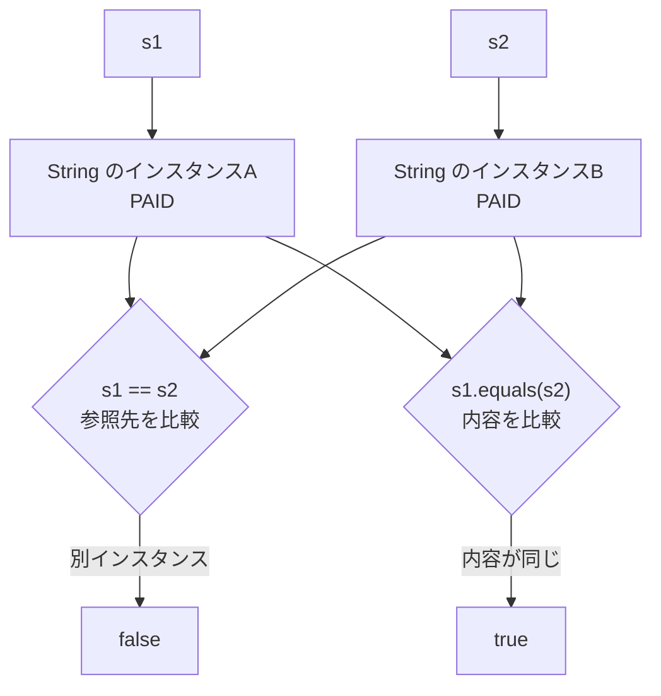

# Java-09A 補講: Stringの参照比較と値比較

前提: [Java-09 インスタンスとクラス](./java-09-instances-and-classes.md) を完了し、変数がインスタンスを参照することを理解していること。

## 1. この資料のゴール
- `String` が参照型であることを説明できる
- `==` による参照比較と `equals` による値比較を使い分けできる
- 文字列リテラルの比較結果に惑わされず、値比較に `equals` を使える

---

## 2. 事前準備
```bash
cd ~/order-management-springboot/practice/java
java -version
javac -version
```

期待状態:
- `java -version` と `javac -version` の両方で `17` が表示される
- 例: `17.0.x`

---

## 3. 先に覚えるポイント
1. `String` 型の変数は文字列のインスタンスを参照する
2. `==` は、2つの変数が同じインスタンスを参照しているかを比較する
3. `equals` は文字列の内容を比較する

### 全体構成図（参照比較と値比較）



ポイント:
- `s1` と `s2` は別々のインスタンスを参照している
- 参照先は別でも、両方の内容は `PAID`
- 文字列の値を比較するときは `equals` を使う

### 書式の基本

#### 別インスタンスを比較する

```java
String s1 = new String("PAID");
String s2 = new String("PAID");

System.out.println(s1 == s2);
System.out.println(s1.equals(s2));
```

期待出力例:

```text
false
true
```

ポイント:
- `new String("PAID")` を2回実行すると、別々のインスタンスが作られる
- `==` は参照先が異なるため `false`
- `equals` は内容が同じため `true`
- 通常のプログラムでは文字列リテラルを使い、`new String(...)` は比較方法の違いを確認するこの例だけで使用する

#### 同じインスタンスを参照する

```java
String s1 = new String("PAID");
String s2 = s1;

System.out.println(s1 == s2);
System.out.println(s1.equals(s2));
```

期待出力例:

```text
true
true
```

ポイント:
- `s2 = s1` は、`s1` が持つ参照を `s2` にコピーする
- `s1` と `s2` は同じインスタンスを参照するため、`==` も `true`

#### 文字列リテラルを比較するときの注意

```java
String a = "OK";
String b = "OK";

System.out.println(a == b);
System.out.println(a.equals(b));
```

期待出力例:

```text
true
true
```

ポイント:
- 同じ文字列リテラルはJava内部で再利用されるため、この例では `a == b` が `true` になる
- `==` が `true` になる場合があっても、文字列の値比較には使用しない
- 文字列の作られ方に左右されない `equals` を使う

---

## 4. ハンズオン

目的:
- 同じ内容を持つ文字列で、参照比較と値比較の結果が異なることを確認する

完了条件:
- `StringComparisonDemo.java` で `==` と `equals` の結果を説明できる

作成ファイル: `~/order-management-springboot/practice/java/handson09a/StringComparisonDemo.java`

### Step 0: 作業フォルダを作る
```bash
mkdir -p ~/order-management-springboot/practice/java/handson09a
cd ~/order-management-springboot/practice/java/handson09a
```

### Step 1: 別インスタンスを比較する
`StringComparisonDemo.java` を次の内容で作成:

```java
public class StringComparisonDemo {
    public static void main(String[] args) {
        String s1 = new String("PAID"); // 1つ目の String インスタンス
        String s2 = new String("PAID"); // 同じ内容を持つ別のインスタンス

        System.out.println("s1 == s2: " + (s1 == s2)); // 参照先が同じかを比較
        System.out.println("s1.equals(s2): " + s1.equals(s2)); // 文字列の内容を比較
    }
}
```

実行:
```bash
javac -encoding UTF-8 StringComparisonDemo.java
java StringComparisonDemo
```

期待出力例:
```text
s1 == s2: false
s1.equals(s2): true
```

### Step 2: 同じ参照と同じ値を比較する
`StringComparisonDemo.java` を次の内容に更新:

```java
public class StringComparisonDemo {
    public static void main(String[] args) {
        String original = new String("PAID");
        String sameReference = original; // original と同じインスタンスを参照
        String sameValue = new String("PAID"); // 内容は同じだが別インスタンス

        System.out.println("sameReference == original: " + (sameReference == original));
        System.out.println("sameValue == original: " + (sameValue == original));
        System.out.println("sameValue.equals(original): " + sameValue.equals(original));
    }
}
```

実行:
```bash
javac -encoding UTF-8 StringComparisonDemo.java
java StringComparisonDemo
```

期待出力例:
```text
sameReference == original: true
sameValue == original: false
sameValue.equals(original): true
```

### Step 3: 業務条件で値を比較する（仕上げ）
`StringComparisonDemo.java` を次の内容に更新:

```java
public class StringComparisonDemo {
    public static void main(String[] args) {
        String[] statuses = {"PAID", "PENDING", "PAID"};
        int paidCount = 0;

        for (String status : statuses) {
            if ("PAID".equals(status)) { // 文字列の内容で判定
                paidCount++;
            }
        }

        System.out.println("PAID件数: " + paidCount);
    }
}
```

実行:
```bash
javac -encoding UTF-8 StringComparisonDemo.java
java StringComparisonDemo
```

期待出力例:
```text
PAID件数: 2
```

確認ポイント:
- 業務条件で文字列の値を比較するときは `equals` を使う
- 比較する定数を左側にした `"PAID".equals(status)` は、`status` が `null` でも `false` になる

### Step 4: 参照比較と業務条件をまとめる（仕上げ）
前のコード全体を置き換え、`StringComparisonDemo.java` を次の内容に更新:

```java
public class StringComparisonDemo {
    public static void main(String[] args) {
        String original = new String("PAID");
        String sameReference = original;
        String sameValue = new String("PAID");

        System.out.println("sameReference == original: " + (sameReference == original));
        System.out.println("sameValue == original: " + (sameValue == original));
        System.out.println("sameValue.equals(original): " + sameValue.equals(original));

        String[] statuses = {"PAID", "PENDING", "PAID"};
        int paidCount = 0;

        for (String status : statuses) {
            if ("PAID".equals(status)) {
                paidCount++;
            }
        }

        System.out.println("PAID件数: " + paidCount);
    }
}
```

実行:
```bash
javac -encoding UTF-8 StringComparisonDemo.java
java StringComparisonDemo
```

期待出力例:
```text
sameReference == original: true
sameValue == original: false
sameValue.equals(original): true
PAID件数: 2
```

確認ポイント:
- `==` は同じインスタンスを参照しているか比較する
- `equals(...)` は文字列の内容を比較する
- 業務条件で文字列を判定するときは `equals(...)` を使う

---

## 5. ミニ演習（10分）

各レベルは前のレベルの完成コードを引き継いで実施します。レベル1はStep 4の完成コードから開始してください。

### レベル1（基本）
1. Step 4の `sameValue` の内容を `"PENDING"` に変更する。
2. `original` とは別の参照であり、文字列の内容も異なることを確認する。

確認対象の出力（抜粋）:
```text
sameValue == original: false
sameValue.equals(original): false
```

### レベル2（拡張）
1. レベル1に `String anotherReference = original;` を追加する。
2. `anotherReference` と `original` を `==` と `equals(...)` の両方で比較する。

確認対象の出力（抜粋）:
```text
anotherReference == original: true
anotherReference.equals(original): true
```

### レベル3（実務）
1. レベル2の `statuses` を `{"PAID", "PENDING", "CANCELLED", "PENDING"}` に変更する。
2. `paidCount` の処理は残したまま、`pendingCount` を追加する。
3. `"PENDING".equals(status)` を使って `PENDING` の件数を数える。
4. `PAID` と `PENDING` の件数を表示する。

確認対象の出力（抜粋）:
```text
PAID件数: 1
PENDING件数: 2
```

### 実行前予想問題（1分）
次の結果を実行前に予想してください。
- `String a = new String("OK"); String b = new String("OK"); System.out.println(a == b);`
- `System.out.println(a.equals(b));`

### デバッグ演習（任意, 5分）
1. Step 4の `sameValue.equals(original)` を `sameValue == original` に変更する。
2. 内容が同じでも `false` になることを確認する。
3. `sameValue.equals(original)` に戻して `true` になることを確認する。

---

## 6. つまずきポイント
- `String` の値を `==` で比較する
  -> 値比較には `equals` を使う
- 文字列リテラル同士の `==` が `true` なので、値比較にも使えると誤解する
  -> リテラルが再利用された結果であり、値比較の方法としては不適切
- 通常の処理でも `new String(...)` を使う
  -> 通常は `String status = "PAID";` のように文字列リテラルを使う
- `null` の可能性がある変数から `equals` を呼ぶ
  -> `"PAID".equals(status)` のように、固定値側から呼ぶ
