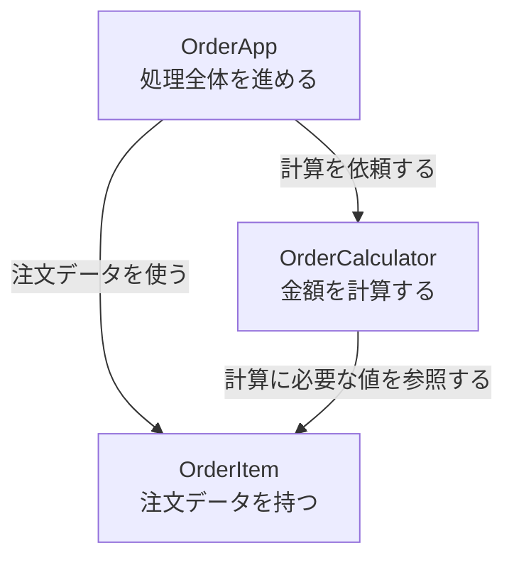
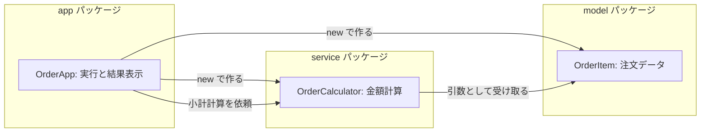

# Java-10 ハンズオン: 複数クラスを用いた開発

前章とのつながり: [Java-09 インスタンスとクラス](./java-09-instances-and-classes.md) では、クラスからインスタンスを作り、フィールドとメソッドを使う方法を学んだ。この章では、クラスを役割ごとのファイルへ分けて連携させる。

## 1. この資料のゴール
- クラスを責務ごとに分割できる
- 複数 `.java` ファイルをコンパイル・実行できる
- `package` と `import` の最小形を理解する

---

## 2. 事前準備
```bash
cd ~/order-management-springboot/practice/java
java -version
javac -version
```

期待状態:
- `java -version` と `javac -version` の両方で `17` が表示される
- 例: `17.0.x`

---

## 3. 先に覚えるポイント
1. 1クラス1責務に分けると保守しやすい
2. 同一パッケージなら `import` なしで相互参照できる
3. 別パッケージを使うときは `package` と `import` を揃える

### クラスを役割ごとに分ける

前章では、1つのクラスからインスタンスを作る方法を学びました。
この章では、オブジェクト指向の考え方を使い、プログラムを役割ごとのクラスに分けて組み合わせます。

注文処理を1つのクラスだけに書くと、注文データ、金額計算、画面表示など、異なる役割のコードが同じ場所に集まります。
小さなプログラムでは動かせますが、機能が増えると「どこを変更すればよいか」が分かりにくくなります。

そこで、この章では次の3つに役割を分けます。

- `OrderItem`: 注文データを持つ
- `OrderCalculator`: 注文金額を計算する
- `OrderApp`: 必要な部品を使って、処理全体を進める



このように役割を分けると、計算ルールを変更するときは主に `OrderCalculator` を確認すればよくなります。
すべてを細かく分ければよいわけではなく、「何を担当するクラスか」を説明できる単位で分けることが重要です。

この章では、前章で学んだクラスとインスタンスを使い、複数クラスを連携させるところまでを体験します。

### この章で作る構成図（クラスと役割）


ポイント:
- `OrderApp` は処理を動かす入口
- `OrderItem` は注文データを持つクラス
- `OrderCalculator` は計算だけを担当するクラス
- `package` を使うと、役割ごとにフォルダと名前空間を分けられる

### 書式の基本

#### 1つのファイルに複数クラスを書く

```java
class OrderItemLite {
    String productName;
    int quantity;
}

public class InstanceWarmup {
    public static void main(String[] args) {
    }
}
```

ポイント:
- `public` を付けるクラス名はファイル名と一致させる
- 補助的なクラスは `public` なしで同じファイルに書ける
- 実務では責務ごとにファイルを分けることが多い

#### インスタンス生成とフィールド参照

```java
OrderItem item = new OrderItem();
item.productName = "Laptop";
item.quantity = 2;
```

ポイント:
- `OrderItem` は、自分で作ったクラス名であり、この場面では変数の型として使っている
- `OrderItem item` は「OrderItem型の変数 item」を用意するという意味
- `new OrderItem()` で `OrderItem` の実体を作る
- `item` は、作成した実体を参照する変数
- `item.productName` のように `変数名.フィールド名` で値を扱う

`int quantity = 2;` と比べると:

| 書き方 | 型 | 変数名 | 入るもの |
| --- | --- | --- | --- |
| `int quantity = 2;` | `int` | `quantity` | 整数値 |
| `OrderItem item = new OrderItem();` | `OrderItem` | `item` | `OrderItem` の実体への参照 |

`int` や `double` はJavaが最初から用意している型です。`OrderItem` は自分で作ったクラスですが、Javaではクラスを作ると、そのクラス名を型として使えるようになります。

#### 複数ファイルをまとめてコンパイルする

```bash
javac -encoding UTF-8 OrderItem.java OrderCalculator.java OrderApp.java
java OrderApp
```

ポイント:
- 別ファイルのクラスを使う場合、関係する `.java` をまとめてコンパイルする
- パッケージなしの場合は、クラス名だけで実行する

#### `package` と `import`

```java
package service;

import model.OrderItem;

public class OrderCalculator {
}
```

ポイント:
- `package` はクラスが所属する名前空間を表す
- `package` 宣言はファイルの先頭に書く
- 別パッケージのクラスを短い名前で使うには `import` する
- `package model;` のクラスは `src/model/` のような対応するフォルダに置く

もう少し詳しく:
- `package` は「クラスの住所」のようなもの
- 同じ `OrderItem` というクラス名でも、`model.OrderItem` のように住所付きで区別できる
- `package` 宣言とフォルダ階層は対応させる
- `import` はファイルを読み込む命令ではない
- `import model.OrderItem;` は、`model.OrderItem` を `OrderItem` と短く書けるようにする宣言

対応イメージ:

| package宣言 | 置く場所 | クラスの正式名 |
| --- | --- | --- |
| `package model;` | `src/model/OrderItem.java` | `model.OrderItem` |
| `package service;` | `src/service/OrderCalculator.java` | `service.OrderCalculator` |
| `package app;` | `src/app/OrderApp.java` | `app.OrderApp` |

よくある誤解:
- `import` は「別の `.java` ファイルをコンパイル対象に追加する」ものではない
- コンパイル時は、使うクラスの `.java` ファイルも `javac` に渡す必要がある
- 実行時は、`java` に「どのフォルダを起点にクラスを探すか」を教える必要がある

#### `-d` と `-cp`

```bash
javac -encoding UTF-8 -d out src/model/OrderItem.java src/app/OrderApp.java
java -cp out app.OrderApp
```

ポイント:
- `javac -d out` は、コンパイル結果を `out` 配下へ出力する
- `java -cp out app.OrderApp` は、`out` を起点に `app.OrderApp` を探して実行する
- パッケージ付きクラスは `パッケージ名.クラス名` で実行する

コマンドの読み方:

| 部分 | 意味 |
| --- | --- |
| `javac` | `.java` を `.class` にコンパイルする |
| `-d out` | `.class` を `out` フォルダへ出力する |
| `-cp out` | `out` フォルダをクラス探索の起点にする |
| `app.OrderApp` | `app` パッケージの `OrderApp` クラスを実行する |

`java OrderApp` ではない理由:
- `OrderApp` は無名パッケージではなく `app` パッケージに所属している
- そのため、実行時は `app.OrderApp` という正式名で指定する
- `out/app/OrderApp.class` を探して実行するイメージ

---

## 4. ハンズオン

目的:
- 複数クラス連携の基本を体験する

完了条件:
- `OrderItem` / `OrderCalculator` / `OrderApp` の3クラスで実行できる

補足（学習順）:
- [Java-09 インスタンスとクラス](./java-09-instances-and-classes.md) で学んだ `new`、フィールド、インスタンスメソッドを使用する
- この章では、クラスの基本説明を繰り返さず、責務分割・複数ファイル・パッケージへ進む

作成フォルダ: `~/order-management-springboot/practice/java/handson10`

### Step 0: 作業フォルダを作る
```bash
mkdir -p ~/order-management-springboot/practice/java/handson10
cd ~/order-management-springboot/practice/java/handson10
```

### Step 1: データクラスを作る
作成ファイル: `OrderItem.java`

```java
public class OrderItem { // 注文1件分のデータを保持するクラス
    String productName; // 商品名
    int quantity; // 数量
    int unitPrice; // 単価
} // クラス定義の終わり
```

コンパイル確認:
```bash
javac -encoding UTF-8 OrderItem.java
```

期待出力例:
```text
(コンパイル成功: 出力なし)
```

ここで `OrderItem` というクラスを作ったため、以降のコードでは `OrderItem` を型として使えます。

例:
```java
OrderItem item;
```

これは「`OrderItem` 型の変数 `item` を用意する」という意味です。`int count;` の `int` と同じ位置に、作成したクラス名 `OrderItem` が来ていると考えてください。

### Step 2: 計算クラスを作る
作成ファイル: `OrderCalculator.java`

```java
public class OrderCalculator { // 注文金額を計算するクラス
    int calcSubtotal(OrderItem item) { // 引数: OrderItem型の変数 item（注文データ1件分の参照）を受け取る
        return item.quantity * item.unitPrice; // itemの中の quantity と unitPrice を使って計算し、結果(int)を呼び出し元へ返す
    }
} // クラス定義の終わり
```

`int calcSubtotal(OrderItem item)` の読み方:

| 部分 | 意味 |
| --- | --- |
| `int` | このメソッドが返す値の型。ここでは整数を返す |
| `calcSubtotal` | メソッド名 |
| `OrderItem` | 引数の型。自分で作った `OrderItem` クラスを型として使っている |
| `item` | メソッド内で使う引数名 |

つまり、このメソッドは「`OrderItem` 型のデータを1件受け取り、その中の `quantity` と `unitPrice` を使って小計を `int` で返す」処理です。

コンパイル確認:
```bash
javac -encoding UTF-8 OrderItem.java OrderCalculator.java
```

期待出力例:
```text
(コンパイル成功: 出力なし)
```


### Step 3: 実行クラスを作る
作成ファイル: `OrderApp.java`

```java
public class OrderApp { // 実行クラス（エントリーポイント）
    public static void main(String[] args) {
        OrderItem item = new OrderItem(); // new で OrderItem のインスタンス（実体）を作成
        item.productName = "Laptop"; // 商品名を設定
        item.quantity = 2; // 数量を設定
        item.unitPrice = 120000; // 単価を設定

        OrderCalculator calculator = new OrderCalculator(); // 計算処理を担当するクラスのインスタンス
        int subtotal = calculator.calcSubtotal(item); // item（インスタンス参照）を引数として渡し、戻り値をローカル変数 subtotal で受け取る

        System.out.println(item.productName + " 小計: " + subtotal); // item.productName は「item の中のフィールド」、subtotal は main 内のローカル変数
    } // main メソッドの終わり
} // クラス定義の終わり
```

実行:
```bash
javac -encoding UTF-8 OrderItem.java OrderCalculator.java OrderApp.java
java OrderApp
```

期待出力例:
```text
Laptop 小計: 240000
```

### 中間チェック: 3クラスの責務

- `OrderItem`がデータ、`OrderCalculator`が計算、`OrderApp`が実行を担当すると説明できる
- `javac`へ3つのJavaファイルを渡す理由を説明できる
- ここまでを講師へ説明してから、packageとimportへ進む

### Step 4: package と import を使って実行する（仕上げ）
ここまでは、`OrderItem.java` / `OrderCalculator.java` / `OrderApp.java` を同じフォルダに置き、`package` 宣言なしで実行しました。
この状態を「無名パッケージ」と呼びます。

無名パッケージは、小さい練習コードでは簡単です。
ただし、実務ではクラス数が増えるため、次のように役割ごとに分けます。

| パッケージ | 役割 | 今回入れるクラス |
| --- | --- | --- |
| `model` | データを表す | `OrderItem` |
| `service` | 計算や業務処理を担当する | `OrderCalculator` |
| `app` | 実行開始点を持つ | `OrderApp` |

ここからは、フォルダと `package` 宣言を対応させて実行します。

作成フォルダ:
```bash
mkdir -p src/model src/service src/app out
```

補足:
- `out` はコンパイル結果（`.class`）の出力先フォルダ（output の略）
- `javac -d out ...` は `out` 配下にパッケージ構造付きで出力する指定
- `java -cp out app.OrderApp` は `out` をクラス探索の起点として実行する指定
- `app.OrderApp` は「`app` パッケージの `OrderApp` クラス」という意味

作成ファイル: `src/model/OrderItem.java`
```java
package model; // model パッケージに属することを宣言

public class OrderItem { // 注文データを表すクラス
    public String productName; // 商品名
    public int quantity; // 数量
    public int unitPrice; // 単価
} // クラス定義の終わり
```

作成ファイル: `src/service/OrderCalculator.java`
```java
package service; // service パッケージに属することを宣言

import model.OrderItem; // model パッケージの OrderItem を利用

public class OrderCalculator { // 金額計算を担当するサービスクラス
    public int calcSubtotal(OrderItem item) { // 引数: OrderItem型の変数 item（注文データ1件分の参照）を受け取る
        return item.quantity * item.unitPrice; // itemの中の quantity と unitPrice を使って計算し、結果(int)を呼び出し元へ返す
    }
} // クラス定義の終わり
```

作成ファイル: `src/app/OrderApp.java`
```java
package app; // app パッケージに属することを宣言

import model.OrderItem; // model パッケージのクラスを利用
import service.OrderCalculator; // service パッケージのクラスを利用

public class OrderApp { // パッケージ構成版の実行クラス
    public static void main(String[] args) {
        OrderItem item = new OrderItem(); // 注文データを生成
        item.productName = "Laptop"; // 商品名を設定
        item.quantity = 2; // 数量を設定
        item.unitPrice = 120000; // 単価を設定

        OrderCalculator calculator = new OrderCalculator(); // 計算クラスを生成
        int subtotal = calculator.calcSubtotal(item); // 小計を計算
        System.out.println(item.productName + " 小計: " + subtotal); // 結果を表示
    } // main メソッドの終わり
} // クラス定義の終わり
```

実行:
```bash
javac -encoding UTF-8 -d out src/model/OrderItem.java src/service/OrderCalculator.java src/app/OrderApp.java
java -cp out app.OrderApp
```

期待出力例:
```text
Laptop 小計: 240000
```


学習ポイント:
- 実務では `package` を使って構造化する
- 同じ考え方は Spring Boot の `domain/service/controller` に直結する
- `import` は別パッケージのクラスを短い名前で書くための宣言
- 実行時は `java -cp out app.OrderApp` のように、クラスパスと正式なクラス名を指定する

### Step 4.5: クラスパス指定の失敗を確認する
ここでは、あえて間違った実行コマンドを試します。
エラーの原因を切り分けられるようにするためです。

先ほどのコンパイルで、`.class` ファイルは `out` フォルダ配下に作られています。

```text
out/
  app/
    OrderApp.class
  model/
    OrderItem.class
  service/
    OrderCalculator.class
```

失敗例1: `-cp out` を付けない
```bash
java app.OrderApp
```

想定結果:
```text
Error: Could not find or load main class app.OrderApp
```

理由:
- `java app.OrderApp` は、現在のフォルダを起点に `app/OrderApp.class` を探す
- 実際の `.class` は `out/app/OrderApp.class` にある
- そのため、実行クラスを見つけられない

失敗例2: クラスパスの起点を `.` にする
```bash
java -cp . app.OrderApp
```

想定結果:
```text
Error: Could not find or load main class app.OrderApp
```

理由:
- `-cp .` は、現在のフォルダをクラス探索の起点にする指定
- 今回は `.class` が `out` 配下にあるため、`-cp .` では起点がずれる
- `app.OrderApp` を実行するには、`out/app/OrderApp.class` を探せるようにする必要がある

正しい実行:
```bash
java -cp out app.OrderApp
```

`-cp out` は「`out` フォルダを起点にクラスを探す」という意味です。
そのため、Javaは `out/app/OrderApp.class` を見つけて実行できます。

---

## 5. ミニ演習（10分）
### レベル1（基本）
1. `OrderCalculator` に送料込み計算メソッドを追加する。

期待出力例:
```text
Laptop 請求額: 240800
```

### レベル2（拡張）
1. `OrderItem` を2件作って合計表示する。
2. `productName` を `"Mouse"` に変更して確認する。

期待出力例:
```text
Laptop 小計: 240000
Mouse 小計: 5000
2件合計: 245000
```

### レベル3（実務: package/import 失敗パターン修正）
1. `src/service/OrderCalculator.java` の `import model.OrderItem;` を一度削除してコンパイルする。
2. `cannot find symbol` を確認したら `import` を戻して再コンパイルする。
3. `src/model/OrderItem.java` の `package model;` を一時的に `package models;` に変えてコンパイルする。
4. パッケージ宣言とフォルダ階層を一致させて修正し、再実行する。

期待出力例:
```text
(失敗時)
error: cannot find symbol

(修正後)
Laptop 小計: 240000
```

### レベル4（実務: classpath 失敗パターン修正）
1. `java app.OrderApp` を実行し、失敗することを確認する。
2. `java -cp . app.OrderApp` を実行し、失敗することを確認する。
3. `java -cp out app.OrderApp` で成功することを確認する。
4. `-cp out` と `-cp .` の違いを、クラス探索の起点という言葉で説明する。

期待状態:
- `-cp out` が必要な理由を、`out/app/OrderApp.class` の位置と結びつけて説明できる。

### 実行前予想問題（1分）
次のうち、`src/app/OrderApp.java` から `OrderCalculator` を使うために必須な行を実行前に選んでください。
1. `package app;`
2. `import service.OrderCalculator;`
3. `import java.util.List;`

答え合わせ:
- 必須は `1` と `2`（`3` はこの課題では不要）。

---

## 6. つまずきポイント
- `cannot find symbol class OrderItem`
  -> ファイル名・クラス名・コンパイル対象を確認
- 実行クラスが見つからない
  -> `java OrderApp` でクラス名を正確に指定
- パッケージ付きなのに `java OrderApp` で実行している
  -> `java -cp out app.OrderApp` のように、`パッケージ名.クラス名` で実行する
- `java app.OrderApp` や `java -cp . app.OrderApp` で実行している
  -> `.class` が `out` 配下にある場合は、`java -cp out app.OrderApp` で実行する
- パッケージ導入時にエラー
  -> `package` 宣言とフォルダ階層を一致させる
- `import` したのにコンパイルできない
  -> `import` はファイルを読み込まないため、必要な `.java` も `javac` に渡す
