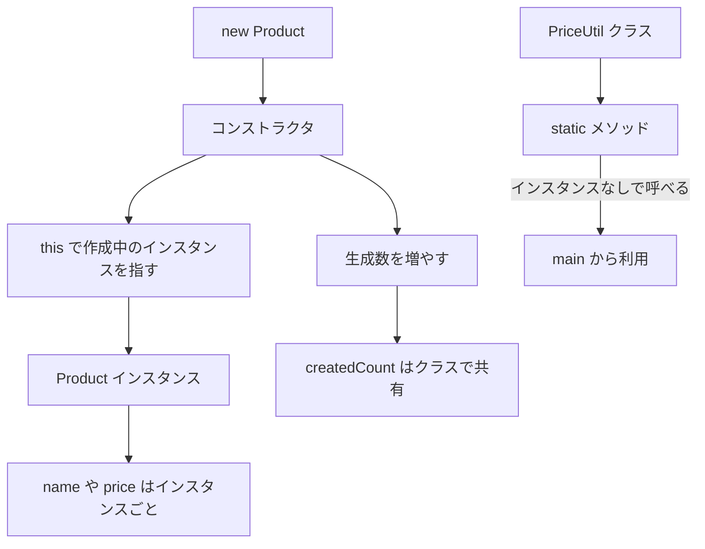
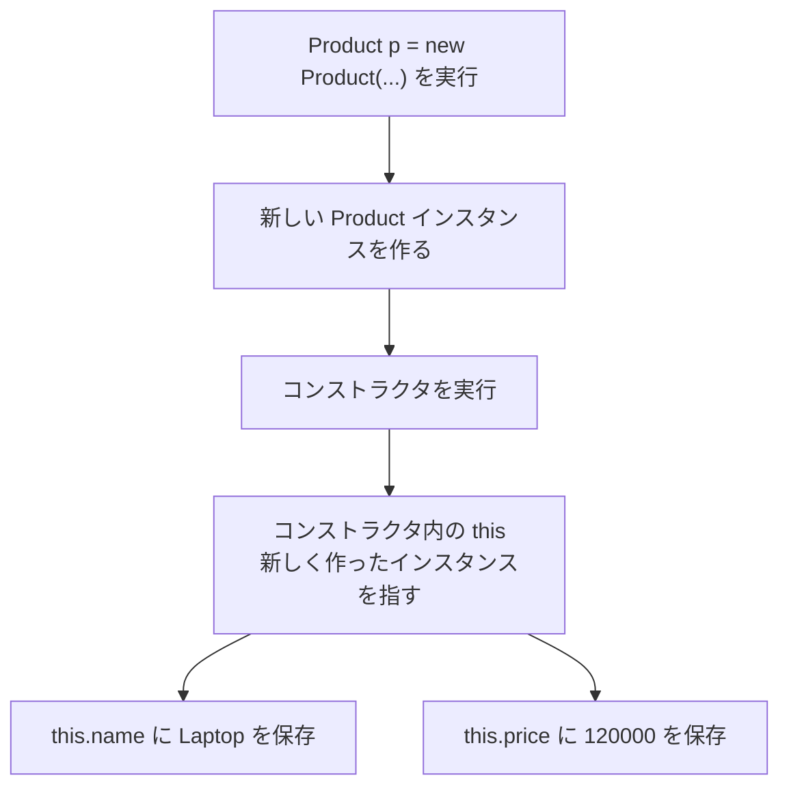

# Java-11 ハンズオン: さまざまなクラス機構（constructor / this / static）

## 1. この資料のゴール
- コンストラクタの役割を説明できる
- `this` が現在のインスタンスを指すことを説明できる
- `this` と `static` の違いを理解できる
- クラス変数とインスタンス変数を使い分けできる

---

## 2. 事前準備
```bash
cd ~/order-management-springboot/practice/java
java -version
javac -version
```

期待状態:
- `java -version` と `javac -version` の両方で `17` が表示される
- 例: `17.0.x`

---

## 3. 先に覚えるポイント
1. コンストラクタは `new` 時に呼ばれる初期化処理
2. コンストラクタ内の `this` は、いま作っているインスタンス自身を指す
3. フィールド名と引数名が同じ場合は、`this.name` のように書いてフィールドを区別する
4. `static` はクラス全体で共有され、`static` メソッドはインスタンスなしで呼べる

### 全体構成図（constructor / this / static）


ポイント:
- `new` するとコンストラクタが呼ばれ、インスタンスの初期値を設定する
- `this` は「いま作っている、または操作しているインスタンス」を指す
- `static` は個別インスタンスではなく、クラス側に1つある共有領域として考える

### 書式の基本

#### コンストラクタと `this`

```java
class Product {
    String name;
    int price;

    Product(String name, int price) {
        this.name = name;
        this.price = price;
    }
}

Product p = new Product("Laptop", 120000);
```

ポイント:
- コンストラクタ名はクラス名と同じ
- コンストラクタには戻り値の型を書かない
- `new Product(...)` のときにコンストラクタが呼ばれる
- `this.name` はフィールド、右辺の `name` は引数

コンストラクタと `this` の関係:



ポイント:
- `this` は「いま作っている、または操作しているインスタンス自身」を表す
- `new Product(...)` で作成中のインスタンスが、コンストラクタ内では `this` になる
- `p` は `main` メソッド側の変数名なので、`Product` クラスの中では `p.name` と書かない
- `this` を使えるのはコンストラクタとインスタンスメソッドであり、`static` メソッドでは使えない

フィールド・引数・ローカル変数の違い:

```java
class Product {
    String name; // フィールド
    int stock; // フィールド

    Product(String name) { // name は引数
        this.name = name;
    }

    void addStock(int value) { // value は引数
        int bonus = 1; // bonus はローカル変数
        stock += value + bonus;
    }
}
```

| 種類 | 宣言する場所 | 使える範囲 | 例 |
| --- | --- | --- | --- |
| フィールド | クラスの中、メソッドやコンストラクタの外 | 各インスタンスが持つ値として使える | `String name;` |
| 引数 | メソッド名やコンストラクタ名の後ろの `()` の中 | そのメソッドやコンストラクタの中 | `String name` |
| ローカル変数 | メソッドやコンストラクタ、ブロックの中 | 宣言したブロックの中 | `int bonus = 1;` |

フィールド名と引数名が同じ場合:

```java
Product(String name, int price) {
    this.name = name;
    this.price = price;
}
```

- 左辺の `this.name` はフィールド
- 右辺の `name` はコンストラクタの引数
- `this` を付けることで、同じ名前を区別できる

`this` を付けない失敗例:

```java
Product(String name, int price) {
    name = name;
    price = price;
}
```

この書き方では、左右ともコンストラクタの引数として扱われます。引数へ同じ値を代入するだけなので、インスタンスのフィールドは初期化されません。

`this` が必要な場合・省略できる場合:

| 書き方 | 判定 | 理由 |
| --- | --- | --- |
| `this.name = name;` | 必要 | フィールド `name` と引数 `name` を区別する |
| `price += value;` | 省略できる | 同じ名前の引数やローカル変数がなければ、`price` はフィールドとして扱われる |
| `this.price += value;` | 書いてもよい | フィールドであることを明示している |
| `int price = 0; price += value;` | 不適切 | ローカル変数 `price` が更新される |
| `int price = 0; this.price += value;` | 必要 | フィールド `price` を明示して更新する |

基本ルール:
- フィールド名と引数名・ローカル変数名が重ならない場合、`this` は省略できる
- 名前が重なる場合、フィールド側に `this.` を付ける
- 初学者のうちは、フィールド側に `this.` を付けて読むと、値の保存先を判別しやすい

インスタンスメソッド内の `this`:

```java
void addStock(int value) {
    this.stock += value;
}

p.addStock(3);
```

- `p.addStock(3)` と呼び出したとき、メソッド内の `this` は `p` が参照するインスタンスを指す
- 同じ名前の引数やローカル変数がなければ、`this.stock` は `stock` と省略できる
- Java-09の `point += value;` も、呼び出したインスタンスのフィールドを更新している

#### `static` フィールド

```java
class Product {
    static int createdCount = 0;
}

System.out.println(Product.createdCount);
```

ポイント:
- `static` フィールドはクラス全体で共有される
- インスタンスごとではなく、クラスに1つだけ存在する
- クラス名経由で `Product.createdCount` のように参照できる

#### `static` メソッド

```java
class PriceUtil {
    static int calcTaxIncluded(int basePrice) {
        return basePrice * 110 / 100;
    }
}

int taxed = PriceUtil.calcTaxIncluded(5000);
```

ポイント:
- `static` メソッドはインスタンスを作らずに呼び出せる
- `クラス名.メソッド名(...)` の形で使う
- 共通計算や変換処理のように、個別の状態を持たない処理に向いている

---

## 4. ハンズオン

目的:
- クラス機構の基本を実装で理解する

完了条件:
- `ClassMechanismDemo.java` で constructor / this / static を確認できる

作成ファイル: `~/order-management-springboot/practice/java/handson11/ClassMechanismDemo.java`

### Step 0: 作業フォルダを作る
```bash
mkdir -p ~/order-management-springboot/practice/java/handson11
cd ~/order-management-springboot/practice/java/handson11
```

### Step 1: コンストラクタと `this` で初期化する
`ClassMechanismDemo.java` を次の内容で作成:

```java
class Product { // 商品クラス
    String name; // 商品名
    int price; // 価格

    Product(String name, int price) { // コンストラクタ: new のときに呼ばれる初期化処理
        this.name = name; // 引数 name をフィールドへ設定
        this.price = price; // 引数 price をフィールドへ設定
    }
}

public class ClassMechanismDemo { // 実行クラス
    public static void main(String[] args) {
        Product p = new Product("Laptop", 120000); // コンストラクタで初期化しながら生成
        System.out.println(p.name + " / " + p.price); // 設定された値を表示
    } // main メソッドの終わり
} // クラス定義の終わり
```

実行:
```bash
javac -encoding UTF-8 ClassMechanismDemo.java
java ClassMechanismDemo
```

期待出力例:
```text
Laptop / 120000
```

確認ポイント:
- `new Product("Laptop", 120000)` によってコンストラクタが呼ばれる
- コンストラクタ内の `this` は、新しく作られた `Product` インスタンスを指す
- `this.name = name;` は、引数 `name` の値をフィールド `name` へ保存する
- `this.price = price;` は、引数 `price` の値をフィールド `price` へ保存する


### Step 2: static フィールドを追加する
`ClassMechanismDemo.java` を次の内容に更新:

```java
class Product { // 商品クラス
    static int createdCount = 0; // static: 全インスタンスで共有する生成数カウンタ
    String name; // 商品名
    int price; // 価格

    Product(String name, int price) { // コンストラクタ
        this.name = name; // フィールド初期化
        this.price = price; // フィールド初期化
        createdCount++; // インスタンス生成ごとに共有カウンタを増やす
    }
}

public class ClassMechanismDemo { // 実行クラス
    public static void main(String[] args) {
        new Product("Laptop", 120000); // 1件目生成。変数に入れていないが、new によりコンストラクタが呼ばれ createdCount が増える
        new Product("Mouse", 2500); // 2件目生成。この例では生成数だけ確認したいため、Product p のような変数には代入しない

        System.out.println("生成数: " + Product.createdCount); // クラス名経由で static フィールドを参照
    } // main メソッドの終わり
} // クラス定義の終わり
```

実行:
```bash
javac -encoding UTF-8 ClassMechanismDemo.java
java ClassMechanismDemo
```

期待出力例:
```text
生成数: 2
```


### Step 3: static メソッドを追加（仕上げ）
`ClassMechanismDemo.java` を次の内容に更新:

```java
class PriceUtil { // 価格計算ユーティリティクラス
    static int calcTaxIncluded(int basePrice) { // static: インスタンス化せず呼べる計算メソッド
        return basePrice * 110 / 100; // 税込(10%)を整数計算で求める
    }
}

class Product { // 商品クラス
    String name; // 商品名
    int price; // 税抜価格

    Product(String name, int price) { // コンストラクタ
        this.name = name; // 名前初期化
        this.price = price; // 価格初期化
    }
}

public class ClassMechanismDemo { // 実行クラス
    public static void main(String[] args) {
        Product p = new Product("Keyboard", 5000); // 商品生成
        int taxed = PriceUtil.calcTaxIncluded(p.price); // static メソッドで税込計算
        System.out.println(p.name + " 税込: " + taxed); // 結果表示
    } // main メソッドの終わり
} // クラス定義の終わり
```

実行:
```bash
javac -encoding UTF-8 ClassMechanismDemo.java
java ClassMechanismDemo
```

期待出力例:
```text
Keyboard 税込: 5500
```


---

## 5. ミニ演習（10分）
### レベル1（基本）
1. `Product` に `quantity` を追加し、同名の引数を使って `this.quantity = quantity;` で初期化する。

期待出力例:
```text
Keyboard quantity: 2
```

### レベル2（拡張）
1. `PriceUtil` に割引計算メソッドを追加する。

期待出力例:
```text
割引後価格: 4500
```

### レベル3（実務）
1. `createdCount` を表示するサンプルを再追加し、生成件数を確認する。

期待出力例:
```text
作成件数: 2
```

---

## 6. つまずきポイント
- コンストラクタ名がクラス名と一致していない
  -> 返り値なし・クラス名一致を確認
- `non-static variable ... cannot be referenced from a static context`
  -> `static` とインスタンス変数の区別を確認
- `this` を `static` メソッドで使ってしまう
  -> `this` はインスタンスメソッド/コンストラクタのみ
- `name = name;` と書いたのにフィールドが初期化されない
  -> 左辺を `this.name` にして、フィールドと引数を区別する

