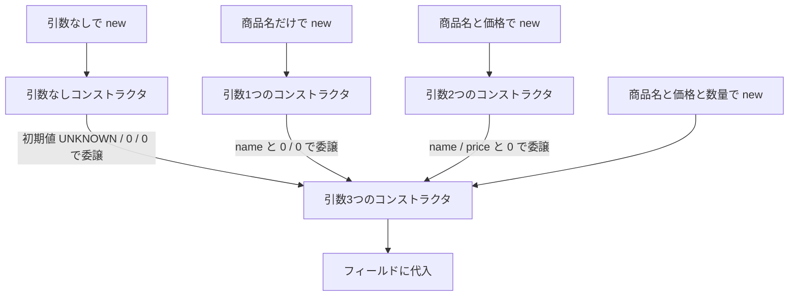

# Java-11A 補講: コンストラクタ連鎖（`this()` / デフォルトコンストラクタ）

## 1. この資料のゴール
- コンストラクタのオーバーロードを実装できる
- `this()` で初期化処理を集約できる
- デフォルトコンストラクタが補われる条件を説明できる

---

## 2. 事前準備
```bash
cd ~/order-management-springboot/practice/java
java -version
javac -version
```

期待状態:
- `java -version` と `javac -version` の両方で `17` が表示される
- 例: `17.0.x`

---

## 3. 先に覚えるポイント
1. コンストラクタはメソッドと同様にオーバーロードできる
2. `this(...)` は同一クラス内の別コンストラクタ呼び出し
3. `this(...)` はコンストラクタの先頭に1回だけ書ける
4. コンストラクタを1つも定義しないときだけ、引数なしコンストラクタが自動補完される

Java-11で学んだ `this.field` と、この章で扱う `this(...)` は役割が異なります。

| 書き方 | 意味 | 例 |
| --- | --- | --- |
| `this.name` | 現在のインスタンスのフィールドを指す | `this.name = name;` |
| `this(...)` | 同じクラスの別のコンストラクタを呼ぶ | `this("UNKNOWN", 0);` |

### 全体構成図（コンストラクタ連鎖）


ポイント:
- 複数の作り方を用意しても、最終的なフィールド代入は1か所に集約できる
- 足りない値は `0` や `"UNKNOWN"` などの初期値で補って委譲する
- `this(...)` は、同じクラスの別コンストラクタへ処理を渡す書き方

### 書式の基本

#### コンストラクタのオーバーロード

```java
class Product {
    String name;
    int price;

    Product() {
        this.name = "UNKNOWN";
        this.price = 0;
    }

    Product(String name) {
        this.name = name;
        this.price = 0;
    }

    Product(String name, int price) {
        this.name = name;
        this.price = price;
    }
}
```

ポイント:
- コンストラクタも、引数の数や型が違えば複数定義できる
- `new Product()`、`new Product("Mouse")`、`new Product("Keyboard", 5000)` のように呼び分けできる
- 戻り値の型は書かない

#### `this(...)` によるコンストラクタ連鎖

```java
Product() {
    this("UNKNOWN", 0);
}

Product(String name) {
    this(name, 0);
}

Product(String name, int price) {
    this.name = name;
    this.price = price;
}
```

ポイント:
- `this(...)` は同じクラスの別コンストラクタを呼ぶ
- 共通の初期化処理を1か所に集約できる
- `this(...)` はコンストラクタの先頭に1回だけ書ける

#### デフォルトコンストラクタ

```java
class User {
    String name;
}

User user = new User();
```

ポイント:
- コンストラクタを1つも書かない場合だけ、引数なしコンストラクタが自動で補われる
- 引数ありコンストラクタを1つでも書くと、引数なしコンストラクタは自動補完されない
- `new User()` を使いたい場合は、必要に応じて `User() {}` を自分で定義する

---

## 4. ハンズオン

目的:
- 重複初期化を避けたクラス設計を体験する

完了条件:
- `ConstructorChainingDemo.java` で `this()` 連鎖と自動補完ルールを確認できる

作成ファイル: `~/order-management-springboot/practice/java/handson11a/ConstructorChainingDemo.java`

### Step 0: 作業フォルダを作る
```bash
mkdir -p ~/order-management-springboot/practice/java/handson11a
cd ~/order-management-springboot/practice/java/handson11a
```

### Step 1: コンストラクタをオーバーロードする
`ConstructorChainingDemo.java` を次の内容で作成:

```java
class Product {
    String name;
    int price;

    Product() { // 引数なし
        this.name = "UNKNOWN";
        this.price = 0;
    }

    Product(String name) { // 引数1つ
        this.name = name;
        this.price = 0;
    }

    Product(String name, int price) { // 引数2つ
        this.name = name;
        this.price = price;
    }
}

public class ConstructorChainingDemo {
    public static void main(String[] args) {
        Product p1 = new Product();
        Product p2 = new Product("Mouse");
        Product p3 = new Product("Keyboard", 5000);

        System.out.println(p1.name + " / " + p1.price);
        System.out.println(p2.name + " / " + p2.price);
        System.out.println(p3.name + " / " + p3.price);
    }
}
```

実行:
```bash
javac -encoding UTF-8 ConstructorChainingDemo.java
java ConstructorChainingDemo
```

期待出力例:
```text
UNKNOWN / 0
Mouse / 0
Keyboard / 5000
```

### Step 1.5: 重複代入のまま quantity を追加する
Step 1 のコードをベースに、`quantity`（数量）を追加します。
この時点では、まだ `this(...)` を使いません。

確認したいこと:
- フィールドが増えると、各コンストラクタに同じような代入が増える
- `this.name = ...` / `this.price = ...` / `this.quantity = ...` が複数箇所に散らばる

`ConstructorChainingDemo.java` を次の内容に更新:

```java
class Product {
    String name;
    int price;
    int quantity;

    Product() { // 引数なし
        this.name = "UNKNOWN";
        this.price = 0;
        this.quantity = 0;
    }

    Product(String name) { // 引数1つ
        this.name = name;
        this.price = 0;
        this.quantity = 0;
    }

    Product(String name, int price) { // 引数2つ
        this.name = name;
        this.price = price;
        this.quantity = 0;
    }

    Product(String name, int price, int quantity) { // 引数3つ
        this.name = name;
        this.price = price;
        this.quantity = quantity;
    }
}

public class ConstructorChainingDemo {
    public static void main(String[] args) {
        Product p1 = new Product();
        Product p2 = new Product("Mouse");
        Product p3 = new Product("Keyboard", 5000);
        Product p4 = new Product("Display", 12000, 2);

        System.out.println(p1.name + " / " + p1.price + " / " + p1.quantity);
        System.out.println(p2.name + " / " + p2.price + " / " + p2.quantity);
        System.out.println(p3.name + " / " + p3.price + " / " + p3.quantity);
        System.out.println(p4.name + " / " + p4.price + " / " + p4.quantity);
    }
}
```

実行:
```bash
javac -encoding UTF-8 ConstructorChainingDemo.java
java ConstructorChainingDemo
```

期待出力例:
```text
UNKNOWN / 0 / 0
Mouse / 0 / 0
Keyboard / 5000 / 0
Display / 12000 / 2
```

確認:
- `this.name = ...` は4か所にある
- `this.price = ...` は4か所にある
- `this.quantity = ...` は4か所にある
- 今後、入力チェックや補正ルールを追加すると、修正箇所が散らばりやすい

### Step 2: `this()` で初期化処理を集約する
`ConstructorChainingDemo.java` を次の内容に更新:

```java
class Product {
    String name;
    int price;

    Product() {
        this("UNKNOWN", 0); // name と price の初期値を補い、引数2つのコンストラクタへ委譲
    }

    Product(String name) {
        this(name, 0); // name は受け取り、price は 0 として引数2つのコンストラクタへ委譲
    }

    Product(String name, int price) {
        this.name = name; // 最終的なフィールド代入はここに集約
        this.price = price;
    }
}

public class ConstructorChainingDemo {
    public static void main(String[] args) {
        Product p1 = new Product();
        Product p2 = new Product("Mouse");
        Product p3 = new Product("Keyboard", 5000);

        System.out.println(p1.name + " / " + p1.price);
        System.out.println(p2.name + " / " + p2.price);
        System.out.println(p3.name + " / " + p3.price);
    }
}
```

実行:
```bash
javac -encoding UTF-8 ConstructorChainingDemo.java
java ConstructorChainingDemo
```

期待出力例:
```text
UNKNOWN / 0
Mouse / 0
Keyboard / 5000
```

Step 1との違い:
- Step 1 は、各コンストラクタがそれぞれ `this.name` / `this.price` に代入していた
- Step 2 は、実際の代入を `Product(String name, int price)` に集約している
- `Product()` と `Product(String name)` は、`this(...)` で `Product(String name, int price)` へ処理を渡している

呼び出しの流れ:

| 生成コード | 最初に呼ばれるコンストラクタ | `this(...)` の委譲先 | 最終的に代入する場所 |
| --- | --- | --- | --- |
| `new Product()` | `Product()` | `this("UNKNOWN", 0)` | `Product(String name, int price)` |
| `new Product("Mouse")` | `Product(String name)` | `this(name, 0)` | `Product(String name, int price)` |
| `new Product("Keyboard", 5000)` | `Product(String name, int price)` | なし | `Product(String name, int price)` |

この形にしておくと、価格の補正や入力チェックを追加したい場合に、`Product(String name, int price)` だけを修正すればよくなります。

### Step 2.5: `this()` 連鎖のまま quantity を追加する
Step 2 のコードをベースに、同じく `quantity` を追加します。
今度は、実際の代入処理を1つのコンストラクタに集約します。

`ConstructorChainingDemo.java` を次の内容に更新:

```java
class Product {
    String name;
    int price;
    int quantity;

    Product() {
        this("UNKNOWN", 0, 0); // name / price / quantity の初期値を補い、引数3つのコンストラクタへ委譲
    }

    Product(String name) {
        this(name, 0, 0); // name は受け取り、price / quantity は 0 として委譲
    }

    Product(String name, int price) {
        this(name, price, 0); // name / price は受け取り、quantity は 0 として委譲
    }

    Product(String name, int price, int quantity) {
        this.name = name; // 最終的なフィールド代入はここに集約
        this.price = price;
        this.quantity = quantity;
    }
}

public class ConstructorChainingDemo {
    public static void main(String[] args) {
        Product p1 = new Product();
        Product p2 = new Product("Mouse");
        Product p3 = new Product("Keyboard", 5000);
        Product p4 = new Product("Display", 12000, 2);

        System.out.println(p1.name + " / " + p1.price + " / " + p1.quantity);
        System.out.println(p2.name + " / " + p2.price + " / " + p2.quantity);
        System.out.println(p3.name + " / " + p3.price + " / " + p3.quantity);
        System.out.println(p4.name + " / " + p4.price + " / " + p4.quantity);
    }
}
```

実行:
```bash
javac -encoding UTF-8 ConstructorChainingDemo.java
java ConstructorChainingDemo
```

期待出力例:
```text
UNKNOWN / 0 / 0
Mouse / 0 / 0
Keyboard / 5000 / 0
Display / 12000 / 2
```

Step 1.5との違い:
- Step 1.5 は、各コンストラクタがそれぞれフィールドへ代入していた
- Step 2.5 は、`Product(String name, int price, int quantity)` だけがフィールドへ代入している
- 他のコンストラクタは、足りない値に初期値を入れて `this(...)` で委譲している

比較:

| 観点 | Step 1.5 | Step 2.5 |
| --- | --- | --- |
| `this.name = ...` を書く場所 | 4か所 | 1か所 |
| `this.price = ...` を書く場所 | 4か所 | 1か所 |
| `this.quantity = ...` を書く場所 | 4か所 | 1か所 |
| 入力チェックを入れる場所 | 散らばりやすい | 1か所に集めやすい |

`this(...)` を使う目的は、コンストラクタの数を減らすことではありません。
複数の作り方を用意しつつ、実際の初期化処理を1か所に集めることです。

### Step 3: デフォルトコンストラクタの補完ルールを確認する（仕上げ）
`ConstructorChainingDemo.java` を次の内容に更新:

```java
class User {
    String name;

    User(String name) { // 引数ありコンストラクタを1つ定義
        this.name = name;
    }
}

public class ConstructorChainingDemo {
    public static void main(String[] args) {
        User ok = new User("Tanaka");
        System.out.println(ok.name);

        // 任意確認: 下の2行は「引数なしコンストラクタ未定義エラー」を確認するときだけコメント解除する
        // User ng = new User(); // 引数なしコンストラクタがないためコンパイルエラーになる
        // constructor User in class User cannot be applied to given types
    }
}
```

任意確認（引数なしコンストラクタ未定義エラーを体験したい場合）:
1. `main` 内の `User ng = new User();` の行をコメント解除する。
2. `javac -encoding UTF-8 ConstructorChainingDemo.java` を実行する。
3. `constructor User in class User cannot be applied to given types` のコンパイルエラーを確認する。
4. 確認後はコメントアウトに戻して、次の通常実行へ進む。

実行:
```bash
javac -encoding UTF-8 ConstructorChainingDemo.java
java ConstructorChainingDemo
```

期待出力例:
```text
Tanaka
```

補足（`new User()` をコメント解除した場合のコンパイルエラー出力例）:
```text
constructor User in class User cannot be applied to given types
```

---

## 5. ミニ演習（10分）
### レベル1（基本）
1. Step 2.5 の `Product(String name, int price, int quantity)` で、`quantity` が `0` 未満なら `0` に補正する。
2. `new Product("Display", 12000, -3)` を追加して確認する。

期待出力例:
```text
Display / 12000 / 0
```

### レベル2（拡張）
1. Step 3 の `User` に引数なしコンストラクタを追加して `new User()` を成功させる。

期待出力例:
```text
guest
```

### レベル3（実務）
1. `this(...)` の前に代入文を書いてコンパイルエラーを確認する。

期待状態:
- `call to this must be first statement in constructor` のようなエラーが表示される

---

## 6. つまずきポイント
- `this(...)` を2行目以降に書いてエラー
  -> 必ずコンストラクタ先頭に書く
- コンストラクタを作ったのに `new ClassName()` が失敗
  -> 引数なしは自動補完されない場合がある
- オーバーロードで初期化処理が重複
  -> `this(...)` で一本化する
