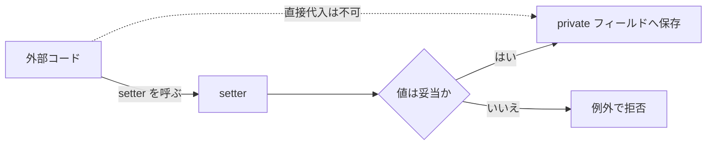

# Java-12 ハンズオン: カプセル化

## 1. この資料のゴール
- カプセル化の目的を説明できる
- `private` フィールド + getter/setter を実装できる
- 不正値を setter で防ぐ設計を実装できる

---

## 2. 事前準備
```bash
cd ~/order-management-springboot/practice/java
java -version
javac -version
```

期待状態:
- `java -version` と `javac -version` の両方で `17` が表示される
- 例: `17.0.x`

---

## 3. 先に覚えるポイント
1. フィールドを `private` にして直接変更を防ぐ
2. getter/setter でアクセスを制御する
3. setter 内でバリデーションすると不正状態を防げる

この章の全体像:

```text
private フィールド
  -> 外から直接変更できない

setter
  -> 変更するときの入口

setter 内の if
  -> 不正な値を止めるルール
```

もしフィールドが `public` なら、利用側から直接代入できます。

```java
user.username = "";
user.age = -10;
```

この場合、空のユーザー名やマイナス年齢のような不正値も入れられてしまいます。
`private` にすると、この直接代入を禁止できます。
その代わり、値を変更するときは setter を通します。

```java
user.setUsername("tanaka");
user.setAge(25);
```

setter の中に `if` を書けば、フィールドへ保存する前に値をチェックできます。
つまり、`private` は直接変更を防ぐ仕組み、setter は変更の入口、setter 内の `if` は入口で不正値を止めるルールです。

### 全体構成図（カプセル化の入口制御）


ポイント:
- 外部コードは `private` フィールドへ直接代入できない
- 値を変更するときは setter を通る
- setter 内の `if` で不正値を保存前に止める

### 書式の基本

#### `private` フィールド

```java
public class UserAccount {
    private String username;
    private int age;
}
```

ポイント:
- `private` を付けたフィールドは、同じクラス内からだけ直接アクセスできる
- クラス外から `user.username` のように直接変更できない
- 不正な値を勝手に入れられないようにするための基本形

補足:
- これまでの `String name;` や `int price;` は、`public` の省略ではない
- アクセス修飾子を何も付けない「無指定」の状態
- 無指定は、同じパッケージ内からアクセスできる
- この章では `private` にして、クラス外からの直接変更を明確に防ぐ
- `public` / `private` / `protected` / 無指定の詳しい違いは [Java-12A アクセス修飾子の使い分け](./java-12a-access-modifiers.md) で扱う

#### getter / setter

```java
public String getUsername() {
    return username;
}

public void setUsername(String username) {
    this.username = username;
}
```

ポイント:
- getter はフィールドの値を返すメソッド
- setter はフィールドの値を変更するメソッド
- `this.username` はフィールド、右辺の `username` は引数
- クラス外からはメソッド経由で値を扱う

#### バリデーションとは

バリデーションとは、受け取った値がクラスのルールに合っているか確認することです。

例:
- `username` は `null` や空白だけを許可しない
- `age` は `0` 〜 `120` の範囲だけ許可する
- `email` は `@` を含む文字列だけ許可する

Java-09 や Java-11A では、`0` 未満なら `0` にするような「補正」を扱いました。
この章では、不正値を保存せず、setter の入口で止める形を扱います。

| 処理 | 意味 | 例 |
| --- | --- | --- |
| 整形 | 保存しやすい形に直す | 前後の空白を `trim()` で削る |
| 補正 | 範囲外の値を別の値に直す | `0` 未満なら `0` にする |
| 拒否 | 不正値を保存せずエラーにする | 空白ユーザー名なら例外にする |

カプセル化では、フィールドを `private` にして setter を入口にすることで、値を保存する前にバリデーションできます。

#### setter 内のバリデーション

```java
public void setUsername(String username) {
    if (username == null || username.isBlank()) {
        throw new IllegalArgumentException("username は必須です");
    }
    this.username = username.trim();
}
```

ポイント:
- setter の中で代入前に値をチェックできる
- `throw new IllegalArgumentException(...)` は不正値を呼び出し元へ知らせる
- 妥当な値だけをフィールドへ保存する

#### 利用側の書き方

```java
UserAccount user = new UserAccount();
user.setUsername("tanaka");
System.out.println(user.getUsername());
```

ポイント:
- 値の設定は setter 経由で行う
- 値の取得は getter 経由で行う
- フィールドを直接触らせないことで、クラス内のルールを守れる

---

## 4. ハンズオン

目的:
- データを安全に扱うクラス設計を学ぶ

完了条件:
- `UserAccount` クラスを `private` フィールドで実装し、妥当性チェックできる

作成フォルダ: `~/order-management-springboot/practice/java/handson12`

### Step 0: 作業フォルダを作る
```bash
mkdir -p ~/order-management-springboot/practice/java/handson12
cd ~/order-management-springboot/practice/java/handson12
```

### Step 1: カプセル化クラスを作る
作成ファイル: `UserAccount.java`

```java
public class UserAccount { // カプセル化したユーザー情報クラス
    private String username; // private: クラス外から直接参照・変更させない
    private int age; // private フィールド

    public String getUsername() { // username の getter
        return username; // 現在値を返す
    }

    public void setUsername(String username) { // username の setter
        this.username = username; // 受け取った値をフィールドへ設定
    }

    public int getAge() { // age の getter
        return age; // 現在値を返す
    }

    public void setAge(int age) { // age の setter
        this.age = age; // 受け取った値をフィールドへ設定
    }
} // クラス定義の終わり
```

コンパイル確認:
```bash
javac -encoding UTF-8 UserAccount.java
```

期待出力例:
```text
(コンパイル成功: 出力なし)
```


### Step 2: 利用側を作る
作成ファイル: `EncapsulationDemo.java`

```java
public class EncapsulationDemo { // UserAccount 利用側の実行クラス
    public static void main(String[] args) {
        UserAccount user = new UserAccount(); // インスタンス生成
        user.setUsername("tanaka"); // setter 経由で値を設定
        user.setAge(25); // setter 経由で値を設定

        System.out.println("username: " + user.getUsername()); // getter 経由で値を取得
        System.out.println("age: " + user.getAge()); // getter 経由で値を取得
    } // main メソッドの終わり
} // クラス定義の終わり
```

実行:
```bash
javac -encoding UTF-8 UserAccount.java EncapsulationDemo.java
java EncapsulationDemo
```

期待出力例:
```text
username: tanaka
age: 25
```


### Step 3: setter にバリデーションを入れる（仕上げ）
`UserAccount.java` を次の内容に更新:

先取り補足:
- バリデーションは、受け取った値がクラスのルールに合っているか確認すること
- この章では、不正値を補正せず「保存しないで拒否する」パターンを扱う
- `throw new IllegalArgumentException(...)` は、入力値が不正なときに処理を止めて呼び出し元へ知らせる書き方
- 例外処理の詳しい扱いは Java-17 で学ぶため、ここでは「不正値を保存しないためのガード」として読む

```java
public class UserAccount { // バリデーション付きのカプセル化クラス
    private String username; // ユーザー名
    private int age; // 年齢

    public String getUsername() { // username の getter
        return username; // 現在の username を返す
    }

    public void setUsername(String username) { // username の setter
        if (username == null || username.isBlank()) { // ここが不正検知（バリデーション）：null や空白だけの入力を見つける
            throw new IllegalArgumentException("username は必須です"); // ここで例外を発生：この setter の処理を中断し、呼び出し元へエラーを通知
        }
        this.username = username.trim(); // 前後空白を除去して保存
    }

    public int getAge() { // age の getter
        return age; // 現在の age を返す
    }

    public void setAge(int age) { // age の setter
        if (age < 0 || age > 120) { // ここが不正検知（バリデーション）：年齢が 0〜120 の範囲か確認
            throw new IllegalArgumentException("age の範囲が不正です"); // ここで例外を発生：この setter の処理を中断し、呼び出し元へエラーを通知
        }
        this.age = age; // 検証済み値を保存
    }
} // クラス定義の終わり
```

実行:
```bash
javac -encoding UTF-8 UserAccount.java EncapsulationDemo.java
java EncapsulationDemo
```

期待出力例:
```text
username: tanaka
age: 25
```


学習ポイント:
- バリデーションは、値をフィールドへ保存する前のルール確認
- setter が「入力チェックの入口」になる
- クラス外から不正データが入りにくくなる

---

## 5. ミニ演習（10分）
各レベルは前のレベルの完成コードを引き継いで実施します。レベル1はStep 3から開始してください。不正値へ一時変更した確認コードだけは、例外確認後に正常値へ戻します。

### レベル1（基本）
1. `EncapsulationDemo.java` の `setUsername(...)` に `"   "` を渡して例外を確認する。

期待状態:
- `username は必須です` のような例外メッセージが表示される

### レベル2（拡張）
1. レベル1の正常値へ戻した`EncapsulationDemo.java`で、`setAge(...)`に`130`を渡して例外を確認する。

期待状態:
- `age の範囲が不正です` のような例外メッセージが表示される

### レベル3（実務）
1. レベル2の不正な年齢をStep 3の正常値`30`へ戻す。
2. `UserAccount`に`private String email;`を追加する。
3. `public void setEmail(String email)`を追加し、`email == null || !email.contains("@")`の場合は、`IllegalArgumentException("email 形式が不正です: " + email)`を投げる。
4. 正常な値は`this.email = email;`で保存する。
5. `email`を返す`public String getEmail()`を追加する。
6. `EncapsulationDemo`の既存表示処理より後で、`account.setEmail("user@example.com");`を呼び出す。
7. `System.out.println("email: " + account.getEmail());`で保存した値を表示する。

確認対象の出力（抜粋）:
```text
email: user@example.com
```

---

## 6. つまずきポイント
- フィールドを `private` にしたら参照できない
  -> getter/setter 経由でアクセス
- setter 内で `this.` を忘れて代入漏れ
  -> フィールド代入は `this.field` を明示
- 例外でアプリが止まる
  -> 呼び出し側の入力値を見直す（後半で例外処理を学習）
