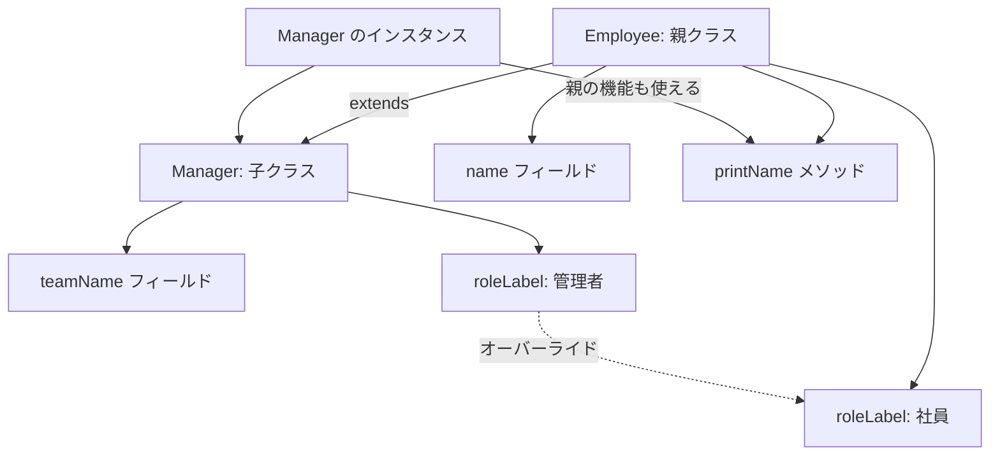

# Java-13 ハンズオン: 継承

## 1. この資料のゴール
- `extends` を使った継承を実装できる
- 親クラスと子クラスの役割分担を説明できる
- オーバーライドの基本を理解できる

---

## 2. 事前準備
```bash
cd ~/order-management-springboot/practice/java
java -version
javac -version
```

期待状態:
- `java -version` と `javac -version` の両方で `17` が表示される
- 例: `17.0.x`

---

## 3. 先に覚えるポイント
1. 継承は共通処理を親へ集約する仕組み
2. 子クラスは親の機能を再利用できる
3. 同名メソッドを子で再定義するのがオーバーライド
4. `@Override` は「親メソッドを上書きしている」ことを明示するアノテーション（推奨）

### 全体構成図（親クラスと子クラス）


ポイント:
- 共通のフィールドやメソッドは親クラスに置く
- 子クラスは親クラスの機能を使える
- 子クラス側で同名メソッドを定義すると、親の動作を上書きできる

### 書式の基本

#### `extends` による継承

```java
class Employee {
    String name;

    void printName() {
        System.out.println("名前: " + name);
    }
}

class Manager extends Employee {
}
```

ポイント:
- `class 子クラス extends 親クラス` の形で継承する
- 子クラスは親クラスのフィールドやメソッドを利用できる
- 共通部分を親クラスにまとめると重複を減らせる

#### 親クラスのメンバーを使う

```java
Manager m = new Manager();
m.name = "Tanaka";
m.printName();
```

ポイント:
- `Manager` のインスタンスから、親クラス `Employee` の `name` や `printName()` を使える
- 子クラス固有のフィールドやメソッドも追加できる

#### オーバーライド

```java
class Employee {
    String roleLabel() {
        return "社員";
    }
}

class Manager extends Employee {
    @Override
    String roleLabel() {
        return "管理者";
    }
}
```

ポイント:
- 親クラスと同じメソッドを子クラスで再定義することをオーバーライドと呼ぶ
- `@Override` を付けると、メソッド名や引数の間違いをコンパイル時に見つけやすい
- 呼び出し時は、実体のクラスに応じたメソッドが実行される

---

## 4. ハンズオン

目的:
- 共通化と差分実装を体験する

完了条件:
- `InheritanceDemo.java` で親・子クラスの動作を確認できる

作成ファイル: `~/order-management-springboot/practice/java/handson13/InheritanceDemo.java`

### Step 0: 作業フォルダを作る
```bash
mkdir -p ~/order-management-springboot/practice/java/handson13
cd ~/order-management-springboot/practice/java/handson13
```

### Step 1: 親クラスと子クラスを作る
`InheritanceDemo.java` を次の内容で作成:

```java
class Employee { // 親クラス: 社員共通の情報と処理を持つ
    String name; // 社員名

    void printName() { // 名前表示メソッド
        System.out.println("名前: " + name); // フィールド name を表示
    }
}

class Manager extends Employee { // 子クラス: Employee を継承
}

public class InheritanceDemo { // 実行クラス
    public static void main(String[] args) {
        Manager m = new Manager(); // 子クラスのインスタンスを生成
        m.name = "Tanaka"; // 親クラスのフィールドを利用
        m.printName(); // 親クラスのメソッドを利用
    } // main メソッドの終わり
} // クラス定義の終わり
```

実行:
```bash
javac -encoding UTF-8 InheritanceDemo.java
java InheritanceDemo
```

期待出力例:
```text
名前: Tanaka
```


### Step 2: 子クラスへ機能追加
`InheritanceDemo.java` を次の内容に更新:

```java
class Employee { // 親クラス
    String name; // 社員名

    void printName() { // 親クラス共通の表示メソッド
        System.out.println("名前: " + name);
    }
}

class Manager extends Employee { // 子クラス
    String teamName; // Manager 固有のフィールド

    void printTeam() { // Manager 固有のメソッド
        System.out.println("チーム: " + teamName);
    }
}

public class InheritanceDemo { // 実行クラス
    public static void main(String[] args) {
        Manager m = new Manager(); // Manager を生成
        m.name = "Tanaka"; // 親クラス由来のフィールド設定
        m.teamName = "Platform"; // 子クラス固有フィールド設定
        m.printName(); // 親クラスメソッド呼び出し
        m.printTeam(); // 子クラスメソッド呼び出し
    } // main メソッドの終わり
} // クラス定義の終わり
```

実行:
```bash
javac -encoding UTF-8 InheritanceDemo.java
java InheritanceDemo
```

期待出力例:
```text
名前: Tanaka
チーム: Platform
```


### Step 3: オーバーライドする（仕上げ）
補足（`@Override` とは）:
- `@Override` はアノテーションで、「このメソッドは親クラスのメソッドを上書きしている」とコンパイラへ伝える。
- 必須ではないが、付けるとメソッド名や引数の書き間違いをコンパイル時に検知しやすくなるため推奨。

`InheritanceDemo.java` を次の内容に更新:

```java
class Employee { // 親クラス
    String name; // 社員名

    String roleLabel() { // 役割名を返すメソッド（親の既定実装）
        return "社員";
    }

    void printProfile() { // プロフィール表示メソッド
        System.out.println(roleLabel() + ": " + name); // roleLabel は実体に応じた実装が呼ばれる
    }
}

class Manager extends Employee { // 子クラス
    @Override
    String roleLabel() { // 親メソッドを上書き（オーバーライド）
        return "管理者";
    }
}

public class InheritanceDemo { // 実行クラス
    public static void main(String[] args) {
        Manager m = new Manager(); // Manager を生成
        m.name = "Tanaka"; // 名前設定
        m.printProfile(); // オーバーライド結果を含めて表示
    } // main メソッドの終わり
} // クラス定義の終わり
```

実行:
```bash
javac -encoding UTF-8 InheritanceDemo.java
java InheritanceDemo
```

期待出力例:
```text
管理者: Tanaka
```

### Step 4: `@Override` の必要性を体感する（演習・5分）

Step 3 の `InheritanceDemo.java` を使って確認する:

1. `Manager` のメソッド名を `roleLable`（意図的なスペルミス）に変更し、`@Override` を外す。
2. そのまま実行する。

実行:
```bash
javac -encoding UTF-8 InheritanceDemo.java
java InheritanceDemo
```

期待出力例:
```text
社員: Tanaka
```

3. 次に、同じ `roleLable` のまま `@Override` を付け直して再コンパイルする。

期待状態:
- 環境に応じて次のいずれかのコンパイルエラーになる
- 英語環境: `method does not override or implement a method from a supertype`
- 日本語環境: `メソッドはスーパータイプのメソッドをオーバーライドまたは実装しません`
- `@Override` を付けることで、「上書きできていないミス」を実行前に検知できる


---

## 5. ミニ演習（10分）
Step 4の確認変更を元へ戻し、各レベルは前のレベルの完成コードを引き継いで実施します。レベル1はStep 3から開始してください。

### レベル1（基本）
1. `Manager`クラスより後、`InheritanceDemo`クラスより前へ、`Employee`を継承する`PartTimeEmployee`クラスを追加する。このレベルではクラスの中身は空にする。
2. `main(...)`の既存処理より後で、`PartTimeEmployee partTime = new PartTimeEmployee();`を生成する。
3. `partTime.name = "Sato";`で名前を設定する。
4. `partTime.printProfile();`を呼び出す。

確認対象の出力（抜粋）:
```text
社員: Sato
```

### レベル2（拡張）
1. レベル1で追加した`PartTimeEmployee`に`roleLabel()`を追加する。
2. `@Override`を付け、`"アルバイト"`を返す。
3. レベル1の`partTime`生成、名前設定、`printProfile()`呼び出しは変更しない。

確認対象の出力（抜粋）:
```text
アルバイト: Sato
```

### レベル3（実務）
1. レベル2のクラス定義は残し、`main(...)`の生成・表示処理を次の内容へ変更する。
   - `Employee employee = new Employee();`を生成し、名前を`"Tanaka"`にする。
   - `Manager manager = new Manager();`を生成し、名前を`"Suzuki"`にする。
   - `PartTimeEmployee partTime = new PartTimeEmployee();`を生成し、名前を`"Sato"`にする。
2. `employee`、`manager`、`partTime`の順に`printProfile()`を呼び出す。

期待出力例:
```text
社員: Tanaka
管理者: Suzuki
アルバイト: Sato
```

---

## 6. つまずきポイント
- `@Override` エラー
  -> 親とメソッド名・引数・戻り値が一致しているか確認
- 親にないフィールドへアクセス
  -> クラス定義の責務を整理
- 継承しすぎて複雑化
  -> 共通化が明確な場合に限定する
