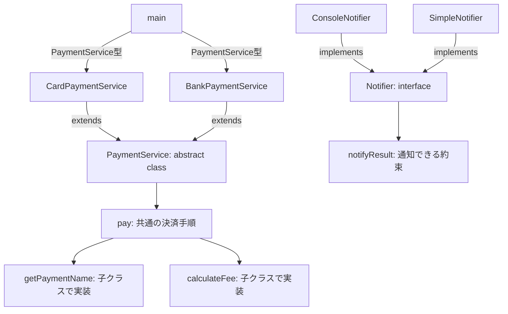

# Java-14 ハンズオン: 高度な継承（abstract / interface）

## 1. この資料のゴール
- 抽象クラス（`abstract class`）の用途を説明できる
- インターフェース（`interface`）の用途を説明できる
- 実装クラスで共通仕様を満たす設計を実装できる

---

## 2. 事前準備
```bash
cd ~/order-management-springboot/practice/java
java -version
javac -version
```

期待状態:
- `java -version` と `javac -version` の両方で `17` が表示される
- 例: `17.0.x`

---

## 3. 先に覚えるポイント
1. 抽象クラスは「途中まで完成した親クラス」
2. 共通の処理手順は親クラスに書き、決済方法ごとの違いだけを抽象メソッドにする
3. 抽象メソッドは、子クラスに「必ず実装すること」をコンパイル時に強制できる
4. 抽象クラスは直接 `new` できない。未完成の設計図だから、完成した子クラスを `new` する
5. インターフェースは「できることの約束」。継承関係とは別に、通知できる・保存できるなどの機能を表す

### `abstract` を使う場所
`abstract` は「まだ完成していない」ことを表すキーワードです。Javaでは主に、抽象クラスと抽象メソッドで使います。

```java
abstract class PaymentService { // abstract class: そのままnewできない未完成の親クラス
    abstract int calculateFee(int amount); // abstract method: 子クラスで必ず中身を書くメソッド
}
```

この例では、次の2か所で `abstract` を使っています。

```java
abstract class PaymentService // 決済サービスの共通部分を表すが、決済方法はまだ決まっていない
```

これは抽象クラスです。`PaymentService` は「決済サービス」という共通の考え方を表しますが、カード決済なのか銀行振込なのかはまだ決まっていません。そのため、直接 `new PaymentService()` して使うことはできません。

```java
abstract int calculateFee(int amount); // 手数料計算の形だけ決める。計算方法は子クラスに任せる
```

これは抽象メソッドです。メソッド名、引数、戻り値だけを決めて、処理内容はまだ書いていません。メソッド本体の `{}` は書かず、最後は `;` で終わります。

抽象メソッドは、子クラスで必ず実装します。

```java
class CardPaymentService extends PaymentService { // PaymentServiceを継承したカード決済クラス
    @Override // 親クラスの抽象メソッドを実装していることを明示する
    int calculateFee(int amount) { // カード決済用の手数料計算
        return amount / 100; // 金額の1%を手数料として返す
    }
}
```

つまり、`abstract` を使うと次のように役割を分けられます。

- 抽象クラス: 共通部分を持つが、まだそのまま使えない親クラス
- 抽象メソッド: 子クラスに実装を強制したい未完成のメソッド

抽象メソッドを1つでも持つクラスは、必ず `abstract class` にします。

### `interface` を使う場所
`interface` は「このメソッドを持っている」という約束を表すものです。抽象クラスのように共通処理をまとめる目的ではなく、「通知できる」「保存できる」「比較できる」などの機能の形を決めたいときに使います。

```java
interface Notifier { // 「通知できる」ことを表す約束
    void notifyResult(String message); // 通知メッセージを受け取り、通知するメソッド
}
```

この例では、次の2か所を確認します。

```java
interface Notifier // 通知機能を持つクラスが守る約束
```

これはインターフェースです。`Notifier` は「通知できるもの」という約束を表します。

```java
void notifyResult(String message); // messageを使って通知する、という形だけ決める
```

これはインターフェースで決めたメソッドです。メソッド名、引数、戻り値だけを決めて、処理内容は書いていません。抽象メソッドと同じように `{}` は書かず、最後は `;` で終わります。

インターフェースを使うクラスは、`implements` を使います。

```java
class ConsoleNotifier implements Notifier { // Notifierの約束を守る通知クラス
    @Override // interfaceで決めたメソッドを実装していることを明示する
    public void notifyResult(String message) { // 通知内容を受け取る
        System.out.println("[通知] " + message); // コンソールへ通知文を表示する
    }
}
```

```java
implements Notifier // 「Notifierのメソッドを必ず実装します」という宣言
```

これは「このクラスは `Notifier` の約束を守ります」という意味です。`implements Notifier` と書いたクラスは、`notifyResult(...)` を必ず実装します。

インターフェースのメソッドは外部から呼び出される前提のため、実装側では `public` を付けます。

```java
public void notifyResult(String message) // interfaceのメソッドを実装する時はpublicを付ける
```

呼び出し側は、具体的なクラス名ではなくインターフェース型で受け取れます。

```java
Notifier notifier = new ConsoleNotifier(); // 変数の型はNotifier、実体はConsoleNotifier
```

この形にすると、あとから `SimpleNotifier` や `ReceiptNotifier` に差し替えやすくなります。

```java
Notifier notifier = new SimpleNotifier(); // 実体だけ差し替えても、Notifierとして同じように扱える
```

抽象クラスとインターフェースの違いは、次のように考えると整理しやすいです。

- 抽象クラス: 共通の流れは親クラスに書き、決済方法ごとに違う部分だけ子クラスに書かせる
- インターフェース: 「このメソッドを必ず持つこと」というルールだけを決める

### 抽象クラス・抽象メソッド・インターフェースの比較

| 使うもの | 主な目的 |
|---|---|
| 抽象クラス | 共通のフィールド・共通処理を親に持たせつつ、一部メソッドだけ子クラスに実装を強制したい |
| 抽象メソッド | 子クラスに「このメソッドは必ず実装して」と強制したい |
| インターフェース | 「このメソッドを持つこと」をクラスに約束させたい |

注意点として、Javaでは「子クラスに特定のフィールドを必ず定義させる」ことは直接はできません。

- 共通のフィールドを持たせたい場合は、抽象クラスにフィールドを定義する
- 子クラスごとに値を必ず返させたい場合は、`abstract getName()` のような抽象メソッドで強制する
- 共通の状態よりも「この操作ができる」という約束を表したい場合は、インターフェースを使う

### なぜ抽象クラスが必要か
決済処理には、どの決済方法でも同じ流れがあります。

```text
決済開始
金額を受け取る
手数料を計算する
合計金額を出す
決済完了
```

このうち、開始メッセージ、合計計算、完了メッセージは共通です。

一方で、手数料計算はカード決済・銀行振込・現金などで変わります。

普通のクラスだけで書くと、次の問題が起きやすくなります。

- 決済方法ごとに同じ表示処理を何度も書く
- 新しい決済クラスで手数料計算を書き忘れても気づきにくい
- `PaymentService` という「決済方法がまだ決まっていないクラス」を誤って `new` できてしまう

抽象クラスにすると、共通部分は親クラスに集められます。さらに、子クラスが `calculateFee(...)` を実装し忘れるとコンパイルエラーになります。

### この章の設計


見方:
- `PaymentService` は共通の決済手順 `pay(...)` を持つ
- `getPaymentName()` と `calculateFee(...)` は決済方法ごとに違うので抽象メソッドにする
- `Notifier` は通知方法を差し替えるための約束として使う

---

## 4. ハンズオン

目的:
- 抽象クラスで「共通の処理手順」と「子クラスごとの差分」を分ける
- インターフェースで「通知できるもの」を差し替えられるようにする

完了条件:
- `CardPaymentService` と `BankPaymentService` を同じ `pay(...)` で実行できる
- `Notifier` の実装を差し替えて通知文を変えられる

作成ファイル: `~/order-management-springboot/practice/java/handson14/AdvancedInheritanceDemo.java`

### Step 0: 作業フォルダを作る
```bash
mkdir -p ~/order-management-springboot/practice/java/handson14
cd ~/order-management-springboot/practice/java/handson14
```

### Step 1: 抽象クラスで共通の決済手順を作る
`AdvancedInheritanceDemo.java` を次の内容で作成:

```java
abstract class PaymentService { // 決済処理の共通手順を持つ親クラス
    void pay(int amount) { // 決済を実行する共通メソッド。amountは決済金額
        System.out.println("決済開始"); // どの決済方法でも共通の開始メッセージ

        String paymentName = getPaymentName(); // 子クラスに決済方法名を決めてもらう
        int fee = calculateFee(amount); // 子クラスに手数料を計算してもらう
        int total = amount + fee; // 決済金額と手数料を足して合計を作る

        System.out.println("決済方法: " + paymentName); // 決済方法名を表示する
        System.out.println("金額: " + amount); // 元の決済金額を表示する
        System.out.println("手数料: " + fee); // 計算された手数料を表示する
        System.out.println("合計: " + total); // 金額 + 手数料の合計を表示する
        System.out.println("決済完了"); // どの決済方法でも共通の完了メッセージ
    }

    abstract String getPaymentName(); // 決済方法名は子クラスごとに違うため、子クラスに実装させる

    abstract int calculateFee(int amount); // 手数料計算は子クラスごとに違うため、子クラスに実装させる
}

class CardPaymentService extends PaymentService { // カード決済用の子クラス
    @Override // 親クラスのgetPaymentName()を実装していることを明示する
    String getPaymentName() {
        return "カード"; // カード決済の表示名を返す
    }

    @Override // 親クラスのcalculateFee(...)を実装していることを明示する
    int calculateFee(int amount) {
        return amount / 100; // 1% 手数料。例: 5000円なら50円
    }
}

class BankPaymentService extends PaymentService { // 銀行振込用の子クラス
    @Override // 親クラスのgetPaymentName()を実装していることを明示する
    String getPaymentName() {
        return "銀行振込"; // 銀行振込の表示名を返す
    }

    @Override // 親クラスのcalculateFee(...)を実装していることを明示する
    int calculateFee(int amount) {
        return 300; // 固定手数料。金額に関係なく300円
    }
}

public class AdvancedInheritanceDemo { // 実行用クラス
    public static void main(String[] args) { // Javaアプリの開始地点
        PaymentService card = new CardPaymentService(); // 親クラス型の変数にカード決済の実体を入れる
        PaymentService bank = new BankPaymentService(); // 親クラス型の変数に銀行振込の実体を入れる

        card.pay(5000); // カード決済としてpay(...)が動く
        System.out.println("---"); // 出力を見やすく区切る
        bank.pay(5000); // 銀行振込としてpay(...)が動く
    }
}
```

実行:
```bash
javac -encoding UTF-8 AdvancedInheritanceDemo.java
java AdvancedInheritanceDemo
```

期待出力例:
```text
決済開始
決済方法: カード
金額: 5000
手数料: 50
合計: 5050
決済完了
---
決済開始
決済方法: 銀行振込
金額: 5000
手数料: 300
合計: 5300
決済完了
```

確認ポイント:
- `card.pay(5000)` と `bank.pay(5000)` は同じ呼び出し方
- `pay(...)` の処理手順は親クラス `PaymentService` に1回だけ書いている
- 決済名と手数料だけが子クラスごとに変わる
- 子クラスで `getPaymentName()` や `calculateFee(...)` を書き忘れるとコンパイルエラーになる

### 中間チェック: 抽象クラス

- 共通の処理手順を`PaymentService`へ置く理由を説明できる
- 子クラスが実装する2つの抽象メソッドを説明できる
- `AdvancedInheritanceDemo.java`をコンパイル・実行できてからStep 2へ進む

### Step 2: インターフェースを追加
`AdvancedInheritanceDemo.java` を次の内容に更新:

ここでは、決済処理そのものは `PaymentService` に任せ、通知方法だけを `Notifier` で差し替えられるようにします。

- `Notifier` は通知機能の約束
- `ConsoleNotifier` と `SimpleNotifier` は、その約束を守る実装クラス
- `PaymentService` は `Notifier` 型で受け取るので、通知方法の具体的なクラスを気にしない

```java
interface Notifier { // 通知機能の約束を表すインターフェース
    void notifyResult(String message); // 通知したいメッセージを受け取るメソッド
}

class ConsoleNotifier implements Notifier { // "[通知]"付きで表示する通知クラス
    @Override // Notifierで決めたnotifyResult(...)を実装していることを明示する
    public void notifyResult(String message) { // publicが必要。interfaceのメソッドは外部から呼ばれる前提
        System.out.println("[通知] " + message); // 受け取ったメッセージをコンソールへ表示する
    }
}

class SimpleNotifier implements Notifier { // 簡易的な文言で表示する通知クラス
    @Override // Notifierで決めたnotifyResult(...)を実装していることを明示する
    public void notifyResult(String message) {
        System.out.println("通知: " + message); // 表示形式だけConsoleNotifierと変えている
    }
}

abstract class PaymentService { // 決済処理の共通手順を持つ親クラス
    void pay(int amount, Notifier notifier) { // 決済金額と通知方法を受け取る
        System.out.println("決済開始"); // どの決済方法でも共通の開始メッセージ

        String paymentName = getPaymentName(); // 子クラスに決済方法名を決めてもらう
        int fee = calculateFee(amount); // 子クラスに手数料を計算してもらう
        int total = amount + fee; // 決済金額と手数料を足して合計を作る

        System.out.println("決済方法: " + paymentName); // 決済方法名を表示する
        System.out.println("金額: " + amount); // 元の決済金額を表示する
        System.out.println("手数料: " + fee); // 計算された手数料を表示する
        System.out.println("合計: " + total); // 金額 + 手数料の合計を表示する
        System.out.println("決済完了"); // どの決済方法でも共通の完了メッセージ

        notifier.notifyResult(paymentName + "決済が完了しました。合計: " + total); // 渡された通知方法で結果を通知する
    }

    abstract String getPaymentName(); // 決済方法名は子クラスごとに違うため、子クラスに実装させる

    abstract int calculateFee(int amount); // 手数料計算は子クラスごとに違うため、子クラスに実装させる
}

class CardPaymentService extends PaymentService { // カード決済用の子クラス
    @Override // 親クラスのgetPaymentName()を実装していることを明示する
    String getPaymentName() {
        return "カード"; // カード決済の表示名を返す
    }

    @Override // 親クラスのcalculateFee(...)を実装していることを明示する
    int calculateFee(int amount) {
        return amount / 100; // 1% 手数料。例: 5000円なら50円
    }
}

class BankPaymentService extends PaymentService { // 銀行振込用の子クラス
    @Override // 親クラスのgetPaymentName()を実装していることを明示する
    String getPaymentName() {
        return "銀行振込"; // 銀行振込の表示名を返す
    }

    @Override // 親クラスのcalculateFee(...)を実装していることを明示する
    int calculateFee(int amount) {
        return 300; // 固定手数料。金額に関係なく300円
    }
}

public class AdvancedInheritanceDemo { // 実行用クラス
    public static void main(String[] args) { // Javaアプリの開始地点
        PaymentService card = new CardPaymentService(); // 親クラス型の変数にカード決済の実体を入れる
        PaymentService bank = new BankPaymentService(); // 親クラス型の変数に銀行振込の実体を入れる

        Notifier consoleNotifier = new ConsoleNotifier(); // 通知方法1: [通知]付きで表示する
        Notifier simpleNotifier = new SimpleNotifier(); // 通知方法2: シンプルな文言で表示する

        card.pay(5000, consoleNotifier); // カード決済を実行し、ConsoleNotifierで通知する
        System.out.println("---"); // 出力を見やすく区切る
        bank.pay(5000, simpleNotifier); // 銀行振込を実行し、SimpleNotifierで通知する
    }
}
```

実行:
```bash
javac -encoding UTF-8 AdvancedInheritanceDemo.java
java AdvancedInheritanceDemo
```

期待出力例:
```text
決済開始
決済方法: カード
金額: 5000
手数料: 50
合計: 5050
決済完了
[通知] カード決済が完了しました。合計: 5050
---
決済開始
決済方法: 銀行振込
金額: 5000
手数料: 300
合計: 5300
決済完了
通知: 銀行振込決済が完了しました。合計: 5300
```

確認ポイント:
- `PaymentService` は決済の共通手順を担当する
- `CardPaymentService` と `BankPaymentService` は決済ごとの差分だけを担当する
- `Notifier` は通知方法の約束を表す
- `ConsoleNotifier` と `SimpleNotifier` は同じ `notifyResult(...)` を持つので、呼び出し側から差し替えられる


---

## 5. ミニ演習（10分）
各レベルは、Step 2で完成した `AdvancedInheritanceDemo.java` を基準に実施し、次のレベルへ進む前に完成コードへ戻してください。

### レベル1（抽象クラス）
1. `CashPaymentService` を追加する。
2. `getPaymentName()` は `"現金"` を返す。
3. `calculateFee(...)` は `0` を返す。
4. `main(...)` から `cash.pay(5000, consoleNotifier);` を実行する。

期待出力例:
```text
決済方法: 現金
金額: 5000
手数料: 0
合計: 5000
```

### レベル2（インターフェース）
1. `ReceiptNotifier` を追加する。
2. `notifyResult(...)` で `"領収書: "` から始まるメッセージを表示する。
3. `Notifier notifier = new ReceiptNotifier();` に差し替えて実行する。

期待出力例:
```text
領収書: カード決済が完了しました。合計: 5050
```

### レベル3（抽象クラスの必要性を確認）
1. `CashPaymentService` から `calculateFee(...)` を一時的に削除する。
2. `javac -encoding UTF-8 AdvancedInheritanceDemo.java` を実行し、コンパイルエラーを確認する。
3. エラー確認後、`calculateFee(...)` を元に戻す。

期待状態:
- `CashPaymentService is not abstract and does not override abstract method ...` のようなエラーが出る
- 抽象メソッドによって、実装漏れをコンパイル時に発見できる

---

## 6. つまずきポイント
- `... is not abstract and does not override ...`
  -> 抽象メソッド、またはインターフェースのメソッドを実装していない
- 抽象クラスを `new` しようとしてエラー
  -> `PaymentService service = new PaymentService();` はできない。`new CardPaymentService()` のように完成した子クラスを生成する
- `@Override` の付与漏れ
  -> 実装ミス防止のため付ける
- 抽象クラスとインターフェースの違いが分からない
  -> 抽象クラスは「共通処理を持つ未完成の親クラス」。インターフェースは「このメソッドを持つという約束」
