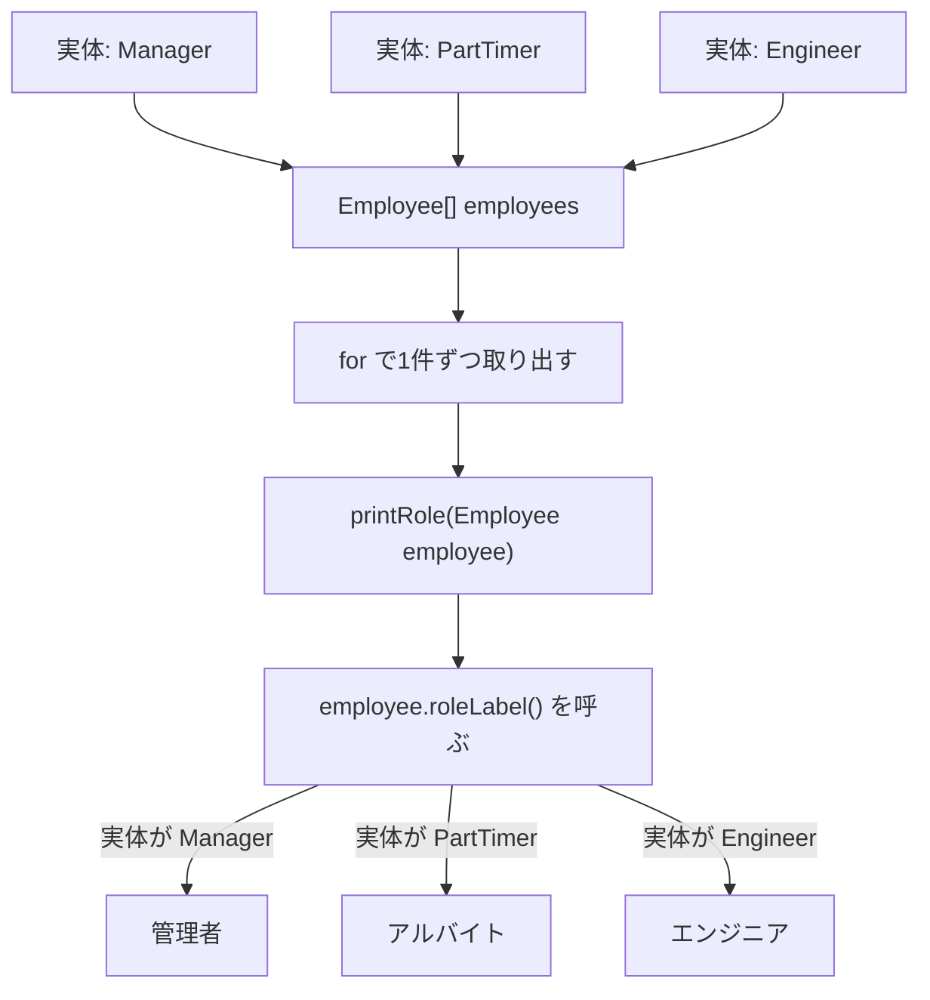

# Java-15 ハンズオン: 多態性（ポリモーフィズム）

対応参考資料: `Java-15_多態性.pptx`

## 1. この資料のゴール
- 親型の変数に子クラスのインスタンスを入れられることを説明できる
- 同じメソッド呼び出しでも、実体に応じて処理が切り替わることを確認できる
- 親型で受けると、呼び出し側の処理を共通化できることを説明できる
- 必要な場合だけ `instanceof` とダウンキャストを使える

---

## 2. 事前準備
```bash
cd ~/order-management-springboot/practice/java
java -version
javac -version
```

期待状態:
- `java -version` と `javac -version` の両方で `17` が表示される
- 例: `17.0.x`

---

## 3. 先に覚えるポイント
1. 多態性は「同じ呼び出しでも、実体によって動きが変わる」仕組み
2. 変数の型は「その変数から何を呼べるか」を決める
3. 実体の型は「オーバーライドされたメソッドのうち、どれが実行されるか」を決める
4. `instanceof` とダウンキャストは、多態性の中心ではなく補助手段

### この章で一番大事な1行

```java
Employee e = new Manager();
```

この1行では、次の2つを分けて考えます。

| 見る場所 | 例 | 意味 |
| --- | --- | --- |
| 左辺の型 | `Employee` | 変数 `e` から呼べるメンバーの範囲 |
| 右辺の実体 | `new Manager()` | 実際に作られるインスタンス |

ポイント:
- `e` の型は `Employee`
- 実体は `Manager`
- `Employee` に定義されているメソッドは `e` から呼べる
- そのメソッドが `Manager` でオーバーライドされていれば、`Manager` 側の処理が動く

### 全体構成図（同じ処理で複数の実体を扱う）


ポイント:
- 配列の型はすべて `Employee`
- 実体は `Manager`、`PartTimer`、`Engineer` のように異なってよい
- 呼び出し側は `employee.roleLabel()` と同じ書き方だけでよい
- どの `roleLabel()` が動くかは、実体のクラスで決まる

### 書式の基本

#### 親型の変数で子クラスの実体を受ける

```java
Employee employee = new Manager();
```

ポイント:
- `Manager` は `Employee` を継承しているため、`Employee` 型の変数へ入れられる
- 「Manager は Employee の一種」と考える
- 同じ考え方で、`PartTimer` や `Engineer` も `Employee` 型として扱える

#### 実体に応じたメソッドが呼ばれる

```java
class Employee {
    String roleLabel() {
        return "社員";
    }
}

class Manager extends Employee {
    @Override
    String roleLabel() {
        return "管理者";
    }
}
```

```java
Employee employee = new Manager();
System.out.println(employee.roleLabel());
```

出力:
```text
管理者
```

ポイント:
- 変数型は `Employee`
- 実体は `Manager`
- `roleLabel()` は `Manager` 側の実装が呼ばれる
- 多態性で切り替わる中心は、オーバーライドされたメソッド

#### 親型を引数にする共通処理

```java
static void printRole(Employee employee) {
    System.out.println(employee.name + " は " + employee.roleLabel());
}
```

ポイント:
- 引数を `Employee` 型にすると、`Manager` も `PartTimer` も受け取れる
- 呼び出し側は、子クラスごとに別メソッドを作らなくてよい
- 子クラスが増えても、共通処理を使い回しやすい

#### 配列やループでまとめて扱う

```java
Employee[] employees = { manager, partTimer, engineer };

for (Employee employee : employees) {
    printRole(employee);
}
```

ポイント:
- 配列の型は `Employee[]`
- 中身の実体は別々の子クラスでよい
- 同じ `printRole(employee)` で、実体ごとの結果になる

#### 親型では親にあるメンバーだけ呼べる

```java
Employee employee = new Manager();

employee.name = "Yamada"; // OK: Employee に name がある
// employee.teamName = "Platform"; // NG: Employee に teamName はない
```

ポイント:
- `employee` の変数型は `Employee`
- コンパイラは `Employee` に定義されたメンバーだけを許可する
- 実体が `Manager` でも、親型のままでは `Manager` 固有の `teamName` を直接使えない

#### 必要な場合だけ `instanceof` とダウンキャストを使う

```java
if (employee instanceof Manager) {
    Manager manager = (Manager) employee;
    manager.teamName = "Platform";
}
```

ポイント:
- 親型変数から子クラス固有のフィールドやメソッドを使うにはダウンキャストが必要
- 先に `instanceof` で実体の型を確認する
- 確認せずに誤った型へキャストすると実行時エラーになる
- `instanceof` 分岐が増えすぎる場合は、共通メソッドへ移せないかを先に考える

---

## 4. ハンズオン

目的:
- 多態性を使わない書き方でも実装できることを確認する
- 種類が増えたとき、`if` 分岐の修正箇所が増えることを確認する
- 多態性を使うと、種類ごとの差分を子クラス側へ移せることを確認する
- 子クラス固有情報が必要な場合だけ、`instanceof` とダウンキャストを使う

完了条件:
- `if` 分岐で種類ごとの処理を書いた場合の修正箇所を説明できる
- 多態性で書き換えた場合、共通処理を変更せずに種類を追加できることを説明できる
- 親型のままでは子クラス固有フィールドを直接使えないことを説明できる

作成ファイル: `~/order-management-springboot/practice/java/handson15/PolymorphismDemo.java`

### Step 0: 作業フォルダを作る
```bash
mkdir -p ~/order-management-springboot/practice/java/handson15
cd ~/order-management-springboot/practice/java/handson15
```

### Step 1: まず `if` で種類ごとに分ける
`PolymorphismDemo.java` を次の内容で作成:

```java
class Employee { // 社員データ
    String name; // 社員名
    String employeeType; // 種類を文字列で持つ
}

public class PolymorphismDemo { // 実行クラス
    static String roleLabel(String employeeType) { // 種類ごとに役割名を返す
        if (employeeType.equals("manager")) {
            return "管理者";
        } else if (employeeType.equals("partTimer")) {
            return "アルバイト";
        } else if (employeeType.equals("engineer")) {
            return "エンジニア";
        }
        return "社員";
    }

    static int monthlyBonus(String employeeType) { // 種類ごとに月額手当を返す
        if (employeeType.equals("manager")) {
            return 50000;
        } else if (employeeType.equals("partTimer")) {
            return 0;
        } else if (employeeType.equals("engineer")) {
            return 30000;
        }
        return 0;
    }

    static void printEmployee(Employee employee) { // 表示処理
        System.out.println(employee.name + " は " + roleLabel(employee.employeeType));
        System.out.println("手当: " + monthlyBonus(employee.employeeType));
    }

    public static void main(String[] args) {
        Employee manager = new Employee();
        manager.name = "Yamada";
        manager.employeeType = "manager";

        Employee partTimer = new Employee();
        partTimer.name = "Kato";
        partTimer.employeeType = "partTimer";

        Employee engineer = new Employee();
        engineer.name = "Tanaka";
        engineer.employeeType = "engineer";

        Employee[] employees = { manager, partTimer, engineer };

        for (Employee employee : employees) {
            printEmployee(employee);
        }
    } // main メソッドの終わり
} // クラス定義の終わり
```

実行:
```bash
javac -encoding UTF-8 PolymorphismDemo.java
java PolymorphismDemo
```

期待出力例:
```text
Yamada は 管理者
手当: 50000
Kato は アルバイト
手当: 0
Tanaka は エンジニア
手当: 30000
```

コード解説:
- この段階では多態性を使っていない
- `employeeType` の文字列を見て、`if` / `else if` で処理を分けている
- 種類が少ないうちは、この書き方でも問題なく動く
- ただし、種類ごとの差分が `roleLabel` と `monthlyBonus` の中に集まっている

### Step 2: 種類を増やして修正箇所が増えることを確認する
`PolymorphismDemo.java` を次の内容に更新:

```java
class Employee { // 社員データ
    String name; // 社員名
    String employeeType; // 種類を文字列で持つ
}

public class PolymorphismDemo { // 実行クラス
    static String roleLabel(String employeeType) { // 種類ごとに役割名を返す
        if (employeeType.equals("manager")) {
            return "管理者";
        } else if (employeeType.equals("partTimer")) {
            return "アルバイト";
        } else if (employeeType.equals("engineer")) {
            return "エンジニア";
        } else if (employeeType.equals("contractor")) { // 追加1: 新しい種類の役割名
            return "業務委託";
        }
        return "社員";
    }

    static int monthlyBonus(String employeeType) { // 種類ごとに月額手当を返す
        if (employeeType.equals("manager")) {
            return 50000;
        } else if (employeeType.equals("partTimer")) {
            return 0;
        } else if (employeeType.equals("engineer")) {
            return 30000;
        } else if (employeeType.equals("contractor")) { // 追加2: 新しい種類の手当
            return 10000;
        }
        return 0;
    }

    static void printEmployee(Employee employee) { // 表示処理
        System.out.println(employee.name + " は " + roleLabel(employee.employeeType));
        System.out.println("手当: " + monthlyBonus(employee.employeeType));
    }

    public static void main(String[] args) {
        Employee manager = new Employee();
        manager.name = "Yamada";
        manager.employeeType = "manager";

        Employee partTimer = new Employee();
        partTimer.name = "Kato";
        partTimer.employeeType = "partTimer";

        Employee engineer = new Employee();
        engineer.name = "Tanaka";
        engineer.employeeType = "engineer";

        Employee contractor = new Employee(); // 追加3: 新しい種類のデータ
        contractor.name = "Sato";
        contractor.employeeType = "contractor";

        Employee[] employees = { manager, partTimer, engineer, contractor };

        for (Employee employee : employees) {
            printEmployee(employee);
        }
    } // main メソッドの終わり
} // クラス定義の終わり
```

実行:
```bash
javac -encoding UTF-8 PolymorphismDemo.java
java PolymorphismDemo
```

期待出力例:
```text
Yamada は 管理者
手当: 50000
Kato は アルバイト
手当: 0
Tanaka は エンジニア
手当: 30000
Sato は 業務委託
手当: 10000
```

コード解説:
- `contractor` を追加するために、少なくとも3か所を変更している
- `roleLabel` に `contractor` の分岐を追加
- `monthlyBonus` に `contractor` の分岐を追加
- `main` で `contractor` のデータを作成して配列へ追加
- 種類ごとの処理が増えるほど、修正する `if` 分岐も増えやすい

### Step 3: 多態性で書き換える
`PolymorphismDemo.java` を次の内容に更新:

```java
class Employee { // 親クラス
    String name; // 社員名

    String roleLabel() { // 役割名
        return "社員";
    }

    int monthlyBonus() { // 月額手当
        return 0;
    }
}

class Manager extends Employee { // 管理者
    @Override
    String roleLabel() {
        return "管理者";
    }

    @Override
    int monthlyBonus() {
        return 50000;
    }
}

class PartTimer extends Employee { // アルバイト
    @Override
    String roleLabel() {
        return "アルバイト";
    }

    @Override
    int monthlyBonus() {
        return 0;
    }
}

class Engineer extends Employee { // エンジニア
    @Override
    String roleLabel() {
        return "エンジニア";
    }

    @Override
    int monthlyBonus() {
        return 30000;
    }
}

class Contractor extends Employee { // 業務委託
    @Override
    String roleLabel() {
        return "業務委託";
    }

    @Override
    int monthlyBonus() {
        return 10000;
    }
}

public class PolymorphismDemo { // 実行クラス
    static void printEmployee(Employee employee) { // Employee 型ならどの子クラスでも受け取れる
        System.out.println(employee.name + " は " + employee.roleLabel());
        System.out.println("手当: " + employee.monthlyBonus());
    }

    public static void main(String[] args) {
        Employee manager = new Manager(); // 変数型は Employee、実体は Manager
        manager.name = "Yamada";

        Employee partTimer = new PartTimer(); // 変数型は Employee、実体は PartTimer
        partTimer.name = "Kato";

        Employee engineer = new Engineer(); // 変数型は Employee、実体は Engineer
        engineer.name = "Tanaka";

        Employee contractor = new Contractor(); // 変数型は Employee、実体は Contractor
        contractor.name = "Sato";

        Employee[] employees = { manager, partTimer, engineer, contractor };

        for (Employee employee : employees) {
            printEmployee(employee);
        }
    } // main メソッドの終わり
} // クラス定義の終わり
```

実行:
```bash
javac -encoding UTF-8 PolymorphismDemo.java
java PolymorphismDemo
```

期待出力例:
```text
Yamada は 管理者
手当: 50000
Kato は アルバイト
手当: 0
Tanaka は エンジニア
手当: 30000
Sato は 業務委託
手当: 10000
```

コード解説:
- `roleLabel()` と `monthlyBonus()` を親クラス `Employee` に用意している
- 子クラスごとの差分は、それぞれのクラスでオーバーライドしている
- `printEmployee` は `if` で種類を判定していない
- `printEmployee` は同じ呼び出しだけをして、実体に応じた処理は各子クラスに任せている

### Step 4: 新しい種類を追加して、共通処理を変えずに動かす
`PolymorphismDemo.java` を次の内容に更新:

```java
class Employee { // 親クラス
    String name; // 社員名

    String roleLabel() { // 役割名
        return "社員";
    }

    int monthlyBonus() { // 月額手当
        return 0;
    }
}

class Manager extends Employee { // 管理者
    @Override
    String roleLabel() {
        return "管理者";
    }

    @Override
    int monthlyBonus() {
        return 50000;
    }
}

class PartTimer extends Employee { // アルバイト
    @Override
    String roleLabel() {
        return "アルバイト";
    }

    @Override
    int monthlyBonus() {
        return 0;
    }
}

class Engineer extends Employee { // エンジニア
    @Override
    String roleLabel() {
        return "エンジニア";
    }

    @Override
    int monthlyBonus() {
        return 30000;
    }
}

class Contractor extends Employee { // 業務委託
    @Override
    String roleLabel() {
        return "業務委託";
    }

    @Override
    int monthlyBonus() {
        return 10000;
    }
}

class Intern extends Employee { // インターン（新しく追加）
    @Override
    String roleLabel() {
        return "インターン";
    }

    @Override
    int monthlyBonus() {
        return 0;
    }
}

public class PolymorphismDemo { // 実行クラス
    static void printEmployee(Employee employee) { // この共通処理は変更しない
        System.out.println(employee.name + " は " + employee.roleLabel());
        System.out.println("手当: " + employee.monthlyBonus());
    }

    public static void main(String[] args) {
        Employee manager = new Manager();
        manager.name = "Yamada";

        Employee partTimer = new PartTimer();
        partTimer.name = "Kato";

        Employee engineer = new Engineer();
        engineer.name = "Tanaka";

        Employee contractor = new Contractor();
        contractor.name = "Sato";

        Employee intern = new Intern(); // 新しい種類の実体を作る
        intern.name = "Suzuki";

        Employee[] employees = { manager, partTimer, engineer, contractor, intern };

        for (Employee employee : employees) { // この呼び出し方は変更しない
            printEmployee(employee);
        }
    } // main メソッドの終わり
} // クラス定義の終わり
```

実行:
```bash
javac -encoding UTF-8 PolymorphismDemo.java
java PolymorphismDemo
```

期待出力例:
```text
Yamada は 管理者
手当: 50000
Kato は アルバイト
手当: 0
Tanaka は エンジニア
手当: 30000
Sato は 業務委託
手当: 10000
Suzuki は インターン
手当: 0
```

コード解説:
- 新しい種類 `Intern` を追加している
- `Intern` の役割名と手当は、`Intern` クラスの中に書いている
- `printEmployee` に `if` 分岐を追加していない
- 種類ごとの差分を子クラス側へ移すことで、共通処理を変更しにくくできる
- これが多態性を使う主な理由

### Step 5: 必要な場合だけ `instanceof` で子クラス固有情報を扱う
`PolymorphismDemo.java` を次の内容に更新:

```java
class Employee { // 親クラス
    String name; // 社員名

    String roleLabel() { // 役割名
        return "社員";
    }

    int monthlyBonus() { // 月額手当
        return 0;
    }
}

class Manager extends Employee { // 管理者
    String teamName; // Manager だけが持つ固有フィールド

    @Override
    String roleLabel() {
        return "管理者";
    }

    @Override
    int monthlyBonus() {
        return 50000;
    }
}

class PartTimer extends Employee { // アルバイト
    @Override
    String roleLabel() {
        return "アルバイト";
    }

    @Override
    int monthlyBonus() {
        return 0;
    }
}

class Engineer extends Employee { // エンジニア
    @Override
    String roleLabel() {
        return "エンジニア";
    }

    @Override
    int monthlyBonus() {
        return 30000;
    }
}

class Contractor extends Employee { // 業務委託
    @Override
    String roleLabel() {
        return "業務委託";
    }

    @Override
    int monthlyBonus() {
        return 10000;
    }
}

class Intern extends Employee { // インターン
    @Override
    String roleLabel() {
        return "インターン";
    }

    @Override
    int monthlyBonus() {
        return 0;
    }
}

public class PolymorphismDemo { // 実行クラス
    static void printEmployee(Employee employee) { // 共通情報は多態性で扱う
        System.out.println(employee.name + " は " + employee.roleLabel());
        System.out.println("手当: " + employee.monthlyBonus());
    }

    static void printManagerTeam(Employee employee) { // Manager 固有情報が必要な場合だけ型判定する
        if (employee instanceof Manager) { // 実体が Manager か確認
            Manager manager = (Manager) employee; // 確認後に Manager 型として扱う
            System.out.println(manager.name + " / " + manager.teamName);
        }
    }

    public static void main(String[] args) {
        Employee manager = new Manager(); // 変数型は Employee、実体は Manager
        manager.name = "Yamada";
        // manager.teamName = "Platform"; // NG: Employee 型のままでは Manager 固有フィールドを使えない

        if (manager instanceof Manager) { // 実体が Manager か確認
            Manager managerDetail = (Manager) manager; // 確認後に Manager 型として扱う
            managerDetail.teamName = "Platform";
        }

        Employee partTimer = new PartTimer();
        partTimer.name = "Kato";

        Employee engineer = new Engineer();
        engineer.name = "Tanaka";

        Employee contractor = new Contractor();
        contractor.name = "Sato";

        Employee intern = new Intern();
        intern.name = "Suzuki";

        Employee[] employees = { manager, partTimer, engineer, contractor, intern };

        for (Employee employee : employees) {
            printEmployee(employee);
        }

        System.out.println("管理チーム:");
        for (Employee employee : employees) {
            printManagerTeam(employee);
        }
    } // main メソッドの終わり
} // クラス定義の終わり
```

実行:
```bash
javac -encoding UTF-8 PolymorphismDemo.java
java PolymorphismDemo
```

期待出力例:
```text
Yamada は 管理者
手当: 50000
Kato は アルバイト
手当: 0
Tanaka は エンジニア
手当: 30000
Sato は 業務委託
手当: 10000
Suzuki は インターン
手当: 0
管理チーム:
Yamada / Platform
```

コード解説:
- `name`、`roleLabel()`、`monthlyBonus()` は `Employee` にあるため、親型のまま扱える
- `teamName` は `Manager` にしかないため、`Employee` 型のままでは扱えない
- `instanceof` で実体が `Manager` であることを確認してから、`Manager` 型へダウンキャストしている
- 共通処理は多態性で扱い、子クラス固有情報が必要な場合だけ `instanceof` を使う
- `instanceof` 分岐が増えすぎる場合は、共通メソッドにできないかを先に考える

---

## 5. ミニ演習（10分）
### レベル1（基本）
1. Step 4 のコードに `Director` クラスを追加する。
2. `roleLabel()` が `"役員"` を返すようにする。
3. `monthlyBonus()` が `80000` を返すようにする。
4. `Employee[] employees` に追加して、同じ `for` 文で表示する。

期待出力例:
```text
Takahashi は 役員
手当: 80000
```

### レベル2（補足: 子クラス固有情報）
1. Step 5 のコードで、`Engineer` に `skillName` フィールドを追加する。
2. `engineer` の `skillName` に `"Java"` を設定する。
3. `instanceof` を使って、`Engineer` のときだけスキル名を表示する。

期待出力例:
```text
Tanaka / Java
```

### レベル3（実務）
1. レベル2の `skillName` 表示を、`instanceof` 分岐を使わずに済むように見直す。
2. `Employee` に `detailLabel()` メソッドを追加する。
3. `Engineer` 側で `detailLabel()` をオーバーライドし、スキル名込みの文字列を返す。
4. 呼び出し側は `employee.detailLabel()` だけを呼ぶ。

期待状態:
- 呼び出し側の `if` / `instanceof` 分岐を減らせる
- 子クラスごとの差分は、子クラス側のオーバーライドに閉じ込められる

---

## 6. つまずきポイント
- `Employee employee = new Manager();` の意味が分からない
  -> 左辺の `Employee` は変数から呼べる範囲、右辺の `Manager` は実際に作られる実体
- `employee.roleLabel()` でなぜ `Manager` 側が呼ばれるのか分からない
  -> オーバーライドされたメソッドは、変数型ではなく実体の型で実行先が決まる
- 親型で子クラス固有フィールドを直接呼んでエラー
  -> 親型参照では、親に定義されたメンバーだけ呼べる
- キャストで `ClassCastException`
  -> `instanceof` 判定を先に行う
- `instanceof` 分岐が増えてコードが読みにくい
  -> 共通メソッドを親に定義し、子クラス側でオーバーライドできないか考える
- 多態性のメリットが見えない
  -> `Employee[]` と `for` で、複数の子クラスを同じ処理で扱える点に着目する
