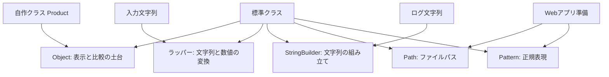

# Java-16 ハンズオン: Javaを支える標準クラス

## 1. この資料のゴール
- `Object` の基本メソッド（`toString`, `equals`）を理解する
- ラッパークラス（`Integer`, `Double`）を使える
- `StringBuilder` で文字列連結を効率化できる
- `Path` / `Pattern` を使った実務寄りの抽出処理を実装できる

---

## 2. 事前準備
```bash
cd ~/order-management-springboot/practice/java
java -version
javac -version
```

期待状態:
- `java -version` と `javac -version` の両方で `17` が表示される
- 例: `17.0.x`

---

## 3. 先に覚えるポイント
1. 全クラスは `Object` を継承する
2. `toString()` は、オブジェクトを文字列として見せるときの標準ルール
3. `equals(...)` は、同じ値とみなすかを決める比較ルール
4. 基本型とラッパー型は相互変換される（オートボクシング）
5. 文字列連結が多いときは `StringBuilder` が有効
6. `Path` はファイルパス、`Pattern` は正規表現パターンを表す型
7. `private static final` は「クラス内で共有し、再代入しない定数」の定番宣言

### 全体構成図（標準クラスの役割）


ポイント:
- 標準クラスは、自作クラスだけでは面倒な処理を支える部品
- `Object` はすべてのクラスの土台として、表示や比較の考え方につながる
- `Path` / `Pattern` は、後続の Web アプリ準備でファイルや文字列抽出を扱う前提になる

### 書式の基本

#### `toString` のオーバーライド

```java
@Override
public String toString() {
    return "Product{code='" + code + "'}";
}
```

ポイント:
- `toString()` は、表示用の文字列を返すメソッド
- `System.out.println(...)` は画面に表示する命令
- `toString()` は、そのオブジェクトをどういう文字列として見せるかを決める
- `System.out.println(product)` や `"商品: " + product` でも `toString()` の結果が使われる

自作表示メソッドとの違い:

| 方法 | 表示用文字列を作れるか | 呼び出し方 |
| --- | --- | --- |
| `displayText()` など | 作れる | 毎回 `product.displayText()` と明示する |
| `toString()` | 作れる | `println(product)` や `"商品: " + product` で自動的に使われる |

#### `equals` のオーバーライド

```java
@Override
public boolean equals(Object obj) {
    if (this == obj) {
        return true;
    }
    if (!(obj instanceof Product other)) {
        return false;
    }
    return Objects.equals(code, other.code);
}
```

ポイント:
- `equals` は「同じ値とみなすか」を決めるメソッド
- `this == obj` は同じ実体なら `true`
- `obj instanceof Product other` は、`obj` が `Product` のときだけ `other` として扱う書き方
- `Objects.equals(code, other.code)` は、`code` が `null` でも安全に比較できる
- `code.equals(other.code)` と書くと、`code` が `null` の場合に `NullPointerException` になる
- `import java.util.Objects;` は `equals(...)` のためではなく、`Objects.equals(...)` を短く書くために使う

#### ラッパークラス

```java
String quantityText = "25";
int quantity = Integer.parseInt(quantityText);

Integer boxed = quantity;
int unboxed = boxed;
```

ポイント:
- `Integer` は `int` に対応するラッパークラス
- `Integer.parseInt(...)` で文字列を `int` に変換できる
- `int` と `Integer` は必要に応じて自動変換される

#### `StringBuilder`

```java
StringBuilder sb = new StringBuilder();
sb.append("受注ID=").append("ORD-1001");
String logLine = sb.toString();
```

ポイント:
- `StringBuilder` は文字列を少しずつ組み立てるためのクラス
- `append(...)` は連続して呼び出せる
- 最後に `toString()` で通常の `String` に変換する

#### `Path` / `Pattern` と定数

```java
private static final Path STATIC_DIR = Path.of("static");
private static final Pattern NAME_PATTERN = Pattern.compile("\"name\"\\s*:\\s*\"(.*?)\"");
```

ポイント:
- `Path.of(...)` はファイルパスを表す `Path` を作る
- `Pattern.compile(...)` は正規表現パターンを事前に作る
- `private static final` はクラス内だけで使う再代入しない共有値に向いている

---

## 4. ハンズオン

目的:
- 標準クラスの実務利用を体験する
- `toString()` を書かない場合と書いた場合の違いを確認する
- 自作表示メソッドと `toString()` の違いを確認する

完了条件:
- `StandardClassDemo.java` で `Object` / ラッパー / `StringBuilder` / `Path` / `Pattern` を確認できる
- `println` と `toString()` の役割の違いを説明できる
- `displayText()` のような自作メソッドと `toString()` の使われ方の違いを説明できる

作成ファイル: `~/order-management-springboot/practice/java/handson16/StandardClassDemo.java`

### Step 0: 作業フォルダを作る
```bash
mkdir -p ~/order-management-springboot/practice/java/handson16
cd ~/order-management-springboot/practice/java/handson16
```

### Step 1: `toString` がない場合の表示を確認する
`StandardClassDemo.java` を次の内容で作成:

```java
class Product { // 商品クラス
    String code; // 商品コード

    Product(String code) { // コンストラクタ
        this.code = code; // フィールド初期化
    }
}

public class StandardClassDemo { // 実行クラス
    public static void main(String[] args) {
        Product p1 = new Product("P-001");

        System.out.println(p1); // Product をそのまま表示
        System.out.println("商品: " + p1); // 文字列連結の中で Product を使う
    } // main メソッドの終わり
} // クラス定義の終わり
```

実行:
```bash
javac -encoding UTF-8 StandardClassDemo.java
java StandardClassDemo
```

期待出力例:
```text
Product@5acf9800
商品: Product@5acf9800
```

補足:
- `@` の後ろの英数字は実行環境によって変わる
- 商品コード `P-001` が表示されていないため、ログやデバッグでは分かりにくい

コード解説:
- `System.out.println(p1)` は `p1` を画面に表示しようとする
- Java は `p1` を文字列にするため、内部で `p1.toString()` を使う
- 自分で `toString()` を定義していないため、`Product@...` のような標準表示になる

### Step 2: 自作表示メソッドで表示を改善する
`StandardClassDemo.java` を次の内容に更新:

```java
class Product { // 商品クラス
    String code; // 商品コード

    Product(String code) { // コンストラクタ
        this.code = code; // フィールド初期化
    }

    String displayText() { // Product を表示するための自作メソッド
        return "Product{code='" + code + "'}";
    }
}

public class StandardClassDemo { // 実行クラス
    public static void main(String[] args) {
        Product p1 = new Product("P-001");

        System.out.println(p1.displayText()); // 自作メソッドを明示して表示
        System.out.println("商品: " + p1.displayText()); // 文字列連結でも明示して呼ぶ
        System.out.println(p1); // displayText は自動では使われない
    } // main メソッドの終わり
} // クラス定義の終わり
```

実行:
```bash
javac -encoding UTF-8 StandardClassDemo.java
java StandardClassDemo
```

期待出力例:
```text
Product{code='P-001'}
商品: Product{code='P-001'}
Product@5acf9800
```

補足:
- 3行目の `@` の後ろの英数字は実行環境によって変わる

コード解説:
- `displayText()` のような自作メソッドでも、表示用文字列は作れる
- ただし、呼び出し側が毎回 `p1.displayText()` と書く必要がある
- `System.out.println(p1)` では `displayText()` は自動で使われない
- 自作メソッド名は Java の標準ルールではないため、Java 側は存在を知らない

### Step 3: `toString` で Java 標準の表示ルールにする
`StandardClassDemo.java` を次の内容に更新:

```java
class Product { // 商品クラス
    String code; // 商品コード

    Product(String code) { // コンストラクタ
        this.code = code; // フィールド初期化
    }

    @Override
    public String toString() { // Product を文字列として見せる標準ルール
        return "Product{code='" + code + "'}";
    }
}

public class StandardClassDemo { // 実行クラス
    public static void main(String[] args) {
        Product p1 = new Product("P-001");

        System.out.println(p1); // println の中で toString が使われる
        System.out.println("商品: " + p1); // 文字列連結でも toString が使われる
    } // main メソッドの終わり
} // クラス定義の終わり
```

実行:
```bash
javac -encoding UTF-8 StandardClassDemo.java
java StandardClassDemo
```

期待出力例:
```text
Product{code='P-001'}
商品: Product{code='P-001'}
```

コード解説:
- `System.out.println(...)` は表示する命令
- `toString()` は表示内容になる文字列を作るメソッド
- `System.out.println(p1.toString())` と書かなくても、`System.out.println(p1)` で `toString()` が使われる
- `"商品: " + p1` のような文字列連結でも `toString()` が使われる
- `toString()` は、Java の標準機能に「このクラスの表示方法」を教えるためのメソッド

### Step 4: `equals` で値として同じかを決める
`StandardClassDemo.java` を次の内容に更新:

先取り補足:
- `obj instanceof Product other` は「`obj` が `Product` なら、`other` という名前で Product として使う」という書き方
- 通常の `instanceof` とキャストを短く安全に書くための構文として読む

```java
import java.util.Objects; // null 安全な比較ユーティリティ

class Product { // 商品クラス
    String code; // 商品コード

    Product(String code) { // コンストラクタ
        this.code = code; // フィールド初期化
    }

    @Override
    public String toString() { // 表示用文字列を返す
        return "Product{code='" + code + "'}";
    }

    @Override
    public boolean equals(Object obj) { // 値の同一性比較を定義
        if (this == obj) { // 同じ参照なら true
            return true;
        }
        if (!(obj instanceof Product other)) { // Product 以外は false
            return false;
        }
        return Objects.equals(code, other.code); // code が null でも安全に値を比較
    }
}

public class StandardClassDemo { // 実行クラス
    public static void main(String[] args) {
        Product p1 = new Product("P-001"); // 同じ code のインスタンス1
        Product p2 = new Product("P-001"); // 同じ code のインスタンス2
        Product p3 = new Product("P-999"); // 異なる code のインスタンス

        System.out.println("p1: " + p1); // toString の結果が使われる
        System.out.println("p2: " + p2); // toString の結果が使われる
        System.out.println("p1 equals p2: " + p1.equals(p2)); // true 期待
        System.out.println("p1 equals p3: " + p1.equals(p3)); // false 期待
    } // main メソッドの終わり
} // クラス定義の終わり
```

実行:
```bash
javac -encoding UTF-8 StandardClassDemo.java
java StandardClassDemo
```

期待出力例:
```text
p1: Product{code='P-001'}
p2: Product{code='P-001'}
p1 equals p2: true
p1 equals p3: false
```

コード解説:
- `toString()` は表示用文字列を決める
- `equals(...)` は同じ値とみなすかを決める
- `toString()` が同じ見た目でも、値比較のルールは `equals(...)` で決める
- `Objects.equals(code, other.code)` は、`code` が `null` でも安全に比較できる
- `code.equals(other.code)` と書くと、`code` が `null` の場合に `NullPointerException` になる
- `import java.util.Objects;` は `equals(...)` を使うためではなく、`Objects.equals(...)` を使うために必要

### Step 5: ラッパークラスを使う
`StandardClassDemo.java` を次の内容に更新:

```java
public class StandardClassDemo { // ラッパークラス利用例
    public static void main(String[] args) {
        String quantityText = "25"; // 数値文字列
        int quantity = Integer.parseInt(quantityText); // 文字列を int へ変換

        Integer boxed = quantity; // オートボクシング: int -> Integer
        int unboxed = boxed; // アンボクシング: Integer -> int

        System.out.println("quantity: " + quantity); // int 値を表示
        System.out.println("boxed: " + boxed); // Integer 値を表示
        System.out.println("unboxed: " + unboxed); // 再び int 化した値を表示
    } // main メソッドの終わり
} // クラス定義の終わり
```

実行:
```bash
javac -encoding UTF-8 StandardClassDemo.java
java StandardClassDemo
```

期待出力例:
```text
quantity: 25
boxed: 25
unboxed: 25
```

### Step 6: StringBuilder を使う
`StandardClassDemo.java` を次の内容に更新:

```java
class Product { // 商品クラス
    String code; // 商品コード

    Product(String code) { // コンストラクタ
        this.code = code; // フィールド初期化
    }

    @Override
    public String toString() { // append(product) で使われる表示用文字列
        return "Product{code='" + code + "'}";
    }
}

public class StandardClassDemo { // StringBuilder 利用例
    public static void main(String[] args) {
        Product product = new Product("P-001");

        StringBuilder sb = new StringBuilder(); // 可変文字列バッファを作成
        // append(...) は末尾に値を追加し、同じ StringBuilder を返すため連続して呼び出せる
        sb.append("受注ID=").append("ORD-1001").append(", "); // 文字列を追加
        sb.append("数量=").append(3).append(", "); // 数値も追加できる
        sb.append("状態=").append("PAID").append(", "); // さらに文字列を追加
        sb.append("商品=").append(product); // product は toString() の結果として追加される

        String logLine = sb.toString(); // 完成した文字列へ変換
        System.out.println(logLine); // ログ1行を表示
    } // main メソッドの終わり
} // クラス定義の終わり
```

実行:
```bash
javac -encoding UTF-8 StandardClassDemo.java
java StandardClassDemo
```

期待出力例:
```text
受注ID=ORD-1001, 数量=3, 状態=PAID, 商品=Product{code='P-001'}
```

コード解説:
- `append(...)` は、文字列や数値を順番に追加するメソッド
- `append(...)` は連続して呼び出せる
- `append(product)` のようにオブジェクトを渡すと、`product.toString()` の結果が使われる
- `StringBuilder` の最後に `toString()` を呼ぶと、完成した通常の `String` になる

### Step 7: Webアプリ先読み（`Path` / `Pattern`）を追加（仕上げ）
`StandardClassDemo.java` を次の内容に更新:

```java
import java.nio.file.Path; // パス情報を扱う型
import java.util.regex.Matcher; // 正規表現の検索結果を扱う型
import java.util.regex.Pattern; // 正規表現パターンを表す型

public class StandardClassDemo { // Path と Pattern の利用例
    private static final Path STATIC_DIR = Path.of("static"); // クラス共通で使うディレクトリ定数
    private static final Pattern NAME_PATTERN = Pattern.compile("\"name\"\\s*:\\s*\"(.*?)\""); // "name" の値を抽出する正規表現

    public static void main(String[] args) {
        String body = "{\"name\":\"Tanaka\"}"; // 擬似的なJSON文字列
        Matcher matcher = NAME_PATTERN.matcher(body); // body に対して正規表現マッチャーを作成
        String name = ""; // 抽出結果を入れる変数（初期値は空文字）
        if (matcher.find()) { // パターンに一致する箇所があるか確認
            name = matcher.group(1); // 1番目のキャプチャグループ（name値）を取得
        }

        StringBuilder sb = new StringBuilder(); // 表示メッセージを構築
        sb.append("static dir: ").append(STATIC_DIR).append(System.lineSeparator()); // パスを1行目に連結
        sb.append("name: ").append(name); // 抽出結果を2行目に連結
        System.out.println(sb); // 2行分をまとめて表示
    } // main メソッドの終わり
} // クラス定義の終わり
```

実行:
```bash
javac -encoding UTF-8 StandardClassDemo.java
java StandardClassDemo
```

期待出力例:
```text
static dir: static
name: Tanaka
```

コード解説:
- `Path` はファイル/ディレクトリの場所を安全に扱うための型
- `Pattern` は正規表現を再利用しやすい形にした型
- `Matcher` は `Pattern` を使って文字列を検索する実行オブジェクト
- `private static final` で「クラス内で共有し再代入しない定数」を宣言できる

### Step 8: 学習した標準クラスを1つのコードにまとめる
ミニ演習では、ここまで別々に確認した内容を同じコード上で変更します。`StandardClassDemo.java` を次の内容に更新:

```java
import java.nio.file.Path;
import java.util.Objects;
import java.util.regex.Matcher;
import java.util.regex.Pattern;

class Product {
    String code;

    Product(String code) {
        this.code = code;
    }

    @Override
    public String toString() {
        return "Product{code='" + code + "'}";
    }

    @Override
    public boolean equals(Object obj) {
        if (this == obj) {
            return true;
        }
        if (!(obj instanceof Product other)) {
            return false;
        }
        return Objects.equals(code, other.code);
    }
}

public class StandardClassDemo {
    private static final Path STATIC_DIR = Path.of("static");
    private static final Pattern NAME_PATTERN =
            Pattern.compile("\"name\"\\s*:\\s*\"(.*?)\"");

    public static void main(String[] args) {
        Product p1 = new Product("P-001");
        Product p2 = new Product("P-001");
        System.out.println(p1);
        System.out.println("同じ商品: " + p1.equals(p2));

        String quantityText = "12";
        int quantity = Integer.parseInt(quantityText);
        Integer boxed = quantity;
        int unboxed = boxed;
        System.out.println("数量: " + unboxed);

        StringBuilder log = new StringBuilder();
        log.append("START");
        System.out.println(log);

        String body = "{\"name\":\"Tanaka\"}";
        Matcher matcher = NAME_PATTERN.matcher(body);
        if (matcher.find()) {
            System.out.println("抽出名: " + matcher.group(1));
        }
        System.out.println("static dir: " + STATIC_DIR);
    }
}
```

期待出力例:
```text
Product{code='P-001'}
同じ商品: true
数量: 12
START
抽出名: Tanaka
static dir: static
```

---

## 5. ミニ演習（20分）
Step 8の完成コードを基準に、レベル1からレベル3まで順番に進めてください。各レベルは直前の変更を残したまま追記・変更します。

### レベル1（基本）
1. `Product` に `name` と `price` を追加し、コンストラクタで受け取る。
2. コンストラクタを`Product(String code, String name, int price)`へ変更し、3つのフィールドを初期化する。
3. `toString()`を、確認対象の出力と同じ`code` / `name` / `price`を含む形式へ変更する。
4. `p1`と`p2`は、どちらも`new Product("P-001", "Keyboard", 3000)`で生成する。
5. `quantityText`を一時的に`"12A"`へ変更し、`Integer.parseInt`で`NumberFormatException`が発生することを確認したら`"12"`へ戻す。

確認対象の出力（抜粋）:
```text
Product{code='P-001', name='Keyboard', price=3000}
```

### レベル2（拡張）
1. レベル1まで完了した`Product`に`hashCode()`も実装し、同じ商品コードを持つ`p1`と`p2`のハッシュ値が一致することを確認する。
2. 既存の`StringBuilder`を、`START` / `PROCESS` / `END`の3行分のログを作る処理へ変更する。

確認対象の出力（抜粋）:
```text
hashCode一致: true
START
PROCESS
END
```

### レベル3（実務）
1. レベル2までの変更を残したまま、`body` を `{"name":"Suzuki"}` に変更し、抽出結果が変わることを確認する。
2. `STATIC_DIR`の宣言から`final`を一時的に外す。
3. `main(...)`の先頭へ`STATIC_DIR = Path.of("static2");`を追加し、`static dir: static2`と表示できることを確認する。
4. 確認後は再代入行を削除し、`STATIC_DIR`へ`final`を戻す。レベル1・2の変更と`body`の変更は残す。

期待状態:
- `抽出名: Suzuki`と表示される
- `final`があると再代入できず、外して再代入すると`static dir: static2`と表示される

---

## 6. つまずきポイント
- `Product@...` のような表示になる
  -> `toString()` をオーバーライドして、見やすい表示用文字列を返す
- `System.out.println` と `toString()` の違いが分からない
  -> `println` は表示する命令、`toString()` は表示内容を作るメソッド
- `displayText()` を作ったのに `System.out.println(product)` で使われない
  -> 自作メソッドは自動では呼ばれない。Java 標準の表示ルールにしたい場合は `toString()` をオーバーライドする
- `NumberFormatException`
  -> 数値変換前に入力値を確認
- `==` でラッパー比較してしまう
  -> 値比較は `equals`
- `String` の連結が多すぎて読みにくい
  -> `StringBuilder` を利用
- 正規表現がマッチしない
  -> `\"` や `\\s*` などのエスケープ記法を確認
- `cannot assign a value to final variable ...`
  -> 再代入したいなら `final` を外す。再代入させない設計なら `final` を維持する
