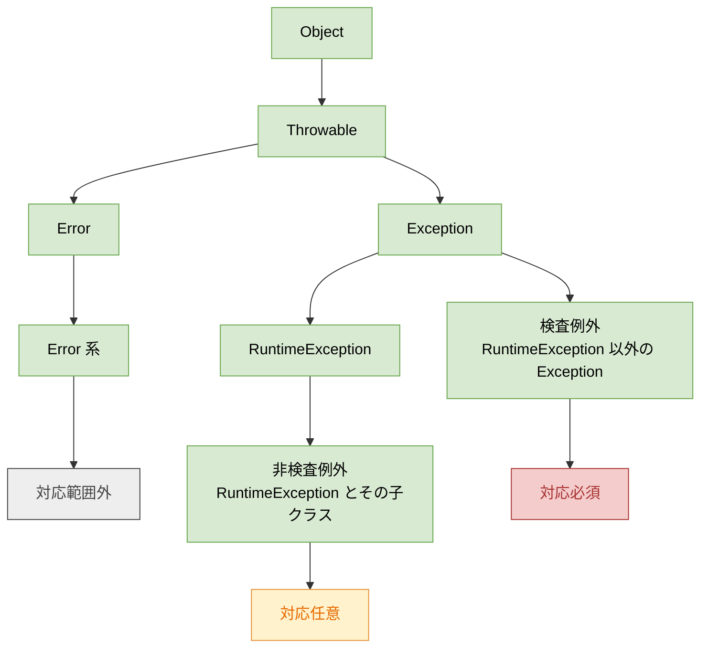
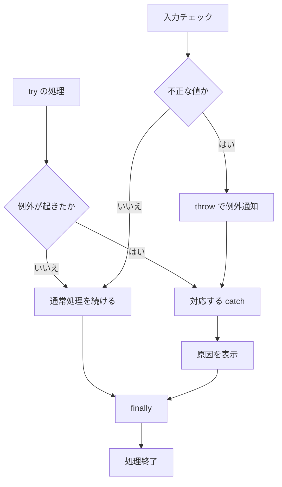

# Java-17 ハンズオン: 例外

## 1. この資料のゴール
- 例外の基本（`try-catch-finally`）を実装できる
- `throw` を使って入力不正を通知できる
- 例外の大まかな分類（Error 系 / 検査例外 / 非検査例外）を説明できる
- 例外を握りつぶさず、原因を表示する習慣を身につける

---

## 2. 事前準備
```bash
cd ~/order-management-springboot/practice/java
java -version
javac -version
```

期待状態:
- `java -version` と `javac -version` の両方で `17` が表示される
- 例: `17.0.x`

---

## 3. 先に覚えるポイント
1. 例外は「通常フローでは処理できない異常」を表す
2. `try` で実行、`catch` で捕捉、`finally` で後処理
3. 不正入力は `throw` で呼び出し元へ通知する
4. 例外は大きく Error 系、検査例外、非検査例外に分けて考える

### 例外クラスの分類


Java で `throw` されたり `catch` されたりする異常は、すべて `Throwable` の仲間です。  
`Throwable` は、大きく `Error` と `Exception` に分かれます。

`Error` 系は、JVM や実行環境レベルの深刻な問題を表します。たとえば、メモリ不足を表す `OutOfMemoryError` や、呼び出しが深くなりすぎたときの `StackOverflowError` があります。通常の業務エラーとして `catch` して回復する対象ではないため、この資料では「対応範囲外」と考えます。

`Exception` 系は、アプリケーションで扱う例外です。`Exception` のうち、`RuntimeException` ではないものを **検査例外**、`RuntimeException` とその子クラスを **非検査例外** として考えます。

| 種類 | 代表例 | コンパイル時の扱い | この資料での考え方 |
| --- | --- | --- | --- |
| Error 系 | `OutOfMemoryError`, `StackOverflowError` | `catch` 必須ではない | 通常はアプリで回復しない |
| 検査例外 | `IOException`, `ClassNotFoundException` | `catch` または `throws` が必要 | 呼び出し側に対応を強制する |
| 非検査例外 | `ArithmeticException`, `NumberFormatException`, `IllegalArgumentException` | `catch` 必須ではない | 入力チェックや事前条件で防ぐことが多い |

この Java-17 本編では、まず非検査例外を中心に扱います。  
検査例外と `throws` の詳しい使い方は、Java-17A 補講で扱います。

### 全体構成図（例外の流れ）


ポイント:
- 例外が起きると、`try` の残り処理は飛ばされて `catch` へ進む
- `finally` は、成功しても失敗しても最後に実行される
- `throw` は、不正な状態を見つけた側から呼び出し元へ知らせる仕組み

### 書式の基本

#### `try-catch-finally`

```java
try {
    int value = 10 / 0;
    System.out.println(value);
} catch (ArithmeticException e) {
    System.out.println("計算エラー: " + e.getMessage());
} finally {
    System.out.println("後処理を実行");
}
```

ポイント:
- `try` には例外が起きる可能性のある処理を書く
- `catch` には捕捉したい例外型を書く
- 例外が発生すると、`try` の残り処理は飛ばされて対応する `catch` が実行される
- `finally` は例外の有無に関係なく最後に実行される

#### 例外オブジェクトから原因を読む

```java
catch (NumberFormatException e) {
    System.out.println(e.getMessage());
}
```

ポイント:
- `e` は発生した例外の情報を持つ変数
- `getMessage()` で原因メッセージを取得できる
- 実務では、入力値や処理名も一緒に出すと原因を追いやすい

#### `throw` で例外を発生させる

```java
static int validateQuantity(int quantity) {
    if (quantity <= 0) {
        throw new IllegalArgumentException("quantity は 1 以上である必要があります");
    }
    return quantity;
}
```

ポイント:
- `throw new 例外型(...)` で意図的に例外を発生させる
- 不正値を見つけた時点で処理を止められる
- 呼び出し側は `try-catch` で受け取って処理できる

---

## 4. ハンズオン

目的:
- 例外の発生・捕捉・再通知を体験する

完了条件:
- `ExceptionDemo.java` で複数の例外ケースを確認できる

作成ファイル: `~/order-management-springboot/practice/java/handson17/ExceptionDemo.java`

### Step 0: 作業フォルダを作る
```bash
mkdir -p ~/order-management-springboot/practice/java/handson17
cd ~/order-management-springboot/practice/java/handson17
```

### Step 1: try-catch-finally を使う
`ExceptionDemo.java` を次の内容で作成:

```java
public class ExceptionDemo { // 例外処理の基本を学ぶクラス
    public static void main(String[] args) {
        try { // 例外が起きる可能性のある処理を囲む
            int value = 10 / 0; // 0 除算で ArithmeticException が発生
            System.out.println(value); // 例外発生時はこの行は実行されない
        } catch (ArithmeticException e) { // 算術例外を捕捉
            System.out.println("計算エラー: " + e.getMessage()); // 原因メッセージを表示
        } finally { // 例外の有無に関係なく最後に実行
            System.out.println("後処理を実行"); // 後処理ログ
        }
    } // main メソッドの終わり
} // クラス定義の終わり
```

実行:
```bash
javac -encoding UTF-8 ExceptionDemo.java
java ExceptionDemo
```

期待出力例:
```text
計算エラー: / by zero
後処理を実行
```


### Step 2: 文字列変換エラーを処理
`ExceptionDemo.java` を次の内容に更新:

```java
public class ExceptionDemo { // 数値変換例外を扱うクラス
    public static void main(String[] args) {
        String input = "abc"; // 数値ではない文字列
        try {
            int quantity = Integer.parseInt(input); // 数値変換（ここで例外が発生）
            System.out.println(quantity); // 例外発生時は実行されない
        } catch (NumberFormatException e) { // 数値変換失敗を捕捉
            System.out.println("入力値が数値ではありません: " + input); // 入力値を含めて表示
        }
    } // main メソッドの終わり
} // クラス定義の終わり
```

実行:
```bash
javac -encoding UTF-8 ExceptionDemo.java
java ExceptionDemo
```

期待出力例:
```text
入力値が数値ではありません: abc
```


### Step 3: throw で不正入力を通知（仕上げ）
`ExceptionDemo.java` を次の内容に更新:

```java
public class ExceptionDemo { // throw による入力検証の例
    static int validateQuantity(int quantity) { // 数量の妥当性を検証するメソッド
        if (quantity <= 0) { // 1 以上でない値は不正
            throw new IllegalArgumentException("quantity は 1 以上である必要があります"); // 呼び出し元へ例外通知
        }
        return quantity; // 妥当ならそのまま返す
    }

    public static void main(String[] args) {
        try {
            int q = validateQuantity(0); // 不正値を渡して例外発生を確認
            System.out.println("数量: " + q); // 例外時は実行されない
        } catch (IllegalArgumentException e) { // 入力不正例外を捕捉
            System.out.println("入力エラー: " + e.getMessage()); // エラーメッセージ表示
        }
    } // main メソッドの終わり
} // クラス定義の終わり
```

実行:
```bash
javac -encoding UTF-8 ExceptionDemo.java
java ExceptionDemo
```

期待出力例:
```text
入力エラー: quantity は 1 以上である必要があります
```


---

## 5. ミニ演習（10分）
Step 3で完成した`ExceptionDemo.java`を基準に、レベル1からレベル3まで順番に進めてください。各レベルは直前の変更を残したまま追記・変更します。

### レベル1（基本）
1. `validateQuantity` を `quantity > 1000` もエラーにする。

期待状態:
- `validateQuantity(1001)` で例外が発生する

### レベル2（拡張）
1. レベル1の`validateQuantity`を残したまま、`validatePrice(int price)`を追加して0未満を弾く。

期待状態:
- `validatePrice(-1)` で例外が発生する

### レベル3（実務）
1. レベル1・2で作成した両方の検証メソッドについて、例外メッセージに入力値を含める。

確認対象の出力（抜粋）:
```text
quantity が不正です: 1001
```

---

## 6. つまずきポイント
- 例外を `catch` しないで終了する
  -> 初学段階ではまず `catch` で可視化する
- `catch (Exception e)` の乱用
  -> まずは具体例外を捕まえる
- 例外メッセージが曖昧
  -> どの値が不正かを明示
