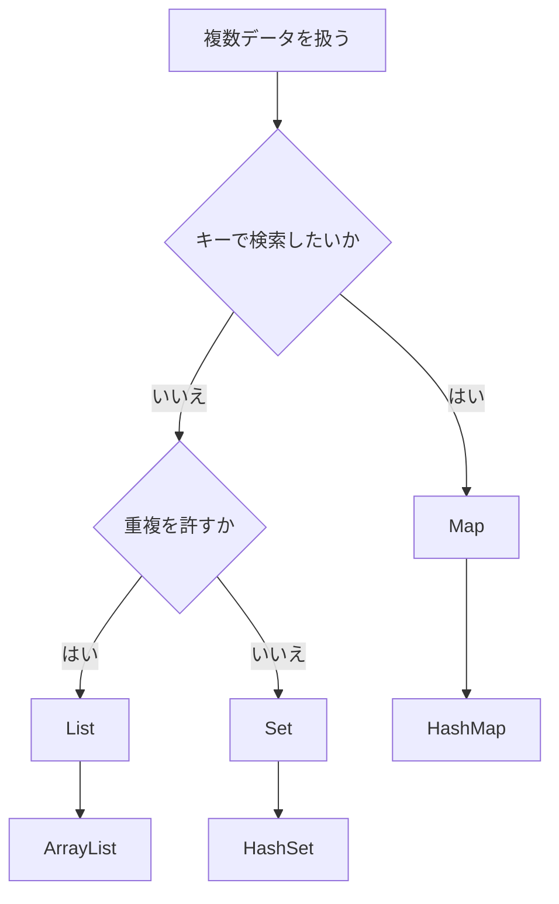

# Java-18 ハンズオン: コレクション（List / Set / Map）

## 1. この資料のゴール
- `List`, `Set`, `Map` の違いを説明できる
- 代表実装（`ArrayList`, `HashSet`, `HashMap`）を使える
- 実務データの保持に適したコレクションを選べる

---

## 2. 事前準備
```bash
cd ~/order-management-springboot/practice/java
java -version
javac -version
```

期待状態:
- `java -version` と `javac -version` の両方で `17` が表示される
- 例: `17.0.x`

---

## 3. 先に覚えるポイント
1. `List`: 順序あり・重複あり
2. `Set`: 重複なし
3. `Map`: キーと値の対応

### 全体構成図（コレクションの選び方）


ポイント:
- 順番を保って同じ値も持ちたいなら `List`
- 重複をなくしたいなら `Set`
- 商品コードなどのキーから値を取り出したいなら `Map`

### 書式の基本

#### `List`

```java
import java.util.ArrayList;
import java.util.List;

List<String> productCodes = new ArrayList<>();
productCodes.add("P-001");
productCodes.add("P-002");

System.out.println(productCodes.size());
```

ポイント:
- `List<String>` は文字列を順番に保持するリスト
- `new ArrayList<>()` で代表的な `List` 実装を作る
- `add` で要素を追加する
- `size()` で要素数を取得する

#### 拡張forで走査する

```java
for (String code : productCodes) {
    System.out.println(code);
}
```

ポイント:
- コレクションの要素を先頭から順番に取り出せる
- インデックスが不要なときに読みやすい

#### `Set`

```java
import java.util.HashSet;
import java.util.Set;

Set<String> tags = new HashSet<>();
tags.add("PAID");
tags.add("PAID");
tags.add("URGENT");
```

ポイント:
- `Set` は重複を許可しない
- 同じ値を複数回 `add` しても1件として扱われる
- `HashSet` は代表的な `Set` 実装

#### `Map`

```java
import java.util.HashMap;
import java.util.Map;

Map<String, Integer> stockByCode = new HashMap<>();
stockByCode.put("P-001", 12);

System.out.println(stockByCode.get("P-001"));
System.out.println(stockByCode.containsKey("P-003"));
```

ポイント:
- `Map<String, Integer>` は文字列キーと整数値の対応を保持する
- `put` でキーと値を登録する
- `get` でキーに対応する値を取得する
- `containsKey` でキーの存在を確認する

#### `Map` の全件走査

```java
for (Map.Entry<String, Integer> entry : stockByCode.entrySet()) {
    System.out.println(entry.getKey() + " -> " + entry.getValue());
}
```

ポイント:
- `entrySet()` でキーと値の組を順番に取り出せる
- `getKey()` でキー、`getValue()` で値を取得する

---

## 4. ハンズオン

目的:
- 実務で頻出のコレクションを使い分ける

完了条件:
- `CollectionDemo.java` で `List` / `Set` / `Map` を実行できる

作成ファイル: `~/order-management-springboot/practice/java/handson18/CollectionDemo.java`

### Step 0: 作業フォルダを作る
```bash
mkdir -p ~/order-management-springboot/practice/java/handson18
cd ~/order-management-springboot/practice/java/handson18
```

### Step 1: List を使う
`CollectionDemo.java` を次の内容で作成:

```java
import java.util.ArrayList; // List の代表実装
import java.util.List; // List インターフェース

public class CollectionDemo { // コレクション利用の実行クラス
    public static void main(String[] args) {
        List<String> productCodes = new ArrayList<>(); // 文字列リストを生成
        productCodes.add("P-001"); // 要素追加
        productCodes.add("P-002"); // 要素追加
        productCodes.add("P-002"); // List は重複を許可

        System.out.println("件数: " + productCodes.size()); // 要素数を表示
        for (String code : productCodes) { // 拡張 for で先頭から順に走査
            System.out.println(code); // 各コードを表示
        }
    } // main メソッドの終わり
} // クラス定義の終わり
```

実行:
```bash
javac -encoding UTF-8 CollectionDemo.java
java CollectionDemo
```

期待出力例:
```text
件数: 3
P-001
P-002
P-002
```


### Step 2: Set を使う
`CollectionDemo.java` を次の内容に更新:

```java
import java.util.HashSet; // Set の代表実装
import java.util.Set; // Set インターフェース

public class CollectionDemo { // Set 利用例
    public static void main(String[] args) {
        Set<String> tags = new HashSet<>(); // 文字列セットを生成
        tags.add("PAID"); // 追加
        tags.add("PAID"); // 同じ値を追加しても 1 件として扱われる
        tags.add("URGENT"); // 別値を追加

        System.out.println("件数(重複除去): " + tags.size()); // 重複除去後件数を表示
        System.out.println(tags); // Set 全体を表示
    } // main メソッドの終わり
} // クラス定義の終わり
```

実行:
```bash
javac -encoding UTF-8 CollectionDemo.java
java CollectionDemo
```

期待出力例:
```text
件数(重複除去): 2
[URGENT, PAID]
```


### Step 3: Map を使う（仕上げ）
`CollectionDemo.java` を次の内容に更新:

```java
import java.util.HashMap; // Map の代表実装
import java.util.Map; // Map インターフェース

public class CollectionDemo { // Map 利用例
    public static void main(String[] args) {
        Map<String, Integer> stockByCode = new HashMap<>(); // キー:商品コード、値:在庫数
        stockByCode.put("P-001", 12); // エントリ追加
        stockByCode.put("P-002", 5); // エントリ追加

        System.out.println("P-001 在庫: " + stockByCode.get("P-001")); // キー指定で値取得
        System.out.println("P-003 在庫あり? " + stockByCode.containsKey("P-003")); // キー存在確認

        for (Map.Entry<String, Integer> entry : stockByCode.entrySet()) { // 全エントリを走査
            System.out.println(entry.getKey() + " -> " + entry.getValue()); // キーと値を表示
        }
    } // main メソッドの終わり
} // クラス定義の終わり
```

実行:
```bash
javac -encoding UTF-8 CollectionDemo.java
java CollectionDemo
```

期待出力例:
```text
P-001 在庫: 12
P-003 在庫あり? false
P-001 -> 12
P-002 -> 5
```


---

## 5. ミニ演習（10分）
### レベル1（基本）
1. `List` に商品名を5件追加して表示する。

期待出力例:
```text
Keyboard
Mouse
Monitor
```

### レベル2（拡張）
1. `Set` で重複データが消えることを確認する。

期待状態:
- 同じ値を複数回追加しても、表示される件数は1件分になる

### レベル3（実務）
1. `Map` に `put` で同じキーを入れたときの上書きを確認する。

期待出力例:
```text
P-001 -> 20
```

---

## 6. つまずきポイント
- `import` 漏れでコンパイルエラー
  -> `java.util` の `import` を確認
- `Map.get` が `null`
  -> キー存在確認に `containsKey` を使う
- コレクション選定ミス
  -> 順序・重複・キー検索の要件で選ぶ


