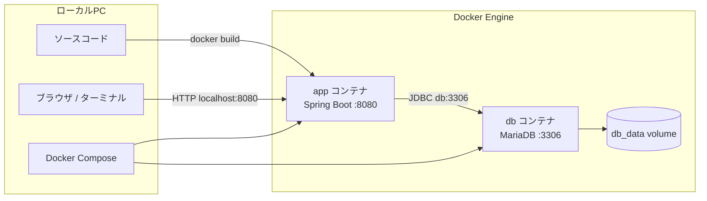
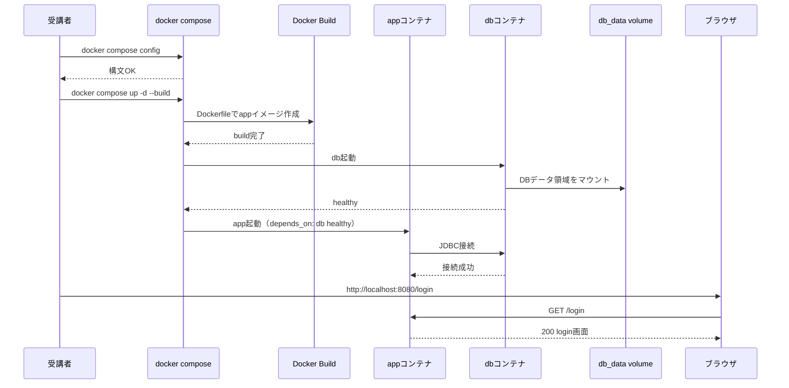
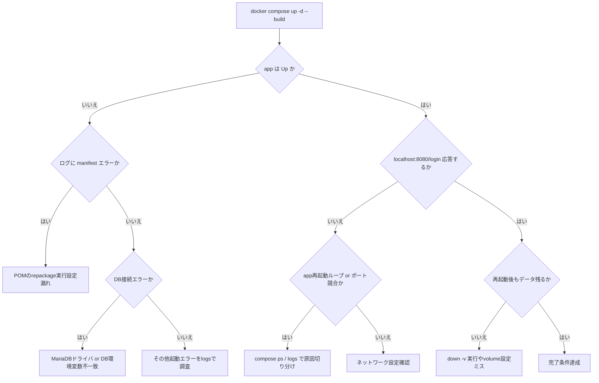

# 環境演習B: Spring Boot コンテナ化（App + MariaDB / Docker Compose）

## 目的
- Lesson7まで完了した `~/order-management-springboot/stages/lesson07` のアプリを、受講生自身でコンテナ化できるようになる
- `app` コンテナ + `db`（MariaDB）コンテナの2コンテナ構成を作成する
- `Dockerfile` / `docker-compose.yml` / `.dockerignore` を自分で作成し、`docker compose up -d` で起動できるようにする
- DBデータを Docker Volume で永続化する

この演習はローカル環境で行います（HTTPSは扱いません）。

## この演習で作るもの
- 構成:
  - `app`（Spring Boot）コンテナ
  - `db`（MariaDB）コンテナ
  - `db_data`（永続化Volume）
- 接続:
  - ブラウザ -> `http://localhost:8080/login`
  - `app` -> `db:3306`（Compose内部ネットワーク）
- 運用要素:
  - `Dockerfile`（マルチステージビルド）
  - `docker-compose.yml`（依存・環境変数・ヘルスチェック）
  - 再起動後もDBデータが残ることの確認

### 全体構成図（コンテナと通信経路）


### 設定受け渡し最小メモ（JSONは未使用）
- この演習は API の JSON ではなく、Compose設定と環境変数で接続情報を渡す。
- 主要な受け渡し:
  - `Dockerfile`（ビルド手順）
  - `docker-compose.yml`（起動構成・依存関係・ポート・環境変数）
  - `DB_URL` / `DB_USER` / `DB_PASSWORD` / `DB_DRIVER`（app -> db接続設定）
  - `db_data` volume（DBデータ永続化）
- 例（Compose環境変数）:
  ```yaml
  DB_URL: jdbc:mariadb://db:3306/attendance?useUnicode=true&characterEncoding=utf8
  DB_USER: attendance_app
  DB_PASSWORD: ${MARIADB_PASSWORD}
  DB_DRIVER: org.mariadb.jdbc.Driver
  ```

### ビルドからログイン画面表示まで（正常系の時系列）


### 起動・疎通の異常系分岐（manifest / DB接続 / ポート競合）


---

## 1. 構成

### 1-1. コンテナ構成
| サービス | 役割 | コンテナ名 | ポート |
|---|---|---|---|
| app | Spring Bootアプリ | `app` | `8080:8080` |
| db | MariaDB | `db` | 外部公開なし（内部3306） |

### 1-2. 接続イメージ
1. ブラウザ -> `http://localhost:8080/login`
2. `app` -> `db:3306`（Compose内部ネットワーク）
3. DBデータは `db_data` volume に永続化

---

## 2. 事前準備（ローカルPC側）

### 2-1. 前提コマンド確認
```bash
docker -v
docker compose version
```

### 2-2. 作業フォルダへ移動
```bash
mkdir -p ~/order-management-springboot/stages/deployment-docker
cp -r ~/order-management-springboot/stages/lesson07/. ~/order-management-springboot/stages/deployment-docker/
cd ~/order-management-springboot/stages/deployment-docker
pwd
ls
```

期待:
- `pom.xml`, `src` が見える
- `Dockerfile`, `docker-compose.yml`, `.dockerignore` はこの環境演習で新規作成する

---

## 3. ファイル作成・編集（受講生作業）

### 3-1. `pom.xml` に MariaDB JDBC ドライバを追加
対象: `~/order-management-springboot/stages/deployment-docker/pom.xml`

次の依存が無い場合だけ `<dependencies>` に追加します。重複追加はしません。

```xml
<dependency>
  <groupId>org.mariadb.jdbc</groupId>
  <artifactId>mariadb-java-client</artifactId>
  <scope>runtime</scope>
</dependency>
```

補足:
- H2依存は残して問題ありません（ローカル学習用）

### 3-2. `Dockerfile` を作成（マルチステージ）
対象: `~/order-management-springboot/stages/deployment-docker/Dockerfile`

```dockerfile
FROM maven:3.9.9-eclipse-temurin-17 AS build
WORKDIR /workspace

COPY pom.xml ./
COPY src ./src

RUN mvn -B clean verify

FROM eclipse-temurin:17-jre
WORKDIR /app

COPY --from=build /workspace/target/attendance-management-0.0.1-SNAPSHOT.jar ./app.jar

EXPOSE 8080
USER 10001
ENTRYPOINT ["java", "-jar", "/app/app.jar"]
```

`ENTRYPOINT` はシェルを介さずJVMを直接起動します。ヒープサイズなどを追加する場合は、Composeの環境変数 `JAVA_TOOL_OPTIONS` を使用します。

### 3-3. `docker-compose.yml` を作成
対象: `~/order-management-springboot/stages/deployment-docker/docker-compose.yml`

```yaml
services:
  db:
    image: mariadb:11.4
    container_name: db
    environment:
      MARIADB_DATABASE: ${MARIADB_DATABASE:-attendance}
      MARIADB_USER: ${MARIADB_USER:-attendance_app}
      MARIADB_PASSWORD: ${MARIADB_PASSWORD:?Set MARIADB_PASSWORD in .env}
      MARIADB_ROOT_PASSWORD: ${MARIADB_ROOT_PASSWORD:?Set MARIADB_ROOT_PASSWORD in .env}
    volumes:
      - db_data:/var/lib/mysql
    healthcheck:
      test: ["CMD-SHELL", "mariadb-admin ping -h 127.0.0.1 -uroot -p$${MARIADB_ROOT_PASSWORD} --silent"]
      interval: 10s
      timeout: 5s
      retries: 10
      start_period: 30s
    restart: unless-stopped

  app:
    build:
      context: .
      dockerfile: Dockerfile
    container_name: app
    depends_on:
      db:
        condition: service_healthy
    ports:
      - "8080:8080"
    environment:
      APP_NAME: attendance-container
      LOG_LEVEL: INFO
      SPRING_PROFILES_ACTIVE: prod
      SERVER_PORT: 8080
      SERVER_ADDRESS: 0.0.0.0
      DB_URL: jdbc:mariadb://db:3306/${MARIADB_DATABASE:-attendance}?useUnicode=true&characterEncoding=utf8
      DB_USER: ${MARIADB_USER:-attendance_app}
      DB_PASSWORD: ${MARIADB_PASSWORD:?Set MARIADB_PASSWORD in .env}
      DB_DRIVER: org.mariadb.jdbc.Driver
      SHOW_SQL: "false"
      # 研修環境だけ初期ユーザーを投入する
      APP_SEED_ENABLED: "true"
      APP_SEED_ADMIN_PASSWORD: ${APP_SEED_ADMIN_PASSWORD:?Set APP_SEED_ADMIN_PASSWORD in .env}
      APP_SEED_USER_PASSWORD: ${APP_SEED_USER_PASSWORD:?Set APP_SEED_USER_PASSWORD in .env}
    read_only: true
    tmpfs:
      - /tmp
    security_opt:
      - no-new-privileges:true
    restart: unless-stopped

volumes:
  db_data:
```

### 3-4. `.dockerignore` を作成

対象: `~/order-management-springboot/stages/deployment-docker/.dockerignore`

```dockerignore
.git
target
data
.env
```

Lesson7で使用したH2ファイルDBをイメージへ含めず、コンテナではMariaDBだけを使用します。

### 3-5. `.env` を作成

`docker-compose.yml` と同じフォルダに `.env` を作成します。実際の値へ置き換え、Gitへコミットしません。

```dotenv
MARIADB_DATABASE=attendance
MARIADB_USER=attendance_app
MARIADB_PASSWORD=replace-with-training-db-password
MARIADB_ROOT_PASSWORD=replace-with-training-root-password
APP_SEED_ADMIN_PASSWORD=replace-with-training-admin-password
APP_SEED_USER_PASSWORD=replace-with-training-user-password
```

---

## 4. ビルド・起動

### 4-1. 構文チェック
```bash
docker compose config
```

### 4-2. イメージビルド + 起動
```bash
docker compose up -d --build
docker compose ps
```

期待:
- `db` が `healthy`
- `app` が `Up`

### 4-3. ログ確認
```bash
docker compose logs -f app
```

---

## 5. 動作確認

### 5-1. HTTP応答確認
```bash
curl -I http://localhost:8080/login
```

### 5-2. ブラウザ確認
`http://localhost:8080/login` を開き、ログイン画面が表示されることを確認。

---

## 6. 永続化確認（重要）

### 6-1. DBデータ作成
画面操作でユーザー追加など、何らかのデータを登録。

### 6-2. コンテナ再作成後も残るか確認
```bash
docker compose down
docker compose up -d
```

再度画面を開き、登録データが残っていれば `db_data` 永続化は成功。

補足:
- `docker compose down -v` は volume を削除するため、データは消えます。

---

## 7. トラブルシュート

### 症状: `app` が `no main manifest attribute` で落ちる
原因:
- 実行可能JARではなく通常JARが作成されている
- POMの `repackage` 実行設定が不足している

確認:
```bash
docker compose logs app
```

対処:
- `pom.xml` の `spring-boot-maven-plugin` に `repackage` execution があることを確認する
- `Dockerfile` のビルドコマンドを `mvn -B clean verify` にする
- `docker compose build --no-cache app` で再ビルド

### 症状: `app` が DB接続エラーで落ちる
原因:
- `pom.xml` に MariaDBドライバ追加漏れ
- `DB_URL` / `DB_USER` / `DB_PASSWORD` の不一致
- `db` が `healthy` になる前に接続している

確認:
```bash
docker compose logs app
docker compose logs db
```

### 症状: `localhost:8080` にアクセスできない
確認:
```bash
docker compose ps
docker compose logs app
```
原因:
- `app` が再起動ループ
- ポート競合（既に8080を別プロセスが使用）

---

## 8. この演習と実運用の差分

この演習は「初学者が確実に動かす」ことを優先しています。  
実運用では次を追加検討します。

1. DBパスワードを平文で持たない（Secret管理）
2. マルチステージの最終イメージをより小さく・脆弱性対策
3. ヘルスチェック強化（アプリの `/actuator/health` など）
4. 監視・アラート・バックアップ
5. Kubernetes向けマニフェスト分離（ConfigMap/Secret/Deployment/Service）

---

## 9. 完了条件
- `docker compose up -d --build` で `app` / `db` が起動する
- `http://localhost:8080/login` にアクセスできる
- `db_data` により再起動後もデータが残る
- 主要エラー（manifest/DB接続）を自力で切り分けられる

ここまでできれば、次のKubernetesデプロイ演習に進む準備が整っています。
