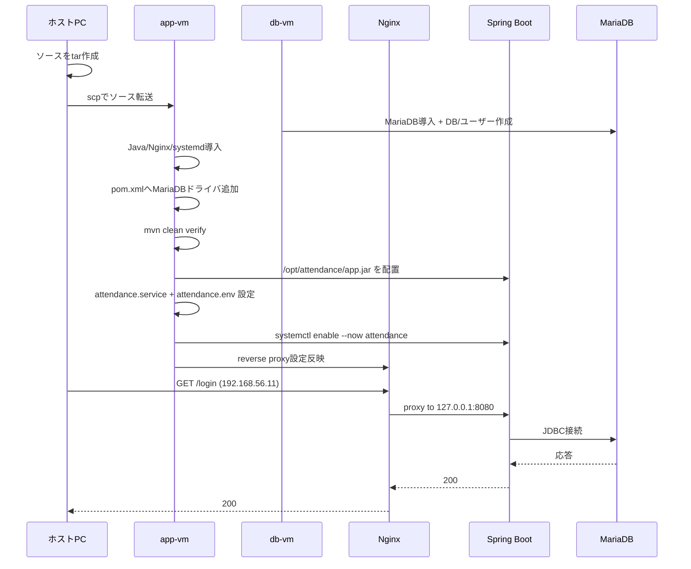
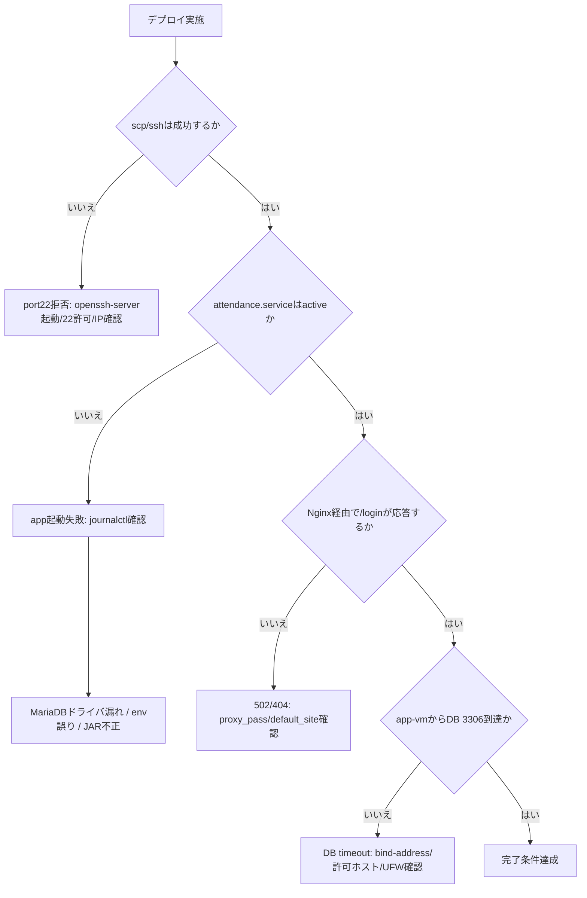

# 環境演習A: Spring Boot 実サーバー移行（VirtualBox 2VM / NAT + Host-Only / MariaDB）

## 目的
- Lesson7まで完了した `~/order-management-springboot/stages/lesson07` を、実サーバー構成に近い形でデプロイする
- Appサーバー1台 + DBサーバー1台（計2台）で疎通し、画面利用できる状態を作る
- 実行方式を `java -jar + systemd` に統一し、常駐運用の基本を体験する

この演習では HTTPS は扱いません（HTTPのみ）。

前提として、受講者は事前研修でVirtualBoxのNATネットワークとHost-Onlyネットワークを構築・確認できる状態とします。この教材ではネットワーク自体の作成手順は扱いません。

## この演習で作るもの
- 構成:
  - `app-vm`（Spring Boot + systemd + Nginx）
  - `db-vm`（MariaDB）
- 接続:
  - ホストPC -> `http://192.168.56.11/login`（Nginx）
  - Nginx -> `127.0.0.1:8080`（Spring Boot）
  - Spring Boot -> `10.0.2.12:3306`（MariaDB）
- 運用要素:
  - `java -jar` 常駐化（systemd）
  - 環境変数ファイルでDB接続設定を注入
  - 疎通テストとトラブルシュート

### 全体構成図（サーバーと通信経路）
```mermaid
flowchart LR
  subgraph HOST[ホストPC]
    DEV[ブラウザ / ターミナル]
    SRC[ソースアーカイブ]
  end

  subgraph APP[app-vm]
    NGINX[Nginx :80]
    SPRING[Spring Boot app.jar :8080]
    SD[systemd attendance.service]
    ENV[/etc/attendance/attendance.env]
    APPSRC[/opt/attendance/src]
  end

  subgraph DBVM[db-vm]
    MDB[(MariaDB :3306)]
  end

  DEV -->|HTTP Host-Only 192.168.56.11| NGINX
  NGINX -->|proxy_pass 127.0.0.1:8080| SPRING
  SPRING -->|JDBC 10.0.2.12:3306| MDB

  SRC -->|scp / ssh| APPSRC
  APPSRC -->|mvn package repackage| SPRING
  SD -->|ExecStart java -jar| SPRING
  ENV --> SD
```

### 設定受け渡し最小メモ（JSONは未使用）
- この演習では API の JSON ではなく、OS設定ファイルと環境変数で値を渡す。
- 主要な受け渡し:
  - `application-*.yml`（アプリ設定）
  - `/etc/attendance/attendance.env`（実行時の上書き値）
  - `attendance.service`（起動コマンドと環境ファイルの紐付け）
  - Nginx 設定（外部公開とリバースプロキシ）
- 例（`attendance.env`）:
  ```ini
  SPRING_PROFILES_ACTIVE=prod
  DB_URL=jdbc:mariadb://10.0.2.12:3306/attendance
  DB_USER=attendance_app
  DB_PASSWORD=<研修ごとに設定したDBパスワード>
  ```

### デプロイから画面表示まで（正常系の時系列）


### デプロイと疎通の異常系分岐（Connection refused / 502 / DB timeout）


---

## 1. 構成

NATネットワーク: `10.0.2.0/24`  
Host-Onlyネットワーク（app-vmアクセス用）: `192.168.56.0/24`

### 1-1. サーバー構成（固定IP）
例として次の値で進めます（必要なら置き換えてください）。

| サーバー | 役割 | OS | NAT IP | Host-Only IP |
|---|---|---|---|---|
| app-vm | Spring Boot + Nginx | Ubuntu 22.04 | `10.0.2.11` | `192.168.56.11` |
| db-vm | MariaDB | Ubuntu 22.04 | `10.0.2.12` | - |

### 1-2. 接続イメージ
1. ブラウザ（ホストPC） -> app-vm（192.168.56.11）の Nginx（80）
2. Nginx -> Spring Boot（127.0.0.1:8080）
3. Spring Boot -> db-vm の MariaDB（10.0.2.12:3306）

### 1-3. VirtualBoxアダプター設定
この演習ではポートフォワーディングは使用しません。

app-vm:
- アダプター1: NATネットワーク（`10.0.2.0/24`）
- アダプター2: ホストオンリーアダプター（`192.168.56.0/24`）

db-vm:
- アダプター1: NATネットワーク（`10.0.2.0/24`）

### 1-4. Ubuntu側の固定IP設定

最初に各VMのコンソールでインターフェース名を確認します。

```bash
ip -br link
ip -br addr
ip route
ls /etc/netplan
```

以下の `enp0s3` / `enp0s8` は例です。実際に表示された名前へ置き換えてください。

app-vmの `/etc/netplan/99-attendance.yaml`:

```yaml
network:
  version: 2
  ethernets:
    enp0s3:
      dhcp4: false
      addresses: [10.0.2.11/24]
      routes:
        - to: default
          via: 10.0.2.1
      nameservers:
        addresses: [1.1.1.1, 8.8.8.8]
    enp0s8:
      dhcp4: false
      addresses: [192.168.56.11/24]
```

db-vmの `/etc/netplan/99-attendance.yaml`:

```yaml
network:
  version: 2
  ethernets:
    enp0s3:
      dhcp4: false
      addresses: [10.0.2.12/24]
      routes:
        - to: default
          via: 10.0.2.1
      nameservers:
        addresses: [1.1.1.1, 8.8.8.8]
```

各VMのコンソールで適用します。SSH接続中ではなく、VirtualBoxコンソールから実行してください。

```bash
sudo netplan generate
sudo netplan try
sudo netplan apply
ip -br addr
```

相互疎通を確認します。

```bash
# app-vmから
ping -c 3 10.0.2.12

# ホストPCから
ping 192.168.56.11
```

---

## 2. 事前準備（ローカルPC側 / コード変更なし）

### 2-1. ソースコードを固める
Lesson7の完成物を環境演習専用フォルダへ複製します。
Lesson7本体は変更せず、環境演習側だけを app-vm へ転送します。

```bash
mkdir -p ~/order-management-springboot/stages/deployment-vm
cp -r ~/order-management-springboot/stages/lesson07/. ~/order-management-springboot/stages/deployment-vm/
cd ~/order-management-springboot/stages/deployment-vm
tar --exclude='.git' --exclude='target' --exclude='data' -czf /tmp/attendance-src.tar.gz .
ls -lh /tmp/attendance-src.tar.gz
```

### 2-2. app-vmへソース転送
```bash
scp -o PubkeyAuthentication=no -o PreferredAuthentications=password /tmp/attendance-src.tar.gz test@192.168.56.11:/tmp/attendance-src.tar.gz
```

### 2-3. 転送前チェック（Connection refused 対策）
`ssh: connect to host ... port 22: Connection refused` が出る場合、app-vm 側で SSH サービスが未起動です。  
先に app-vm コンソールで以下を実施してください。

```bash
ip -4 addr
sudo apt update
sudo apt install -y openssh-server
sudo systemctl enable --now ssh
sudo systemctl status ssh --no-pager
sudo ss -ltnp | grep :22
```

その後、ホストPCから再試行:

```bash
ssh -o PubkeyAuthentication=no -o PreferredAuthentications=password test@192.168.56.11
scp -o PubkeyAuthentication=no -o PreferredAuthentications=password /tmp/attendance-src.tar.gz test@192.168.56.11:/tmp/attendance-src.tar.gz
```

補足:
- MariaDBドライバ追加は app-vm 側で、コピーした `pom.xml` を直接編集して対応します
- ローカルPC側の `pom.xml` は編集しません（Git管理対象を汚さない）

---

## 3. DBサーバー（db-vm）構築

### 3-1. MariaDBインストール
```bash
sudo apt update
sudo apt install -y mariadb-server
sudo systemctl enable --now mariadb
```

### 3-2. 初期セットアップ
```bash
sudo mysql_secure_installation
```

対話プロンプトの推奨回答（この演習向け）:
1. `Enter current password for root (enter for none):` -> `Enter`（空でOK）
2. `Switch to unix_socket authentication` -> `Y`
3. `Change the root password?` -> `N`
4. `Remove anonymous users?` -> `Y`
5. `Disallow root login remotely?` -> `Y`
6. `Remove test database and access to it?` -> `Y`
7. `Reload privilege tables now?` -> `Y`

補足:
- root は `sudo mysql` で管理操作できるため、演習では root パスワード変更は必須ではありません。
- アプリ接続は後続手順で作成する `attendance_app` を使用します。

### 3-3. データベースとアプリ用ユーザー作成
```bash
sudo mysql <<'SQL'
CREATE DATABASE attendance
  CHARACTER SET utf8mb4
  COLLATE utf8mb4_unicode_ci;

CREATE USER 'attendance_app'@'10.0.2.11' IDENTIFIED BY '<研修ごとに設定したDBパスワード>';
GRANT ALL PRIVILEGES ON attendance.* TO 'attendance_app'@'10.0.2.11';
FLUSH PRIVILEGES;
SQL
```

### 3-4. リモート接続許可（app-vmから）
`/etc/mysql/mariadb.conf.d/50-server.cnf` の `bind-address` をDB用IPだけに変更:

```cnf
bind-address = 10.0.2.12
```

反映:
```bash
sudo systemctl restart mariadb
sudo ufw allow from 10.0.2.11 to any port 3306 proto tcp
```

---

## 4. アプリサーバー（app-vm）構築

### 4-1. Java/Nginx/クライアント導入
```bash
sudo apt update
sudo apt install -y openjdk-17-jdk-headless maven nginx mariadb-client openssh-server curl
sudo systemctl enable --now ssh
```

### 4-2. 実行ユーザーと配置先作成
```bash
sudo useradd --system --home /opt/attendance --shell /usr/sbin/nologin attendance
sudo mkdir -p /opt/attendance /opt/attendance/src /etc/attendance /var/log/attendance
sudo chown -R attendance:attendance /opt/attendance /var/log/attendance
```

### 4-3. ソース展開
`2-2` で転送したアーカイブを展開:

```bash
sudo tar -xzf /tmp/attendance-src.tar.gz -C /opt/attendance/src
sudo chown -R attendance:attendance /opt/attendance/src
```

### 4-4. app-vm上の `pom.xml` を確認（MariaDBドライバ）
コピー済みソース内の `pom.xml` に MariaDB ドライバがあるか確認します。

```bash
sudo -u attendance nano /opt/attendance/src/pom.xml
```

次が無い場合だけ、`<dependencies>` に追加します。同じ依存を重複記載しません。

```xml
<dependency>
  <groupId>org.mariadb.jdbc</groupId>
  <artifactId>mariadb-java-client</artifactId>
  <scope>runtime</scope>
</dependency>
```

### 4-5. app-vmでJARビルド（deploy用）
```bash
sudo -u attendance -H bash -lc '
cd /opt/attendance/src
mvn clean verify
cp target/attendance-management-0.0.1-SNAPSHOT.jar /opt/attendance/app.jar
'
```

### 4-6. 環境変数ファイル作成
`/etc/attendance/attendance.env` を作成:

```bash
sudo tee /etc/attendance/attendance.env > /dev/null <<'ENV'
SPRING_PROFILES_ACTIVE=prod
APP_NAME=attendance-management
SERVER_PORT=8080
SERVER_ADDRESS=127.0.0.1

DB_URL=jdbc:mariadb://10.0.2.12:3306/attendance?useUnicode=true&characterEncoding=utf8
DB_USER=attendance_app
DB_PASSWORD=<3-3で設定したDBパスワード>
DB_DRIVER=org.mariadb.jdbc.Driver

SHOW_SQL=false
LOG_LEVEL=INFO

# 研修環境で初回ログイン用ユーザーを作る。実運用ではfalseにし、別の管理手順を使う。
APP_SEED_ENABLED=true
APP_SEED_ADMIN_PASSWORD=admin123
APP_SEED_USER_PASSWORD=password
ENV
```

権限設定:
```bash
sudo chown root:attendance /etc/attendance/attendance.env
sudo chmod 640 /etc/attendance/attendance.env
```

### 4-7. systemdユニット作成
`/etc/systemd/system/attendance.service`:

```ini
[Unit]
Description=Attendance Management Application
After=network-online.target
Wants=network-online.target

[Service]
Type=simple
User=attendance
Group=attendance
EnvironmentFile=/etc/attendance/attendance.env
WorkingDirectory=/opt/attendance
ExecStart=/usr/bin/java -jar /opt/attendance/app.jar
SuccessExitStatus=143
Restart=always
RestartSec=5
StandardOutput=append:/var/log/attendance/app.log
StandardError=append:/var/log/attendance/app-error.log
NoNewPrivileges=true
LimitNOFILE=65535

[Install]
WantedBy=multi-user.target
```

反映・起動:
```bash
sudo systemctl daemon-reload
sudo systemctl enable --now attendance
sudo systemctl status attendance --no-pager
```

ログ確認:
```bash
journalctl -u attendance -n 100 --no-pager
tail -n 100 /var/log/attendance/app.log
```

---

## 5. Nginx設定（HTTP）

`/etc/nginx/sites-available/attendance` を作成:

```nginx
server {
    listen 127.0.0.1:80;
    listen 192.168.56.11:80 default_server;
    server_name _;

    location / {
        proxy_pass http://127.0.0.1:8080;
        proxy_set_header Host $host;
        proxy_set_header X-Real-IP $remote_addr;
        proxy_set_header X-Forwarded-For $proxy_add_x_forwarded_for;
        proxy_set_header X-Forwarded-Proto $scheme;
    }
}
```

有効化:
```bash
sudo ln -s /etc/nginx/sites-available/attendance /etc/nginx/sites-enabled/attendance
sudo rm -f /etc/nginx/sites-enabled/default
sudo nginx -t
sudo systemctl restart nginx
```

---

## 6. 動作確認（疎通テスト）

### 6-1. app-vm から
```bash
curl -I http://127.0.0.1:8080/login
curl -I http://127.0.0.1/login
```

### 6-2. app-vm から db-vm 接続確認
```bash
mysql -h 10.0.2.12 -u attendance_app -p attendance -e "SHOW TABLES;"
```

### 6-3. ホストPCから
ブラウザで次を開く:
- `http://192.168.56.11/login`

ログイン確認後、ユーザー管理・勤怠画面が操作できれば完了です。

---

## 7. トラブルシュート

### 症状: アプリが起動しない
確認:
```bash
journalctl -u attendance -n 200 --no-pager
```
よくある原因:
- `/opt/attendance/src/pom.xml` の MariaDBドライバ不足（`org.mariadb.jdbc.Driver`）
- `DB_URL` / `DB_USER` / `DB_PASSWORD` の誤り
- DBサーバー側で 3306 未開放

### 症状: Nginxは起動しているが 502 Bad Gateway
確認:
```bash
sudo systemctl status attendance --no-pager
sudo systemctl status nginx --no-pager
```
原因:
- Spring Boot が 8080 で待受できていない
- `proxy_pass` が誤っている

### 症状: `/opt/attendance/app.jarにメイン・マニフェスト属性がありません`
原因:
- 実行可能JARではなく通常JARを配置している（POMの `repackage` 実行設定漏れ）
- `target/*.jar.original` を誤って `app.jar` に配置している

対処:
```bash
sudo -u attendance -H bash -lc '
cd /opt/attendance/src
mvn clean verify
cp target/attendance-management-0.0.1-SNAPSHOT.jar /opt/attendance/app.jar
'
```

確認:
```bash
unzip -p /opt/attendance/app.jar META-INF/MANIFEST.MF | grep -E "Main-Class|Start-Class"
```

### 症状: `curl -I http://127.0.0.1/login` が 404（Nginx）
原因:
- default サイトが優先されている
- `attendance` サイトが default_server で待受していない

対処:
```bash
sudo ln -sf /etc/nginx/sites-available/attendance /etc/nginx/sites-enabled/attendance
sudo rm -f /etc/nginx/sites-enabled/default
sudo nginx -t
sudo systemctl reload nginx
```

### 症状: DB接続タイムアウト
確認:
```bash
nc -vz 10.0.2.12 3306
```
原因:
- `bind-address` 未変更
- UFWやVirtualBoxネットワーク設定
- 接続元許可（`attendance_app` のホスト範囲）不一致

### 症状: `scp` / `ssh` で `Connection refused`（port 22）
確認（app-vmコンソール）:
```bash
ip -4 addr
sudo systemctl status ssh --no-pager
sudo ss -ltnp | grep :22
sudo ufw status
```
原因:
- `openssh-server` 未インストール
- `ssh` サービス未起動
- Host-Only 側IPが `192.168.56.11` になっていない
- UFWで22/tcpが閉じている

対処:
```bash
sudo apt update
sudo apt install -y openssh-server
sudo systemctl enable --now ssh
sudo ufw allow 22/tcp
```

---

## 8. この演習と実運用の差分

この演習は「初学者向けで確実に動かす」ことを優先しています。  
実運用では次を追加検討してください。

1. DBスキーマ変更管理（Flyway/Liquibase）
2. DBパスワードを平文ファイルで管理しない（Secret管理）
3. HTTPS（証明書運用）
4. バックアップ/リストア手順の整備
5. 監視（メトリクス・アラート）

---

## 9. 完了条件
- app-vm の `attendance` サービスが `active (running)`
- app-vm の Nginx 経由で `/login` が応答
- app-vm -> db-vm の MariaDB接続が成功
- ホストPCから画面を開き、ログイン後に機能操作できる

ここまでできれば、次のコンテナ化/Kubernetes移行に進む準備が整っています。
