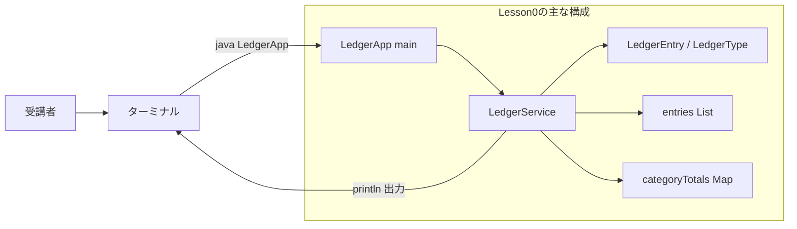
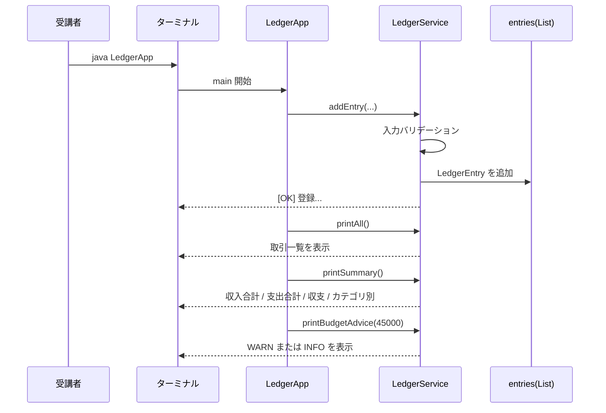
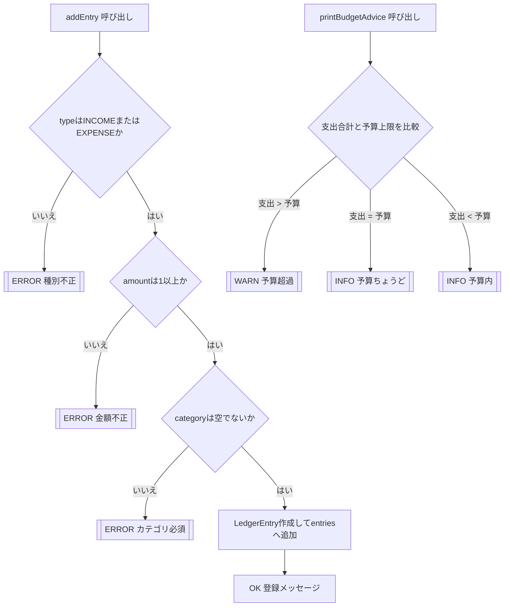

# Lesson0 ミニ制作: 家計簿Lite（コンソール）

## 0. 環境セットアップ
この研修では、Windows上の Git Bash でコマンドを実行し、VS Codeでファイルを編集します。開始前に次のコマンドがすべて成功することを確認してください。

```bash
java -version
javac -version
mvn -version
git --version
```

必須条件:
- Java / `javac`: 17
- Maven: 3.9以上
- Git Bashから `java`, `javac`, `mvn`, `git` を実行できる
- VS Codeでこのリポジトリを開ける

確認ポイント:
- `mvn -version` に表示されるJavaが17である
- 作業場所がこのリポジトリである

```bash
cd ~/order-management-springboot
pwd
ls
```

コマンドが見つからない場合は、推測でインストールをやり直す前に配置を確認します。

```bash
echo "$JAVA_HOME"
which java
which javac
which mvn
which git
```

- Javaのバージョンが違う場合: `JAVA_HOME` と `PATH` がJava 17を指しているか確認する
- Mavenだけ見つからない場合: Mavenの `bin` が `PATH` に含まれているか確認する
- `~/order-management-springboot` が存在しない場合: 講師から指定された配置先を確認する

解消できない場合は、上記コマンドの出力を講師へ提示します。環境確認が通るまではLesson1へ進みません。

---

## 1. 目的
`lesson0.md` で学んだ範囲だけで、動くコンソールアプリを作る。

- クラス/メソッド
- `if/else`
- `for`
- `List` / `Map`
- カプセル化 / `enum`

画面（GUI）やDBは使わない。

## 1.5 Lesson0で作るもの（コンソール）
- アプリ入口: `LedgerApp`（`main`）
- 処理: `LedgerService`（登録 / 一覧 / 集計 / 予算チェック）
- データ: `LedgerEntry`（`type` / `category` / `amount` / `memo`）と `LedgerType`
- 動作: サンプル登録 -> バリデーション確認 -> 一覧表示 -> 集計表示 -> 予算チェック

### 全体構成図（ファイルと役割）


### データ受け渡し最小メモ（JSONは未使用）
- このLessonは Web API ではないため JSON は使わない。
- 値の受け渡しは「メソッド引数」と「オブジェクト」で行う。
- 登録時の例:
  ```java
  service.addEntry("EXPENSE", "食費", 18000, "スーパー");
  ```
- 内部で `LedgerEntry` を作成して `entries` に追加する。
- 結果はコンソールへ `System.out.println(...)` で表示する。

### 実行時の時系列（正常系）


### 入力検証と判定の分岐（ERROR/WARN/INFO）


---

## 2. 作業フォルダ
```bash
cd ~/order-management-springboot
mkdir -p practice/lesson00/java/lesson0-console-ledger
cd practice/lesson00/java/lesson0-console-ledger
```

---

## 3. ファイル1: `LedgerType.java`

```java
public enum LedgerType { // 家計簿の取引種別をまとめた型。指定できる値をこの中の値だけに制限する
    INCOME, // 収入を表す種別
    EXPENSE // 支出を表す種別
}
```

文字列のまま種別を保持せず、取り得る値を `enum` で制限します。

---

## 4. ファイル2: `LedgerEntry.java`
`LedgerEntry.java` を作成:

```java
public class LedgerEntry { // 家計簿の取引1件分を表すクラス
    private final LedgerType type; // 収入か支出かを保持する。LedgerTypeなのでINCOME/EXPENSE以外は入らない
    private final String category; // 食費、交通費、給料などの分類名
    private final int amount; // 金額。今回は整数の円として扱う
    private final String memo; // 補足メモ。空の場合は後で「メモなし」に変換する

    // コンストラクタ: LedgerEntryを作る時に必要な値を受け取り、フィールドへ保存する
    LedgerEntry(LedgerType type, String category, int amount, String memo) {
        this.type = type; // 引数typeの値を、このオブジェクトのtypeフィールドへ代入する
        this.category = category; // 引数categoryの値を、このオブジェクトのcategoryフィールドへ代入する
        this.amount = amount; // 引数amountの値を、このオブジェクトのamountフィールドへ代入する
        this.memo = memo; // 引数memoの値を、このオブジェクトのmemoフィールドへ代入する
    }

    LedgerType getType() { // typeを外部から読み取るためのメソッド
        return type; // 保持している収入/支出の種別を返す
    }

    String getCategory() { // categoryを外部から読み取るためのメソッド
        return category; // 保持しているカテゴリ名を返す
    }

    int getAmount() { // amountを外部から読み取るためのメソッド
        return amount; // 保持している金額を返す
    }

    String getMemo() { // memoを外部から読み取るためのメソッド
        return memo; // 保持しているメモを返す
    }
}
```

---

## 5. ファイル3: `LedgerService.java`
`LedgerService.java` を作成:

```java
import java.util.ArrayList; // Listの実体として使う、順番を保持できるコレクション
import java.util.HashMap; // Mapの実体として使う、キーと値の組み合わせを保持できるコレクション
import java.util.List; // 複数のLedgerEntryを順番に保持するための型
import java.util.Map; // カテゴリ別合計のように「名前 -> 金額」を保持するための型

public class LedgerService { // 家計簿データの登録・表示・集計を担当するクラス
    private final List<LedgerEntry> entries = new ArrayList<>(); // 登録された取引を順番に保存するリスト

    // 取引を1件登録するメソッド。文字列や金額を検証してからLedgerEntryを作成する
    void addEntry(String typeText, String category, int amount, String memo) {
        LedgerType type; // 文字列のtypeTextをLedgerTypeへ変換した結果を入れる変数
        try { // valueOfは不正な文字列やnullが来ると例外になるため、try-catchで受け止める
            type = LedgerType.valueOf(typeText); // "INCOME" や "EXPENSE" という文字列をenumへ変換する（valueOfはenum作成時に自動で使用できるメソッドで、typeText に入っている文字列を、LedgerType の値に変換）
        } catch (IllegalArgumentException | NullPointerException e) { // 想定外の種別やnullが渡された場合の処理
            System.out.println("[ERROR] 種別は INCOME または EXPENSE を指定してください"); // エラー理由をコンソールに表示する
            return; // これ以上処理せず、登録を中止する
        }

        if (amount <= 0) { // 金額が0以下なら家計簿データとして扱わない
            System.out.println("[ERROR] 金額は1以上を指定してください"); // 金額エラーを表示する
            return; // 不正なデータなので登録しない
        }

        if (category == null || category.isBlank()) { // カテゴリがnullまたは空白だけなら不正とする
            System.out.println("[ERROR] カテゴリは必須です"); // カテゴリ必須エラーを表示する
            return; // 不正なデータなので登録しない
        }

        LedgerEntry entry = new LedgerEntry(type, category.trim(), amount, normalizeMemo(memo)); // 検証済みの値から取引1件分のオブジェクトを作る
        entries.add(entry); // 作成した取引をリストへ追加する
        System.out.println("[OK] 登録: " + type + " / " + category + " / " + amount); // 登録できたことを表示する
    }

    void printAll() { // 登録済みの取引をすべて表示するメソッド
        System.out.println("=== 取引一覧 ==="); // 一覧表示の見出し
        if (entries.isEmpty()) { // リストが空なら表示する取引がない
            System.out.println("データがありません"); // データなしメッセージを表示する
            return; // 一覧表示を終了する
        }

        int index = 1; // 画面表示用の連番。人が見やすいように1から始める
        for (LedgerEntry entry : entries) { // entriesの中身を1件ずつentryに取り出して処理する
            System.out.println(index + ". " // 連番を表示する
                    + entry.getType() // 収入/支出の種別を表示する
                    + " | "
                    + entry.getCategory() // カテゴリを表示する
                    + " | "
                    + entry.getAmount() // 金額を表示する
                    + "円 | "
                    + entry.getMemo()); // メモを表示する
            index++; // 次の取引を表示する前に連番を1増やす
        }
    }

    void printSummary() { // 収入・支出・カテゴリ別の合計を表示するメソッド
        int incomeTotal = 0; // 収入合計を入れる変数
        int expenseTotal = 0; // 支出合計を入れる変数
        Map<String, Integer> categoryTotals = new HashMap<>(); // キーをカテゴリ名、値を合計金額として保持するMap

        for (LedgerEntry entry : entries) { // 登録済み取引を1件ずつ集計する
            if (entry.getType() == LedgerType.INCOME) { // 種別が収入なら収入合計へ足す
                incomeTotal += entry.getAmount(); // incomeTotal = incomeTotal + 金額 と同じ意味
            } else { // INCOMEではない場合、このLessonではEXPENSEとして扱う
                expenseTotal += entry.getAmount(); // expenseTotal = expenseTotal + 金額 と同じ意味
            }

            String key = entry.getType() + ":" + entry.getCategory(); // 種別とカテゴリを組み合わせてMapのキーにする
            int current = categoryTotals.getOrDefault(key, 0); // 既に合計があれば取得し、なければ0から始める
            categoryTotals.put(key, current + entry.getAmount()); // 今回の金額を足した合計をMapへ保存し直す
        }

        int balance = incomeTotal - expenseTotal; // 収支 = 収入合計 - 支出合計

        System.out.println("=== 集計 ==="); // 集計表示の見出し
        System.out.println("収入合計: " + incomeTotal + "円"); // 収入合計を表示する
        System.out.println("支出合計: " + expenseTotal + "円"); // 支出合計を表示する
        System.out.println("収支: " + balance + "円"); // 収支を表示する

        System.out.println("=== カテゴリ別 ==="); // カテゴリ別表示の見出し
        for (String key : categoryTotals.keySet()) { // Mapに入っているキーを1つずつ取り出す
            System.out.println(key + " -> " + categoryTotals.get(key) + "円"); // キーと合計金額を表示する
        }
    }

    void printBudgetAdvice(int budgetLimit) { // 支出合計が予算内かどうかを表示するメソッド
        int expenseTotal = 0; // 支出合計を入れる変数
        for (LedgerEntry entry : entries) { // 登録済み取引を1件ずつ確認する
            if (entry.getType() == LedgerType.EXPENSE) { // 支出だけを集計対象にする
                expenseTotal += entry.getAmount(); // 支出金額を合計へ足す
            }
        }

        System.out.println("=== 予算チェック ==="); // 予算チェック表示の見出し
        System.out.println("予算上限: " + budgetLimit + "円"); // 引数で受け取った予算上限を表示する
        System.out.println("現在の支出: " + expenseTotal + "円"); // 集計した支出合計を表示する

        if (expenseTotal > budgetLimit) { // 支出が予算を超えている場合
            System.out.println("[WARN] 予算を超えています"); // 警告メッセージを表示する
        } else if (expenseTotal == budgetLimit) { // 支出が予算と同じ場合
            System.out.println("[INFO] 予算ちょうどです"); // ちょうどであることを表示する
        } else { // 支出が予算より少ない場合
            System.out.println("[INFO] 予算内です"); // 予算内であることを表示する
        }
    }

    private String normalizeMemo(String memo) { // メモの未入力を扱いやすい文字列へ整えるメソッド
        if (memo == null || memo.isBlank()) { // メモがnullまたは空白だけの場合
            return "(メモなし)"; // 一覧表示で分かりやすいように固定文言を返す
        }
        return memo.trim(); // 前後の余分な空白を取り除いて返す
    }
}
```

---

## 6. ファイル4: `LedgerApp.java`
`LedgerApp.java` を作成:

```java
public class LedgerApp { // アプリケーションの起動入口を持つクラス
    public static void main(String[] args) { // Java実行時に最初に呼び出されるメソッド
        LedgerService service = new LedgerService(); // 登録・一覧・集計を担当するサービスクラスを作成する

        System.out.println("=== 家計簿Lite (Console) ==="); // アプリ名をコンソールに表示する

        // サンプルデータ登録
        // addEntry(種別, カテゴリ, 金額, メモ) の順番で値を渡す
        service.addEntry("INCOME", "給料", 280000, "3月分"); // 収入データを1件登録する
        service.addEntry("EXPENSE", "食費", 18000, "スーパー"); // 支出データを1件登録する
        service.addEntry("EXPENSE", "交通費", 9000, "定期券"); // 交通費の支出データを登録する
        service.addEntry("EXPENSE", "娯楽", 12000, "映画・書籍"); // 娯楽費の支出データを登録する
        service.addEntry("INCOME", "副業", 30000, "Web制作"); // 副業の収入データを登録する

        // バリデーション動作確認（意図的にエラー）
        service.addEntry("PAY", "不正種別", 1000, "テスト"); // 種別がINCOME/EXPENSEではないためエラーになる
        service.addEntry("EXPENSE", "", 2000, "カテゴリ空"); // カテゴリが空文字のためエラーになる
        service.addEntry("EXPENSE", "食費", -500, "負の金額"); // 金額が0以下のためエラーになる

        // 一覧表示 / 集計表示 / 予算チェック
        service.printAll(); // 登録済みの取引一覧を表示する
        service.printSummary(); // 収入合計・支出合計・カテゴリ別合計を表示する
        service.printBudgetAdvice(45000); // 支出合計が45,000円の予算内か確認する
    }
}
```

---

## 7. コンパイルと実行
```bash
cd ~/order-management-springboot/practice/lesson00/java/lesson0-console-ledger
javac -encoding UTF-8 LedgerType.java LedgerEntry.java LedgerService.java LedgerApp.java
java LedgerApp
```

---

## 8. 完了条件
- 登録メッセージ `[OK]` が表示される
- 不正データで `[ERROR]` が表示される
- 取引一覧が表示される
- `収入合計` `支出合計` `収支` が表示される
- 予算チェックが表示される
- `LedgerEntry` のフィールドが `private final` で、種別が `LedgerType` になっている

---

## 9. 1分拡張（任意）
1. `service.printBudgetAdvice(30000);` に変えて警告表示を確認  
2. `service.addEntry("EXPENSE", "通信費", 7000, "スマホ");` を追加  
3. `カテゴリ別` の出力が増えることを確認
