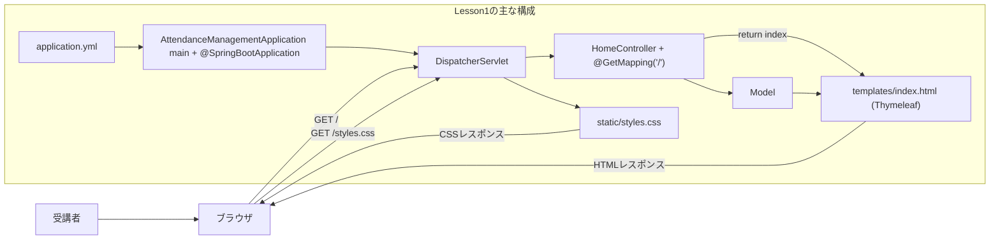
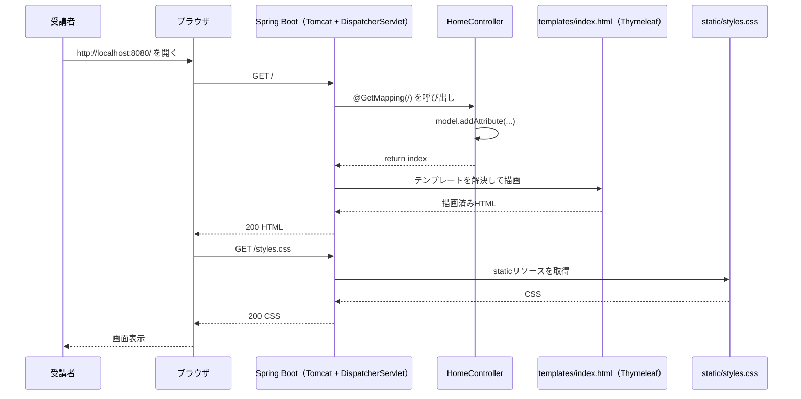
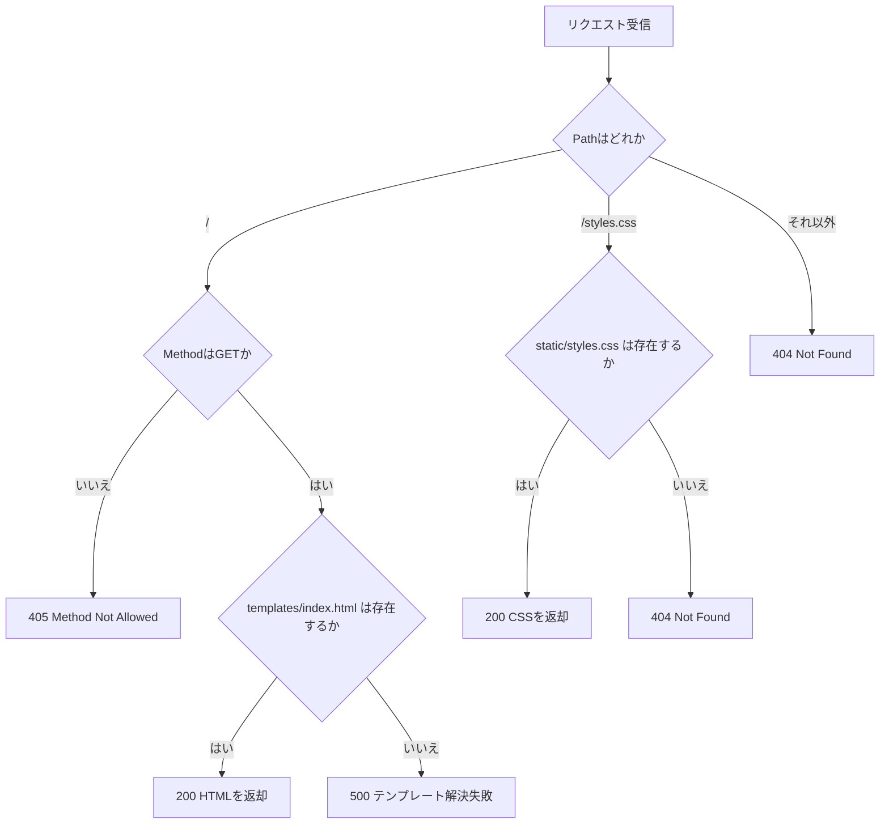
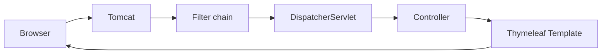

# Lesson1（7/9）最小MVCで画面表示（完成版を自分で作成）

## 目的（Lesson1でできるようになること）
- Spring Boot アプリを「ゼロから」起動できる
- Thymeleafで画面が表示される仕組み（Controller → Template）が分かる

## 前提
今回の受講順（`java-handson` → `lesson00` → `lesson01`）では、以下を満たしていることを前提にします。

- `docs/curriculum/java/java-handson` のSpring Bootへ進む場合の追加必修まで学習済み
- `docs/curriculum/springboot/lesson00/lesson0.md`（コンソール復習）を実施済み
- Java 17 / Maven 3.9+ がインストール済み
- このリポジトリのルートで作業する

標準コースで `web-app(簡易版)` を実施している場合は、次の内容も前提になります。

- `docs/curriculum/web-app(簡易版)` の必修範囲を実施済み
- `docs/curriculum/web-app(簡易版)/bridge-to-springboot.md` を読了済み

バックエンド短縮コースでは、HTML/CSSの実装理解よりもControllerとTemplateの対応確認を優先します。

- `docs/curriculum/springboot/prerequisites/http-thymeleaf-minimum.md` を完了している
- Lesson1のMaven Sandboxを実行し、Maven操作とコンストラクタ注入（DI）を確認している
- HTML/CSSは講師提供コードを使用し、指定された配置場所とControllerとの対応を確認する

## フレームワークとは（初心者向け）
フレームワークは、アプリ開発の「土台セット」です。  
画面表示、Web起動、設定、エラーハンドリングなどの共通処理を先に用意してくれているため、開発者は業務ロジックに集中できます。

イメージ:
- ライブラリ:
  - 必要な部品を自分で呼び出して使う
- フレームワーク:
  - 先に決まった流れ（枠組み）があり、その流れに自分のコードを当てはめる

`web-app(簡易版)` との違い:
- `web-app(簡易版)`:
  - Web起動やレスポンス処理を手作業で実装した
- Lesson1（Spring Boot）:
  - `@Controller` / `@GetMapping` などで必要部分だけを書けば動く

なぜ使うか:
- 同じ種類の設定や定型処理を毎回書かなくてよい
- チームで構成を揃えやすい
- 機能追加や保守を進めやすい

## CoCとは（Convention over Configuration）
CoC は **Convention over Configuration（設定より規約）** の略です。  
「よくある構成は共通ルール（規約）として決めておき、必要な設定を減らす」という考え方です。

Spring Bootでの具体例:
- `src/main/resources/templates` にHTMLを置くと、テンプレート置き場として自動で認識される
- `@Controller` + `@GetMapping("/")` のような規約的な書き方で画面表示までつながる
- `spring-boot-starter-web` を追加すると、Webに必要な主要ライブラリがまとまって入る

`web-app(簡易版)` との比較:
- `web-app(簡易版)`: ルーティングやレスポンス処理、起動設定を手作業で書いた
- Lesson1: 規約に沿って配置・記述すると、設定量を減らして同じ目的を達成できる

## Spring Bootとは（Lesson1開始前に読む）
Spring Bootは、JavaでWebアプリを作るためのSpringの実行基盤です。  
通常は手作業で必要になる設定を減らし、`mvn spring-boot:run` で起動できる状態を短時間で作れます。

### Springとは（用語の整理）
- Spring:
  - Javaアプリ開発を効率化するための技術群（フレームワーク群）
- Spring Framework:
  - Springの中核。DI、Web MVCなどの基盤機能を提供
- Spring Boot:
  - Spring Frameworkを「すぐ起動できる形」にまとめた仕組み
  - 設定の自動化（Auto Configuration）で初期構築を簡略化
- Spring MVC:
  - Web機能の一部。`@Controller` や `@GetMapping` でURLと処理を結び付ける

関係イメージ:
- Spring（全体）
- Spring Framework（中核）
- Spring Boot（起動・設定を簡単にする）
- Spring MVC（Web画面/HTTPを扱う機能）

Lesson1では、以下の最小構成を体験します。
- `Controller`:
  - URLリクエストを受け取り、画面に渡すデータを用意する
- `Template`（Thymeleaf）:
  - `Controller`から受け取ったデータをHTMLに埋め込んで表示する
- `Application`:
  - Spring Bootアプリの起動エントリポイント（`main`メソッド）

この研修の目的は、Java文法を深掘りすることではなく、後続のDocker/CI/CD/K8sで扱う「動くアプリ土台」を作ることです。  
そのためLesson1は、最小の構成で起動と画面表示に集中します。

## Lesson1で作るもの（最小MVC）
- 画面: `/`（「勤怠管理システム（MVP）」を表示するトップ画面、表示のみ）
- 機能: まだ出勤/退勤はしない（Lesson2から）

### 全体構成図（ファイルと役割）


### 値受け渡し最小メモ（JSONはLesson1では未使用）
- このLessonでは `fetch` や JSON API はまだ使わない。
- Controller から Template へは `Model`（キーと値）で渡す。
- `web-app(簡易版)` ではブラウザのJavaScriptが `fetch` でJSON APIを呼び、DOMを更新した。
- Spring Boot Lesson1〜5では、まずSpring MVCの基本を理解するため、サーバー側でHTMLを作る `Controller + Model + Thymeleaf` を使う。
- JSON APIは後続の `lesson06` で `@RestController` として扱う。
- 例:
  ```java
  model.addAttribute("statusLabel", "未出勤");
  return "index";
  ```
- 受け取り側（Template）:
  ```html
  <span th:text="${statusLabel}">未出勤</span>
  ```
- `"statusLabel"` というキー名と `${statusLabel}` が一致しているため、Controllerで入れた値がHTMLに表示される。

### 画面表示までの時系列（正常系）


### ルーティングと異常系の分岐（404/405/500）


---

## 0. 事前確認（環境セットアップはspringboot/lesson00）
環境セットアップ手順は `~/order-management-springboot/docs/curriculum/springboot/lesson00/lesson0.md` の「0. 環境セットアップ」で実施します。  
Lesson1開始前に、以下だけ確認してください。

```bash
java -version
mvn -version
git --version
```

3つともエラーなしで表示されれば Lesson1 を開始できます。

---

## 1. Maven超入門（最初に読む）
Lesson1で使う `mvn` は、Javaプロジェクトの「依存関係管理」と「ビルド自動化」を行うツールです。

### Mavenがやっていること（最重要）
- 依存関係管理:
  - `pom.xml` に必要ライブラリを書くと、取得とバージョン整合を自動化できる
- ビルド自動化:
  - コンパイル、リソース配置、テスト、成果物作成をコマンドで実行できる
- 実行補助:
  - `spring-boot-maven-plugin` を通じて `mvn spring-boot:run` で起動できる

### 用語ミニ辞典
- `pom.xml`:
  - Mavenが読む設定ファイル（依存、Javaバージョン、プラグインなどを定義）
- dependency（依存）:
  - アプリが利用する外部ライブラリ
- plugin（プラグイン）:
  - Mavenに機能を追加する部品
- `target`:
  - ビルド成果物の出力先フォルダ（コンパイル結果や各種中間ファイル）
- `~/.m2/repository`:
  - ダウンロード済み依存ライブラリのローカル保存先

### `mvn spring-boot:run` で起きること
1. `pom.xml` を読み込む
2. 必要な依存を解決する
3. Javaコードをコンパイルする（`.java` -> `.class`）
4. `src/main/resources` を `target/classes` に配置する
5. Spring Bootアプリを起動する

### ビルドとコンパイルの違い
- コンパイル:
  - Javaソースをバイトコード（`.class`）へ変換する工程
- ビルド:
  - 依存解決、コンパイル、テスト、成果物作成まで含む一連の工程
- 関係:
  - コンパイルはビルドの一部

### テストとは何をするか
- `mvn test` は `src/test/java` のテストコードを実行し、期待結果と実際結果を比較する
- テスト失敗時はビルド失敗として扱われる
- Lesson1時点ではテストコード未作成のため、実行対象はほぼない

### Lesson1で最低限使うコマンド
- `mvn -version`: Mavenが使えるか確認
- `mvn clean`: `target` を削除して作業状態を初期化
- `mvn spring-boot:run`: 依存解決・コンパイル後にアプリ起動
- `mvn test`: （必要時）テスト実行
- `mvn package`: （必要時）jarを作成

---

## 2. `mvn`コマンドを先に体験（コード変更なし）
まず、どのフォルダで実行しているかを確認する習慣を付けます。

```bash
pwd
```

この時点では、まだ `~/order-management-springboot/stages/lesson01` を作っていないため `pom.xml` はありません。  
`mvn -version` だけ先に実行して、Maven自体が動くことを確認します。

```bash
mvn -version
```

---

## 3. 作業フォルダ
Lesson1は `~/order-management-springboot/stages/lesson01` に **自分でコードを作成** します。  
まずこのフォルダを作成し、このフォルダの中で以降の作業を行ってください。

```bash
mkdir -p ~/order-management-springboot/stages/lesson01
cd ~/order-management-springboot/stages/lesson01
```

以降の `作成ファイル` は、`~/order-management-springboot` からのフルパスで表記します。  
例: `~/order-management-springboot/stages/lesson01/pom.xml`

### VS Codeでフォルダを開く（GUI）
1. VS Code を起動
2. `ファイル` → `フォルダーを開く`  
3. `~/order-management-springboot/stages/lesson01` を選択  
   - フォルダが無い場合は、エクスプローラーで `~/order-management-springboot/stages/lesson01` を作成してから開く

---

## 4. ディレクトリ構成を作成
```bash
mkdir -p ~/order-management-springboot/stages/lesson01/src/main/java/com/shinesoft/attendance
mkdir -p ~/order-management-springboot/stages/lesson01/src/main/java/com/shinesoft/attendance/web
mkdir -p ~/order-management-springboot/stages/lesson01/src/main/resources/templates
mkdir -p ~/order-management-springboot/stages/lesson01/src/main/resources/static
```

### VS Codeでディレクトリを作る（GUI）
1. 左側のエクスプローラーで `src` を右クリック → `新しいフォルダー`
2. 以下を順に作成  
   - `~/order-management-springboot/stages/lesson01/src/main/java/com/shinesoft/attendance`  
   - `~/order-management-springboot/stages/lesson01/src/main/java/com/shinesoft/attendance/web`  
   - `~/order-management-springboot/stages/lesson01/src/main/resources/templates`  
   - `~/order-management-springboot/stages/lesson01/src/main/resources/static`

---

## 5. `pom.xml` を作成（Maven設定）
作成ファイル: `~/order-management-springboot/stages/lesson01/pom.xml`

この `pom.xml` は、次の4ブロックに分けて読みます。

1. プロジェクト識別情報: このアプリの名前とバージョン
2. 共通設定: Javaバージョンや文字コードなど、複数箇所で使う値
3. 依存関係: このアプリで使う外部ライブラリ
4. ビルド設定: コンパイルや起動用Jar作成の方法

```xml
<project xmlns="http://maven.apache.org/POM/4.0.0"
         xmlns:xsi="http://www.w3.org/2001/XMLSchema-instance"
         xsi:schemaLocation="http://maven.apache.org/POM/4.0.0
                             http://maven.apache.org/xsd/maven-4.0.0.xsd"> <!-- Maven用XMLの定型。今日は編集しない -->
  <modelVersion>4.0.0</modelVersion> <!-- pom.xml自体の形式バージョン。Mavenでは通常4.0.0を使う -->

  <!-- 1. プロジェクト識別情報: Mavenがこのアプリを区別するための名前 -->
  <groupId>com.shinesoft</groupId> <!-- 組織や会社を表すID。Javaのpackage名と同じくドメイン逆順が多い -->
  <artifactId>attendance-management</artifactId> <!-- アプリ/成果物の名前。jarファイル名にも使われる -->
  <version>0.0.1-SNAPSHOT</version> <!-- アプリのバージョン。SNAPSHOTは開発中という意味 -->
  <name>attendance-management</name> <!-- Mavenやログ上で表示されるプロジェクト名 -->
  <description>Attendance Management MVP</description> <!-- プロジェクトの説明。起動動作にはほぼ影響しない -->

  <!-- 2. 共通設定: このpom.xml内で何度も使う値をまとめる -->
  <properties>
    <java.version>17</java.version> <!-- この研修で使うJavaのバージョン -->
    <spring-boot.version>3.5.15</spring-boot.version> <!-- Spring Boot関連ライブラリの基準バージョン -->
    <project.build.sourceEncoding>UTF-8</project.build.sourceEncoding> <!-- ソースやリソースをUTF-8として扱う -->
    <project.reporting.outputEncoding>UTF-8</project.reporting.outputEncoding> <!-- Mavenレポート出力もUTF-8として扱う -->
    <maven.compiler.encoding>UTF-8</maven.compiler.encoding> <!-- Javaコンパイル時のソース文字コード -->
    <maven.compiler.release>${java.version}</maven.compiler.release> <!-- Java 17向けの.classを作る。上のjava.versionを再利用 -->
  </properties>

  <!-- 3-1. 依存関係のバージョン表: Spring Boot推奨の組み合わせを取り込む -->
  <dependencyManagement> <!-- バージョン管理用。ここに書いただけではライブラリは追加されない -->
    <dependencies>
      <dependency>
        <groupId>org.springframework.boot</groupId>
        <artifactId>spring-boot-dependencies</artifactId>
        <version>${spring-boot.version}</version> <!-- propertiesで決めたSpring Bootバージョンを使う -->
        <type>pom</type> <!-- jarではなく、依存関係の一覧表として読む -->
        <scope>import</scope> <!-- Spring Boot推奨のバージョン表を取り込む -->
      </dependency>
    </dependencies>
  </dependencyManagement>

  <!-- 3-2. 実際に使うライブラリ: このアプリに必要な機能を追加する -->
  <dependencies>
    <dependency> <!-- Webアプリに必要なSpring MVC/Tomcat/JSON変換などをまとめて追加 -->
      <groupId>org.springframework.boot</groupId>
      <artifactId>spring-boot-starter-web</artifactId>
    </dependency>
    <dependency> <!-- HTMLテンプレートThymeleafを使うために追加 -->
      <groupId>org.springframework.boot</groupId>
      <artifactId>spring-boot-starter-thymeleaf</artifactId>
    </dependency>
  </dependencies>

  <!-- 4. ビルド設定: コンパイルやSpring Boot起動に使うMaven拡張 -->
  <build>
    <plugins>
      <plugin> <!-- mvn spring-boot:run や実行可能jar作成を使えるようにする -->
        <groupId>org.springframework.boot</groupId>
        <artifactId>spring-boot-maven-plugin</artifactId>
        <version>${spring-boot.version}</version>
        <executions> <!-- mvn package時に追加で実行する処理 -->
          <execution>
            <goals>
              <goal>repackage</goal> <!-- java -jarで起動できるSpring Boot用jarへ作り直す -->
            </goals>
          </execution>
        </executions>
      </plugin>
      <plugin> <!-- Javaをどのバージョン・文字コードでコンパイルするかを決める -->
        <groupId>org.apache.maven.plugins</groupId>
        <artifactId>maven-compiler-plugin</artifactId>
        <version>3.13.0</version>
        <configuration>
          <release>${maven.compiler.release}</release> <!-- Java 17向けにコンパイル -->
          <encoding>${maven.compiler.encoding}</encoding> <!-- ソース文字コード -->
        </configuration>
      </plugin>
    </plugins>
  </build>
</project>
```

理解ポイント（10分）:
- このファイルの役割:
  - Mavenがプロジェクトをビルド/起動するための設定ファイル
- 今日見るキーワード:
  - `<dependencies>`（使うライブラリ）
  - `spring-boot-starter-web`（Web機能）
  - `spring-boot-starter-thymeleaf`（画面テンプレート機能）
- まず見る場所:
  - `<groupId>`, `<artifactId>`, `<version>`（プロジェクト識別）
  - `<dependencies>`（必要機能の宣言）
  - `spring-boot-maven-plugin`（起動と実行可能Jar作成）
  - `repackage` を `package` に結び付け、`java -jar` で起動できるJarを作る
- 講義用説明:

  | 項目 | 初学者向け説明 |
  |---|---|
  | `groupId` / `artifactId` / `version` | Maven上でこのプロジェクトを識別する3点セット |
  | `properties` | バージョンや文字コードなど、共通で使う値の置き場 |
  | `dependencyManagement` | ライブラリのバージョン表を取り込む場所。ここだけではライブラリは使われない |
  | `dependencies` | 実際に使うライブラリを書く場所 |
  | `spring-boot-starter-web` | Web画面やHTTPを扱うためのセット |
  | `spring-boot-starter-thymeleaf` | HTMLテンプレートを使うためのセット |
  | `spring-boot-maven-plugin` | Spring Bootアプリを起動・jar化するためのMaven拡張 |
  | `maven-compiler-plugin` | Javaをどのバージョンとしてコンパイルするかを決める設定 |

- 変更メモ（12.5でまとめて実施）:
  - `<description>` を任意の文字列に変更し、起動できることを確認
- よくあるミス:
  - XMLタグの閉じ忘れでビルド失敗
  - `<dependency>` の入れ子崩れで依存解決失敗

---

## 6. `application.yml` を作成
このファイルを作る理由（最初に把握）:
- コードを書き換えずに、アプリの動作設定（ポート・ログレベル・表示名など）を変更できるため
- 環境変数を使って、実行環境ごとに値を切り替えやすくするため
- 設定値を1か所に集約し、保守しやすくするため

作成ファイル: `~/order-management-springboot/stages/lesson01/src/main/resources/application.yml`

```yaml
spring: # Spring Framework全体の設定
  application:
    name: ${APP_NAME:attendance-management} # ${環境変数:デフォルト値}。APP_NAME未設定ならattendance-management
  thymeleaf:
    cache: false # テンプレートキャッシュ無効（学習中はHTML変更を反映しやすい）

server: # 組み込みWebサーバー（Tomcat）の設定
  port: ${SERVER_PORT:8080} # 待受ポート。SERVER_PORT未設定なら8080

logging: # ログ出力設定
  level:
    root: ${LOG_LEVEL:INFO} # アプリ全体(root)のログレベル（INFO/DEBUG/WARN/ERROR など）

app: # 独自設定（spring配下ではない任意キー）
  name: ${APP_NAME:attendance-management} # 画面表示などで使うアプリ名
```

理解ポイント（5分）:
- このファイルの役割:
  - アプリの設定値をまとめるファイル
- 今日見るキーワード:
  - `server.port`（待受ポート）
  - `spring.application.name`（アプリ名）
  - `logging.level.root`（ログ出力レベル）
- まず見る場所:
  - `server.port: ${SERVER_PORT:8080}`（環境変数未指定時は8080）
  - `app.name: ${APP_NAME:attendance-management}`（画面表示などで利用可能）
- 変更メモ（12.5でまとめて実施）:
  - `server.port` のデフォルトを `8081` に変更して起動確認
- よくあるミス:
  - YAMLのインデントずれ（スペース数不一致）
  - `:` の前後を崩して起動失敗

---

## 7. Applicationクラスを作成
このファイルを作る理由（最初に把握）:
- Spring Bootアプリを起動する「入口（エントリポイント）」を明示するため
- `@SpringBootApplication` により、自動設定やコンポーネントスキャンを有効化するため
- `mvn spring-boot:run` や jar実行時に、どのクラスから起動するかを決めるため

作成ファイル: `~/order-management-springboot/stages/lesson01/src/main/java/com/shinesoft/attendance/AttendanceManagementApplication.java`

```java
package com.shinesoft.attendance; // パッケージ宣言（配置フォルダと一致させる）

import org.springframework.boot.SpringApplication; // Spring Boot起動クラス
import org.springframework.boot.autoconfigure.SpringBootApplication; // 起点アノテーション

@SpringBootApplication // 設定クラス + コンポーネントスキャン + 自動設定を有効化
public class AttendanceManagementApplication {
    public static void main(String[] args) { // Java実行時の開始地点（エントリポイント）
        SpringApplication.run(AttendanceManagementApplication.class, args); // 起動クラスと引数を渡してアプリ起動
    }
}
```

ポイント:
- `@SpringBootApplication` が起点
- `main` から Spring Boot を起動する

理解ポイント（5分）:
- このファイルの役割:
  - Java実行時の「開始地点」
- 今日見るキーワード:
  - `@SpringBootApplication`
  - `SpringApplication.run(...)`
  - `main(String[] args)`
- 変更メモ（12.5でまとめて実施）:
  - クラス名を変えずに `main` の中へ `System.out.println("start");` を追加し、起動時に表示されることを確認
- よくあるミス:
  - ファイル名とクラス名の不一致
  - `package` 宣言と配置パスの不一致

---

## 8. Controllerを作成
作成ファイル: `~/order-management-springboot/stages/lesson01/src/main/java/com/shinesoft/attendance/web/HomeController.java`

```java
package com.shinesoft.attendance.web; // `web` は画面/HTTPリクエストを扱う層

import java.time.LocalDate; // 今日の日付を扱うJava標準クラス

import org.springframework.stereotype.Controller; // 画面表示用Controllerを示す
import org.springframework.ui.Model; // Controllerからテンプレートへ値を渡す入れ物
import org.springframework.web.bind.annotation.GetMapping; // HTTP GETのURLとメソッドを対応付ける

@Controller // 「画面を返すController」としてSpringに登録
public class HomeController {

    @GetMapping("/") // ブラウザが "/" にGETアクセスした時に呼ばれる
    public String index(Model model) {
        model.addAttribute("workDate", LocalDate.now()); // "workDate" という名前で値を入れる。HTML側の ${workDate} と対応する
        model.addAttribute("statusLabel", "未出勤"); // "statusLabel" という名前で値を入れる。HTML側の ${statusLabel} と対応する
        model.addAttribute("startTime", "-"); // Lesson1では固定表示。HTML側の ${startTime} と対応する
        model.addAttribute("endTime", "-"); // Lesson1では固定表示。HTML側の ${endTime} と対応する
        return "index"; // templates/index.html を表示（先頭に "/" は付けない）
    }
}
```

ポイント:
- `/` にアクセスしたら `index.html` を返す
- `Model` で画面にデータを渡している
- `model.addAttribute("キー名", 値)` のキー名と、HTML側の `${キー名}` が一致すると値が表示される

理解ポイント（10分）:
- このファイルの役割:
  - ブラウザからのリクエストを受け、画面に渡すデータを準備する
- 今日見るキーワード:
  - `@Controller`（画面表示の制御クラス）
  - `@GetMapping("/")`（URLとメソッドの対応）
  - `model.addAttribute(...)`（テンプレートへ値を渡す）
- 変更メモ（12.5でまとめて実施）:
  - `statusLabel` を `"未出勤"` から `"出勤前（確認用）"` に変更し、画面反映を確認
- よくあるミス:
  - `return "index"` を `return "/index"` にしてテンプレート解決に失敗
  - `addAttribute` のキー名とHTML側 `${...}` の不一致

---

## 9. テンプレート（画面）を作成
作成ファイル: `~/order-management-springboot/stages/lesson01/src/main/resources/templates/index.html`

バックエンド短縮コース:

- 以下のコードブロック全体を講師提供コードとして使用する
- `templates/index.html` を受講者自身で作成し、内容と説明コメントを削除せず配置する
- HTML文法の実装は評価せず、`${workDate}` / `${statusLabel}` / `${startTime}` / `${endTime}` とControllerの `Model` を対応づける

```html
<!doctype html> <!-- HTML5の文書宣言 -->
<html lang="ja" xmlns:th="http://www.thymeleaf.org"> <!-- lang: 日本語 / xmlns:th: Thymeleaf有効化 -->
<head>
  <meta charset="utf-8" /> <!-- 日本語表示のためUTF-8 -->
  <meta name="viewport" content="width=device-width, initial-scale=1" /> <!-- レスポンシブ表示 -->
  <title>勤怠管理（MVP）</title>
  <link rel="stylesheet" th:href="@{/styles.css}" /> <!-- @{} はURL生成式。/static/styles.css を参照 -->
</head>
<body>
  <div class="container"> <!-- 画面全体のラッパー -->
    <header>
      <h1>勤怠管理システム（MVP）</h1>
      <p class="subtitle">研修用 / Lesson1（画面表示のみ）</p>
    </header>

    <section class="panel"> <!-- 1つ目の情報パネル -->
      <div class="panel-header">
        <h2>今日の勤怠</h2>
        <span class="status-badge" th:text="${statusLabel}">未出勤</span> <!-- ${statusLabel}。ControllerのstatusLabelを表示。右の文字はフォールバック -->
      </div>
      <p>日付: <span th:text="${workDate}">2026-02-05</span></p> <!-- ${workDate}。ControllerのworkDateを表示 -->
      <p>出勤時刻: <span th:text="${startTime}">-</span></p> <!-- ${startTime}。Lesson1ではControllerから "-" を渡す -->
      <p>退勤時刻: <span th:text="${endTime}">-</span></p> <!-- ${endTime}。Lesson1ではControllerから "-" を渡す -->
    </section>

    <section class="panel"> <!-- 2つ目の情報パネル -->
      <h2>業務ルール（抜粋）</h2>
      <ul>
        <li>同日に複数回の出勤は不可</li>
        <li>未出勤で退勤は不可</li>
        <li>退勤後に再度退勤は不可</li>
      </ul>
      <p class="muted">※ Lesson2 以降でボタンや業務ルールを実装します。</p>
    </section>
  </div>
</body>
</html>
```

理解ポイント（10分）:
- このファイルの役割:
  - Controllerから渡された値をHTMLとして表示するテンプレート
- 今日見るキーワード:
  - `xmlns:th="http://www.thymeleaf.org"`（Thymeleaf有効化）
  - `th:text="${statusLabel}"`（値の差し込み）
  - `th:href="@{/styles.css}"`（静的CSSの参照）
- 今日の最重要対応:
  - `model.addAttribute("workDate", ...)` -> `${workDate}`
  - `model.addAttribute("statusLabel", ...)` -> `${statusLabel}`
  - `model.addAttribute("startTime", ...)` -> `${startTime}`
  - `model.addAttribute("endTime", ...)` -> `${endTime}`
- 変更メモ（12.5でまとめて実施）:
  - `<title>` を変更してブラウザタブ名が変わることを確認
  - `h1` の文言を変更して画面に反映されることを確認
- よくあるミス:
  - `th:text` の`${}`忘れ
  - `templates` 以外に置いてテンプレートが見つからない

---

## 10. CSSを作成
作成ファイル: `~/order-management-springboot/stages/lesson01/src/main/resources/static/styles.css`

バックエンド短縮コース:

- 以下のコードブロック全体を講師提供コードとして使用する
- `static/styles.css` を受講者自身で作成し、内容と説明コメントを削除せず配置する
- CSS設計は評価せず、`static` 配下のファイルが `/styles.css` として配信されることを確認する
- Lesson1で読む範囲は、`:root` / `body` / `.container` / `.panel` / `.panel-header` / `.status-badge` / `.muted` を中心にする
- `.row` / `button` / `table` / `.alert` などはLesson2以降で使う先取りのスタイルとして残す

```css
:root { /* 全体で使えるCSS変数 */
  --bg: #f6f6f2; /* ページ全体の背景色 */
  --panel: #ffffff; /* パネル（カード）の背景色 */
  --text: #202124; /* 基本文字色 */
  --muted: #6b7280; /* 補助文字色（少し薄い文字） */
  --accent: #0ea5e9; /* 強調色（ボタンなど） */
  --border: #e5e7eb; /* 枠線色 */
}

* { box-sizing: border-box; } /* 幅計算に border/padding を含める */

body { /* ページ全体の基本スタイル */
  margin: 0; /* ブラウザ既定の余白をリセット */
  font-family: "Segoe UI", Tahoma, sans-serif; /* 文字フォント */
  color: var(--text); /* 基本文字色（CSS変数参照） */
  background: var(--bg); /* 背景色（CSS変数参照） */
}

.container { /* 画面中央に内容を寄せるコンテナ */
  max-width: 920px; /* 横幅の上限（これ以上は広がらない） */
  margin: 0 auto; /* 左右自動余白で中央寄せ */
  padding: 24px; /* 内側余白 */
}

header { margin-bottom: 16px; } /* ヘッダー下に少し余白 */

h1 { margin: 0 0 4px; } /* タイトル余白（上0 / 右0 / 下4 / 左0） */

.subtitle { /* サブタイトル */
  color: var(--muted); /* 薄い色 */
  margin: 0 0 16px;
}

.panel { /* 情報ブロック（白いカード） */
  background: var(--panel);
  border: 1px solid var(--border);
  border-radius: 8px; /* 角を丸くする */
  padding: 16px;
  margin-bottom: 16px;
}

.panel-header { /* パネル見出しの左右配置（見出し + ステータス） */
  display: flex; /* 子要素を横並びにする */
  align-items: center; /* 垂直方向の中央揃え */
  justify-content: space-between; /* 左右端に配置 */
}

.status-badge { /* 「未出勤」などのバッジ */
  display: inline-block;
  padding: 4px 10px;
  border-radius: 999px; /* 999pxでカプセル形にする */
  background: #e0f2fe;
  color: #0369a1;
  font-size: 12px;
}

.status-working { background: #fef9c3; color: #854d0e; } /* 状態別の色（Lesson2以降で利用） */
.status-finished { background: #dcfce7; color: #166534; } /* 状態別の色（Lesson2以降で利用） */

.row { /* 入力項目などを横並びにする共通クラス */
  display: flex;
  gap: 8px; /* 子要素間の間隔 */
  flex-wrap: wrap; /* 幅不足時は折り返し */
  align-items: center;
}

label { /* ラベルと入力欄を縦並びにする */
  display: flex;
  flex-direction: column;
  gap: 6px;
  font-size: 14px;
}

input, select { /* 入力欄とセレクトボックスの共通見た目 */
  padding: 8px;
  border: 1px solid var(--border);
  border-radius: 6px;
}

button { /* ボタンの基本スタイル */
  padding: 8px 12px;
  background: var(--accent);
  color: #fff;
  border: none; /* ブラウザ既定の枠線を消す */
  border-radius: 6px;
  cursor: pointer; /* マウスカーソルを手の形に */
}

button:hover { opacity: 0.9; } /* ホバー時に少し薄くして押せる感を出す */

.danger { background: #ef4444; } /* 危険操作ボタン（削除など）の色 */

table { /* 表の基本設定 */
  width: 100%; /* 横幅いっぱい */
  border-collapse: collapse; /* セルの境界線を1本にまとめる */
  font-size: 14px;
}

th, td { /* 表ヘッダーとセルの共通設定 */
  border-bottom: 1px solid var(--border);
  text-align: left;
  padding: 8px;
}

.muted { color: var(--muted); } /* 補足文字用の薄い色 */

.alert { /* 通知メッセージの共通枠 */
  padding: 10px 12px;
  border-radius: 6px;
  margin-bottom: 12px;
}

.alert-error { /* エラー通知の色 */
  background: #fee2e2;
  color: #991b1b;
  border: 1px solid #fecaca;
}

.alert-info { /* 情報通知の色 */
  background: #e0f2fe;
  color: #075985;
  border: 1px solid #bae6fd;
}
```

理解ポイント（10分）:
- このファイルの役割:
  - HTMLの見た目（色・余白・配置）を制御する
- 今日見るキーワード:
  - `:root`（共通変数の定義）
  - `--bg` / `var(--bg)`（CSS変数の定義と参照）
  - `.panel`（クラスセレクタ）
- 変更メモ（12.5でまとめて実施）:
  - `--bg` を別の色に変えて背景色が変わることを確認
  - `h1` の `margin` を調整して見た目の変化を確認
- よくあるミス:
  - `{}` の閉じ忘れで後続のスタイルが無効化
  - HTML側のクラス名とCSS側のクラス名不一致

---

## 10.4 補足: Servlet基盤の最小理解（余裕があれば読む / 実装演習なし）
この章は、Spring Bootを理解するために必要な「Servletの土台」を最小限だけ押さえる補足です。
Lesson1の本線は `Controller -> Model -> Template` です。時間が限られる場合は、10.5へ進んでください。
Servlet/JSP の実装演習は行わず、Spring側の対応関係だけ理解します。

### 1) 先に結論
- Spring MVC は Servlet 基盤の上で動く
- 入口は `DispatcherServlet`（Servlet実装）
- 認証/認可などの共通処理は Filter（この研修では `SecurityFilterChain`）で先に処理される
- この研修では JSP は使わず、View は Thymeleaf を使う
- Lesson1では、`DispatcherServlet` がControllerへ振り分けることだけ分かればよい
- `SecurityFilterChain` はLesson5で詳しく扱う

### 2) 1リクエストの流れ（概念）


読み方:
1. ブラウザからのHTTPリクエストをTomcatが受ける
2. Filterが前処理（認証/認可など）を行う
3. `DispatcherServlet` が適切なControllerへ振り分ける
4. ControllerがView名（例: `index`）を返し、ThymeleafがHTMLを生成して返す

### 3) 用語対応（Servlet基盤 -> このLesson）
| 土台用語 | Springでの見え方 | このLessonの該当 |
|---|---|---|
| Servlet | `DispatcherServlet` として動作 | `GET /` の振り分け役 |
| Filter | `SecurityFilterChain` など | Lesson5でURL権限制御に使用 |
| View技術 | Thymeleaf / JSP など | Lesson1は Thymeleaf |
| Servlet Container | Tomcat | `mvn spring-boot:run` で組み込み起動 |

### 4) JSPをこの研修で省いている理由
- 学習目的を「Spring Boot実務導入」に寄せるため
- 新規案件では JSP より Thymeleaf / REST API + フロント分離が多い
- まずは Spring MVC の流れ（Controller -> Template / JSON）理解を優先する

### 5) 3分確認（口頭）
1. `DispatcherServlet` は何をしているか
2. Filter（Lesson5では `SecurityFilterChain`）は Controller の前後どちらで効くか
3. この研修で JSP を必須にしていない理由

---

## 10.5 Spring Boot + Thymeleaf の表示の流れ（Controller -> Template）
この章は、`11. 起動` の直前に読んで「何がどう表示されるか」を整理するための章です。

### 1) リクエストの流れ
1. ブラウザで `http://localhost:8080/` にアクセスする
2. Spring Boot の DispatcherServlet が `@GetMapping("/")` のメソッドを探す
3. `HomeController#index` が実行される
4. `model.addAttribute(...)` で画面に渡す値を詰める
5. `return "index"` で `templates/index.html` を表示対象として返す
6. Thymeleaf が `index.html` 内の `th:text` などを評価して HTML を生成する
7. 生成されたHTMLがブラウザに返る

### 2) 対応関係（重要）
- `@GetMapping("/")` -> URL `/` を処理
- `return "index"` -> `~/order-management-springboot/stages/lesson01/src/main/resources/templates/index.html`
- `model.addAttribute("workDate", ...)` -> HTML側 `${workDate}` に表示
- `model.addAttribute("statusLabel", "未出勤")` -> HTML側 `${statusLabel}` に表示
- `model.addAttribute("startTime", "-")` -> HTML側 `${startTime}` に表示
- `model.addAttribute("endTime", "-")` -> HTML側 `${endTime}` に表示

### 3) 3分ハンズオン（理解確認）
1. `HomeController` の `statusLabel` を `"未出勤"` から `"出勤中(テスト)"` に変更
2. `11` で起動（または再起動）して `/` を開き、表示が変わることを確認
3. 元に戻す

### 4) よくあるミス
- `return "index"` のスペルミス -> テンプレートが見つからずエラー
- `addAttribute` のキー名と `${...}` が不一致 -> 値が表示されない
- `@Controller` / `@GetMapping` を付け忘れる -> URLにアクセスできない

### 5) Springを使わない場合に増える作業（比較）
- URLごとの振る舞いを手作業でルーティング実装する必要がある
- リクエスト/レスポンス処理の共通化を自前で設計する必要がある
- テンプレートへの値受け渡し規約を自前で決める必要がある
- 起動・設定・依存解決の手順が分散し、初期構築コストが上がる

この章で触れた `@Controller` / `@GetMapping` / `return "index"` は、これらの定型作業を大幅に減らすための仕組みです。

---

## 11. 起動
`~/order-management-springboot/stages/lesson01` で実行していることを先に確認してください。

```bash
pwd
ls
```

`pom.xml` が見えることを確認したら起動します。

```bash
mvn spring-boot:run
```

補足: `target` フォルダについて
- `mvn spring-boot:run` を初めて実行した時点で、`~/order-management-springboot/stages/lesson01/target` が自動作成される
- `target` は Maven の作業フォルダ（ビルド成果物の出力先）
- 例: `target/classes` にコンパイル済みの `.class` が出力される
- 手動で作成する必要はない
- 削除しても問題ない（次回の `mvn spring-boot:run` で再作成される）
- 一度きれいにしたい場合は `mvn clean` を実行する

---

## 12. 画面確認
ブラウザで:
```
http://localhost:8080/
```

確認ポイント:
- 「勤怠管理システム（MVP）」と「今日の勤怠」が表示される
- 状態が「未出勤」と表示される
- 時刻は「-」になっている

## 12.5 変更して試す（このタイミングでまとめて実施）
ここまでで一度起動確認が終わった後に、以下を1項目ずつ試します。

進め方:
1. 1項目だけ変更する
2. 画面またはログで結果を確認する
3. 元に戻す
4. 次の項目へ進む

変更メニュー:
1. `HomeController` の `statusLabel` を `"出勤前（確認用）"` に変更して画面反映を確認
2. `AttendanceManagementApplication` の `main` に `System.out.println("start");` を入れて、再起動時ログを確認
3. `application.yml` の `server.port` を `8081` に変更して再起動し、`http://localhost:8081/` で表示確認
4. `pom.xml` の `<description>` を変更しても `mvn spring-boot:run` で起動できることを確認

補足:
- Javaクラス（`Application`/`Controller`）や `application.yml` を変えた場合は、いったん停止して再起動する
- まとめ実施後は、`server.port` を `8080` へ戻しておく
- 再起動手順（ターミナル）:
  1. `mvn spring-boot:run` を動かしているターミナルで `Ctrl + C` を押して停止
  2. プロンプトが戻ったことを確認（例: `PS ...>` が表示される）
  3. 次を実行して再起動
     ```bash
     cd ~/order-management-springboot/stages/lesson01
     mvn spring-boot:run
     ```
  4. ブラウザで確認（`server.port` を `8081` にした場合は `http://localhost:8081/`）

---

## 13. 今日のゴール
- MVCの最低限構成（Controller → Template）が動くことを確認
- `web-app(簡易版)` の手動実行と比べて、Maven/Spring Bootの便利さを説明できる
- Lesson2から「出勤ボタン」を実装する準備ができた

---

## 13.5 リフレクション（3分）
1. `web-app(簡易版)` 方式で同じ画面表示を作る場合、どの作業が増えるかを3つ書く
2. Mavenを使わない場合、依存ライブラリ管理で何がつらいかを1つ書く

バックエンド短縮コースでは、設問1の代わりに次を確認します。

1. `GET /` が `HomeController` へ届き、`templates/index.html` が返るまでを説明する
2. `model.addAttribute(...)` のキーとHTMLの `${...}` を4組対応づける
3. Mavenを使わない場合、依存ライブラリ管理で何がつらいかを1つ書く

---

## 14. つまずきポイント
- `mvn` が通らない → 環境変数を確認
- `The goal you specified requires a project to execute but there is no POM in this directory`:
  - 実行場所が `~/order-management-springboot/stages/lesson01` になっているか確認
  - `ls` で `pom.xml` が存在するか確認
- 画面が出ない → 起動ターミナルのエラーを見る

---

## 15. 時間割目安
- 午前: Java/Maven導入(60分) / 作成(90分)
- 午後: 起動・画面確認(60分) / まとめ(30分)

バックエンド短縮コースではHTML/CSSの実装時間を削減し、Maven SandboxのDI確認とControllerからTemplateまでのコード追跡へ時間を配分します。
