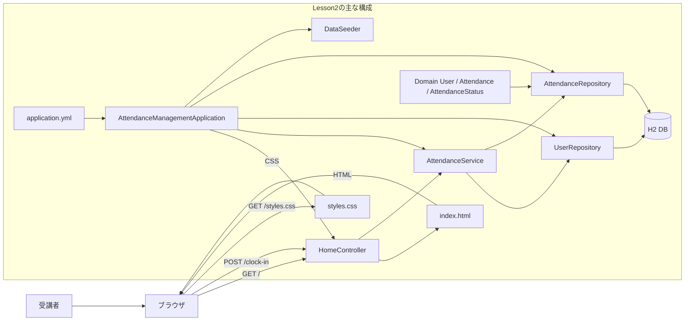
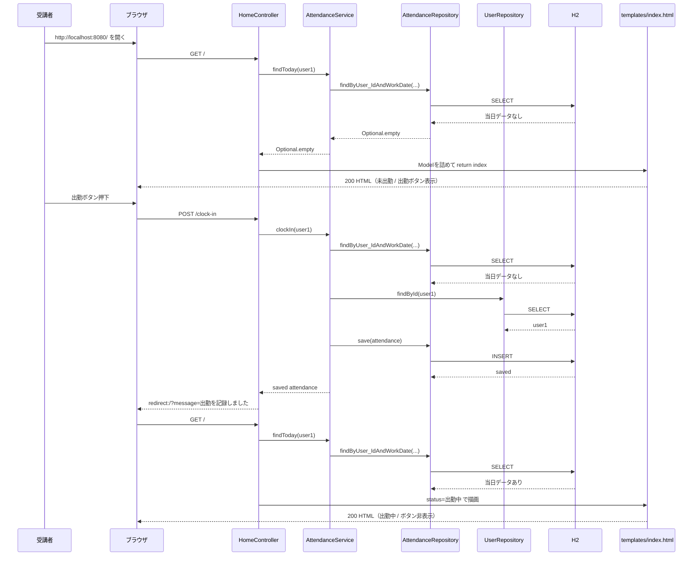
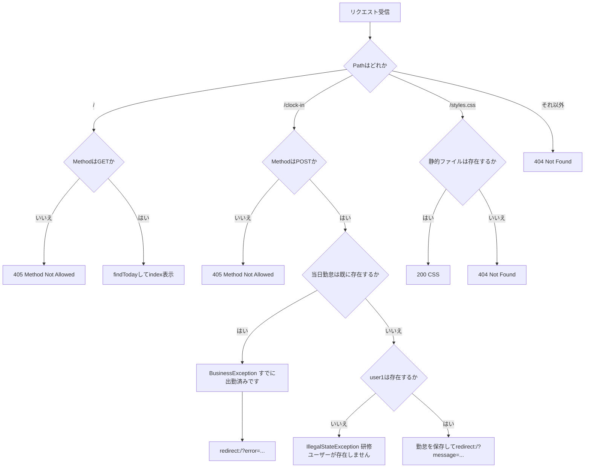

# Lesson2（7/10）出勤機能の実装（Entity / Repository / Service）

## 目的（Lesson2でできるようになること）
- 出勤ボタン押下で DB に勤怠レコードを登録できる
- `Controller -> Service -> Repository -> DB` の流れを追える
- 同日の二重出勤を業務ルールとして弾ける
- Mockitoを使い、二重出勤禁止の業務ルールをService単体で確認できる

## 前提
- Lesson1 を完了している
- `java -version` と `mvn -version` が通る
- このリポジトリのルートで作業する

バックエンド短縮コースでは、次も完了していることを前提にします。

- `docs/curriculum/springboot/lesson02/sql-rdb-basics.md`
- `docs/curriculum/springboot/prerequisites/http-thymeleaf-minimum.md`
- HTML/CSSは講師提供コードを指定位置へ配置し、フォームとControllerの対応だけを追跡する

## Lesson2で作るもの
- 画面: `/`（トップ画面）
- 機能:
  - `POST /clock-in` で出勤登録
  - 当日の状態表示（未出勤 / 出勤中）
  - 二重出勤時にエラーメッセージ表示

### 全体構成図（ファイルと役割）


読み方:
- `AttendanceManagementApplication` がSpring Bootを起動する
- Springが `Controller` / `Service` / `Repository` / `DataSeeder` を部品（Bean）として登録する
- リクエスト処理では `Controller -> Service -> Repository -> DB` の順に役割を分けて処理する
- `Application` が毎回直接 `Controller` や `Repository` を呼ぶわけではなく、起動時に使える状態へ準備する役割と考える

### データ受け渡し最小メモ（JSONはLesson2では未使用）
- このLessonはフォーム送信中心で、`fetch` + JSON API はまだ使わない。
- `POST /clock-in` はフォーム送信（`application/x-www-form-urlencoded`）で、本文データはほぼ不要。
- Controller は `Model` でテンプレートへ値を渡す。
- 例:
  ```java
  model.addAttribute("statusLabel", toStatusLabel(today));
  model.addAttribute("canClockIn", today.isEmpty());
  return "index";
  ```
- エラー/成功メッセージは `RedirectAttributes` で `redirect:/` に引き継ぐ。

### 画面表示から出勤登録まで（正常系の時系列）


### ルーティングと異常系の分岐（404/405/業務エラー）


---

## 0. 事前確認
```bash
java -version
mvn -version
git --version
```

---

## 1. 作業フォルダ
Lesson2 は `~/order-management-springboot/stages/lesson02` に自分でコードを作成します。

```bash
mkdir -p ~/order-management-springboot/stages/lesson02
cd ~/order-management-springboot/stages/lesson02
```

以降の `作成ファイル` は、`~/order-management-springboot` からのフルパスで表記します。  
例: `~/order-management-springboot/stages/lesson02/pom.xml`

### VS Codeでフォルダを開く（GUI）
1. VS Code を起動
2. `ファイル` -> `フォルダーを開く`
3. `~/order-management-springboot/stages/lesson02` を選択

---

## 2. ディレクトリ構成を作成
```bash
mkdir -p ~/order-management-springboot/stages/lesson02/src/main/java/com/shinesoft/attendance
mkdir -p ~/order-management-springboot/stages/lesson02/src/main/java/com/shinesoft/attendance/web
mkdir -p ~/order-management-springboot/stages/lesson02/src/main/java/com/shinesoft/attendance/service
mkdir -p ~/order-management-springboot/stages/lesson02/src/main/java/com/shinesoft/attendance/domain
mkdir -p ~/order-management-springboot/stages/lesson02/src/main/java/com/shinesoft/attendance/repository
mkdir -p ~/order-management-springboot/stages/lesson02/src/main/java/com/shinesoft/attendance/exception
mkdir -p ~/order-management-springboot/stages/lesson02/src/main/java/com/shinesoft/attendance/config
mkdir -p ~/order-management-springboot/stages/lesson02/src/test/java/com/shinesoft/attendance/service
mkdir -p ~/order-management-springboot/stages/lesson02/src/main/resources/templates
mkdir -p ~/order-management-springboot/stages/lesson02/src/main/resources/static
```

---

## 3. `pom.xml` を作成（Maven設定）
作成ファイル: `~/order-management-springboot/stages/lesson02/pom.xml`

この `pom.xml` は、Lesson1と同じく次の4ブロックに分けて読みます。

1. プロジェクト識別情報: このアプリの名前とバージョン
2. 共通設定: Javaバージョンや文字コードなど、複数箇所で使う値
3. 依存関係: Web、画面、DB、テストで使う外部ライブラリ
4. ビルド設定: コンパイルや起動用Jar作成の方法

```xml
<project xmlns="http://maven.apache.org/POM/4.0.0"
         xmlns:xsi="http://www.w3.org/2001/XMLSchema-instance"
         xsi:schemaLocation="http://maven.apache.org/POM/4.0.0
                             http://maven.apache.org/xsd/maven-4.0.0.xsd"> <!-- Maven用XMLの定型。今日は編集しない -->
  <modelVersion>4.0.0</modelVersion> <!-- pom.xml自体の形式バージョン。Mavenでは通常4.0.0を使う -->

  <!-- 1. プロジェクト識別情報: Mavenがこのアプリを区別するための名前 -->
  <groupId>com.shinesoft</groupId> <!-- 組織や会社を表すID。Javaのpackage名と同じくドメイン逆順が多い -->
  <artifactId>attendance-management</artifactId> <!-- アプリ/成果物の名前。jarファイル名にも使われる -->
  <version>0.0.1-SNAPSHOT</version> <!-- アプリのバージョン。SNAPSHOTは開発中という意味 -->
  <name>attendance-management</name> <!-- Mavenやログ上で表示されるプロジェクト名 -->
  <description>Attendance Management MVP Lesson2</description> <!-- プロジェクトの説明。Lessonを識別しやすくする -->

  <!-- 2. 共通設定: このpom.xml内で何度も使う値をまとめる -->
  <properties>
    <java.version>17</java.version> <!-- この研修で使うJavaのバージョン -->
    <spring-boot.version>3.5.15</spring-boot.version> <!-- Spring Boot関連ライブラリの基準バージョン -->
    <project.build.sourceEncoding>UTF-8</project.build.sourceEncoding> <!-- ソースやリソースをUTF-8として扱う -->
    <project.reporting.outputEncoding>UTF-8</project.reporting.outputEncoding> <!-- Mavenレポート出力もUTF-8として扱う -->
    <maven.compiler.encoding>UTF-8</maven.compiler.encoding> <!-- Javaコンパイル時のソース文字コード -->
    <maven.compiler.release>${java.version}</maven.compiler.release> <!-- Java 17向けの.classを作る。上のjava.versionを再利用 -->
  </properties>

  <!-- 3-1. 依存関係のバージョン表: Spring Boot推奨の組み合わせを取り込む -->
  <dependencyManagement> <!-- バージョン管理用。ここに書いただけではライブラリは追加されない -->
    <dependencies>
      <dependency>
        <groupId>org.springframework.boot</groupId>
        <artifactId>spring-boot-dependencies</artifactId>
        <version>${spring-boot.version}</version> <!-- propertiesで決めたSpring Bootバージョンを使う -->
        <type>pom</type> <!-- jarではなく、依存関係の一覧表として読む -->
        <scope>import</scope> <!-- Spring Boot推奨のバージョン表を取り込む -->
      </dependency>
    </dependencies>
  </dependencyManagement>

  <!-- 3-2. 実際に使うライブラリ: Lesson2で必要な機能を追加する -->
  <dependencies>
    <dependency> <!-- Webアプリに必要なSpring MVC/Tomcat/JSON変換などをまとめて追加 -->
      <groupId>org.springframework.boot</groupId>
      <artifactId>spring-boot-starter-web</artifactId>
    </dependency>
    <dependency> <!-- HTMLテンプレートThymeleafを使うために追加 -->
      <groupId>org.springframework.boot</groupId>
      <artifactId>spring-boot-starter-thymeleaf</artifactId>
    </dependency>
    <dependency> <!-- Entity/RepositoryでDB操作を行うために追加 -->
      <groupId>org.springframework.boot</groupId>
      <artifactId>spring-boot-starter-data-jpa</artifactId>
    </dependency>
    <dependency> <!-- 研修用の軽量DB。アプリ内で起動できるためローカルDB構築が不要 -->
      <groupId>com.h2database</groupId>
      <artifactId>h2</artifactId>
      <scope>runtime</scope> <!-- 実行時だけ必要。Javaコードのコンパイルには直接使わない -->
    </dependency>
    <dependency> <!-- JUnit/Mockitoなど、Serviceの業務ルールを自動確認するために追加 -->
      <groupId>org.springframework.boot</groupId>
      <artifactId>spring-boot-starter-test</artifactId>
      <scope>test</scope> <!-- テスト実行時だけ使う。本番起動には含めない -->
    </dependency>
  </dependencies>

  <!-- 4. ビルド設定: コンパイルやSpring Boot起動に使うMaven拡張 -->
  <build>
    <plugins>
      <plugin> <!-- mvn spring-boot:run や実行可能jar作成を使えるようにする -->
        <groupId>org.springframework.boot</groupId>
        <artifactId>spring-boot-maven-plugin</artifactId>
        <version>${spring-boot.version}</version>
        <executions> <!-- mvn package時に追加で実行する処理 -->
          <execution>
            <goals>
              <goal>repackage</goal> <!-- java -jarで起動できるSpring Boot用jarへ作り直す -->
            </goals>
          </execution>
        </executions>
      </plugin>
      <plugin> <!-- Javaをどのバージョン・文字コードでコンパイルするかを決める -->
        <groupId>org.apache.maven.plugins</groupId>
        <artifactId>maven-compiler-plugin</artifactId>
        <version>3.13.0</version>
        <configuration>
          <release>${maven.compiler.release}</release> <!-- Java 17向けにコンパイル -->
          <encoding>${maven.compiler.encoding}</encoding> <!-- ソース文字コード -->
        </configuration>
      </plugin>
    </plugins>
  </build>
</project>
```

理解ポイント（10分）:
- このファイルの役割:
  - Lesson2のビルド設定を管理する（Web + 画面 + DB）
- Lesson1からの追加点:
  - `spring-boot-starter-data-jpa`（DBアクセス）
  - `h2`（研修用のローカルDB）
  - `spring-boot-starter-test`（JUnitとMockitoによる自動テスト）
- まず見る場所:
  - `<dependencies>` の5つの依存関係
  - `<description>`（Lesson2用に識別）
- 講義用説明:

  | 項目 | 初学者向け説明 |
  |---|---|
  | `groupId` / `artifactId` / `version` | Maven上でこのプロジェクトを識別する3点セット |
  | `properties` | バージョンや文字コードなど、共通で使う値の置き場 |
  | `dependencyManagement` | ライブラリのバージョン表を取り込む場所。ここだけではライブラリは使われない |
  | `dependencies` | 実際に使うライブラリを書く場所 |
  | `spring-boot-starter-web` | Controller、HTTP、組み込みTomcatを使うためのセット |
  | `spring-boot-starter-thymeleaf` | HTMLテンプレートを使うためのセット |
  | `spring-boot-starter-data-jpa` | Entity / RepositoryでDB操作を行うためのセット |
  | `h2` | 研修用の軽量DB。アプリを止めるとデータは消える |
  | `spring-boot-starter-test` | JUnit / MockitoでServiceテストを行うためのセット |
  | `scope runtime` | 実行時だけ必要な依存を表す |
  | `scope test` | テスト時だけ必要な依存を表す |
  | `spring-boot-maven-plugin` | Spring Bootアプリを起動・jar化するためのMaven拡張 |
  | `maven-compiler-plugin` | Javaをどのバージョンとしてコンパイルするかを決める設定 |

- よくあるミス:
  - `data-jpa` や `h2` の追加漏れでDB関連クラスが動かない

---

## 4. `application.yml` を作成
作成ファイル: `~/order-management-springboot/stages/lesson02/src/main/resources/application.yml`

```yaml
# Spring Framework全体の設定
spring:
  application:
    # アプリ名。環境変数 APP_NAME が無ければ attendance-management を使う
    name: ${APP_NAME:attendance-management}
  datasource:
    # H2の接続先（インメモリDB）。アプリ停止でデータは消える
    url: jdbc:h2:mem:attendance;DB_CLOSE_DELAY=-1;DB_CLOSE_ON_EXIT=FALSE
    # JDBCドライバ
    driver-class-name: org.h2.Driver
    # Lesson2では簡易構成として固定ユーザーを使用
    username: sa
    password:
  jpa:
    hibernate:
      # Entity定義に合わせてテーブルを自動更新（学習用設定）
      ddl-auto: update
    # View描画中に追加のDBアクセスを発生させない
    open-in-view: false
  thymeleaf:
    # 学習中はキャッシュ無効（HTML変更を反映しやすくする）
    cache: false
  h2:
    console:
      # H2コンソール（ブラウザでDB確認）を有効化
      enabled: true
      # H2コンソールのアクセスパス
      path: /h2-console

# 組み込みWebサーバーの設定
server:
  # 環境変数 SERVER_PORT が無い時は 8080
  port: ${SERVER_PORT:8080}

# ログ設定
logging:
  level:
    # ルートロガーの出力レベル
    root: ${LOG_LEVEL:INFO}
```

理解ポイント（10分）:
- このファイルの役割:
  - DB接続や起動時設定をまとめる
- Lesson2で重要な設定:
  - `spring.datasource.*`（H2接続先）
  - `spring.jpa.hibernate.ddl-auto: update`（テーブル自動更新）
  - `spring.h2.console.enabled: true`（H2コンソール有効化）
- まず見る場所:
  - `url: jdbc:h2:mem:attendance...`
  - `open-in-view: false`（必要なDB取得はService内で完了させる）
- 講義用説明:

  | 設定 | 初学者向け説明 |
  |---|---|
  | `spring.datasource.url` | アプリが接続するDBの場所 |
  | `jdbc:h2:mem:attendance` | H2のインメモリDB。アプリ実行中だけメモリ上にDBを作る |
  | `DB_CLOSE_DELAY=-1` | 接続が一度閉じても、アプリ起動中はDBを残すためのH2設定 |
  | `driver-class-name` | JDBCでH2へ接続するためのドライバ名 |
  | `username: sa` | H2でよく使われる学習用ユーザー名 |
  | `ddl-auto: update` | Entity定義を見てテーブルを自動作成/更新する学習用設定 |
  | `open-in-view: false` | 画面描画中に追加DBアクセスしないようにし、Service内で取得を完了させる |
  | `h2.console.enabled` | ブラウザからH2 DBを確認する画面を有効化する |

- よくあるミス:
  - `jdbc:h2:mem:attendance` のスペルミス
  - YAMLインデント崩れ

---

## 5. Applicationクラス
作成ファイル: `~/order-management-springboot/stages/lesson02/src/main/java/com/shinesoft/attendance/AttendanceManagementApplication.java`

```java
// このクラスが属するパッケージ（フォルダ構成と一致させる）
package com.shinesoft.attendance;

// Spring Boot起動用クラス
import org.springframework.boot.SpringApplication;
// このクラスをSpring Bootの起点として扱う
import org.springframework.boot.autoconfigure.SpringBootApplication;

// 設定読み込み・コンポーネントスキャン・自動設定を有効化
@SpringBootApplication
public class AttendanceManagementApplication {
    // Java実行時の開始地点
    public static void main(String[] args) {
        // Spring Bootアプリを起動する
        SpringApplication.run(AttendanceManagementApplication.class, args);
    }
}
```

理解ポイント（5分）:
- このファイルの役割:
  - Spring Bootの起動エントリポイント
- Lesson1との関係:
  - Lesson2でもこのクラスは同じ（起点は変わらない）
- 確認すること:
  - `@SpringBootApplication` と `main` があること

---

## 6. Domain（Entity / Enum）を作成

### 6-0. Domainを作る理由（最初に読む）
この章は、画面やボタン処理を作る前に「勤怠アプリで扱うデータの型」を先に決めるための章です。

理由:
- 業務ルールの対象（ユーザー、勤怠、状態）をコード上で明確にするため
- Repository / Service が同じデータ定義を前提に実装できるようにするため
- DBテーブルとの対応を早い段階で固定し、後続実装の手戻りを減らすため

### 6-0.5. DB対応表（1分で把握）
| Domain（Java） | 役割 | DBでの対応 |
|---|---|---|
| `User` | 利用者情報（最小） | `users` テーブル |
| `Attendance` | 日次の勤怠記録 | `attendances` テーブル |
| `AttendanceStatus` | 勤怠状態の固定値 | `attendances.status` 列（文字列） |

関係（重要）:
- `User` 1件に対して、`Attendance` は複数件（1対多）
- ただし同じユーザー・同じ日付での重複は `@UniqueConstraint(user_id, work_date)` で禁止

JPAアノテーション対応表:

| アノテーション | Java側での意味 | DB側での対応 |
|---|---|---|
| `@Entity` | このクラスをDB保存対象として扱う | テーブルに対応する |
| `@Table(name = "...")` | 対応するテーブル名を指定する | `users` / `attendances` |
| `@Id` | 主キーフィールドを示す | `id` 列 |
| `@GeneratedValue` | 主キーをDB側で自動採番する | AUTO_INCREMENT相当 |
| `@Column` | フィールドと列の対応や制約を指定する | `NOT NULL` / `UNIQUE` / 文字数など |
| `@ManyToOne` | 多数の勤怠が1ユーザーに紐づく関係を示す | `attendances.user_id -> users.id` |
| `@JoinColumn` | 外部キー列名を指定する | `user_id` 列 |
| `@Enumerated(EnumType.STRING)` | Enumを文字列として保存する | `WORKING` などの文字列 |
| `@PrePersist` | INSERT前に自動実行する処理を指定する | 作成日時の自動設定 |
| `@PreUpdate` | UPDATE前に自動実行する処理を指定する | 更新日時の自動更新 |

### 6-1. 勤怠ステータス
作成ファイル: `~/order-management-springboot/stages/lesson02/src/main/java/com/shinesoft/attendance/domain/AttendanceStatus.java`

```java
// 勤怠状態を固定値で管理する列挙型（Enum）
// 文字列の打ち間違いを防ぎ、状態の取り得る値を明確にする
package com.shinesoft.attendance.domain;

public enum AttendanceStatus {
    // まだ出勤していない
    NOT_STARTED,
    // 出勤中（開始時刻あり、終了時刻なし）
    WORKING,
    // 退勤済み（開始時刻・終了時刻あり）
    FINISHED
}
```

### 6-2. ユーザー
作成ファイル: `~/order-management-springboot/stages/lesson02/src/main/java/com/shinesoft/attendance/domain/User.java`

```java
// Entity（DBテーブル）を置くパッケージ
package com.shinesoft.attendance.domain;

import jakarta.persistence.Column;
import jakarta.persistence.Entity;
import jakarta.persistence.GeneratedValue;
import jakarta.persistence.GenerationType;
import jakarta.persistence.Id;
import jakarta.persistence.Table;

// このクラスをJPAの永続化対象（テーブル）として扱う
@Entity
// 対応するテーブル名
@Table(name = "users")
public class User {
    // 主キー
    @Id
    // DB側で自動採番（AUTO_INCREMENT）
    @GeneratedValue(strategy = GenerationType.IDENTITY)
    private Long id;

    // NULL不可、重複不可、最大50文字
    @Column(nullable = false, unique = true, length = 50)
    private String username;

    // 以下はアクセサ（getter/setter）
    public Long getId() {
        return id;
    }

    public String getUsername() {
        return username;
    }

    public void setUsername(String username) {
        this.username = username;
    }
}
```

### 6-3. 勤怠
作成ファイル: `~/order-management-springboot/stages/lesson02/src/main/java/com/shinesoft/attendance/domain/Attendance.java`

```java
// Entityクラスを置くパッケージ
package com.shinesoft.attendance.domain;

import java.time.LocalDate;
import java.time.LocalDateTime;

import jakarta.persistence.Column;
import jakarta.persistence.Entity;
import jakarta.persistence.EnumType;
import jakarta.persistence.Enumerated;
import jakarta.persistence.FetchType;
import jakarta.persistence.GeneratedValue;
import jakarta.persistence.GenerationType;
import jakarta.persistence.Id;
import jakarta.persistence.JoinColumn;
import jakarta.persistence.ManyToOne;
import jakarta.persistence.PrePersist;
import jakarta.persistence.PreUpdate;
import jakarta.persistence.Table;
import jakarta.persistence.UniqueConstraint;

// 勤怠テーブルに対応するEntity
@Entity
@Table(
    name = "attendances",
    // DB制約: 1ユーザー1日1件（同日の二重出勤をDBレベルでも防ぐ）
    uniqueConstraints = @UniqueConstraint(name = "uk_attendance_user_date", columnNames = {"user_id", "work_date"})
)
public class Attendance {
    // 主キー
    @Id
    @GeneratedValue(strategy = GenerationType.IDENTITY)
    private Long id;

    // 多対1: 多数の勤怠レコードが1ユーザーに紐づく
    // LAZY: 必要になるまでuser本体は読み込まない
    @ManyToOne(fetch = FetchType.LAZY, optional = false)
    // 外部キー列名
    @JoinColumn(name = "user_id", nullable = false)
    private User user;

    // 勤務日（yyyy-MM-dd）
    @Column(name = "work_date", nullable = false)
    private LocalDate workDate;

    // 出勤時刻（未出勤ならnull）
    @Column(name = "start_time")
    private LocalDateTime startTime;

    // 退勤時刻（退勤前ならnull）
    @Column(name = "end_time")
    private LocalDateTime endTime;

    // Enumを文字列として保存（NOT_STARTED / WORKING / FINISHED）
    @Enumerated(EnumType.STRING)
    @Column(nullable = false, length = 20)
    private AttendanceStatus status;

    // 監査用の作成日時
    @Column(name = "created_at", nullable = false)
    private LocalDateTime createdAt;

    // 監査用の更新日時
    @Column(name = "updated_at", nullable = false)
    private LocalDateTime updatedAt;

    // INSERT前に自動実行されるコールバック
    @PrePersist
    void prePersist() {
        LocalDateTime now = LocalDateTime.now();
        this.createdAt = now;
        this.updatedAt = now;
    }

    // UPDATE前に自動実行されるコールバック
    @PreUpdate
    void preUpdate() {
        this.updatedAt = LocalDateTime.now();
    }

    // 以下はアクセサ（getter/setter）
    public Long getId() {
        return id;
    }

    public User getUser() {
        return user;
    }

    public void setUser(User user) {
        this.user = user;
    }

    public LocalDate getWorkDate() {
        return workDate;
    }

    public void setWorkDate(LocalDate workDate) {
        this.workDate = workDate;
    }

    public LocalDateTime getStartTime() {
        return startTime;
    }

    public void setStartTime(LocalDateTime startTime) {
        this.startTime = startTime;
    }

    public LocalDateTime getEndTime() {
        return endTime;
    }

    public void setEndTime(LocalDateTime endTime) {
        this.endTime = endTime;
    }

    public AttendanceStatus getStatus() {
        return status;
    }

    public void setStatus(AttendanceStatus status) {
        this.status = status;
    }
}
```

理解ポイント（20分）:
- `AttendanceStatus`:
  - 勤怠状態を列挙型で固定（`NOT_STARTED / WORKING / FINISHED`）
- `User`:
  - 研修用ユーザー情報の最小モデル
  - `username` は重複禁止（`unique = true`）
- `Attendance`:
  - 勤怠の中心データ
  - `@UniqueConstraint(user_id, work_date)` で「1ユーザー1日1件」をDB制約化
  - `@PrePersist / @PreUpdate` で作成/更新日時を自動設定
- よくあるミス:
  - `@Entity` / `@Table` の付け忘れ
  - `uniqueConstraints` のカラム名と `@JoinColumn` / `@Column` の不一致

---

## 6.5 Java補足: `Optional` の最小理解

Repositoryの検索結果は「対象が存在しない」場合があります。
Lesson2では、値がある場合とない場合を型で表す `Optional<T>` を使用します。

```java
Optional<User> user = userRepository.findByUsername("user1");
```

最低限使用する操作:

| 操作 | 意味 |
| --- | --- |
| `Optional.of(value)` | 値があるOptionalを作る |
| `Optional.empty()` | 値がないOptionalを作る |
| `isPresent()` | 値があるか確認する |
| `isEmpty()` | 値がないか確認する |
| `get()` | 値を取り出す。値なしでは例外になるため単独利用を避ける |
| `orElse(defaultValue)` | 値がなければ既定値を返す |
| `orElseThrow(...)` | 値がなければ例外を投げる |

Lesson2での例:

```java
Optional<Attendance> existing = attendanceRepository.findByUser_IdAndWorkDate(userId, today);
if (existing.isPresent()) {
    throw new BusinessException("すでに出勤済みです");
}

User user = userRepository.findById(userId)
        .orElseThrow(() -> new IllegalStateException("研修ユーザーが存在しません"));
```

確認ポイント:

- `Optional.empty()` は検索処理の失敗ではなく「該当データなし」を表す
- `null` を直接返す代わりに、値の有無を呼び出し側へ明示できる
- 二重出勤確認では「値があること」が業務エラーになる
- ユーザー検索では「値がないこと」を `orElseThrow` でシステム上の異常として扱う

---

## 7. Repositoryを作成

### 7-0. Repositoryとは何か（最初に読む）
Repository は、DBアクセス専用の窓口です。  
Controller や Service から直接SQLを書く代わりに、「保存」「検索」などの処理をRepositoryへ依頼します。

役割:
- DB操作の責務を1か所へ集約する
- Serviceは業務ルール判断に集中できる
- `JpaRepository` 継承で基本CRUD（作成・参照・更新・削除）を自動利用できる

この章での対応:
- `UserRepository`:
  - `User` テーブルの操作窓口
- `AttendanceRepository`:
  - `Attendance` テーブルの操作窓口

処理の流れ（イメージ）:
1. Controller がリクエストを受ける
2. Service が業務ルールを判定する
3. Repository がDBへ保存/検索する

### 7-1. `UserRepository`
作成ファイル: `~/order-management-springboot/stages/lesson02/src/main/java/com/shinesoft/attendance/repository/UserRepository.java`

```java
// Repositoryインターフェースを置くパッケージ
package com.shinesoft.attendance.repository;

import java.util.Optional;

import org.springframework.data.jpa.repository.JpaRepository;

import com.shinesoft.attendance.domain.User;

// UserテーブルのDB操作窓口
// JpaRepository<エンティティ型, 主キー型>
public interface UserRepository extends JpaRepository<User, Long> {
    // ユーザー名で1件検索（存在しない場合があるのでOptional）
    Optional<User> findByUsername(String username);
}
```

### 7-2. `AttendanceRepository`
作成ファイル: `~/order-management-springboot/stages/lesson02/src/main/java/com/shinesoft/attendance/repository/AttendanceRepository.java`

```java
// Repositoryインターフェースを置くパッケージ
package com.shinesoft.attendance.repository;

import java.time.LocalDate;
import java.util.Optional;

import org.springframework.data.jpa.repository.JpaRepository;

import com.shinesoft.attendance.domain.Attendance;

// AttendanceテーブルのDB操作窓口
public interface AttendanceRepository extends JpaRepository<Attendance, Long> {
    // userId + workDate で当日レコードを検索
    // メソッド名からSQL相当の処理が自動生成される
    Optional<Attendance> findByUser_IdAndWorkDate(Long userId, LocalDate workDate);
}
```

`findByUser_IdAndWorkDate` の読み方:

| 部分 | 意味 |
|---|---|
| `findBy` | 条件に一致するデータを検索する |
| `User_Id` | `Attendance` の `user` の中にある `id` で絞り込む |
| `And` | 条件を追加する |
| `WorkDate` | `Attendance` の `workDate` で絞り込む |

SQLに近いイメージ:

```sql
SELECT *
FROM attendances
WHERE user_id = ?
  AND work_date = ?;
```

理解ポイント（10分）:
- このファイルの役割:
  - DB操作（検索・保存）の窓口
- 重要ポイント:
  - `JpaRepository` 継承でCRUDの基本機能を自動取得
  - `findByUser_IdAndWorkDate(...)` はメソッド名からSQL相当が生成される
- よくあるミス:
  - メソッド名のプロパティ名をEntityと不一致にする

---

## 8. 例外とServiceを作成

### 8-0. 例外とServiceとは何か（最初に読む）
この章では、「業務ルールをどこで判定するか」と「違反時にどう扱うか」を決めます。

用語:
- 例外（Exception）:
  - 通常処理を続けられない状態を表す仕組み
  - Lesson2では業務ルール違反（例: 二重出勤、未出勤で退勤）を `BusinessException` で表現する
- Service:
  - 業務ルールを実行する層
  - Controllerから受けた操作を判定し、必要なDB操作をRepositoryへ依頼する

役割分担（重要）:
1. Controller: リクエスト受付、画面への受け渡し
2. Service: 業務ルール判定（出勤できるか、退勤できるか）
3. Repository: DB検索・保存
4. Exception: ルール違反をエラーとして呼び出し元へ通知

`clockIn` の処理手順:

| 手順 | 処理 | 失敗時 |
|---|---|---|
| 1 | 今日の日付を決める | なし |
| 2 | `userId + 今日` で既存勤怠を検索する | 既にあれば `BusinessException` |
| 3 | 研修ユーザーを取得する | なければ `IllegalStateException` |
| 4 | `Attendance` を作成し、日付・出勤時刻・状態を入れる | なし |
| 5 | RepositoryでDBへ保存する | DB制約違反などは例外 |
| 6 | ログを出して保存結果を返す | なし |

### 8-1. `BusinessException`
作成ファイル: `~/order-management-springboot/stages/lesson02/src/main/java/com/shinesoft/attendance/exception/BusinessException.java`

```java
// 業務ルール違反を表す独自例外
// 例: 二重出勤、未出勤退勤など
package com.shinesoft.attendance.exception;

public class BusinessException extends RuntimeException {
    // 画面に表示するメッセージを受け取る
    public BusinessException(String message) {
        super(message);
    }
}
```

### 8-2. `AttendanceService`
作成ファイル: `~/order-management-springboot/stages/lesson02/src/main/java/com/shinesoft/attendance/service/AttendanceService.java`

```java
// Serviceクラスを置くパッケージ
package com.shinesoft.attendance.service;

import java.time.LocalDate;
import java.time.LocalDateTime;
import java.util.Optional;

import org.slf4j.Logger;
import org.slf4j.LoggerFactory;
import org.springframework.stereotype.Service;

import com.shinesoft.attendance.domain.Attendance;
import com.shinesoft.attendance.domain.AttendanceStatus;
import com.shinesoft.attendance.domain.User;
import com.shinesoft.attendance.exception.BusinessException;
import com.shinesoft.attendance.repository.AttendanceRepository;
import com.shinesoft.attendance.repository.UserRepository;

// 業務ロジックを担当するクラス（Controllerから分離）
@Service
public class AttendanceService {
    // 操作履歴をログ出力するためのロガー
    private static final Logger log = LoggerFactory.getLogger(AttendanceService.class);

    // DBアクセス窓口（依存注入される）
    private final AttendanceRepository attendanceRepository;
    private final UserRepository userRepository;

    // コンストラクタインジェクション
    public AttendanceService(AttendanceRepository attendanceRepository, UserRepository userRepository) {
        this.attendanceRepository = attendanceRepository;
        this.userRepository = userRepository;
    }

    // 当日の勤怠を取得（無ければOptional.empty）
    public Optional<Attendance> findToday(Long userId) {
        return attendanceRepository.findByUser_IdAndWorkDate(userId, LocalDate.now());
    }

    // 出勤処理（業務ルール: 同日二重出勤禁止）
    public Attendance clockIn(Long userId) {
        // 1. 今日の日付を取得
        LocalDate today = LocalDate.now();
        // 2. 既存データがあるか確認
        Optional<Attendance> existing = attendanceRepository.findByUser_IdAndWorkDate(userId, today);
        if (existing.isPresent()) {
            // 3. すでに出勤済みなら業務例外
            throw new BusinessException("すでに出勤済みです");
        }

        // 4. ユーザー取得（研修用固定ユーザーがいない場合はシステム例外）
        User user = userRepository.findById(userId)
            .orElseThrow(() -> new IllegalStateException("研修ユーザーが存在しません"));

        // 5. 新しい勤怠レコードを作成
        Attendance attendance = new Attendance();
        attendance.setUser(user);
        attendance.setWorkDate(today);
        // 出勤時刻は「現在時刻」
        attendance.setStartTime(LocalDateTime.now());
        // 状態は「出勤中」
        attendance.setStatus(AttendanceStatus.WORKING);

        // 6. DBへ保存
        Attendance saved = attendanceRepository.save(attendance);
        // 7. 監査しやすいようにログ出力
        log.info("clock-in userId={} date={} time={}", userId, saved.getWorkDate(), saved.getStartTime());
        return saved;
    }
}
```

理解ポイント（20分）:
- このファイルの役割:
  - 業務ルールをまとめる層（Controllerを薄くする）
- 重要ポイント:
  - `clockIn` で二重出勤チェック（同日データがあれば例外）
  - `BusinessException` で画面表示用のエラーを返す
  - `log.info(...)` で操作ログを残す
- 依存関係:
  - `Controller -> Service -> Repository -> DB`
- よくあるミス:
  - Controller側で業務判定を書いてしまい責務が混ざる

---

## 8.5 最小Serviceテストを作成

Lesson5で複数のテストを扱う前に、Lesson2では「同じ日に2回出勤できない」という業務ルールを1件だけ自動確認します。
このテストではSpring Bootアプリ全体やH2 DBを起動せず、Repositoryの代用品（Mock）を使ってServiceだけを確認します。

作成ファイル: `~/order-management-springboot/stages/lesson02/src/test/java/com/shinesoft/attendance/service/AttendanceServiceTest.java`

配置注意:
- テストコードは必ず `src/test/java` 配下に作成する
- `src/main/java` 配下に作成すると、本番コードとしてコンパイルされる
- `spring-boot-starter-test` は `<scope>test</scope>` のため、`src/main/java` のコンパイル時にはJUnit/Mockitoを参照できない
- `org.junit.jupiter.api は存在しません` や `org.mockito は存在しません` が `src/main/java/.../AttendanceServiceTest.java` に対して出た場合は、ファイル配置ミスを疑う

テストの読み方:

| 区分 | このテストでやること |
|---|---|
| Arrange（準備） | Mock Repositoryに「当日勤怠が既にある」と返させる |
| Act（実行） | `attendanceService.clockIn(1L)` を呼ぶ |
| Assert（確認） | `BusinessException` が発生し、メッセージが仕様通りか確認する |

Mockitoの最小用語:

| 用語 | 意味 |
|---|---|
| `@Mock` | 本物のRepositoryの代用品を作る |
| `when(...).thenReturn(...)` | 代用品が返す結果を事前に決める |
| `eq(1L)` | 引数が `1L` と一致する条件 |
| `any(LocalDate.class)` | 日付なら何でもよいという条件 |
| `assertThrows` | 指定した例外が発生することを確認する |

```java
package com.shinesoft.attendance.service; // Serviceテスト用パッケージ

import static org.junit.jupiter.api.Assertions.assertEquals; // 期待値との一致確認
import static org.junit.jupiter.api.Assertions.assertThrows; // 例外発生の確認
import static org.mockito.ArgumentMatchers.any; // 任意の日付をテスト条件に使う
import static org.mockito.ArgumentMatchers.eq; // userIdの一致条件に使う
import static org.mockito.Mockito.when; // Repositoryの戻り値を決める

import java.time.LocalDate; // Repository検索条件の日付型
import java.util.Optional; // 既存勤怠ありを表現する

import org.junit.jupiter.api.BeforeEach; // 各テスト前の準備
import org.junit.jupiter.api.Test; // テストメソッドを示す
import org.junit.jupiter.api.extension.ExtendWith; // MockitoをJUnitで使う
import org.mockito.Mock; // Repositoryの代用品を作る
import org.mockito.junit.jupiter.MockitoExtension; // Mockito初期化を自動化する

import com.shinesoft.attendance.domain.Attendance; // 既存勤怠として返すEntity
import com.shinesoft.attendance.exception.BusinessException; // 確認対象の業務例外
import com.shinesoft.attendance.repository.AttendanceRepository; // テスト用の代用品
import com.shinesoft.attendance.repository.UserRepository; // Service生成に必要な代用品

@ExtendWith(MockitoExtension.class) // Spring Boot全体を起動せずServiceだけ確認する
class AttendanceServiceTest {

    @Mock
    private AttendanceRepository attendanceRepository; // DBへ接続しない代用品

    @Mock
    private UserRepository userRepository; // DBへ接続しない代用品

    private AttendanceService attendanceService; // テスト対象

    @BeforeEach
    void setUp() {
        // 本番コードと同じコンストラクタ注入でServiceを作る
        attendanceService = new AttendanceService(attendanceRepository, userRepository);
    }

    @Test
    void clockIn_rejectsSecondClockInOnSameDay() {
        // userId=1の当日勤怠が既に存在する状態を作る
        when(attendanceRepository.findByUser_IdAndWorkDate(eq(1L), any(LocalDate.class)))
            .thenReturn(Optional.of(new Attendance()));

        // 2回目の出勤でBusinessExceptionが発生することを確認する
        BusinessException exception = assertThrows(
            BusinessException.class,
            () -> attendanceService.clockIn(1L));

        // 利用者へ返すエラーメッセージも業務仕様として確認する
        assertEquals("すでに出勤済みです", exception.getMessage());
    }
}
```

実行:

```bash
ls src/test/java/com/shinesoft/attendance/service/AttendanceServiceTest.java
mvn -Dtest=AttendanceServiceTest test
```

確認ポイント:

- `@Mock`はRepositoryの代用品であり、H2へ接続しない
- `when(...).thenReturn(...)`で「既に当日勤怠がある」状態を作る
- `assertThrows`で業務ルール違反を確認する
- Spring全体ではなくServiceだけを対象にするため、失敗原因を絞り込みやすい
- Mavenログで `src/test/java` のテストとして実行されることを確認する

---

## 9. 初期データ投入（固定ユーザー）
### 9-0. 何をしているか（最初に読む）
この章では、アプリ起動時に「研修用の固定ユーザー `user1`」をDBへ自動登録します。

なぜ必要か:
- Lesson2時点ではログイン機能/ユーザー登録画面をまだ作っていないため
- Controller/Serviceが「操作対象ユーザー」を前提に動くため
- 毎回手動でSQL投入しなくても、演習をすぐ始められるため

実際の動き:
1. 起動時に `user1` が存在するか確認
2. 存在しなければ `users` テーブルへ1件登録
3. 既に存在する場合は何もしない（重複防止）

作成ファイル: `~/order-management-springboot/stages/lesson02/src/main/java/com/shinesoft/attendance/config/DataSeeder.java`

```java
// 設定クラスを置くパッケージ
package com.shinesoft.attendance.config;

// アプリ起動時に1回だけ実行される処理を作るためのインターフェース
import org.springframework.boot.CommandLineRunner;
import org.springframework.context.annotation.Bean;
import org.springframework.context.annotation.Configuration;

import com.shinesoft.attendance.domain.User;
import com.shinesoft.attendance.repository.UserRepository;

// Springの設定クラス
@Configuration
public class DataSeeder {

    // Beanとして登録され、起動時に自動実行される
    @Bean
    CommandLineRunner seedUser(UserRepository userRepository) {
        // argsは起動引数（今回は未使用）
        return args -> {
            // user1 がいない時だけ作成（重複投入を防ぐ）
            if (userRepository.findByUsername("user1").isEmpty()) {
                User user = new User();
                user.setUsername("user1");
                userRepository.save(user);
            }
        };
    }
}
```

理解ポイント（5分）:
- このファイルの役割:
  - アプリ起動時に研修用ユーザー（`user1`）を投入する
- 重要ポイント:
  - `findByUsername("user1")` で重複作成を防止
- よくあるミス:
  - Seederを作っていないため `研修ユーザーが存在しません` で失敗

---

## 10. Controllerを作成
作成ファイル: `~/order-management-springboot/stages/lesson02/src/main/java/com/shinesoft/attendance/web/HomeController.java`

Controllerの役割:
- `GET /` で画面表示に必要な値を `Model` へ詰める
- `POST /clock-in` で出勤ボタン押下を受け取り、Serviceへ処理を依頼する
- 成功/エラーの結果を `RedirectAttributes` へ入れて `redirect:/` でトップ画面に戻す

PRGパターン:
- POSTでDB更新した後、直接HTMLを返さずGETへリダイレクトする流れ
- ブラウザ更新による二重POSTを防ぎやすい
- Lesson2では `POST /clock-in -> redirect:/ -> GET /` という流れになる

```java
// 画面（Web）層のクラスを置くパッケージ
package com.shinesoft.attendance.web;

import java.time.LocalDate;
import java.time.LocalDateTime;
import java.time.format.DateTimeFormatter;
import java.util.Optional;

import org.springframework.stereotype.Controller;
import org.springframework.ui.Model;
import org.springframework.web.bind.annotation.GetMapping;
import org.springframework.web.bind.annotation.PostMapping;
import org.springframework.web.bind.annotation.RequestParam;
import org.springframework.web.servlet.mvc.support.RedirectAttributes;

import com.shinesoft.attendance.domain.Attendance;
import com.shinesoft.attendance.domain.AttendanceStatus;
import com.shinesoft.attendance.exception.BusinessException;
import com.shinesoft.attendance.service.AttendanceService;

// 画面表示を担当するController
@Controller
public class HomeController {
    // Lesson2では固定ユーザーで進める（ログイン機能はLesson5で実装）
    private static final Long TRAINING_USER_ID = 1L;
    // 日時表示フォーマット
    private static final DateTimeFormatter FMT = DateTimeFormatter.ofPattern("yyyy-MM-dd HH:mm:ss");

    // 業務ロジックはServiceに委譲
    private final AttendanceService attendanceService;

    public HomeController(AttendanceService attendanceService) {
        this.attendanceService = attendanceService;
    }

    // トップ画面表示
    @GetMapping("/")
    public String index(Model model,
                        // redirect:/ から渡される成功メッセージ（任意）
                        @RequestParam(value = "message", required = false) String message,
                        // redirect:/ から渡されるエラーメッセージ（任意）
                        @RequestParam(value = "error", required = false) String error) {
        // 当日の勤怠を取得
        Optional<Attendance> today = attendanceService.findToday(TRAINING_USER_ID);

        // 画面表示に必要な値をModelへ詰める
        model.addAttribute("workDate", LocalDate.now());
        model.addAttribute("statusLabel", toStatusLabel(today));
        model.addAttribute("startTime", format(today.map(Attendance::getStartTime).orElse(null)));
        model.addAttribute("endTime", format(today.map(Attendance::getEndTime).orElse(null)));
        // trueの時だけ「出勤」ボタンを表示
        model.addAttribute("canClockIn", today.isEmpty());
        model.addAttribute("message", message);
        model.addAttribute("error", error);
        // templates/index.html を表示
        return "index";
    }

    // 出勤ボタン押下時の処理
    @PostMapping("/clock-in")
    public String clockIn(RedirectAttributes redirectAttributes) {
        try {
            // 出勤処理（Serviceで業務判定）
            attendanceService.clockIn(TRAINING_USER_ID);
            // 画面へ成功メッセージを渡してリダイレクト
            redirectAttributes.addAttribute("message", "出勤を記録しました");
        } catch (BusinessException e) {
            // 業務エラー（例: 二重出勤）はエラーメッセージとして返す
            redirectAttributes.addAttribute("error", e.getMessage());
        }
        // PRGパターン: POST後はGETへリダイレクト
        return "redirect:/";
    }

    // 勤怠状態(Enum)を画面表示用文字列へ変換
    private String toStatusLabel(Optional<Attendance> today) {
        if (today.isEmpty()) {
            return "未出勤";
        }
        AttendanceStatus status = today.get().getStatus();
        if (status == AttendanceStatus.WORKING) {
            return "出勤中";
        }
        if (status == AttendanceStatus.FINISHED) {
            return "退勤済み";
        }
        return "未出勤";
    }

    // 日時表示の共通フォーマッタ
    private String format(LocalDateTime value) {
        if (value == null) {
            // 値が無い時は "-" 表示
            return "-";
        }
        return value.format(FMT);
    }
}
```

理解ポイント（20分）:
- このファイルの役割:
  - 画面入力を受け取り、表示データを作ってテンプレートへ渡す
- 重要ポイント:
  - `@GetMapping("/")` でトップ画面表示
  - `@PostMapping("/clock-in")` で出勤処理
  - `RedirectAttributes` でメッセージを画面に戻す
- 画面制御:
  - `canClockIn` により出勤ボタンの表示/非表示を切り替える
- Model対応:

  | Controllerで入れるキー | HTML側 | 役割 |
  |---|---|---|
  | `workDate` | `${workDate}` | 今日の日付 |
  | `statusLabel` | `${statusLabel}` | `未出勤` / `出勤中` / `退勤済み` |
  | `startTime` | `${startTime}` | 出勤時刻。値がなければ `-` |
  | `endTime` | `${endTime}` | 退勤時刻。Lesson2では基本 `-` |
  | `canClockIn` | `${canClockIn}` | 出勤フォームを表示するかどうか |
  | `message` | `${message}` | 成功通知 |
  | `error` | `${error}` | エラー通知 |

- よくあるミス:
  - `@RequestParam(..., required = false)` を外して初回表示でエラー

---

## 11. テンプレートを作成
作成ファイル: `~/order-management-springboot/stages/lesson02/src/main/resources/templates/index.html`

バックエンド短縮コース:

- 以下のコードブロック全体を講師提供コードとして使用する
- `templates/index.html` を作成し、内容と説明コメントを削除せず配置する
- HTML実装は評価せず、`POST /clock-in`、`Model` のキー、ボタン表示条件を確認する

Controllerとの対応:

| HTML | Controller側 | 意味 |
|---|---|---|
| `th:text="${statusLabel}"` | `model.addAttribute("statusLabel", ...)` | 勤怠状態を表示 |
| `th:if="${message}"` | `message` リクエストパラメータ | 成功メッセージがある時だけ表示 |
| `th:if="${error}"` | `error` リクエストパラメータ | エラーメッセージがある時だけ表示 |
| `th:if="${canClockIn}"` | `model.addAttribute("canClockIn", ...)` | 出勤できる時だけフォームを表示 |
| `method="post"` | `@PostMapping("/clock-in")` | POSTリクエストとして送信 |
| `th:action="@{/clock-in}"` | `@PostMapping("/clock-in")` | 出勤処理のURLへ送信 |

```html
<!-- HTML5の文書宣言 -->
<!doctype html>
<!-- Thymeleafを使うため xmlns:th を宣言 -->
<html lang="ja" xmlns:th="http://www.thymeleaf.org">
<head>
  <!-- 文字コード -->
  <meta charset="utf-8" />
  <!-- スマホ表示用の基本設定 -->
  <meta name="viewport" content="width=device-width, initial-scale=1" />
  <title>勤怠管理（Lesson2）</title>
  <!-- static/styles.css を読み込む -->
  <link rel="stylesheet" th:href="@{/styles.css}" />
</head>
<body>
  <!-- 画面全体のコンテナ -->
  <div class="container">
    <header>
      <h1>勤怠管理システム（MVP）</h1>
      <p class="subtitle">Lesson2: 出勤機能（DB保存）</p>
    </header>

    <!-- messageがある時だけ成功通知を表示 -->
    <div th:if="${message}" class="alert alert-info" th:text="${message}"></div>
    <!-- errorがある時だけエラー通知を表示 -->
    <div th:if="${error}" class="alert alert-error" th:text="${error}"></div>

    <!-- 今日の勤怠パネル -->
    <section class="panel">
      <div class="panel-header">
        <h2>今日の勤怠</h2>
        <!-- Controllerから受け取った statusLabel を表示 -->
        <span class="status-badge" th:text="${statusLabel}">未出勤</span>
      </div>
      <!-- 値がある時はその値、無い時はフォールバック文字が表示される -->
      <p>日付: <span th:text="${workDate}">2026-02-05</span></p>
      <p>出勤時刻: <span th:text="${startTime}">-</span></p>
      <p>退勤時刻: <span th:text="${endTime}">-</span></p>

      <!-- canClockIn=true の時だけ出勤フォームを表示 -->
      <form th:if="${canClockIn}" method="post" th:action="@{/clock-in}">
        <button type="submit">出勤</button>
      </form>
      <!-- canClockIn=false の時は案内文を表示 -->
      <p th:if="${!canClockIn}" class="muted">本日はすでに出勤済みです。</p>
    </section>
  </div>
</body>
</html>
```

理解ポイント（15分）:
- このファイルの役割:
  - Controllerから渡された値をHTMLに描画する
- 重要ポイント:
  - `th:if` でメッセージ表示制御
  - `th:text` で値を埋め込む
  - `th:action="@{/clock-in}"` でPOST先を指定
- 変更して試す:
  - `subtitle` の文言を変更し、画面反映を確認
- よくあるミス:
  - `${canClockIn}` のキー名ミスでボタン表示が崩れる

---

## 12. CSSを作成
作成ファイル: `~/order-management-springboot/stages/lesson02/src/main/resources/static/styles.css`

バックエンド短縮コース:

- 以下のコードブロック全体を講師提供コードとして使用する
- `static/styles.css` を作成し、内容と説明コメントを削除せず配置する
- CSS実装は評価せず、画面へスタイルが適用されることだけ確認する

```css
/* 画面全体で使う色変数 */
:root {
  /* 背景色 */
  --bg: #f6f6f2;
  /* パネル背景 */
  --panel: #ffffff;
  /* 基本文字色 */
  --text: #202124;
  /* 補助文字色 */
  --muted: #6b7280;
  /* 強調色（ボタン） */
  --accent: #0ea5e9;
  /* 枠線色 */
  --border: #e5e7eb;
}

/* 幅計算にpadding/borderを含める */
* { box-sizing: border-box; }

/* ページ全体の基本スタイル */
body {
  /* 既定余白をリセット */
  margin: 0;
  font-family: "Segoe UI", Tahoma, sans-serif;
  color: var(--text);
  background: var(--bg);
}

/* 中央寄せコンテナ */
.container {
  max-width: 920px;
  margin: 0 auto;
  padding: 24px;
}

/* ヘッダー余白 */
header { margin-bottom: 16px; }

/* 見出し余白 */
h1 { margin: 0 0 4px; }

/* サブタイトル色 */
.subtitle {
  color: var(--muted);
  margin: 0 0 16px;
}

/* カード風パネル */
.panel {
  background: var(--panel);
  border: 1px solid var(--border);
  border-radius: 8px;
  padding: 16px;
  margin-bottom: 16px;
}

/* 見出し行の左右配置 */
.panel-header {
  display: flex;
  align-items: center;
  justify-content: space-between;
}

/* ステータス表示バッジ */
.status-badge {
  display: inline-block;
  padding: 4px 10px;
  border-radius: 999px;
  background: #e0f2fe;
  color: #0369a1;
  font-size: 12px;
}

/* 出勤ボタン */
button {
  padding: 8px 12px;
  background: var(--accent);
  color: #fff;
  border: none;
  border-radius: 6px;
  cursor: pointer;
}

/* ホバーで視覚フィードバック */
button:hover { opacity: 0.9; }

/* 補助テキスト色 */
.muted { color: var(--muted); }

/* 通知メッセージ共通 */
.alert {
  padding: 10px 12px;
  border-radius: 6px;
  margin-bottom: 12px;
}

/* エラー通知 */
.alert-error {
  background: #fee2e2;
  color: #991b1b;
  border: 1px solid #fecaca;
}

/* 成功/情報通知 */
.alert-info {
  background: #e0f2fe;
  color: #075985;
  border: 1px solid #bae6fd;
}
```

理解ポイント（10分）:
- このファイルの役割:
  - Lesson2画面の見た目を整える
- 重要ポイント:
  - `.alert-error` / `.alert-info` で結果表示の見分けを付ける
  - `.status-badge` で状態を視覚化
- 変更して試す:
  - `.status-badge` の背景色を変更して違いを確認
- よくあるミス:
  - HTML側のクラス名とCSS側のクラス名の不一致

---

## 13. 起動
```bash
cd ~/order-management-springboot/stages/lesson02
mvn spring-boot:run
```

---

## 14. 動作確認
1. ブラウザで `http://localhost:8080/` を開く
2. 初期表示で状態が「未出勤」であることを確認
3. 「出勤」ボタンを押す
4. 状態が「出勤中」に変わり、出勤時刻が表示されることを確認
5. 出勤後は画面上のボタンが非表示になることを確認

### 14.5 直接POSTで二重出勤エラーを確認する理由

画面上では、1回出勤すると「出勤」ボタンが非表示になります。
ただし、ボタンが非表示でも、HTTPリクエストを直接送ることはできます。

そのため、Lesson2では次の2段階で二重出勤防止を確認します。

1. 画面側:
   - 出勤後にボタンが非表示になることを確認する
2. サーバー側:
   - 直接 `POST /clock-in` を送っても、Serviceの業務ルールで拒否されることを確認する

`curl` は、ブラウザ画面を使わずにHTTPリクエストを送るためのコマンドです。
ここでは、画面のボタンを押す代わりに、ターミナルから直接2回目の出勤リクエストを送ります。

別ターミナルから次を実行します。
`mvn spring-boot:run` を実行しているターミナルはアプリ起動中で入力に使えないため、別ターミナルを使います。

```bash
curl -i -X POST http://localhost:8080/clock-in
```

コマンドの意味:

| 部分 | 意味 |
|---|---|
| `curl` | HTTPリクエストを送るコマンド |
| `-i` | レスポンスヘッダーも表示する |
| `-X POST` | POSTメソッドで送信する |
| `http://localhost:8080/clock-in` | 出勤処理のURLへ直接送る |

期待する流れ:

1. すでに出勤済みの状態で `POST /clock-in` を送る
2. `AttendanceService#clockIn` が当日勤怠を検索する
3. 既存データがあるため `BusinessException("すでに出勤済みです")` を投げる
4. `HomeController` が `error` パラメータ付きで `redirect:/` を返す
5. レスポンスヘッダーの `Location` に `error=` が含まれる

`Location` はリダイレクト先を表すレスポンスヘッダーです。
`Location` に `error=` が含まれていれば、二重出勤がサーバー側で拒否され、エラーメッセージ付きでトップ画面へ戻そうとしていることを確認できます。

DB保存確認（H2コンソール）:

1. ブラウザで `http://localhost:8080/h2-console` を開く
2. 接続情報を入力する

   | 項目 | 値 |
   |---|---|
   | JDBC URL | `jdbc:h2:mem:attendance` |
   | User Name | `sa` |
   | Password | 空欄 |

3. `Connect` を押す
4. 次のSQLを実行し、固定ユーザーと勤怠レコードを確認する

```sql
SELECT * FROM users;
SELECT * FROM attendances;
```

確認ポイント:
- `users` に `user1` が登録されている
- 出勤ボタン押下後、`attendances` に `work_date` / `start_time` / `status` が登録されている
- `status` が `WORKING` になっている

---

## 15. コード確認ポイント
- `Attendance` の `@Table(uniqueConstraints=...)` で「1日1件」を DB 制約にしている
- `AttendanceService#clockIn` で業務ルール（二重出勤不可）を実装している
- `HomeController` は画面入出力に集中し、業務ロジックは Service に寄せている
- `DataSeeder` で固定ユーザー `user1` を初期投入している

---

## 16. つまずきポイント
- `Table "USERS" not found`:
  - 起動ログに `Started AttendanceManagementApplication` があるか確認
  - `User` の `@Entity`、パッケージ位置、datasource URLを確認
  - 正常起動後にリクエストを早く送ったこと自体が原因になることはない
- `研修ユーザーが存在しません`:
  - `DataSeeder` が正しく作成されているか確認
- `mvn` が通らない:
  - Lesson0 の環境セットアップに戻って `JAVA_HOME` / `Path` を確認

---

## 17. 時間割目安
- 午前: JPA/H2導入（60分）+ Entity/Repository作成（90分）
- 午後: Service/Controller/画面実装（90分）+ 動作確認/振り返り（30分）

バックエンド短縮コースでは画面コードの実装時間を削減し、事前のSQL・RDB基礎、`Optional`、Entityとテーブルの対応確認へ時間を配分します。
