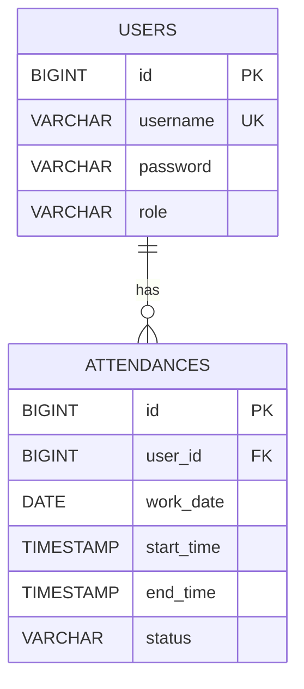

# Lesson2事前学習: SQL・RDB基礎

この資料は、Spring Data JPAを使う前に、データベースの最小用語とSQLの役割を理解するための教材です。
複雑なSQLを暗記することではなく、Entity / Repository / DBの対応を追跡できる状態を目指します。

## 目的

- RDBのテーブル・行・列を説明できる
- 主キー・外部キー・一意制約の役割を説明できる
- `SELECT` / `INSERT` / `UPDATE` / `DELETE` の目的を区別できる
- EntityのフィールドとDB列を対応づけられる
- Repositoryの操作がどのSQLに相当するか説明できる
- トランザクションとインデックスの目的を概要レベルで説明できる

## 1. DBとRDB

- DB（データベース）: データを保存し、検索や更新を行う仕組み
- RDB（リレーショナルデータベース）: データを表形式のテーブルで管理し、テーブル間を関連づけるDB
- H2: Lesson2〜5で使用する学習用RDB
- MariaDB: 環境演習A/Bで使用するRDB

テーブルの例:

| id | username | role |
| ---: | --- | --- |
| 1 | admin | ROLE_ADMIN |
| 2 | user1 | ROLE_USER |

- テーブル: `users` 全体
- 行（レコード）: ユーザー1件
- 列（カラム）: `id`, `username`, `role` などの項目

## 2. 勤怠アプリのテーブル

```text
users
├── id
├── username
├── password
└── role

attendances
├── id
├── user_id
├── work_date
├── start_time
├── end_time
└── status
```

`attendances.user_id` は、`users.id` を参照します。
これにより「どのユーザーの勤怠か」を関連づけられます。



## 3. 主キー・外部キー・制約

| 用語 | 役割 | 勤怠アプリの例 |
| --- | --- | --- |
| 主キー（Primary Key） | 行を一意に識別する | `users.id`, `attendances.id` |
| 外部キー（Foreign Key） | 別テーブルの行を参照する | `attendances.user_id -> users.id` |
| `NOT NULL` | 値なしを禁止する | `username`, `work_date` |
| `UNIQUE` | 同じ値の重複を禁止する | `users.username` |
| 複合一意制約 | 複数列の組み合わせの重複を禁止する | `user_id + work_date` |

勤怠アプリでは、Serviceで二重出勤を確認するだけでなく、DBでも同一ユーザー・同一日付の重複を禁止します。
アプリケーションの判定とDB制約を組み合わせて、データの不整合を防ぎます。

## 4. CRUDとSQL

CRUDは、データ操作の4分類です。

| CRUD | SQL | 目的 |
| --- | --- | --- |
| Create | `INSERT` | 新しい行を登録する |
| Read | `SELECT` | 行を取得する |
| Update | `UPDATE` | 既存行を更新する |
| Delete | `DELETE` | 行を削除する |

### SELECT

```sql
SELECT id, username, role
FROM users;
```

条件を付ける場合:

```sql
SELECT id, username, role
FROM users
WHERE username = 'user1';
```

並び替える場合:

```sql
SELECT id, user_id, work_date, status
FROM attendances
ORDER BY work_date DESC;
```

### INSERT

```sql
INSERT INTO users (username, password, role)
VALUES ('user2', 'encoded-password', 'ROLE_USER');
```

### UPDATE

```sql
UPDATE attendances
SET status = 'FINISHED'
WHERE id = 1;
```

### DELETE

```sql
DELETE FROM users
WHERE id = 3;
```

`UPDATE` や `DELETE` で `WHERE` を付け忘れると、複数行を意図せず変更する危険があります。
この研修では、Lesson4までは主に読み取りSQLを使って安全に確認します。

## 5. JOIN

`attendances` にはユーザー名ではなく `user_id` が保存されています。
ユーザー名と勤怠を同時に確認するときは、外部キーを使ってテーブルを結合します。

```sql
SELECT
    a.id,
    u.username,
    a.work_date,
    a.start_time,
    a.end_time,
    a.status
FROM attendances a
JOIN users u ON u.id = a.user_id
ORDER BY a.work_date DESC;
```

- `a`: `attendances` の短い別名
- `u`: `users` の短い別名
- `ON u.id = a.user_id`: 関連づける条件

## 6. Entityとテーブルの対応

Spring Data JPAでは、JavaクラスとDBテーブルの対応をアノテーションで表します。

```java
@Entity
@Table(name = "users")
public class User {
    @Id
    @GeneratedValue(strategy = GenerationType.IDENTITY)
    private Long id;

    @Column(nullable = false, unique = true)
    private String username;
}
```

対応:

| Java / JPA | DB |
| --- | --- |
| `@Entity` | DBへ保存するクラス |
| `@Table(name = "users")` | `users` テーブル |
| `@Id` | 主キー |
| `@GeneratedValue` | DBによるID自動採番 |
| `@Column(nullable = false)` | `NOT NULL` |
| `@Column(unique = true)` | `UNIQUE` |
| `@ManyToOne` | 複数の勤怠から1ユーザーへの関連 |
| `@JoinColumn(name = "user_id")` | 外部キー列 `user_id` |

## 7. RepositoryとSQLの対応

Spring Data JPAでは、Repositoryのメソッド呼び出しを通じてSQL相当の処理を実行します。

| Repository操作 | SQL相当 |
| --- | --- |
| `save(entity)` | 新規なら `INSERT`、既存なら `UPDATE` |
| `findById(id)` | 主キーを条件にした `SELECT` |
| `findAll()` | 全件 `SELECT` |
| `delete(entity)` | `DELETE` |
| `findByUsername(username)` | `username` を条件にした `SELECT` |

Lesson2ではSQLを直接書かず、メソッド名やJPAの仕組みからSQLが生成されます。
起動ログやH2コンソールで、実際のテーブルとデータを確認します。

## 8. トランザクション

トランザクションは、複数のDB操作をひとまとまりとして扱う仕組みです。

例:

1. 対象ユーザーを検索する
2. 当日の勤怠がないことを確認する
3. 新しい勤怠を保存する

途中で失敗した場合に中途半端な状態を残さないことが重要です。
Springでは、Serviceの処理に `@Transactional` を付けてトランザクション境界を示します。

この段階では次だけ覚えます。

- すべて成功したら確定する
- 途中で失敗したら元に戻す
- 業務処理のまとまりをServiceで表す

## 9. インデックス

インデックスは、特定の列を使った検索や並び替えを補助する仕組みです。
本の索引と同様に、全行を順番に確認するより対象を探しやすくします。

ただし、インデックスは増やせばよいわけではありません。
保存時の更新コストや容量が増えるため、実際の検索条件に合わせて設計します。

Lesson7では、Flywayのマイグレーションとして次のSQLを扱います。

```sql
CREATE INDEX idx_attendances_work_date
    ON attendances(work_date);
```

## 10. 完了条件

次を説明できればLesson2本編へ進みます。

1. テーブル・行・列の違い
2. 主キーと外部キーの違い
3. `user_id + work_date` の一意制約が必要な理由
4. `SELECT` / `INSERT` / `UPDATE` / `DELETE` の用途
5. `User` Entityと `users` テーブルの対応
6. RepositoryがDBアクセスの窓口になる理由
7. トランザクションが必要な理由

確認問題:

1. `attendances.user_id` はどの列を参照するか
2. `findById(1L)` は、どのようなSQLに相当するか
3. 同じユーザーの同じ日付に2件登録できないようにする制約は何か
4. 勤怠一覧を新しい日付順に並べるSQLはどのように書くか
