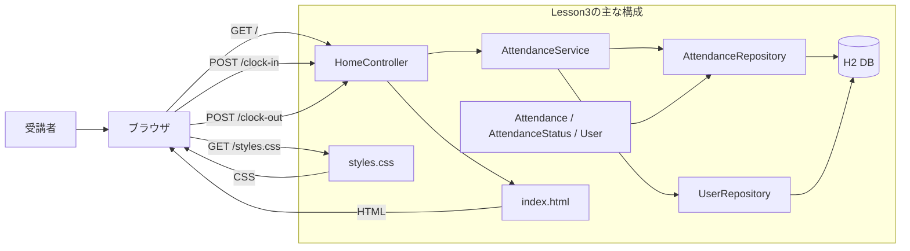
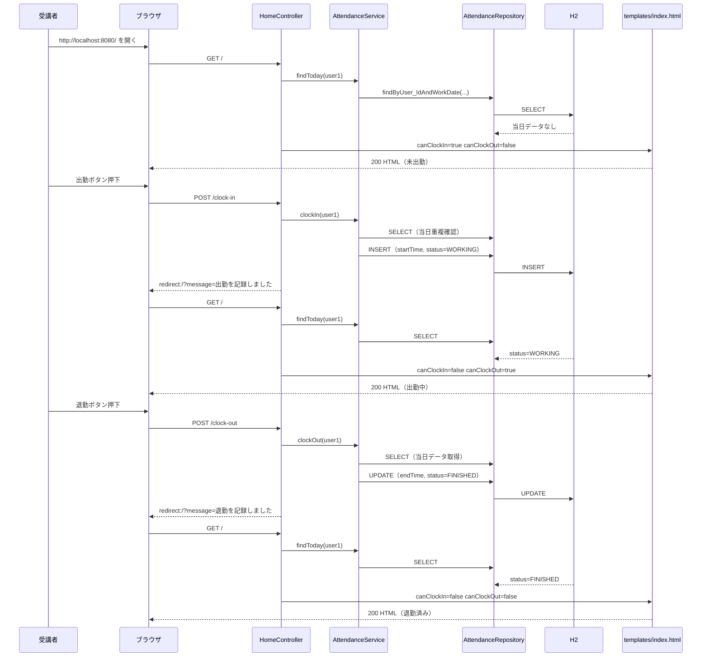
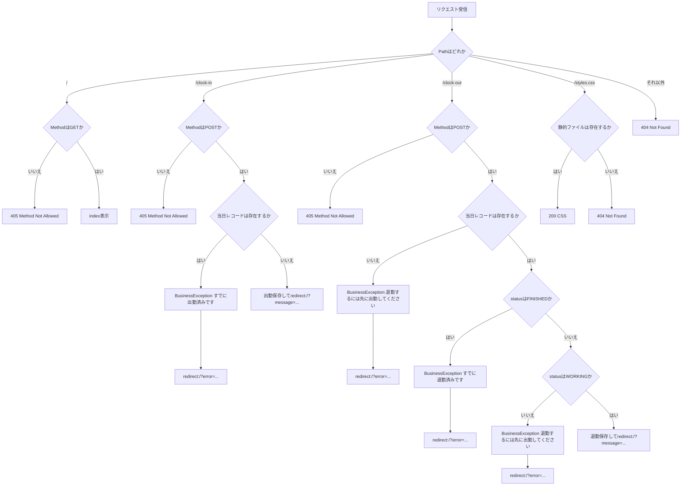

# Lesson3（7/13）退勤機能と業務ルール実装（Lesson2から拡張）

## 目的（Lesson3でできるようになること）
- 退勤 (`POST /clock-out`) を実装できる
- 状態遷移（未出勤 -> 出勤中 -> 退勤済み）をコードで説明できる
- 業務ルール違反時に画面へエラーメッセージを表示できる
- ログレベルによる出力差と、安全なログ出力の基本を説明できる

## 前提
- Lesson2 を完了している
- `~/order-management-springboot/stages/lesson02` のアプリが起動・動作確認できている

バックエンド短縮コースでは、HTML/CSSの差分は講師提供コードを使用します。
受講者は提供コードを内容や説明コメントを削らず配置し、Controllerが設定する状態と画面表示条件を対応づけます。

## Lesson3で作るもの
- 画面: `/`
- 機能:
  - 出勤（Lesson2の継続）
  - 退勤（新規）
  - ルール違反表示
    - 未出勤で退勤不可
    - 退勤済みで再退勤不可

### 全体構成図（ファイルと役割）


### データ受け渡し最小メモ（JSONはLesson3でも未使用）
- Lesson3もフォーム送信中心で、`fetch` + JSON API は使わない。
- `POST /clock-in` と `POST /clock-out` を送信し、結果は `redirect:/` で画面に戻す。
- 成功/失敗メッセージは `RedirectAttributes` で受け渡す。
- 例:
  ```java
  redirectAttributes.addAttribute("message", "退勤を記録しました");
  redirectAttributes.addAttribute("error", e.getMessage());
  return "redirect:/";
  ```
- 画面表示の制御は `canClockIn` / `canClockOut` を `Model` に詰めて行う。

### 状態遷移を含む時系列（正常系）


### ルーティングと異常系の分岐（404/405/業務エラー）


---

## 0. 事前確認
```bash
java -version
mvn -version
git --version
```

---

## 1. 作業フォルダを準備（Lesson2を複製）
Lesson3 は Lesson2 を土台に進めます。`~/order-management-springboot/stages/lesson03` を作成して Lesson2 の内容をコピーしてください。

```bash
mkdir -p ~/order-management-springboot/stages/lesson03
cp -r ~/order-management-springboot/stages/lesson02/* ~/order-management-springboot/stages/lesson03/
cd ~/order-management-springboot/stages/lesson03
```

以降の `作成ファイル` は、`~/order-management-springboot` からのフルパスで表記します。  
例: `~/order-management-springboot/stages/lesson03/src/main/java/...`

---

## 2. `AttendanceService` を編集（退勤ロジック追加）
作成ファイル: `~/order-management-springboot/stages/lesson03/src/main/java/com/shinesoft/attendance/service/AttendanceService.java`

全文を以下に置き換えてください。

```java
// Serviceクラスを置くパッケージ
package com.shinesoft.attendance.service;

import java.time.LocalDate;
import java.time.LocalDateTime;
import java.util.Optional;

import org.slf4j.Logger;
import org.slf4j.LoggerFactory;
import org.springframework.stereotype.Service;

import com.shinesoft.attendance.domain.Attendance;
import com.shinesoft.attendance.domain.AttendanceStatus;
import com.shinesoft.attendance.domain.User;
import com.shinesoft.attendance.exception.BusinessException;
import com.shinesoft.attendance.repository.AttendanceRepository;
import com.shinesoft.attendance.repository.UserRepository;

// 業務ロジックを担当するクラス（Controllerから分離）
@Service
public class AttendanceService {
    // 操作履歴を出力するロガー
    private static final Logger log = LoggerFactory.getLogger(AttendanceService.class);

    // DBアクセス層（依存注入）
    private final AttendanceRepository attendanceRepository;
    private final UserRepository userRepository;

    // コンストラクタインジェクション
    public AttendanceService(AttendanceRepository attendanceRepository, UserRepository userRepository) {
        this.attendanceRepository = attendanceRepository;
        this.userRepository = userRepository;
    }

    // 当日の勤怠を取得（無ければOptional.empty）
    public Optional<Attendance> findToday(Long userId) {
        return attendanceRepository.findByUser_IdAndWorkDate(userId, LocalDate.now());
    }

    // 出勤処理（Lesson2から継続）
    public Attendance clockIn(Long userId) {
        // 1. 今日の日付を取得
        LocalDate today = LocalDate.now();
        // 2. 同日レコードが既にあるか確認
        Optional<Attendance> existing = attendanceRepository.findByUser_IdAndWorkDate(userId, today);
        if (existing.isPresent()) {
            // 3. 既存レコードがあれば二重出勤として業務エラー
            throw new BusinessException("すでに出勤済みです");
        }

        // 4. 対象ユーザー取得（存在しなければシステムエラー）
        User user = userRepository.findById(userId)
            .orElseThrow(() -> new IllegalStateException("研修ユーザーが存在しません"));

        // 5. 新規勤怠レコード作成
        Attendance attendance = new Attendance();
        attendance.setUser(user);
        attendance.setWorkDate(today);
        // 出勤時刻は現在時刻
        attendance.setStartTime(LocalDateTime.now());
        // 出勤後の状態
        attendance.setStatus(AttendanceStatus.WORKING);

        // 6. 保存してログ出力
        Attendance saved = attendanceRepository.save(attendance);
        log.info("clock-in userId={} date={} time={}", userId, saved.getWorkDate(), saved.getStartTime());
        return saved;
    }

    // 退勤処理（Lesson3で追加）
    public Attendance clockOut(Long userId) {
        // 1. 今日の日付で当日レコードを取得
        LocalDate today = LocalDate.now();
        Attendance attendance = attendanceRepository.findByUser_IdAndWorkDate(userId, today)
            // レコードが無い = まだ出勤していない
            .orElseThrow(() -> new BusinessException("退勤するには先に出勤してください"));

        // 2. すでに退勤済みなら再退勤は禁止
        if (attendance.getStatus() == AttendanceStatus.FINISHED) {
            throw new BusinessException("すでに退勤済みです");
        }
        // 3. 出勤中以外の状態では退勤不可
        if (attendance.getStatus() != AttendanceStatus.WORKING) {
            throw new BusinessException("退勤するには先に出勤してください");
        }

        // 4. 退勤時刻と状態を更新
        attendance.setEndTime(LocalDateTime.now());
        attendance.setStatus(AttendanceStatus.FINISHED);

        // 5. 保存してログ出力
        Attendance saved = attendanceRepository.save(attendance);
        log.info("clock-out userId={} date={} time={}", userId, saved.getWorkDate(), saved.getEndTime());
        return saved;
    }
}
```

ポイント:
- `clockOut` は「当日レコードが無ければエラー」
- `FINISHED` の再退勤を禁止
- 成功時は `endTime` と `status=FINISHED` を更新

理解ポイント（20分）:
- この変更の目的:
  - Lesson2の出勤のみ機能に「退勤」と状態遷移を追加する
- 重要ポイント:
  - `findByUser_IdAndWorkDate(...)` で当日レコードを取得
  - レコード未作成時は `退勤するには先に出勤してください`
  - `FINISHED` の再退勤を明示的に禁止
  - 正常時のみ `endTime` と `status` を更新
- ログ観点:
  - `clock-out ...` のINFOログで操作記録を追える
- よくあるミス:
  - `WORKING` 判定を入れ忘れて不正退勤を許してしまう

---

## 2.5 Lesson2のServiceテストを再実行

退勤処理を追加した後も、Lesson2で作成した「二重出勤禁止」のテストが成功することを確認します。

```bash
mvn -Dtest=AttendanceServiceTest test
```

この時点ではテストを増やしません。既存機能を壊していないことを先に確認し、Lesson5Cで状態遷移テストを発展させます。

---

## 3. `HomeController` を編集（退勤エンドポイント追加）
作成ファイル: `~/order-management-springboot/stages/lesson03/src/main/java/com/shinesoft/attendance/web/HomeController.java`

全文を以下に置き換えてください。

```java
// 画面（Web）層のクラスを置くパッケージ
package com.shinesoft.attendance.web;

import java.time.LocalDate;
import java.time.LocalDateTime;
import java.time.format.DateTimeFormatter;
import java.util.Optional;

import org.springframework.stereotype.Controller;
import org.springframework.ui.Model;
import org.springframework.web.bind.annotation.GetMapping;
import org.springframework.web.bind.annotation.PostMapping;
import org.springframework.web.bind.annotation.RequestParam;
import org.springframework.web.servlet.mvc.support.RedirectAttributes;

import com.shinesoft.attendance.domain.Attendance;
import com.shinesoft.attendance.domain.AttendanceStatus;
import com.shinesoft.attendance.exception.BusinessException;
import com.shinesoft.attendance.service.AttendanceService;

// 画面表示を担当するController
@Controller
public class HomeController {
    // Lesson3は固定ユーザーで進める（認証はLesson5で実装）
    private static final Long TRAINING_USER_ID = 1L;
    // 日時表示フォーマット
    private static final DateTimeFormatter FMT = DateTimeFormatter.ofPattern("yyyy-MM-dd HH:mm:ss");

    // 業務ロジックはServiceに委譲
    private final AttendanceService attendanceService;

    public HomeController(AttendanceService attendanceService) {
        this.attendanceService = attendanceService;
    }

    // トップ画面表示
    @GetMapping("/")
    public String index(Model model,
                        // リダイレクト時に受け取る成功メッセージ（任意）
                        @RequestParam(value = "message", required = false) String message,
                        // リダイレクト時に受け取るエラーメッセージ（任意）
                        @RequestParam(value = "error", required = false) String error) {
        // 当日の勤怠を取得
        Optional<Attendance> today = attendanceService.findToday(TRAINING_USER_ID);

        // テンプレートに渡す表示データを準備
        model.addAttribute("workDate", LocalDate.now());
        model.addAttribute("statusLabel", toStatusLabel(today));
        model.addAttribute("startTime", format(today.map(Attendance::getStartTime).orElse(null)));
        model.addAttribute("endTime", format(today.map(Attendance::getEndTime).orElse(null)));
        // 出勤ボタン: 当日レコードがまだ無い時のみ表示
        model.addAttribute("canClockIn", today.isEmpty());
        // 退勤ボタン: 当日レコードがあり、状態がWORKINGの時のみ表示
        model.addAttribute("canClockOut", today.isPresent() && today.get().getStatus() == AttendanceStatus.WORKING);
        model.addAttribute("message", message);
        model.addAttribute("error", error);
        // templates/index.html を表示
        return "index";
    }

    // 出勤ボタン押下時の処理
    @PostMapping("/clock-in")
    public String clockIn(RedirectAttributes redirectAttributes) {
        try {
            // 出勤処理を実行
            attendanceService.clockIn(TRAINING_USER_ID);
            redirectAttributes.addAttribute("message", "出勤を記録しました");
        } catch (BusinessException e) {
            // 業務エラーは画面向けメッセージとして返す
            redirectAttributes.addAttribute("error", e.getMessage());
        }
        // POST後はGETへリダイレクト（PRGパターン）
        return "redirect:/";
    }

    // 退勤ボタン押下時の処理（Lesson3で追加）
    @PostMapping("/clock-out")
    public String clockOut(RedirectAttributes redirectAttributes) {
        try {
            // 退勤処理を実行
            attendanceService.clockOut(TRAINING_USER_ID);
            redirectAttributes.addAttribute("message", "退勤を記録しました");
        } catch (BusinessException e) {
            // 業務エラーは画面向けメッセージとして返す
            redirectAttributes.addAttribute("error", e.getMessage());
        }
        // POST後はGETへリダイレクト（PRGパターン）
        return "redirect:/";
    }

    // 勤怠状態を画面表示用文字列へ変換
    private String toStatusLabel(Optional<Attendance> today) {
        if (today.isEmpty()) {
            return "未出勤";
        }
        AttendanceStatus status = today.get().getStatus();
        if (status == AttendanceStatus.WORKING) {
            return "出勤中";
        }
        if (status == AttendanceStatus.FINISHED) {
            return "退勤済み";
        }
        return "未出勤";
    }

    // 日時表示の共通フォーマッタ
    private String format(LocalDateTime value) {
        if (value == null) {
            // 値が無い時は "-" を表示
            return "-";
        }
        return value.format(FMT);
    }
}
```

ポイント:
- `@PostMapping("/clock-out")` を追加
- 画面表示のため `canClockOut` を Model に追加

理解ポイント（15分）:
- この変更の目的:
  - 退勤APIを画面から呼び出せるようにする
- 重要ポイント:
  - `clockOut(...)` でServiceの退勤処理を実行
  - 例外時は `error`、成功時は `message` をリダイレクトで返す
  - `canClockOut` で「退勤ボタンを表示してよい状態」を判定
- 表示制御の考え方:
  - ボタン表示条件はControllerで作り、HTMLは受けて描画する
- よくあるミス:
  - `@PostMapping` ではなく `@GetMapping` にしてしまう

---

## 4. `index.html` を編集（退勤ボタン表示）
作成ファイル: `~/order-management-springboot/stages/lesson03/src/main/resources/templates/index.html`

バックエンド短縮コース:

- 以下の完成コードを講師提供コードとして使用する
- 既存ファイルを完成コードへ更新し、説明コメントを含めて内容を削除しない
- `canClockIn` / `canClockOut` と `th:if` の対応、`POST /clock-out` の送信先を確認する

全文を以下に置き換えてください。

```html
<!-- HTML5の文書宣言 -->
<!doctype html>
<!-- Thymeleafを使うため xmlns:th を宣言 -->
<html lang="ja" xmlns:th="http://www.thymeleaf.org">
<head>
  <!-- 文字コード -->
  <meta charset="utf-8" />
  <!-- スマホ表示用の基本設定 -->
  <meta name="viewport" content="width=device-width, initial-scale=1" />
  <title>勤怠管理（Lesson3）</title>
  <!-- /static 配下のCSSを読み込む -->
  <link rel="stylesheet" th:href="@{/styles.css}" />
</head>
<body>
  <!-- 画面全体コンテナ -->
  <div class="container">
    <header>
      <h1>勤怠管理システム（MVP）</h1>
      <p class="subtitle">Lesson3: 退勤機能と業務ルール</p>
    </header>

    <!-- message がある時のみ成功通知表示 -->
    <div th:if="${message}" class="alert alert-info" th:text="${message}"></div>
    <!-- error がある時のみエラー通知表示 -->
    <div th:if="${error}" class="alert alert-error" th:text="${error}"></div>

    <!-- 今日の勤怠表示パネル -->
    <section class="panel">
      <div class="panel-header">
        <h2>今日の勤怠</h2>
        <!-- Controllerで作った statusLabel を表示 -->
        <span class="status-badge" th:text="${statusLabel}">未出勤</span>
      </div>
      <!-- 値があれば差し込み、無ければフォールバック値を表示 -->
      <p>日付: <span th:text="${workDate}">2026-02-05</span></p>
      <p>出勤時刻: <span th:text="${startTime}">-</span></p>
      <p>退勤時刻: <span th:text="${endTime}">-</span></p>

      <!-- 出勤・退勤ボタンを横並びにする -->
      <div class="row">
        <!-- canClockIn=true の時だけ出勤ボタンを表示 -->
        <form th:if="${canClockIn}" method="post" th:action="@{/clock-in}">
          <button type="submit">出勤</button>
        </form>

        <!-- canClockOut=true の時だけ退勤ボタンを表示 -->
        <form th:if="${canClockOut}" method="post" th:action="@{/clock-out}">
          <!-- danger クラスで退勤ボタンを強調 -->
          <button type="submit" class="danger">退勤</button>
        </form>
      </div>

      <!-- 退勤済み（両ボタン非表示）時の案内 -->
      <p th:if="${!canClockIn and !canClockOut}" class="muted">
        本日の勤怠は確定済みです（退勤済み）。
      </p>
    </section>
  </div>
</body>
</html>
```

理解ポイント（15分）:
- この変更の目的:
  - 画面に「退勤」ボタンと完了表示を追加する
- 重要ポイント:
  - `th:if="${canClockOut}"` で退勤ボタンを制御
  - `th:if="${!canClockIn and !canClockOut}"` で退勤済み文言を表示
  - `class="danger"` で退勤ボタンを視覚的に区別
- 変更して試す:
  - 退勤前/退勤後でボタン表示がどう変わるか確認
- よくあるミス:
  - `th:if` 条件式の否定や `and` の書き間違い

---

## 5. `styles.css` を編集（退勤ボタン用クラス）
作成ファイル: `~/order-management-springboot/stages/lesson03/src/main/resources/static/styles.css`

バックエンド短縮コースでは、以下のCSS差分を提供コードとして反映します。
CSS文法は評価せず、`class="danger"` と表示結果の対応だけ確認します。既存の説明コメントは削除しません。

`styles.css` に以下を追加。

```css
/* 出勤ボタンと退勤ボタンを横並びにする */
.row {
  /* 子要素を横方向に並べる */
  display: flex;
  /* ボタン間の余白 */
  gap: 8px;
  /* 幅が足りない時は折り返す */
  flex-wrap: wrap;
  /* 高さ方向を中央揃え */
  align-items: center;
}

/* 危険操作（退勤）を目立たせる色 */
.danger {
  background: #ef4444;
}
```

理解ポイント（5分）:
- この変更の目的:
  - 退勤ボタンを強調表示して誤操作を減らす
- 重要ポイント:
  - `.row` で出勤/退勤フォームを横並びにする
  - `.danger` で破壊系アクションの色を分ける
- よくあるミス:
  - HTML側に `class="danger"` を付け忘れる

---

## 6. 起動
```bash
cd ~/order-management-springboot/stages/lesson03
mvn spring-boot:run
```

---

## 7. 動作確認（必須）
この確認で分かること:
- 未出勤のまま退勤できない（業務ルール違反）
- 出勤中なら退勤できる（正常系）
- 退勤済みの再退勤を禁止できる（業務ルール違反）

先にターミナルを2つ用意して進めます。

- ターミナルA（起動用）:
  - `cd ~/order-management-springboot/stages/lesson03`
  - `mvn spring-boot:run` を実行し、そのまま起動状態を維持する
- ターミナルB（確認用）:
  - `curl` や追加確認コマンドを実行する
  - ※ `mvn spring-boot:run` 実行中のターミナルAでは `curl` は入力できない

`curl -i` の結果の見方:
- `HTTP/1.1 302` は正常（POST後に `redirect:/` するため）
- `Location` に `?message=...` があれば成功
- `Location` に `?error=...` があれば業務エラー
- 日本語メッセージはURLエンコードされるため、まず `message=` / `error=` を見る

1. `http://localhost:8080/` を開く
2. 初期状態で「未出勤」を確認
3. 未出勤のまま退勤APIを直接呼び、エラーになることを確認

```bash
# ターミナルBで実行
curl -X POST http://localhost:8080/clock-out -i
```

4. 出勤APIを呼び、成功になることを確認

```bash
# ターミナルBで実行
curl -X POST http://localhost:8080/clock-in -i
```

5. 退勤APIを呼び、成功になることを確認

```bash
# ターミナルBで実行
curl -X POST http://localhost:8080/clock-out -i
```

6. 再度退勤APIを呼び、`すでに退勤済みです` のエラーになることを確認

```bash
# ターミナルBで実行
curl -X POST http://localhost:8080/clock-out -i
```

7. ブラウザを再読み込みし、状態が「退勤済み」になっていることを確認

---

## 8. ログ出力の理解と確認（必須）

### 8-1. ログレベルを使い分ける

ログは、画面に表示するメッセージとは目的が異なります。運用担当者や開発者が、アプリ内部で何が起きたかを後から確認するために残します。

| レベル | この教材での使い分け |
| --- | --- |
| `ERROR` | 処理を正常に継続できない予期しない例外。例外オブジェクトも渡して原因を残す |
| `WARN` | 処理は継続できるが、調査や注意が必要な状態 |
| `INFO` | 出勤・退勤など、正常に完了した重要な業務操作 |
| `DEBUG` | 開発中の調査に必要な詳細情報。本番環境では通常は常時出力しない |
| `TRACE` | `DEBUG` より細かい追跡情報。必要な期間と範囲を限定して使う |

`AttendanceService` では、文字列を連結せず `{}` プレースホルダーを使っています。

```java
log.info("clock-in userId={} date={} time={}",
         userId, saved.getWorkDate(), saved.getStartTime());
```

プレースホルダーを使うと、値の区切りが明確になり、対象レベルが無効な場合の不要な文字列生成も避けられます。

ログへ出してはいけない情報:
- パスワード、APIキー、アクセストークン、セッションID
- `DB_PASSWORD` などの秘密の環境変数
- 目的なく収集した住所、電話番号などの個人情報

予期しない例外を記録する場合は、メッセージだけでなく例外オブジェクトも渡します。

```java
log.error("Unexpected error while processing attendance", ex);
```

### 8-2. `INFO`ログを確認する

通常起動したターミナルで、次のようなログが出ることを確認してください。

- `clock-in userId=1 ...`
- `clock-out userId=1 ...`

`application.yml` の `${LOG_LEVEL:INFO}` は、環境変数 `LOG_LEVEL` が未設定なら `INFO` を使う、という意味です。

### 8-3. ログレベルによる出力差を比較する

各確認の前に、起動中のアプリを `Ctrl + C` で停止します。H2はインメモリDBのため、再起動すると勤怠データが初期化されます。

1. `ERROR`で起動します。

```bash
LOG_LEVEL=ERROR mvn spring-boot:run
```

別ターミナルで出勤を実行します。

```bash
curl -i -X POST http://localhost:8080/clock-in
```

HTTP処理は成功しますが、`clock-in userId=...` の`INFO`ログは表示されないことを確認します。

2. 停止後、`DEBUG`で起動します。

```bash
LOG_LEVEL=DEBUG mvn spring-boot:run
```

`INFO`起動時よりSpring内部の詳細ログが増えることを確認します。確認後は停止し、通常の`INFO`設定へ戻します。

```bash
mvn spring-boot:run
```

### 8-4. 説明確認

次を自分の言葉で説明できれば合格です。

1. `LOG_LEVEL=ERROR`で`log.info(...)`が表示されない理由
2. 正常な出勤を`INFO`、予期しない例外を`ERROR`にする理由
3. `{}`プレースホルダーを使う理由
4. パスワードやトークンをログへ出してはいけない理由

---

## 9. コード確認ポイント
- `AttendanceService#clockOut` で業務ルールを集約している
- `HomeController` は画面入出力に集中し、`BusinessException` を画面メッセージに変換している
- `index.html` は `canClockIn / canClockOut` でボタンの表示を制御している

---

## 10. つまずきポイント
- 退勤ボタンが出ない:
  - `canClockOut` の条件式が `WORKING` 判定になっているか確認
- `Request method 'POST' is required`:
  - 退勤は `GET` ではなく `POST /clock-out`
- 何度も同じ結果になる:
  - 前日の状態ではなく「当日レコード」を見ているか (`LocalDate.now()`)

---

## 11. 時間割目安
- 午前: Lesson2コードの複製と差分実装（90分）
- 午後: 業務ルール検証（60分）+ ログ比較演習（45分）+ コード確認（15分）+ まとめ（30分）

バックエンド短縮コースではHTML/CSS編集時間を削減し、状態遷移、業務例外、ログレベルの比較へ時間を配分します。
