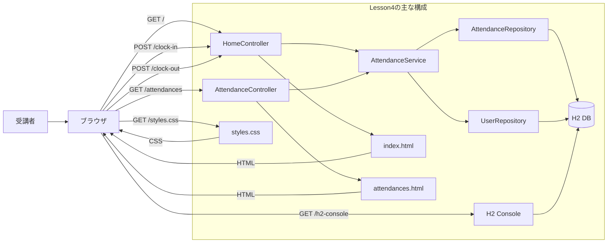
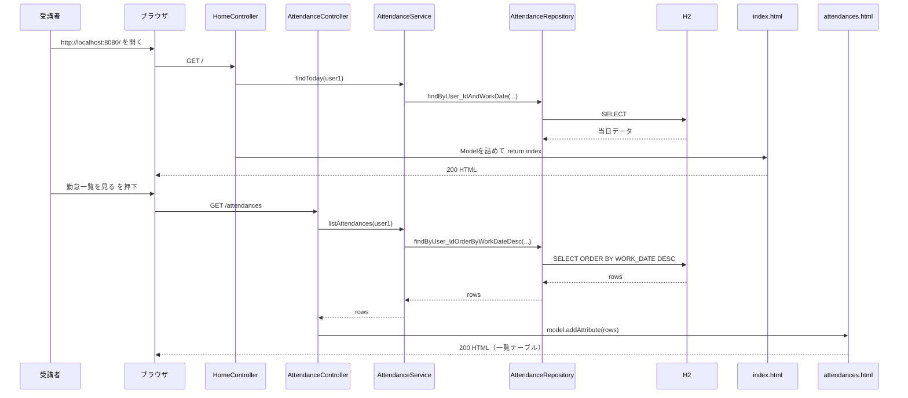
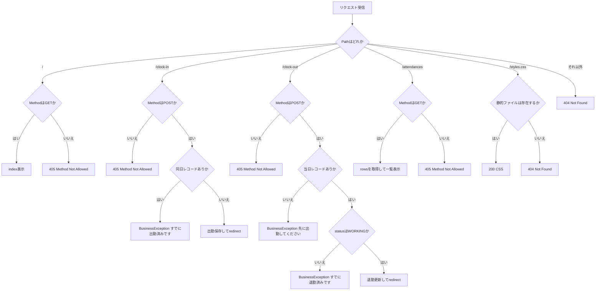

# Lesson4（7/14）勤怠一覧画面とH2確認（Lesson3から拡張）

## 目的（Lesson4でできるようになること）
- 勤怠一覧ページ（`GET /attendances`）を実装できる
- Repository -> Service -> Controller で一覧データを取得できる
- H2コンソールで登録済みデータを確認できる

## 前提
- Lesson3 を完了している
- `~/order-management-springboot/stages/lesson03` が起動し、出勤/退勤の動作確認が終わっている

バックエンド短縮コースでは、HTML/CSSの差分は講師提供コードを使用します。
画面コードの実装は評価せず、一覧データの取得、`Model`、Thymeleafの繰り返し表示、DBの値を対応づけます。

## Lesson4で作るもの
- 画面:
  - `/`（トップ）
  - `/attendances`（勤怠一覧）
- 機能:
  - 勤怠履歴の降順表示（日付, 出勤時刻, 退勤時刻, 状態）
  - トップから一覧への遷移リンク

### 全体構成図（ファイルと役割）


### データ受け渡し最小メモ（JSONはLesson4でも未使用）
- Lesson4もサーバーサイド描画中心で、`fetch` + JSON API は使わない。
- 画面表示データは `Model` でテンプレートへ渡す。
- 例（一覧）:
  ```java
  List<Attendance> rows = attendanceService.listAttendances(1L);
  model.addAttribute("rows", rows);
  return "attendances";
  ```
- `rows` を `th:each` でテーブル表示し、`#temporals.format` で日時を整形する。

### トップ画面から一覧表示まで（正常系の時系列）


### ルーティングと異常系の分岐（404/405/業務エラー）


---

## 0. 事前確認
```bash
java -version
mvn -version
git --version
```

---

## 1. 作業フォルダを準備（Lesson3を複製）
Lesson4 は Lesson3 を土台に進めます。

```bash
mkdir -p ~/order-management-springboot/stages/lesson04
cp -r ~/order-management-springboot/stages/lesson03/* ~/order-management-springboot/stages/lesson04/
cd ~/order-management-springboot/stages/lesson04
```

以降の `作成ファイル` は、`~/order-management-springboot` からのフルパスで表記します。  
例: `~/order-management-springboot/stages/lesson04/src/main/java/...`

---

## 2. `AttendanceRepository` を編集（一覧取得クエリ追加）
作成ファイル: `~/order-management-springboot/stages/lesson04/src/main/java/com/shinesoft/attendance/repository/AttendanceRepository.java`

全文を以下に置き換えてください。

```java
// Repositoryインターフェースを置くパッケージ
package com.shinesoft.attendance.repository;

import java.time.LocalDate;
import java.util.List;
import java.util.Optional;

import org.springframework.data.jpa.repository.JpaRepository;

import com.shinesoft.attendance.domain.Attendance;

// AttendanceテーブルのDB操作窓口
public interface AttendanceRepository extends JpaRepository<Attendance, Long> {
    // userId + 勤務日で当日レコードを1件取得（出勤/退勤判定に使う）
    Optional<Attendance> findByUser_IdAndWorkDate(Long userId, LocalDate workDate);

    // 指定ユーザーの履歴を勤務日降順で取得
    // 直近データを上に表示したい一覧画面向け
    List<Attendance> findByUser_IdOrderByWorkDateDesc(Long userId);
}
```

ポイント:
- `findByUser_IdOrderByWorkDateDesc` で履歴を降順表示する

理解ポイント（10分）:
- この変更の目的:
  - 一覧画面向けに「並び替え済みデータ」をRepositoryで取得する
- 重要ポイント:
  - `findByUser_IdOrderByWorkDateDesc` はメソッド名でソート条件を表現
  - Service/Controller側にソート処理を書かなくてよくなる
- よくあるミス:
  - メソッド名の `WorkDate` などプロパティ名のスペルミス

---

## 3. `AttendanceService` を編集（一覧取得メソッド追加）
作成ファイル: `~/order-management-springboot/stages/lesson04/src/main/java/com/shinesoft/attendance/service/AttendanceService.java`

全文を以下に置き換えてください。

```java
// Serviceクラスを置くパッケージ
package com.shinesoft.attendance.service;

import java.time.LocalDate;
import java.time.LocalDateTime;
import java.util.List;
import java.util.Optional;

import org.slf4j.Logger;
import org.slf4j.LoggerFactory;
import org.springframework.stereotype.Service;

import com.shinesoft.attendance.domain.Attendance;
import com.shinesoft.attendance.domain.AttendanceStatus;
import com.shinesoft.attendance.domain.User;
import com.shinesoft.attendance.exception.BusinessException;
import com.shinesoft.attendance.repository.AttendanceRepository;
import com.shinesoft.attendance.repository.UserRepository;

// 業務ロジックを担当するクラス
@Service
public class AttendanceService {
    // 操作ログ出力用
    private static final Logger log = LoggerFactory.getLogger(AttendanceService.class);

    // DBアクセス層（依存注入）
    private final AttendanceRepository attendanceRepository;
    private final UserRepository userRepository;

    // コンストラクタインジェクション
    public AttendanceService(AttendanceRepository attendanceRepository, UserRepository userRepository) {
        this.attendanceRepository = attendanceRepository;
        this.userRepository = userRepository;
    }

    // 当日の勤怠を取得（無ければOptional.empty）
    public Optional<Attendance> findToday(Long userId) {
        return attendanceRepository.findByUser_IdAndWorkDate(userId, LocalDate.now());
    }

    // 一覧画面用: 指定ユーザーの勤怠履歴を取得（降順）
    public List<Attendance> listAttendances(Long userId) {
        return attendanceRepository.findByUser_IdOrderByWorkDateDesc(userId);
    }

    // 出勤処理（Lesson3までと同じ）
    public Attendance clockIn(Long userId) {
        // 1. 今日の日付
        LocalDate today = LocalDate.now();
        // 2. 同日データがあれば二重出勤エラー
        Optional<Attendance> existing = attendanceRepository.findByUser_IdAndWorkDate(userId, today);
        if (existing.isPresent()) {
            throw new BusinessException("すでに出勤済みです");
        }

        // 3. ユーザー取得（存在しない場合はシステムエラー）
        User user = userRepository.findById(userId)
            .orElseThrow(() -> new IllegalStateException("研修ユーザーが存在しません"));

        // 4. 新規勤怠を作成して出勤状態で保存
        Attendance attendance = new Attendance();
        attendance.setUser(user);
        attendance.setWorkDate(today);
        attendance.setStartTime(LocalDateTime.now());
        attendance.setStatus(AttendanceStatus.WORKING);

        // 5. 保存結果をログ出力
        Attendance saved = attendanceRepository.save(attendance);
        log.info("clock-in userId={} date={} time={}", userId, saved.getWorkDate(), saved.getStartTime());
        return saved;
    }

    // 退勤処理（Lesson3までと同じ）
    public Attendance clockOut(Long userId) {
        // 1. 当日レコード取得（無ければ未出勤）
        LocalDate today = LocalDate.now();
        Attendance attendance = attendanceRepository.findByUser_IdAndWorkDate(userId, today)
            .orElseThrow(() -> new BusinessException("退勤するには先に出勤してください"));

        // 2. すでに退勤済みなら再退勤を禁止
        if (attendance.getStatus() == AttendanceStatus.FINISHED) {
            throw new BusinessException("すでに退勤済みです");
        }
        // 3. 出勤中以外の状態も退勤不可
        if (attendance.getStatus() != AttendanceStatus.WORKING) {
            throw new BusinessException("退勤するには先に出勤してください");
        }

        // 4. 退勤時刻と状態を更新
        attendance.setEndTime(LocalDateTime.now());
        attendance.setStatus(AttendanceStatus.FINISHED);

        // 5. 保存してログ出力
        Attendance saved = attendanceRepository.save(attendance);
        log.info("clock-out userId={} date={} time={}", userId, saved.getWorkDate(), saved.getEndTime());
        return saved;
    }
}
```

理解ポイント（15分）:
- この変更の目的:
  - 一覧取得の業務処理をServiceに追加する
- 重要ポイント:
  - `listAttendances(Long userId)` で一覧取得を1か所に集約
  - 出勤/退勤ロジックはLesson3のまま維持
- 設計ポイント:
  - 一覧取得の呼び出し元（Controller）が増えても、Service APIは1つで済む
- よくあるミス:
  - Controllerから直接Repositoryを呼んで層分離が崩れる

---

## 4. 一覧用Controllerを新規作成
作成ファイル: `~/order-management-springboot/stages/lesson04/src/main/java/com/shinesoft/attendance/web/AttendanceController.java`

新規作成してください。

```java
// 画面（Web）層のクラスを置くパッケージ
package com.shinesoft.attendance.web;

import java.util.List;

import org.springframework.stereotype.Controller;
import org.springframework.ui.Model;
import org.springframework.web.bind.annotation.GetMapping;

import com.shinesoft.attendance.domain.Attendance;
import com.shinesoft.attendance.service.AttendanceService;

// 勤怠一覧画面専用Controller
@Controller
public class AttendanceController {
    // Lesson4までは固定ユーザーを使用（認証はLesson5で実装）
    private static final Long TRAINING_USER_ID = 1L;

    // 一覧取得ロジックはServiceへ委譲
    private final AttendanceService attendanceService;

    public AttendanceController(AttendanceService attendanceService) {
        this.attendanceService = attendanceService;
    }

    // /attendances にアクセスした時の画面表示
    @GetMapping("/attendances")
    public String list(Model model) {
        // 画面表示用の一覧データを取得
        List<Attendance> rows = attendanceService.listAttendances(TRAINING_USER_ID);
        // テンプレートへデータを渡す
        model.addAttribute("rows", rows);
        // templates/attendances.html を表示
        return "attendances";
    }
}
```

理解ポイント（10分）:
- この変更の目的:
  - `/attendances` に対する画面制御を専用Controllerに分離する
- 重要ポイント:
  - `rows` をModelへ詰めて `attendances` テンプレートに渡す
  - `TRAINING_USER_ID = 1L` の固定ユーザーで履歴を表示
- よくあるミス:
  - `return "attendances"` のテンプレート名とファイル名不一致

---

## 5. `HomeController` を編集（一覧画面リンク用）
作成ファイル: `~/order-management-springboot/stages/lesson04/src/main/java/com/shinesoft/attendance/web/HomeController.java`

`HomeController` は Lesson3 のままで動作します。  
このステップでは変更不要です。

---

## 6. 一覧テンプレートを新規作成
作成ファイル: `~/order-management-springboot/stages/lesson04/src/main/resources/templates/attendances.html`

バックエンド短縮コース:

- 以下のコードブロック全体を講師提供コードとして使用する
- `templates/attendances.html` を作成し、内容と説明コメントを削除せず配置する
- `rows` と `th:each` の対応、各列とEntityのフィールドを確認する

新規作成してください。

```html
<!-- HTML5の文書宣言 -->
<!doctype html>
<!-- Thymeleafを使うため xmlns:th を宣言 -->
<html lang="ja" xmlns:th="http://www.thymeleaf.org">
<head>
  <!-- 文字コード -->
  <meta charset="utf-8" />
  <!-- スマホ表示用の基本設定 -->
  <meta name="viewport" content="width=device-width, initial-scale=1" />
  <title>勤怠一覧（Lesson4）</title>
  <!-- static/styles.css を読み込む -->
  <link rel="stylesheet" th:href="@{/styles.css}" />
</head>
<body>
  <!-- ページ全体コンテナ -->
  <div class="container">
    <header>
      <h1>勤怠履歴一覧</h1>
      <p class="subtitle">Lesson4: 一覧表示とDB確認</p>
      <!-- トップ画面へ戻るリンク -->
      <p><a href="/">トップへ戻る</a></p>
    </header>

    <!-- 一覧表示パネル -->
    <section class="panel">
      <table>
        <thead>
          <tr>
            <th>日付</th>
            <th>出勤時刻</th>
            <th>退勤時刻</th>
            <th>状態</th>
          </tr>
        </thead>
        <tbody>
          <!-- rows が空の時に表示する行 -->
          <tr th:if="${#lists.isEmpty(rows)}">
            <td colspan="4" class="muted">データがありません</td>
          </tr>
          <!-- rows の件数分だけ繰り返し表示 -->
          <tr th:each="r : ${rows}">
            <!-- 勤務日 -->
            <td th:text="${r.workDate}">2026-02-05</td>
            <!-- 出勤時刻（nullなら '-'） -->
            <td th:text="${r.startTime != null ? #temporals.format(r.startTime, 'yyyy-MM-dd HH:mm:ss') : '-'}">-</td>
            <!-- 退勤時刻（nullなら '-'） -->
            <td th:text="${r.endTime != null ? #temporals.format(r.endTime, 'yyyy-MM-dd HH:mm:ss') : '-'}">-</td>
            <!-- Enum状態を日本語表示へ変換 -->
            <td th:text="${r.status == T(com.shinesoft.attendance.domain.AttendanceStatus).WORKING ? '出勤中' : (r.status == T(com.shinesoft.attendance.domain.AttendanceStatus).FINISHED ? '退勤済み' : '未出勤')}">未出勤</td>
          </tr>
        </tbody>
      </table>
    </section>
  </div>
</body>
</html>
```

理解ポイント（15分）:
- この変更の目的:
  - 勤怠履歴を表形式で可視化する
- 重要ポイント:
  - `th:each="r : ${rows}"` で繰り返し描画
  - `#temporals.format(...)` で日時フォーマット
  - `#lists.isEmpty(rows)` で空データ時の表示
- 変更して試す:
  - 履歴が0件の状態と1件以上の状態を両方確認
- よくあるミス:
  - `rows` キー名とController側 `model.addAttribute("rows", ...)` の不一致

---

## 7. `index.html` を編集（一覧リンク追加）
作成ファイル: `~/order-management-springboot/stages/lesson04/src/main/resources/templates/index.html`

バックエンド短縮コースでは、以下のリンクを講師提供差分として反映します。
HTML文法は評価せず、`/attendances` と `@GetMapping("/attendances")` の対応を確認します。

`<section class="panel">` の末尾付近に以下の1行を追加してください。

```html
<!-- トップ画面から一覧画面へ移動するリンク -->
<p><a href="/attendances">勤怠一覧を見る</a></p>
```

理解ポイント（5分）:
- この変更の目的:
  - トップ画面から一覧画面への導線を追加する
- 重要ポイント:
  - 画面間遷移はまずリンクで明示する（後でナビ統一しやすい）

---

## 8. `styles.css` を確認
作成ファイル: `~/order-management-springboot/stages/lesson04/src/main/resources/static/styles.css`

Lesson3 の CSS でそのまま表示可能です。  
追加変更は必須ではありません。

バックエンド短縮コースでもCSSは変更せず、提供済みファイルが `static/styles.css` に存在することだけ確認します。

理解ポイント（3分）:
- Lesson4でCSSを増やさない理由:
  - 今回の主眼は「データ取得と一覧描画」
  - 見た目より層構造とデータフローの理解を優先

---

## 9. 起動
```bash
cd ~/order-management-springboot/stages/lesson04
mvn spring-boot:run
```

---

## 10. 動作確認（必須）
1. `http://localhost:8080/` を開く
2. 出勤 -> 退勤を1回実施
3. `勤怠一覧を見る` を押す
4. `http://localhost:8080/attendances` で履歴行が表示されることを確認

---

## 11. H2コンソール確認（必須）
1. `http://localhost:8080/h2-console` を開く
2. JDBC URL に以下を入力

```text
jdbc:h2:mem:attendance
```

3. ユーザー名 `sa`、パスワード空で接続
4. SQL実行:

```sql
SELECT * FROM ATTENDANCES ORDER BY WORK_DATE DESC;
```

5. 画面の一覧と DB の値が一致することを確認

### 11-1. SQL読解演習（バックエンド短縮コース必須）

最初に全件を確認します。

```sql
SELECT *
FROM ATTENDANCES
ORDER BY WORK_DATE DESC;
```

次に、ユーザー名と勤怠を同時に確認します。

```sql
SELECT
    A.ID,
    U.USERNAME,
    A.WORK_DATE,
    A.START_TIME,
    A.END_TIME,
    A.STATUS
FROM ATTENDANCES A
JOIN USERS U ON U.ID = A.USER_ID
ORDER BY A.WORK_DATE DESC;
```

確認ポイント:

1. `ATTENDANCES.USER_ID` と `USERS.ID` が外部キーで対応している
2. `JOIN` により、勤怠とユーザー名を1つの結果で確認できる
3. `ORDER BY ... DESC` により、新しい勤務日から並ぶ
4. 画面の一覧、Entity、SQL結果の同じ1件を対応づける

---

## 12. コード確認ポイント
- `AttendanceRepository` でソート済み取得メソッドを定義している
- `AttendanceService` で一覧取得処理を集約している
- `AttendanceController` は一覧画面表示だけを担当している
- Thymeleaf テーブル描画で `rows` を反復表示している

---

## 13. つまずきポイント
- `TemplateInputException: attendances`:
  - `attendances.html` の配置パスを確認
- 一覧が空:
  - 先にトップ画面で出勤/退勤を実行してレコードを作成
- H2に接続できない:
  - JDBC URL が `jdbc:h2:mem:attendance` になっているか確認

---

## 14. 時間割目安
- 午前: Lesson3コード複製 + 一覧機能追加（90分）
- 午後: H2確認 + コード読解 + まとめ（120分）

バックエンド短縮コースではHTML作成時間を削減し、H2での `SELECT` / `ORDER BY` / `JOIN` とEntityの対応確認へ時間を配分します。
