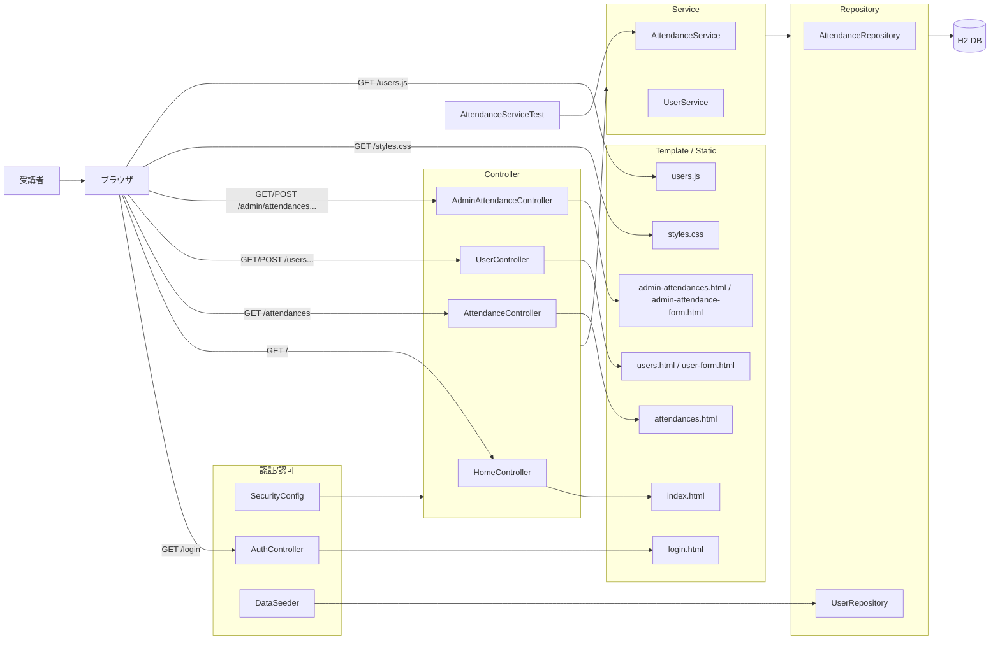
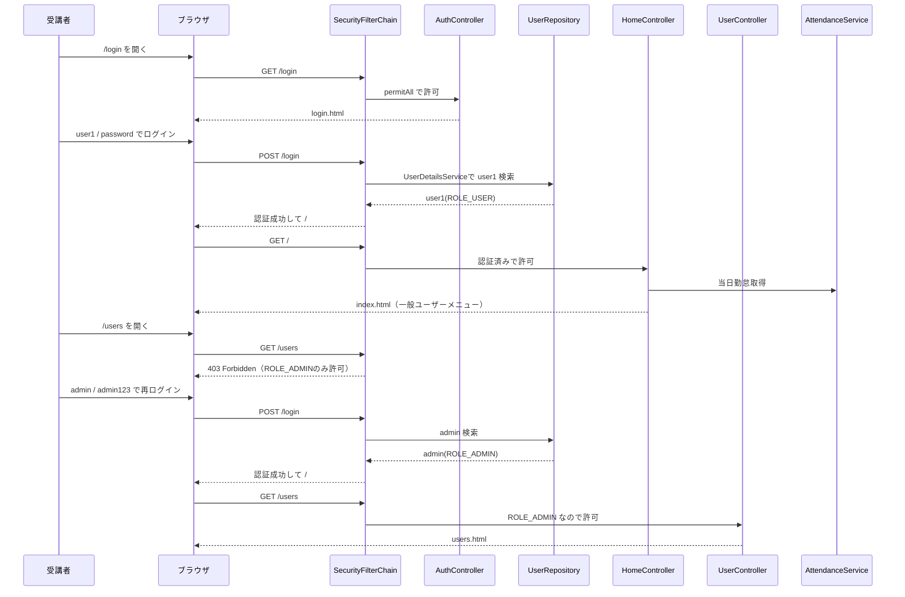
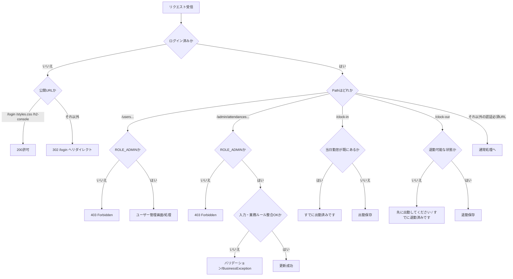

# Lesson5（7/15）ログイン + 管理者機能 + テスト（Lesson4から拡張）

## 目的（Lesson5でできるようになること）
- ログイン機能（Spring Security）を実装できる
- 一般ユーザー / 管理者でアクセス権が分かれることを確認できる
- 管理者のアカウント管理・勤怠編集ができる
- `mvn test` でServiceテストを実行できる
- 画面操作をControllerからRepositoryまでコードで追跡できる

## 前提
- Lesson4 を完了している
- `~/order-management-springboot/stages/lesson04` のトップ/一覧が動作する

バックエンド短縮コースでは、HTML/CSS/JavaScriptは講師提供コードを使用します。
受講者は指定されたファイルを作成し、提供コードを内容や説明コメントを削らず配置します。
フロントエンド文法は評価せず、フォーム送信先、認証・認可、Controller、Service、Repository、テストを重点的に追跡します。

## Lesson5で作るもの
- 画面:
  - `/login`（ログイン）
  - `/`（トップ）
  - `/attendances`（本人の勤怠一覧）
  - `/users`（管理者のユーザー管理）
  - `/admin/attendances`（管理者の勤怠管理）
- 機能:
  - 認証（ログイン / ログアウト）
  - 認可（一般ユーザーと管理者のアクセス制御）
  - 管理者によるユーザー作成/更新/削除
  - 管理者による勤怠編集（整合性チェック）
  - `mvn test` による業務ルール・削除制約・認可の回帰確認

### 全体構成図（ファイルと役割）


### データ受け渡し最小メモ（JSONはLesson5でも中心ではない）
- Lesson5の主軸はサーバーサイド描画とフォーム送信。
- 認証は `POST /login`（Spring Security標準パラメータ `username` / `password`）で実行される。
- 画面データは `Model` で渡し、成功/失敗メッセージは `RedirectAttributes` で引き継ぐ。
- 例:
  ```java
  model.addAttribute("isAdmin", "ROLE_ADMIN".equals(user.getRole()));
  redirectAttributes.addFlashAttribute("message", "ユーザーを更新しました");
  return "redirect:/users";
  ```
- `users.js` は「削除確認ダイアログ」「一覧絞り込み」のUI補助で使う。

### ログインから権限別画面まで（正常系の時系列）


### ルーティングと異常系の分岐（302/403/業務エラー）


---

## 0. 事前確認
```bash
java -version
mvn -version
git --version
```

---

## 1. 作業フォルダを準備（Lesson4を複製）
```bash
mkdir -p ~/order-management-springboot/stages/lesson05
cp -r ~/order-management-springboot/stages/lesson04/* ~/order-management-springboot/stages/lesson05/
cd ~/order-management-springboot/stages/lesson05
```

以降の `作成ファイル` は、`~/order-management-springboot` からのフルパスで表記します。  
例: `~/order-management-springboot/stages/lesson05/src/main/java/...`

---

## 2. ディレクトリを追加
```bash
mkdir -p ~/order-management-springboot/stages/lesson05/src/main/java/com/shinesoft/attendance/config
mkdir -p ~/order-management-springboot/stages/lesson05/src/main/java/com/shinesoft/attendance/web/form
mkdir -p ~/order-management-springboot/stages/lesson05/src/test/java/com/shinesoft/attendance/service
```

---

## 3. `pom.xml` を編集（依存追加）
作成ファイル: `~/order-management-springboot/stages/lesson05/pom.xml`

この章でやること（具体手順）:
1. `~/order-management-springboot/stages/lesson05/pom.xml` を開く
2. 実利用側の `<dependencies>`（`spring-boot-starter-web` などが並んでいるブロック）を探す
3. その `</dependencies>` の直前に、以下3つを追記する
4. Lesson2から引き継いだ `spring-boot-starter-test` が既にあることを確認し、重複追加しない

```xml
<dependency>
  <groupId>org.springframework.boot</groupId>
  <artifactId>spring-boot-starter-security</artifactId>
</dependency>

<dependency>
  <groupId>org.springframework.boot</groupId>
  <artifactId>spring-boot-starter-validation</artifactId>
</dependency>

<dependency>
  <groupId>org.springframework.security</groupId>
  <artifactId>spring-security-test</artifactId>
  <scope>test</scope>
</dependency>
```

Lesson4からの追加依存:
- `spring-boot-starter-security`
- `spring-boot-starter-validation`
- `spring-security-test`（認証・認可のテスト用）

Lesson2から引き継ぐ既存依存（追加済みであることを確認）:

```xml
<dependency>
  <groupId>org.springframework.boot</groupId>
  <artifactId>spring-boot-starter-test</artifactId>
  <scope>test</scope>
</dependency>
```

確認コマンド:
```bash
cd ~/order-management-springboot/stages/lesson05
# 依存が追記されているか確認（Git Bash）
grep -nE "spring-boot-starter-security|spring-boot-starter-validation|spring-boot-starter-test|spring-security-test" pom.xml
# コンパイル確認（成功時は BUILD SUCCESS）
mvn compile
```

理解ポイント（10分）:
- この変更の目的:
  - Lesson5で必要な「認証」「入力検証」「テスト」を有効化する
- 依存の意味:
  - `spring-boot-starter-security`: ログイン/権限制御
  - `spring-boot-starter-validation`: `@Valid` / `@NotBlank` など入力検証
  - `spring-boot-starter-test`: Lesson2から使用しているJUnit + Mockito + Spring Test
  - `spring-security-test`: 認証・認可の自動テスト
- よくあるミス:
  - 依存追加漏れで `org.springframework.security...` や `jakarta.validation...` のコンパイルエラー

---

## 4. Lesson5差分を手動追記（理解優先の3フェーズ）
Lesson5は差分が多いため、手動で一気に作ると混乱しやすいです。  
この章では、Lesson4コードから段階的に追記して「何が増えたか」を理解しながら進めます。

バックエンド短縮コースの作業ルール:

- Javaコードと設定ファイルは、通常どおりフェーズごとに追記して処理を理解する
- HTML/CSS/JavaScriptのコードブロックは講師提供コードとして使用する
- 受講者は指定されたパスとファイル名で作成し、説明コメントを含む内容を削除せず配置する
- `users.js` のDOM実装は評価せず、読み込み先と動作結果だけ確認する
- Thymeleafは、フォームの送信先、`Model` のキー、認可による表示差分だけ確認する

作業量の目安:
- 初学者: 6〜9時間（1日相当）
- 既にSpring経験あり: 3〜5時間

補足:
- 上記は実装作業だけの目安
- 新人研修では、動作確認、テスト、コード追跡、説明レビューを含めて5A〜5C合計10〜11時間（2日）を確保する

進め方ルール:
1. フェーズごとの対象ファイルだけ触る
2. 各フェーズの最後で `mvn compile` を実行してエラー0を確認
3. 1フェーズ完了ごとに最低1つ動作確認を行う
4. 30分以上詰まったら完成版 `~/order-management-springboot/src` と差分比較して修正


---

### 分割教材（5A -> 5B -> 5C）

| 順序 | 教材 | 主題 |
| --- | --- | --- |
| 5A | [lesson5a-authentication.md](./lesson5a-authentication.md) | ログイン・認証・認可 |
| 5B | [lesson5b-management.md](./lesson5b-management.md) | ユーザー管理・勤怠管理 |
| 5C | [lesson5c-testing-operations.md](./lesson5c-testing-operations.md) | テスト・プロファイル・参照整合性 |

標準時間配分:

| 教材 | 目安 |
| --- | ---: |
| 5A | 2.5時間 |
| 5B | 5時間 |
| 5C | 3.5時間 |

進め方:

1. この共通準備で `stages/lesson05`、依存関係、追加ディレクトリを準備する
2. 5A、5B、5Cの順に、同じ `stages/lesson05` へ差分を追加する
3. 各教材の終了時にコンパイルまたはテストを実行する
4. 5Cの完了条件まで確認してからLesson6へ進む
