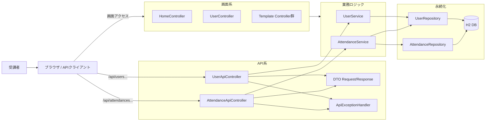
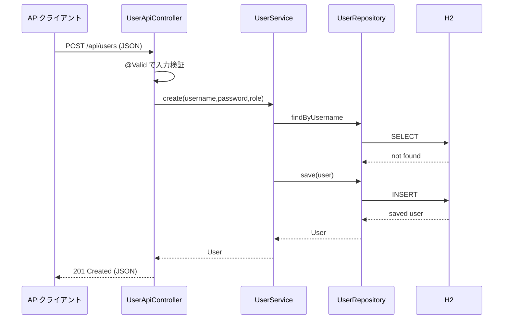
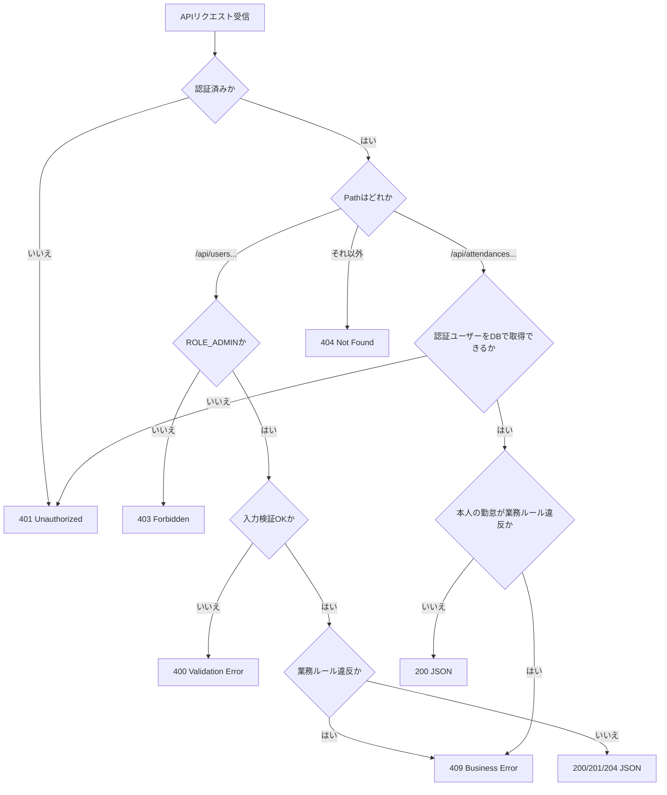

# Lesson6 REST API基礎（@RestController / DTO / 例外応答）

## 目的（Lesson6でできるようになること）
- `@RestController` で JSON API を実装できる
- DTO と `@Valid` で入力検証を実装できる
- `@RestControllerAdvice` でエラー応答形式を統一できる
- 画面系 Controller（Thymeleaf）と API 系 Controller を分けて設計できる
- APIリクエストの正常系と例外系をコードで追跡できる

## 前提
- Lesson5共通準備、Lesson5A、Lesson5B、Lesson5Cを完了している
- `docs/curriculum/web-app(簡易版)/bridge-to-springboot.md` の `fetch + JSON` と `Controller + Thymeleaf` の違いを説明できる
- `~/order-management-springboot/stages/lesson05` が起動できる
- `java -version` と `mvn -version` が通る

バックエンド短縮コースでは、`web-app(簡易版)` の前提を次へ読み替えます。

- `docs/curriculum/springboot/prerequisites/http-thymeleaf-minimum.md` を完了している
- `curl` で `GET` / `POST` を実行し、HTTPステータスとレスポンス本文を確認できる
- ブラウザの `fetch` 実装は前提にせず、`curl -> Controller -> DTO -> Service -> JSON` を追跡する

## 位置づけ
Lesson1〜5では、Spring MVCの基本を理解するために `@Controller + Model + Thymeleaf` を中心に扱いました。
このLessonでは、`web-app(簡易版)` で使った `fetch + JSON API` の考え方に戻り、Spring Bootではどう書くかを学びます。

バックエンド短縮コースでは、上記の `fetch` 経験を前提にしません。
APIクライアントとして `curl` を使用し、JSONの入力、DTO、バリデーション、例外応答、認証・認可をサーバー側から確認します。

対応関係:

| web-app(簡易版) | Spring Boot Lesson6 |
| --- | --- |
| `server.createContext("/api/...", ...)` | `@RestController` + `@GetMapping` / `@PostMapping` |
| 手書きJSON文字列 | DTOを返して Jackson がJSONへ変換 |
| `sendJson(status, body)` | `ResponseEntity` / Controllerの戻り値 |
| 個別のエラーJSON | `@RestControllerAdvice` で形式を統一 |
| ブラウザの `fetch` | `curl` やAPIクライアントからHTTPリクエスト |

## Lesson6で作るもの
- API:
  - `GET /api/users`
  - `GET /api/users/:id`
  - `POST /api/users`
  - `PUT /api/users/:id`
  - `DELETE /api/users/:id`
  - `POST /api/attendances/clock-in`（ログイン中の本人を出勤）
  - `POST /api/attendances/clock-out`（ログイン中の本人を退勤）
- 追加クラス:
  - `UserApiController`
  - `AttendanceApiController`
  - DTO（Request/Response）
  - `ApiExceptionHandler`

### 全体構成図（ファイルと役割）


### JSON最小メモ（このLessonで使用）
- 一覧レスポンス例:
  ```json
  [
    {"id":1,"username":"admin","role":"ROLE_ADMIN"},
    {"id":2,"username":"user1","role":"ROLE_USER"}
  ]
  ```
- 作成リクエスト例:
  ```json
  {"username":"user2","password":"password123","role":"ROLE_USER"}
  ```
- エラーレスポンス例（統一形式）:
  ```json
  {"code":"BUSINESS_ERROR","message":"ユーザー名が既に存在します"}
  ```

### API呼び出しの時系列（正常系）


### ルーティングと異常系の分岐（401/403/400/409）


---

## 0. 事前確認
```bash
java -version
mvn -version
git --version
```

---

## 1. 作業フォルダを準備（Lesson5を複製）
```bash
mkdir -p ~/order-management-springboot/stages/lesson06
cp -r ~/order-management-springboot/stages/lesson05/* ~/order-management-springboot/stages/lesson06/
cd ~/order-management-springboot/stages/lesson06
```

---

## 2. ディレクトリを追加
```bash
mkdir -p ~/order-management-springboot/stages/lesson06/src/main/java/com/shinesoft/attendance/web/api
mkdir -p ~/order-management-springboot/stages/lesson06/src/main/java/com/shinesoft/attendance/web/api/dto
mkdir -p ~/order-management-springboot/stages/lesson06/src/main/java/com/shinesoft/attendance/web/api/advice
```

---

## 3. DTOを作成

作成ファイル:
- `~/order-management-springboot/stages/lesson06/src/main/java/com/shinesoft/attendance/web/api/dto/UserCreateRequest.java`
- `~/order-management-springboot/stages/lesson06/src/main/java/com/shinesoft/attendance/web/api/dto/UserUpdateRequest.java`
- `~/order-management-springboot/stages/lesson06/src/main/java/com/shinesoft/attendance/web/api/dto/UserResponse.java`
- `~/order-management-springboot/stages/lesson06/src/main/java/com/shinesoft/attendance/web/api/dto/ErrorResponse.java`

`UserCreateRequest.java`:
```java
package com.shinesoft.attendance.web.api.dto;

import jakarta.validation.constraints.NotBlank;
import jakarta.validation.constraints.Pattern;
import jakarta.validation.constraints.Size;

public record UserCreateRequest(
        @NotBlank @Size(max = 30) String username,
        @NotBlank @Size(min = 8, max = 64) String password,
        @NotBlank @Pattern(regexp = "ROLE_ADMIN|ROLE_USER") String role
) {
}
```

`UserUpdateRequest.java`:
```java
package com.shinesoft.attendance.web.api.dto;

import jakarta.validation.constraints.NotBlank;
import jakarta.validation.constraints.Pattern;
import jakarta.validation.constraints.Size;

public record UserUpdateRequest(
        @NotBlank @Size(max = 30) String username,
        @Size(min = 8, max = 64) String password,
        @NotBlank @Pattern(regexp = "ROLE_ADMIN|ROLE_USER") String role
) {
}
```

`UserResponse.java`:
```java
package com.shinesoft.attendance.web.api.dto;

public record UserResponse(
        Long id,
        String username,
        String role
) {
}
```

`ErrorResponse.java`:
```java
package com.shinesoft.attendance.web.api.dto;

public record ErrorResponse(
        String code,
        String message
) {
}
```

---

## 4. `UserApiController` を作成
作成ファイル:
- `~/order-management-springboot/stages/lesson06/src/main/java/com/shinesoft/attendance/web/api/UserApiController.java`

```java
package com.shinesoft.attendance.web.api;

import java.util.List;

import org.springframework.http.HttpStatus;
import org.springframework.validation.annotation.Validated;
import org.springframework.web.bind.annotation.DeleteMapping;
import org.springframework.web.bind.annotation.GetMapping;
import org.springframework.web.bind.annotation.PathVariable;
import org.springframework.web.bind.annotation.PostMapping;
import org.springframework.web.bind.annotation.PutMapping;
import org.springframework.web.bind.annotation.RequestBody;
import org.springframework.web.bind.annotation.RequestMapping;
import org.springframework.web.bind.annotation.ResponseStatus;
import org.springframework.web.bind.annotation.RestController;

import com.shinesoft.attendance.domain.User;
import com.shinesoft.attendance.service.UserService;
import com.shinesoft.attendance.web.api.dto.UserCreateRequest;
import com.shinesoft.attendance.web.api.dto.UserResponse;
import com.shinesoft.attendance.web.api.dto.UserUpdateRequest;

import jakarta.validation.Valid;

@RestController
@RequestMapping("/api/users")
@Validated
public class UserApiController {
    private final UserService userService;

    public UserApiController(UserService userService) {
        this.userService = userService;
    }

    @GetMapping
    public List<UserResponse> list() {
        return userService.list().stream().map(this::toResponse).toList();
    }

    @GetMapping("/{id}")
    public UserResponse get(@PathVariable Long id) {
        return toResponse(userService.get(id));
    }

    @PostMapping
    @ResponseStatus(HttpStatus.CREATED)
    public UserResponse create(@Valid @RequestBody UserCreateRequest request) {
        User created = userService.create(request.username(), request.password(), request.role());
        return toResponse(created);
    }

    @PutMapping("/{id}")
    public UserResponse update(@PathVariable Long id, @Valid @RequestBody UserUpdateRequest request) {
        User updated = userService.update(id, request.username(), request.password(), request.role());
        return toResponse(updated);
    }

    @DeleteMapping("/{id}")
    @ResponseStatus(HttpStatus.NO_CONTENT)
    public void delete(@PathVariable Long id) {
        userService.delete(id);
    }

    private UserResponse toResponse(User user) {
        return new UserResponse(user.getId(), user.getUsername(), user.getRole());
    }
}
```

---

## 5. `AttendanceApiController` を作成
作成ファイル:
- `~/order-management-springboot/stages/lesson06/src/main/java/com/shinesoft/attendance/web/api/AttendanceApiController.java`

```java
package com.shinesoft.attendance.web.api;

import java.security.Principal;
import java.util.Map;

import org.springframework.web.bind.annotation.PostMapping;
import org.springframework.web.bind.annotation.RequestMapping;
import org.springframework.web.bind.annotation.RestController;

import com.shinesoft.attendance.service.AttendanceService;
import com.shinesoft.attendance.service.UserService;

@RestController
@RequestMapping("/api/attendances")
public class AttendanceApiController {
    private final AttendanceService attendanceService;
    private final UserService userService;

    public AttendanceApiController(AttendanceService attendanceService,
                                   UserService userService) {
        this.attendanceService = attendanceService;
        this.userService = userService;
    }

    @PostMapping("/clock-in")
    public Map<String, String> clockIn(Principal principal) {
        var user = userService.getByUsername(principal.getName());
        attendanceService.clockIn(user.getId());
        return Map.of("message", "出勤しました");
    }

    @PostMapping("/clock-out")
    public Map<String, String> clockOut(Principal principal) {
        var user = userService.getByUsername(principal.getName());
        attendanceService.clockOut(user.getId());
        return Map.of("message", "退勤しました");
    }
}
```

重要:
- 一般ユーザー向け勤怠APIは、リクエストから `userId` を受け取らない。
- 操作対象は `Principal` のログイン名から決める。これにより、利用者が別ユーザーIDを指定して他人の勤怠を操作することを防ぐ。
- 管理者による代理操作が必要な場合は、`/api/admin/...` のような管理者専用APIとして別に設計する。

---

## 6. `ApiExceptionHandler` を作成
作成ファイル:
- `~/order-management-springboot/stages/lesson06/src/main/java/com/shinesoft/attendance/web/api/advice/ApiExceptionHandler.java`

```java
package com.shinesoft.attendance.web.api.advice;

import org.slf4j.Logger;
import org.slf4j.LoggerFactory;
import org.springframework.http.HttpStatus;
import org.springframework.web.bind.MethodArgumentNotValidException;
import org.springframework.web.bind.annotation.ExceptionHandler;
import org.springframework.web.bind.annotation.ResponseStatus;
import org.springframework.web.bind.annotation.RestControllerAdvice;
import org.springframework.web.method.annotation.MethodArgumentTypeMismatchException;

import com.shinesoft.attendance.exception.BusinessException;
import com.shinesoft.attendance.web.api.dto.ErrorResponse;

@RestControllerAdvice(basePackages = "com.shinesoft.attendance.web.api")
public class ApiExceptionHandler {
    private static final Logger log = LoggerFactory.getLogger(ApiExceptionHandler.class);

    @ExceptionHandler(BusinessException.class)
    @ResponseStatus(HttpStatus.CONFLICT)
    public ErrorResponse handleBusiness(BusinessException ex) {
        return new ErrorResponse("BUSINESS_ERROR", ex.getMessage());
    }

    @ExceptionHandler(MethodArgumentNotValidException.class)
    @ResponseStatus(HttpStatus.BAD_REQUEST)
    public ErrorResponse handleValidation(MethodArgumentNotValidException ex) {
        String message = ex.getBindingResult().getFieldErrors().stream()
                .findFirst()
                .map(err -> err.getField() + ": " + err.getDefaultMessage())
                .orElse("入力値が不正です");
        return new ErrorResponse("VALIDATION_ERROR", message);
    }

    @ExceptionHandler(MethodArgumentTypeMismatchException.class)
    @ResponseStatus(HttpStatus.BAD_REQUEST)
    public ErrorResponse handleTypeMismatch(MethodArgumentTypeMismatchException ex) {
        return new ErrorResponse("VALIDATION_ERROR", ex.getName() + ": 入力値が不正です");
    }

    @ExceptionHandler(Exception.class)
    @ResponseStatus(HttpStatus.INTERNAL_SERVER_ERROR)
    public ErrorResponse handleUnknown(Exception ex) {
        log.error("Unexpected API error", ex);
        return new ErrorResponse("INTERNAL_SERVER_ERROR", "予期しないエラーが発生しました");
    }
}
```

---

## 7. `SecurityConfig` を編集（API認証とJSONエラー応答）
編集ファイル:
- `~/order-management-springboot/stages/lesson06/src/main/java/com/shinesoft/attendance/config/SecurityConfig.java`

変更ポイント:
1. API権限を追加
2. `/api/**` はCSRF対象外にする
3. `httpBasic` を有効化（curl検証用）
4. APIの401/403を `ErrorResponse` と同じJSON形式で返す

```java
package com.shinesoft.attendance.config;

import java.io.IOException;
import java.nio.charset.StandardCharsets;

import org.springframework.context.annotation.Bean;
import org.springframework.context.annotation.Configuration;
import org.springframework.http.HttpStatus;
import org.springframework.http.MediaType;
import org.springframework.security.config.Customizer;
import org.springframework.security.config.annotation.web.builders.HttpSecurity;
import org.springframework.security.config.annotation.web.configuration.EnableWebSecurity;
import org.springframework.security.core.userdetails.UserDetailsService;
import org.springframework.security.crypto.bcrypt.BCryptPasswordEncoder;
import org.springframework.security.crypto.password.PasswordEncoder;
import org.springframework.security.web.SecurityFilterChain;
import org.springframework.security.web.authentication.LoginUrlAuthenticationEntryPoint;
import org.springframework.security.web.util.matcher.NegatedRequestMatcher;
import org.springframework.security.web.util.matcher.RequestMatcher;

import com.fasterxml.jackson.databind.ObjectMapper;
import com.shinesoft.attendance.repository.UserRepository;
import com.shinesoft.attendance.web.api.dto.ErrorResponse;

import jakarta.servlet.http.HttpServletResponse;

@Configuration
@EnableWebSecurity
public class SecurityConfig {

    @Bean
    public SecurityFilterChain securityFilterChain(HttpSecurity http,
                                                   ObjectMapper objectMapper) throws Exception {
        RequestMatcher apiMatcher = request -> {
            String apiPrefix = request.getContextPath() + "/api";
            String requestUri = request.getRequestURI();
            return apiPrefix.equals(requestUri) || requestUri.startsWith(apiPrefix + "/");
        };

        http
            .authorizeHttpRequests(auth -> auth
                .requestMatchers("/login", "/styles.css").permitAll()
                .requestMatchers("/h2-console/**").permitAll()
                .requestMatchers("/api/users/**").hasRole("ADMIN")
                .requestMatchers("/api/attendances/**").authenticated()
                .requestMatchers("/users/**").hasRole("ADMIN")
                .requestMatchers("/admin/**").hasRole("ADMIN")
                .anyRequest().authenticated()
            )
            .formLogin(form -> form
                .loginPage("/login")
                .defaultSuccessUrl("/", true)
                .permitAll()
            )
            .logout(logout -> logout
                .logoutUrl("/logout")
                .logoutSuccessUrl("/login?logout")
            )
            .httpBasic(Customizer.withDefaults())
            .exceptionHandling(exceptions -> exceptions
                .defaultAuthenticationEntryPointFor(
                    (request, response, exception) -> writeApiError(
                        response, objectMapper, HttpStatus.UNAUTHORIZED,
                        "UNAUTHORIZED", "認証が必要です"),
                    apiMatcher)
                .defaultAuthenticationEntryPointFor(
                    new LoginUrlAuthenticationEntryPoint("/login"),
                    new NegatedRequestMatcher(apiMatcher))
                .defaultAccessDeniedHandlerFor(
                    (request, response, exception) -> writeApiError(
                        response, objectMapper, HttpStatus.FORBIDDEN,
                        "FORBIDDEN", "この操作を行う権限がありません"),
                    apiMatcher)
            )
            .csrf(csrf -> csrf.ignoringRequestMatchers("/h2-console/**", "/api/**"))
            .headers(headers -> headers.frameOptions(frame -> frame.sameOrigin()));
        return http.build();
    }

    private static void writeApiError(HttpServletResponse response,
                                      ObjectMapper objectMapper,
                                      HttpStatus status,
                                      String code,
                                      String message) throws IOException {
        response.setStatus(status.value());
        response.setCharacterEncoding(StandardCharsets.UTF_8.name());
        response.setContentType(MediaType.APPLICATION_JSON_VALUE);
        objectMapper.writeValue(response.getWriter(), new ErrorResponse(code, message));
    }

    @Bean
    public UserDetailsService userDetailsService(UserRepository userRepository) {
        return username -> {
            var user = userRepository.findByUsername(username)
                .orElseThrow(() -> new org.springframework.security.core.userdetails.UsernameNotFoundException(
                    "User not found: " + username));
            return org.springframework.security.core.userdetails.User
                .withUsername(user.getUsername())
                .password(user.getPassword())
                .roles(user.getRole().replace("ROLE_", ""))
                .build();
        };
    }

    @Bean
    public PasswordEncoder passwordEncoder() {
        return new BCryptPasswordEncoder();
    }
}
```

`@RestControllerAdvice` はControllerで発生した例外を処理します。認証前の401と認可失敗の403はSecurityフィルター内で発生するため、`AuthenticationEntryPoint` / `AccessDeniedHandler` 相当の設定が別途必要です。非APIの未認証アクセスは、従来どおり `/login` へリダイレクトします。

---

## 8. 起動
```bash
cd ~/order-management-springboot/stages/lesson06
mvn clean spring-boot:run
```

---

## 9. 動作確認（必須）
別ターミナルで実行:

```bash
# 未認証でAPIへアクセス（失敗: 401 + JSON）
curl -i http://localhost:8080/api/users

# 管理者でユーザー一覧を取得（成功: 200）
curl -i -u admin:admin123 http://localhost:8080/api/users

# 一般ユーザーでユーザー一覧を取得（失敗: 403）
curl -i -u user1:password http://localhost:8080/api/users

# バリデーションエラー（失敗: 400）
curl -i -u admin:admin123 -H "Content-Type: application/json" \
  -d "{\"username\":\"\",\"password\":\"short\",\"role\":\"ROLE_USER\"}" \
  http://localhost:8080/api/users

# 業務エラー（重複ユーザー名、失敗: 409）
curl -i -u admin:admin123 -H "Content-Type: application/json" \
  -d "{\"username\":\"user1\",\"password\":\"password123\",\"role\":\"ROLE_USER\"}" \
  http://localhost:8080/api/users

# 一般ユーザー本人として出勤（成功: 200）
# userIdは送らず、Basic認証のuser1が操作対象になる
curl -i -u user1:password -X POST \
  http://localhost:8080/api/attendances/clock-in
```

期待状態:
- 未認証は `401` と `{"code":"UNAUTHORIZED",...}`
- 権限不足は `403`
- 入力不正は `400`
- 業務ルール違反は `409`
- APIのエラーはすべて `code` / `message` を持つJSON形式で返る
- 勤怠APIの操作対象は、リクエスト値ではなく認証済みユーザー本人になる

---

## 10. API認可の自動テスト（必須）

[lesson6-testing.md](./lesson6-testing.md) の `ApiSecurityTest` を作成し、次を実行します。

```bash
mvn test
```

合格条件:
- Lesson5から引き継いだ12件とAPIテスト5件の合計17件が成功する
- 401/403のJSON形式と、勤怠操作がログイン本人へ記録されることを自動確認できる

---

## 11. APIコード解読演習（必須）

### 11-1. コード確認ポイント

1. `@Controller` と `@RestController` の戻り値の違い
2. `@Valid` と DTO の責務（Controllerで検証）
3. `BusinessException` を `409` に変換する流れ
4. 画面系ルートとAPI系ルートのセキュリティ差分
5. 勤怠APIが `userId` を受け取らず、認証ユーザーから本人性を確定する理由

### 11-2. 正常系を追跡する

「9. 動作確認」ですでに`user1`の出勤データを作成しています。起動中のアプリを`Ctrl + C`で停止し、再起動してインメモリH2を初期状態へ戻してください。

```bash
mvn spring-boot:run
```

次のリクエストを実行する前に、HTTPステータスとJSONを予想します。

```bash
curl -i -u user1:password -X POST \
  http://localhost:8080/api/attendances/clock-in
```

次の表を、実際のソースコードを開きながら完成させてください。

| 順番 | ファイル / メソッド | 確認する値・処理 | 次の呼び出しまたは結果 |
| ---: | --- | --- | --- |
| 1 | `SecurityConfig` | Basic認証と`/api/attendances/**`の認可 | 認証済みリクエスト |
| 2 | `AttendanceApiController#clockIn` | `Principal#getName()` | ログインユーザー名 |
| 3 | `UserService#getByUsername` | ユーザー名からDB検索 | `User`とそのID |
| 4 | `AttendanceService#clockIn` | 同日データの有無と業務ルール | 保存対象`Attendance` |
| 5 | `AttendanceRepository` | 同日検索と`save(...)` | 保存済み勤怠 |
| 6 | `AttendanceService#clockIn` | `INFO`ログ | Controllerへ正常復帰 |
| 7 | `AttendanceApiController#clockIn` | 戻り値の`Map` | `200`とJSON |

実行後、予想と次の実測値を比較します。

- HTTPステータス
- レスポンスJSON
- 起動ターミナルの`Clock in`ログ
- H2コンソールの`attendances`レコード

### 11-3. 例外系を追跡する

同じcurlをもう一度実行し、二重出勤を発生させます。

1. `AttendanceService#clockIn`のどの条件で`BusinessException`になるか特定する
2. 例外が`AttendanceApiController`の通常の戻り値まで進まないことを確認する
3. `ApiExceptionHandler#handleBusiness`が例外を`409`へ変換する箇所を探す
4. `ErrorResponse`が`code` / `message`のJSONになる流れを説明する

合格条件:
- 正常系7段階を、入力値と戻り値を含めて順番に説明できる
- `Controller -> Service -> Repository -> DB`の境界をソースコード上で示せる
- 二重出勤時に`409`になるまでの例外伝播を説明できる
- 認証エラーの`401`はControllerへ到達する前にSecurityフィルターで発生すると説明できる

---

## 12. つまずきポイント
- `@RequestBody` を付け忘れて `400` になる
  -> APIのJSON受け取りには `@RequestBody` が必須
- CSRF で `403` になる
  -> `/api/**` をCSRF除外しているか確認
- `ROLE_` 接頭辞の不一致で認可失敗する
  -> DB値は `ROLE_ADMIN` / `ROLE_USER` で統一
- 401/403だけHTMLまたは空本文になる
  -> Securityフィルター用のJSONハンドラー設定を確認する

---

## 13. 時間割目安
- 0〜2: 15分
- 3〜7: 70分
- 8〜9: 20分
- 10: 20分
- 11: 30分
- 12: 10分

バックエンド短縮コースでも時間配分は同じです。ブラウザ側JavaScriptの実装は追加せず、`curl` のリクエストとレスポンスをコードへ対応づけます。
