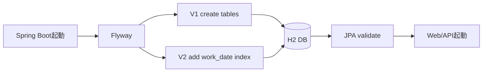
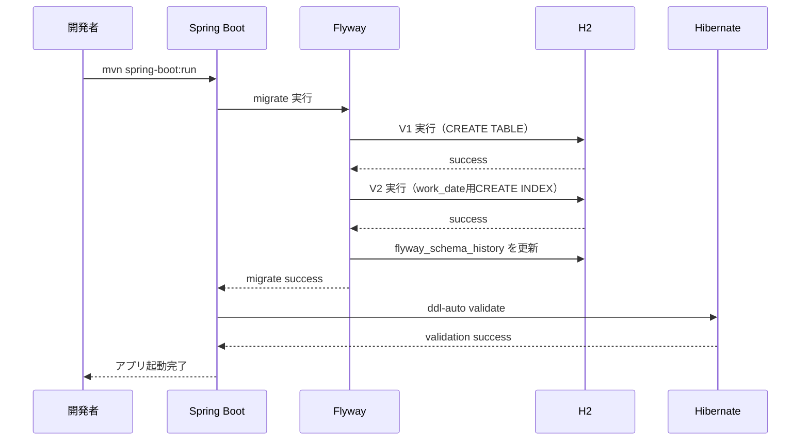
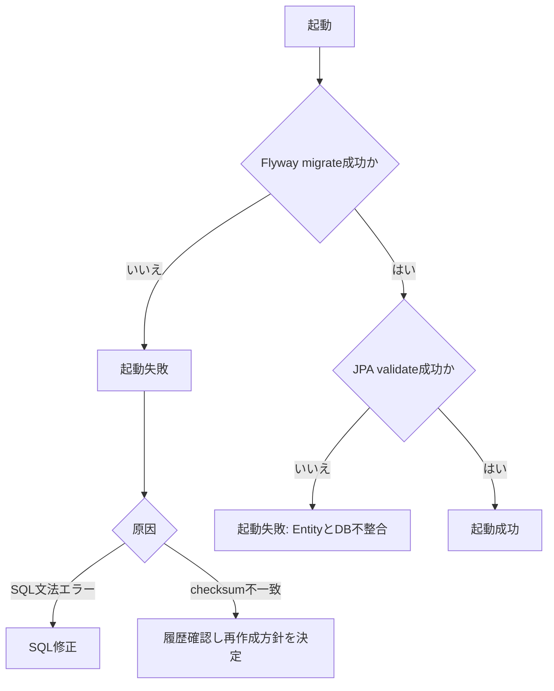

# Lesson7 FlywayでDBスキーマ変更管理（Migration運用）

## 目的（Lesson7でできるようになること）
- `ddl-auto: update` 依存をやめ、Flywayでスキーマを管理できる
- SQLを `V1__`, `V2__` の履歴として積み上げられる
- 起動時に `flyway_schema_history` で適用履歴を確認できる
- 「開発者ごとの差分」ではなく「共通履歴」でDBを再現できる

## 前提
- Lesson6 を完了している
- `~/order-management-springboot/stages/lesson06` が起動できる
- `java -version` と `mvn -version` が通る
- `docs/curriculum/springboot/lesson02/sql-rdb-basics.md` の主キー、外部キー、制約、インデックスを説明できる

## Lesson7で作るもの
- 追加/編集:
  - `pom.xml`（Flyway依存追加）
  - `application.yml`（`ddl-auto: validate` へ変更）
  - `db/migration/V1__create_tables.sql`
  - `db/migration/V2__add_index_to_attendance_work_date.sql`
- 確認:
  - Flyway履歴テーブル `flyway_schema_history`
  - 既存画面/APIがそのまま動くこと

### 全体構成図（起動時の適用順）


### 設定受け渡し最小メモ（このLessonで使用）
- `spring.jpa.hibernate.ddl-auto=validate`
  - エンティティとDB差分を検出する
  - テーブルを自動で作らない
- `spring.flyway.enabled=true`
  - 起動時に `db/migration` 配下SQLを適用する
- `flyway_schema_history`
  - どのバージョンが成功したかをDB内で管理する履歴テーブル

### 起動からマイグレーション適用まで（正常系）


### 適用失敗時の分岐（checksum / SQL文法 / validate失敗）


---

## 0. 事前確認
```bash
java -version
mvn -version
git --version
```

---

## 1. 作業フォルダを準備（Lesson6を複製）
```bash
mkdir -p ~/order-management-springboot/stages/lesson07
cp -r ~/order-management-springboot/stages/lesson06/* ~/order-management-springboot/stages/lesson07/
cd ~/order-management-springboot/stages/lesson07
```

---

## 2. `pom.xml` を編集（Flyway依存を追加）
編集ファイル:
- `~/order-management-springboot/stages/lesson07/pom.xml`

`<dependencies>` に以下を追記:

```xml
<dependency>
  <groupId>org.flywaydb</groupId>
  <artifactId>flyway-core</artifactId>
</dependency>
<dependency>
  <groupId>org.flywaydb</groupId>
  <artifactId>flyway-mysql</artifactId>
</dependency>
```

- H2でのLesson7実行は `flyway-core` が担当します。
- 後続のMariaDB環境演習では `flyway-mysql` が必要です。Lesson7の成果物をVirtualBoxまたはDocker Composeの環境演習へ渡すため、この時点で追加します。

確認:
```bash
cd ~/order-management-springboot/stages/lesson07
mvn -q -DskipTests compile
```

---

## 3. `application.yml` を編集（Flyway運用モードへ）
編集ファイル:
- `~/order-management-springboot/stages/lesson07/src/main/resources/application.yml`

変更ポイント:
1. `spring.jpa.hibernate.ddl-auto` を `update` -> `validate` に変更
2. `spring.flyway` 設定を追加

例:
```yaml
spring:
  datasource:
    # 履歴を再起動後も残し、後続のMariaDB演習とDDLを揃える
    url: ${DB_URL:jdbc:h2:file:./data/attendance;MODE=MariaDB}
    username: ${DB_USER:sa}
    password: ${DB_PASSWORD:}
    driver-class-name: ${DB_DRIVER:org.h2.Driver}
  jpa:
    hibernate:
      ddl-auto: validate
    show-sql: ${SHOW_SQL:false}
  flyway:
    enabled: true
    locations: classpath:db/migration
```

`lesson07/data` は実行時DBなのでGit管理しません。`lesson07/.gitignore` に次を追加します。

```gitignore
data/
```

---

## 4. マイグレーションSQLを作成

この章へ進む前に、`sql-rdb-basics.md` のEntityとテーブルの対応を見直します。
ここでは既存SQLや説明コメントを削除せず、JPAが自動生成していたテーブルをFlywayのSQLとして明示的に管理します。

作成ディレクトリ:
```bash
mkdir -p ~/order-management-springboot/stages/lesson07/src/main/resources/db/migration
```

作成ファイル:
- `~/order-management-springboot/stages/lesson07/src/main/resources/db/migration/V1__create_tables.sql`
- `~/order-management-springboot/stages/lesson07/src/main/resources/db/migration/V2__add_index_to_attendance_work_date.sql`

`V1__create_tables.sql`:
```sql
CREATE TABLE users (
    id BIGINT AUTO_INCREMENT PRIMARY KEY,
    username VARCHAR(255) NOT NULL UNIQUE,
    password VARCHAR(255) NOT NULL,
    role VARCHAR(50) NOT NULL
);

CREATE TABLE attendances (
    id BIGINT AUTO_INCREMENT PRIMARY KEY,
    user_id BIGINT NOT NULL,
    work_date DATE NOT NULL,
    start_time TIMESTAMP,
    end_time TIMESTAMP,
    status VARCHAR(32) NOT NULL,
    created_at TIMESTAMP NOT NULL,
    updated_at TIMESTAMP NOT NULL,
    CONSTRAINT fk_attendances_user FOREIGN KEY (user_id) REFERENCES users(id),
    CONSTRAINT uk_attendances_user_work_date UNIQUE (user_id, work_date)
);
```

`V2__add_index_to_attendance_work_date.sql`:
```sql
CREATE INDEX idx_attendances_work_date
    ON attendances(work_date);
```

`(user_id, work_date)` はV1の一意制約ですでに索引化されます。V2では同じ索引を重複させず、管理者向け全件一覧の勤務日検索・並び替えを補助する `work_date` 索引を追加します。

---

## 5. 起動
```bash
cd ~/order-management-springboot/stages/lesson07
mvn clean spring-boot:run
```

起動ログで以下のような出力が出ることを確認:
- `Successfully applied 2 migrations`

---

## 6. 動作確認（必須）
1. H2コンソールを開く
- `http://localhost:8080/h2-console`
- JDBC URL: `jdbc:h2:file:./data/attendance;MODE=MariaDB`
- User: `sa`

2. SQLを実行して履歴を確認:
```sql
SELECT installed_rank, version, description, success
FROM flyway_schema_history
ORDER BY installed_rank;
```

期待出力例:
```text
1 / 1 / create tables / true
2 / 2 / add index to attendance work date / true
```

3. アプリ動作確認:
```bash
curl -i -u admin:admin123 http://localhost:8080/api/users
```
- `200` でJSONが返ること

---

## 7. マイグレーション失敗を再現する（必須）

一度成功したV1を変更するとchecksum不一致で起動できないことを確認します。

1. アプリを停止する
2. V1をバックアップする

```bash
cp src/main/resources/db/migration/V1__create_tables.sql /tmp/V1__create_tables.sql
```

3. V1の末尾にコメント `-- checksum test` を追加する
4. 再起動し、`Validate failed` または `checksum mismatch` で失敗することを確認する
5. V1を元に戻して再起動する

```bash
cp /tmp/V1__create_tables.sql src/main/resources/db/migration/V1__create_tables.sql
mvn spring-boot:run
```

確認ポイント:
- 適用済みmigrationを後から編集してはいけない
- 変更は新しい `V3__...sql` として追加する
- 学習中にDBを完全初期化する場合だけ、アプリ停止後に `data/` を削除してV1から再適用する

---

## 8. Flyway履歴の自動テスト（必須）

作成ファイル:
- `~/order-management-springboot/stages/lesson07/src/test/java/com/shinesoft/attendance/MigrationSmokeTest.java`

```java
package com.shinesoft.attendance;

import static org.junit.jupiter.api.Assertions.assertEquals;

import org.junit.jupiter.api.Test;
import org.springframework.beans.factory.annotation.Autowired;
import org.springframework.boot.test.context.SpringBootTest;
import org.springframework.jdbc.core.JdbcTemplate;

@SpringBootTest
class MigrationSmokeTest {

    @Autowired
    private JdbcTemplate jdbcTemplate;

    @Test
    void twoMigrationsAreApplied() {
        Integer count = jdbcTemplate.queryForObject(
            "SELECT COUNT(*) FROM flyway_schema_history WHERE success = TRUE",
            Integer.class);
        assertEquals(2, count);
    }
}
```

```bash
mvn test
```

---

## 9. 変更の反映ルール（実務での基本）
1. 既存の `V1` / `V2` は書き換えない（履歴固定）
2. 変更が必要なら `V3__...sql` を追加する
3. 失敗時はログと `flyway_schema_history` を見て原因を切り分ける

---

## 10. コード確認ポイント
1. `ddl-auto: validate` の役割（自動生成しない）
2. Flywayが「アプリ起動前」にスキーマを整える意味
3. `V1` から順番に適用されるバージョン管理の価値

---

## 11. つまずきポイント
- `ddl-auto: update` のままでFlywayの価値が薄れる
  -> `validate` にして責務を分離する
- 既存 migration を編集して checksum エラー
  -> 既存は編集せず、新しい `Vn__` を追加する
- SQLとEntityの不一致で起動失敗
  -> `@Table` / `@Column` 名と migration SQL を突き合わせる

---

## 12. 時間割目安
- 0〜3: 25分
- 4〜6: 45分
- 7: 30分
- 8: 30分
- 9〜11: 20分
