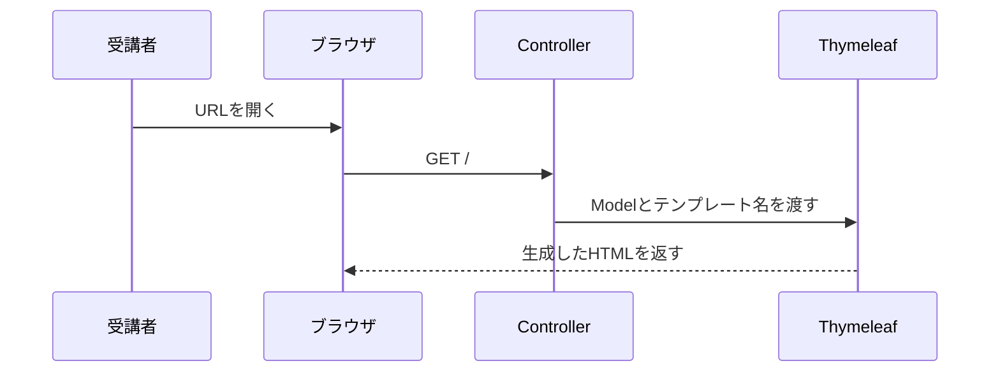

# 短縮コース事前学習: HTTP / フォーム / Thymeleaf最小理解

この資料は、HTML/CSS/JavaScriptの実装演習を省略する短縮コース向けです。
画面コードは講師が提供し、受講者は指定されたファイルを作成して適切な場所へ配置します。

この短縮コースでは、HTMLのデザインやJavaScriptによるDOM操作は評価対象にしません。
一方で、Spring MVCの処理を追跡するため、画面からControllerへ届く最小限の流れは確認します。

## 目的

- ブラウザからSpring BootへHTTPリクエストが届く流れを説明できる
- `GET` と `POST` の用途を区別できる
- `templates` と `static` の配置場所を区別できる
- フォームの送信先とControllerのマッピングを対応づけられる
- `Model` の値がThymeleafで表示される箇所を追跡できる

## 1. リクエストとレスポンス

ブラウザでURLを開いたりボタンを押したりすると、ブラウザからサーバーへリクエストが送られます。
Spring BootはリクエストをControllerへ振り分け、HTMLやリダイレクトなどのレスポンスを返します。



最低限覚える用語:

| 用語 | この研修での意味 |
| --- | --- |
| URL | アクセス先。例: `/`, `/clock-in`, `/attendances` |
| リクエスト | ブラウザからSpring Bootへ送る要求 |
| レスポンス | Spring Bootからブラウザへ返す結果 |
| GET | 主に画面やデータを取得する |
| POST | 主に登録や状態変更を実行する |
| ステータスコード | `200`, `302`, `400`, `404`, `405` などの処理結果 |

## 2. Spring Bootでのファイル配置

短縮コースでは、講師から提供されたコードを次の規約に従って配置します。

```text
src/main/resources/
├── templates/       # Thymeleafが処理する画面
│   ├── index.html
│   └── attendances.html
└── static/          # そのまま配信するファイル
    ├── styles.css
    └── users.js
```

- `templates`: Controllerがテンプレート名を返して表示するHTML
- `static`: CSSやJavaScriptなど、ブラウザへそのまま返すファイル
- ファイル名と配置場所を間違えると、`404` やテンプレート解決エラーになる

この研修で受講者が行うこと:

1. 指定されたディレクトリを作成する
2. 指定されたファイル名でファイルを作成する
3. 講師提供コードを内容を削らず貼り付ける
4. Controllerとの対応箇所を確認する
5. 起動して画面とHTTPステータスを確認する

## 3. フォームからControllerへの送信

次のフォームは、ボタンを押すと `POST /clock-in` を送ります。

```html
<form action="/clock-in" method="post">
  <button type="submit">出勤</button>
</form>
```

Spring Boot側では、次のControllerメソッドが受け取ります。

```java
@PostMapping("/clock-in")
public String clockIn() {
    return "redirect:/";
}
```

対応確認:

| HTML | Controller |
| --- | --- |
| `action="/clock-in"` | `@PostMapping("/clock-in")` |
| `method="post"` | `@PostMapping` |
| `action="/attendances"` + GET相当のリンク | `@GetMapping("/attendances")` |

入力値がある場合は、`name` がControllerの受け取り名と対応します。

```html
<input type="text" name="username" />
```

```java
public String create(@RequestParam String username) {
    // usernameに画面入力が入る
}
```

## 4. ModelとThymeleafの対応

Controllerは、画面表示に必要な値を `Model` へ入れます。

```java
model.addAttribute("statusLabel", "未出勤");
return "index";
```

`return "index"` は `templates/index.html` を表示する指定です。
HTML側の `${statusLabel}` は、Controllerが設定した同名の値を参照します。

```html
<span th:text="${statusLabel}">未出勤</span>
```

この研修で確認するThymeleaf属性:

| 記述 | 役割 |
| --- | --- |
| `th:text="${value}"` | 値を文字として表示する |
| `th:if="${condition}"` | 条件が真のときだけ表示する |
| `th:each="row : ${rows}"` | 一覧を1件ずつ繰り返す |
| `th:action="@{/clock-in}"` | フォームの送信先URLを作る |
| `th:href="@{/styles.css}"` | CSSなどのURLを作る |

## 5. JavaScriptとCSSの扱い

- CSSは講師提供コードを配置し、見た目が反映されることだけ確認する
- JavaScriptは講師提供コードを配置し、期待した操作結果になることだけ確認する
- CSS設計、DOM API、イベント処理、`fetch` の実装は短縮コースの評価対象外とする
- JavaScript固有の不具合は講師が切り分けを支援する

受講者は、画面操作によって送られたリクエストをController、Service、Repositoryまで追跡します。

## 6. 完了条件

次を説明できればSpring Boot Lesson1へ進みます。

1. `GET` と `POST` の違い
2. `templates` と `static` の違い
3. フォームの `action` とControllerのマッピングの対応
4. `model.addAttribute("statusLabel", ...)` と `${statusLabel}` の対応
5. 短縮コースではHTML/CSS/JavaScriptを実装対象にしないこと

確認問題:

1. `return "index"` のとき、どのファイルが表示対象になるか
2. `POST /clock-in` を受け取るアノテーションは何か
3. CSSを `templates` に置かず `static` に置く理由は何か
4. HTMLの `${rows}` は、どこで設定された値か
